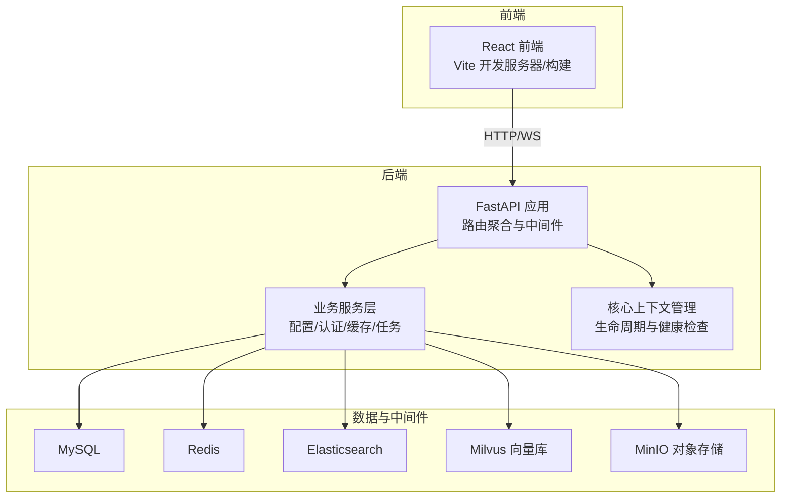
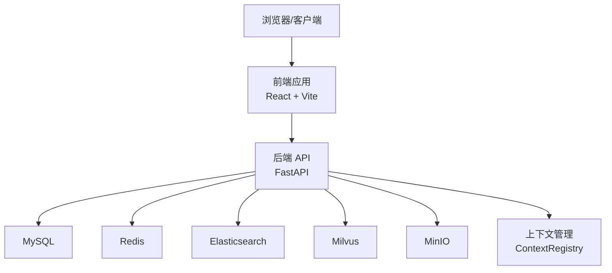
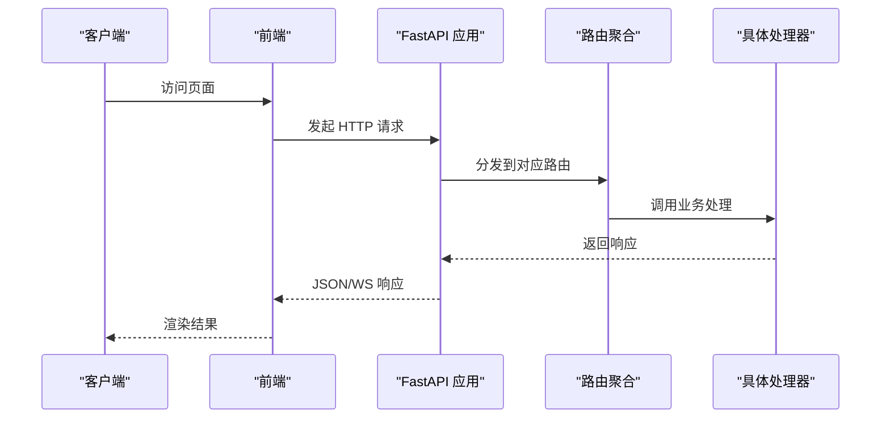
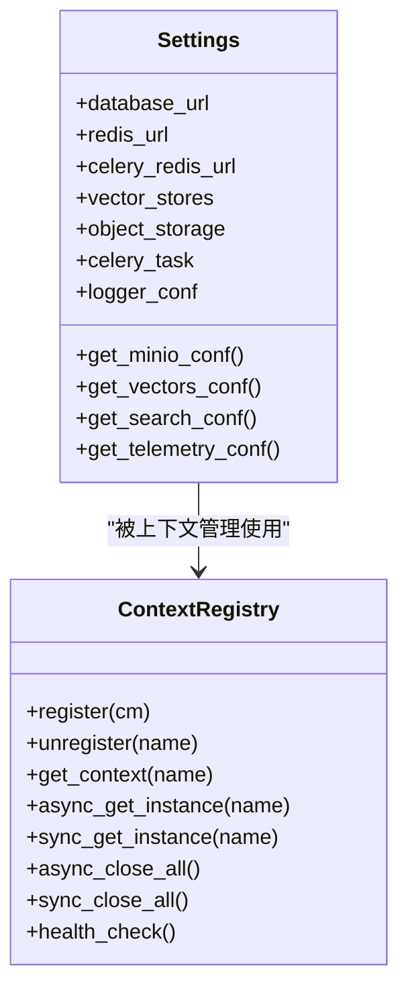
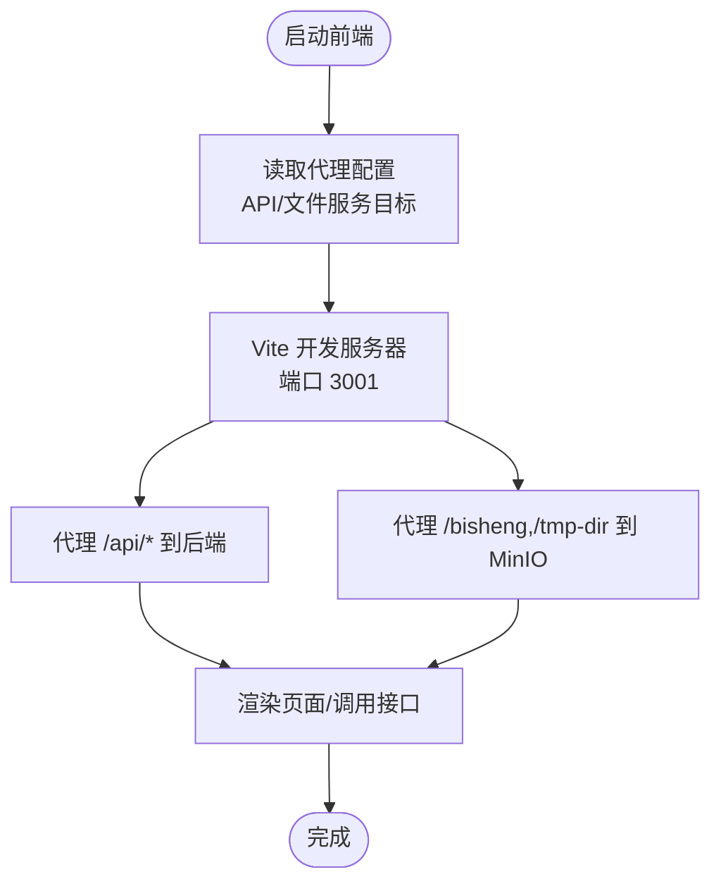
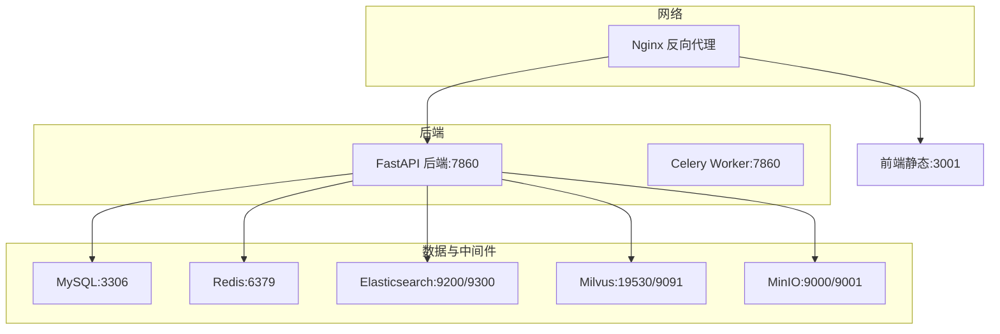

# 整体架构

<cite>
**本文引用的文件**
- [README.md](file://README.md)
- [docker-compose.yml](file://docker/docker-compose.yml)
- [config.yaml](file://docker/bisheng/config/config.yaml)
- [main.py](file://src/backend/bisheng/main.py)
- [router.py](file://src/backend/bisheng/api/router.py)
- [settings.py](file://src/backend/bisheng/core/config/settings.py)
- [base.py](file://src/backend/bisheng/core/context/base.py)
- [App.tsx](file://src/frontend/platform/src/App.tsx)
- [vite.config.mts](file://src/frontend/platform/vite.config.mts)
- [package.json](file://src/frontend/platform/package.json)
- [release.yml](file://.github/workflows/release.yml)
</cite>

## 目录
1. [引言](#引言)
2. [项目结构](#项目结构)
3. [核心组件](#核心组件)
4. [架构总览](#架构总览)
5. [详细组件分析](#详细组件分析)
6. [依赖分析](#依赖分析)
7. [性能考虑](#性能考虑)
8. [故障排查指南](#故障排查指南)
9. [结论](#结论)
10. [附录](#附录)

## 引言
本文件面向 Bisheng 平台的整体架构文档，目标是帮助读者从系统设计、分层结构、组件交互与数据流、技术栈选型、容器化与部署策略、可扩展性与高可用等方面全面理解平台。平台定位为企业级大模型应用开发与运维平台，提供工作流编排、智能体、知识库、RAG、多模态解析等能力，并通过前后端分离与微服务化容器编排实现可扩展、可维护、可演进的体系。

## 项目结构
Bisheng 采用前后端分离与容器化部署策略：
- 后端基于 FastAPI，提供 REST API 与 RPC 接口，统一在主入口中注册路由并管理生命周期。
- 前端基于 React + Vite，提供可视化工作流编辑、知识库管理、聊天与报表等功能界面。
- 容器编排通过 Docker Compose 将后端、前端、数据库、缓存、搜索引擎、向量库、对象存储等组件统一编排，形成可一键部署的运行时拓扑。

图表来源
- [docker-compose.yml](file://docker/docker-compose.yml#L1-L201)
- [main.py](file://src/backend/bisheng/main.py#L64-L102)
- [router.py](file://src/backend/bisheng/api/router.py#L1-L61)
- [settings.py](file://src/backend/bisheng/core/config/settings.py#L210-L346)

章节来源
- [README.md](file://README.md#L31-L57)
- [docker-compose.yml](file://docker/docker-compose.yml#L1-L201)
- [config.yaml](file://docker/bisheng/config/config.yaml#L1-L88)

## 核心组件
- 表现层（前端）
  - React 应用负责路由、状态、国际化、UI 组件与工作流可视化编辑；开发时通过 Vite 代理后端 API 与文件服务。
- 业务层（后端）
  - FastAPI 提供统一 API 路由聚合，包含 v1/v2 版本接口；内置 CORS、异常处理、中间件与健康检查端点。
  - 配置中心 Settings 聚合数据库、缓存、向量库、对象存储、Celery 任务调度等配置项。
  - 上下文管理 ContextRegistry 提供统一的资源初始化、重试、并发安全与生命周期管理。
- 数据层与中间件
  - MySQL：持久化元数据与业务数据。
  - Redis：缓存、会话、Celery broker。
  - Elasticsearch：全文检索与日志统计。
  - Milvus：向量检索与 RAG。
  - MinIO：对象存储与文件上传下载。

章节来源
- [App.tsx](file://src/frontend/platform/src/App.tsx#L1-L246)
- [vite.config.mts](file://src/frontend/platform/vite.config.mts#L1-L147)
- [main.py](file://src/backend/bisheng/main.py#L64-L102)
- [router.py](file://src/backend/bisheng/api/router.py#L1-L61)
- [settings.py](file://src/backend/bisheng/core/config/settings.py#L210-L346)
- [base.py](file://src/backend/bisheng/core/context/base.py#L456-L635)

## 架构总览
系统采用“前后端分离 + 微服务化容器编排”的架构：
- 前端通过 Vite 本地开发代理或 Nginx 静态托管，统一访问后端 API 与 MinIO 文件服务。
- 后端以 FastAPI 为核心，按模块聚合路由，统一异常处理与中间件，结合配置中心与上下文管理实现稳定运行。
- 数据与中间件通过 Docker Compose 统一编排，支持健康检查与依赖顺序启动。

图表来源
- [docker-compose.yml](file://docker/docker-compose.yml#L1-L201)
- [main.py](file://src/backend/bisheng/main.py#L64-L102)
- [settings.py](file://src/backend/bisheng/core/config/settings.py#L210-L346)

## 详细组件分析

### 后端应用与路由
- 应用入口创建 FastAPI 实例，注册异常处理器、CORS、自定义中间件与健康检查端点，统一挂载 v1/v2 路由。
- 路由聚合器将各领域路由（聊天、工作流、知识库、评估、工具、审计等）集中注册，便于扩展与维护。

图表来源
- [main.py](file://src/backend/bisheng/main.py#L64-L102)
- [router.py](file://src/backend/bisheng/api/router.py#L1-L61)

章节来源
- [main.py](file://src/backend/bisheng/main.py#L1-L113)
- [router.py](file://src/backend/bisheng/api/router.py#L1-L61)

### 配置中心与上下文管理
- Settings 负责加载与校验数据库、缓存、向量库、对象存储、Celery 等配置，支持环境变量注入与解密。
- ContextRegistry 提供线程/协程安全的资源初始化、重试、超时等待与健康检查，确保服务启动与关闭过程可控。

图表来源
- [settings.py](file://src/backend/bisheng/core/config/settings.py#L210-L346)
- [base.py](file://src/backend/bisheng/core/context/base.py#L456-L635)

章节来源
- [settings.py](file://src/backend/bisheng/core/config/settings.py#L1-L346)
- [base.py](file://src/backend/bisheng/core/context/base.py#L1-L635)

### 前端应用与开发代理
- React 应用通过 App.tsx 组织路由、国际化、全局提示与用户上下文；动态路由根据权限切换。
- Vite 配置提供 API 与文件服务代理，支持重写路径与 WebSocket；开发服务器监听 3001 端口。

图表来源
- [vite.config.mts](file://src/frontend/platform/vite.config.mts#L1-L147)
- [App.tsx](file://src/frontend/platform/src/App.tsx#L1-L246)

章节来源
- [App.tsx](file://src/frontend/platform/src/App.tsx#L1-L246)
- [vite.config.mts](file://src/frontend/platform/vite.config.mts#L1-L147)
- [package.json](file://src/frontend/platform/package.json#L1-L126)

### 容器化与部署拓扑
- Docker Compose 统一编排后端、前端、数据库、缓存、ES、Milvus、MinIO 等服务，定义健康检查与依赖顺序。
- 配置文件 config.yaml 通过环境变量注入向量库、ES、MinIO 等连接参数，支持集群/哨兵模式的 Redis 配置。

图表来源
- [docker-compose.yml](file://docker/docker-compose.yml#L1-L201)
- [config.yaml](file://docker/bisheng/config/config.yaml#L1-L88)

章节来源
- [docker-compose.yml](file://docker/docker-compose.yml#L1-L201)
- [config.yaml](file://docker/bisheng/config/config.yaml#L1-L88)

## 依赖分析
- 技术栈与组件耦合
  - 前端：React 生态（路由、状态、UI 组件）、Vite、Axios、i18n、TailwindCSS 等。
  - 后端：FastAPI、ORJSON、loguru、Celery、Pydantic 配置模型、中间件链路。
  - 数据与中间件：MySQL、Redis、Elasticsearch、Milvus、MinIO。
- 外部依赖与集成点
  - MinIO：对象存储与文件服务，支持公共桶与临时桶。
  - Elasticsearch：全文检索与日志统计。
  - Milvus：向量检索，支持连接参数与分区配置。
  - Celery：异步任务调度，区分知识库与工作流队列。
- 配置与环境变量
  - Settings 与 config.yaml 通过环境变量注入连接参数，支持加密字段解密。

章节来源
- [package.json](file://src/frontend/platform/package.json#L1-L126)
- [settings.py](file://src/backend/bisheng/core/config/settings.py#L210-L346)
- [config.yaml](file://docker/bisheng/config/config.yaml#L1-L88)

## 性能考虑
- 前端构建与代理
  - Vite 通过手动分块策略将 Ace、PDFJS、ReactFlow 等大依赖拆分，减少首屏体积与提升缓存命中率。
  - 代理开启 WebSocket 支持，保障实时通信。
- 后端性能
  - 使用 ORJSON 响应序列化，降低序列化开销。
  - 中间件链路精简，异常统一处理，避免未捕获异常导致的性能抖动。
- 数据与检索
  - Elasticsearch 与 Milvus 分别承担结构化检索与向量检索，结合缓存与连接池优化查询延迟。
- 异步任务
  - Celery 任务按类型路由至不同队列，避免阻塞与热点问题。

章节来源
- [vite.config.mts](file://src/frontend/platform/vite.config.mts#L65-L93)
- [main.py](file://src/backend/bisheng/main.py#L64-L102)
- [settings.py](file://src/backend/bisheng/core/config/settings.py#L129-L167)

## 故障排查指南
- 健康检查
  - 后端提供 /health 健康端点；Compose 中为各服务配置健康检查，确保依赖就绪后再启动上游服务。
- 异常处理
  - 统一异常处理器返回标准错误结构，便于前端展示与日志追踪。
- 日志与可观测性
  - 配置多 handler 输出，支持按级别与内容过滤，便于定位问题。
- 常见问题
  - 数据库连接失败：检查 config.yaml 中 database_url 与密码解密逻辑。
  - 向量库/ES 连接失败：确认环境变量注入与网络连通性。
  - 前端无法访问后端：检查 Vite 代理目标与路径重写规则。

章节来源
- [main.py](file://src/backend/bisheng/main.py#L77-L98)
- [docker-compose.yml](file://docker/docker-compose.yml#L67-L72)
- [config.yaml](file://docker/bisheng/config/config.yaml#L63-L88)

## 结论
Bisheng 平台通过前后端分离与容器化编排，实现了企业级 LLM 应用的可扩展与高可用。后端以 FastAPI 为核心，配合配置中心与上下文管理，保证了稳定性与可维护性；前端以 React/Vite 为基础，提供丰富的可视化与交互体验。数据与中间件通过 Docker Compose 统一编排，支持健康检查与依赖治理。整体架构在性能、可扩展性与高可用方面具备良好基础，适合在生产环境中持续演进。

## 附录
- 部署与发布
  - GitHub Actions 在发布流程中构建多架构镜像并推送至仓库，支持 amd64/arm64。
- 快速开始
  - 参考 README 的安装与启动步骤，使用 Docker Compose 一键启动平台。

章节来源
- [release.yml](file://.github/workflows/release.yml#L38-L101)
- [README.md](file://README.md#L58-L87)