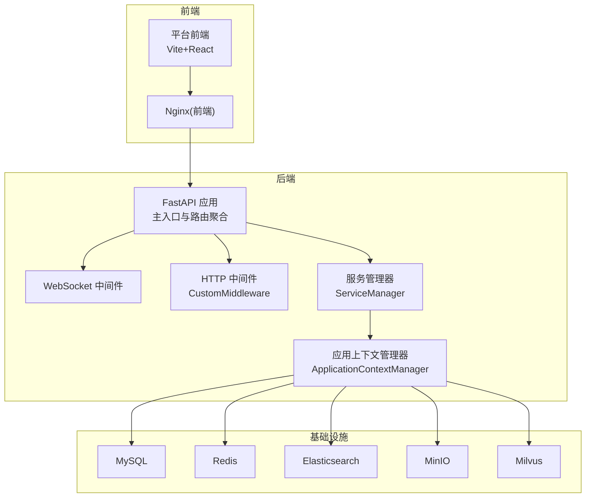
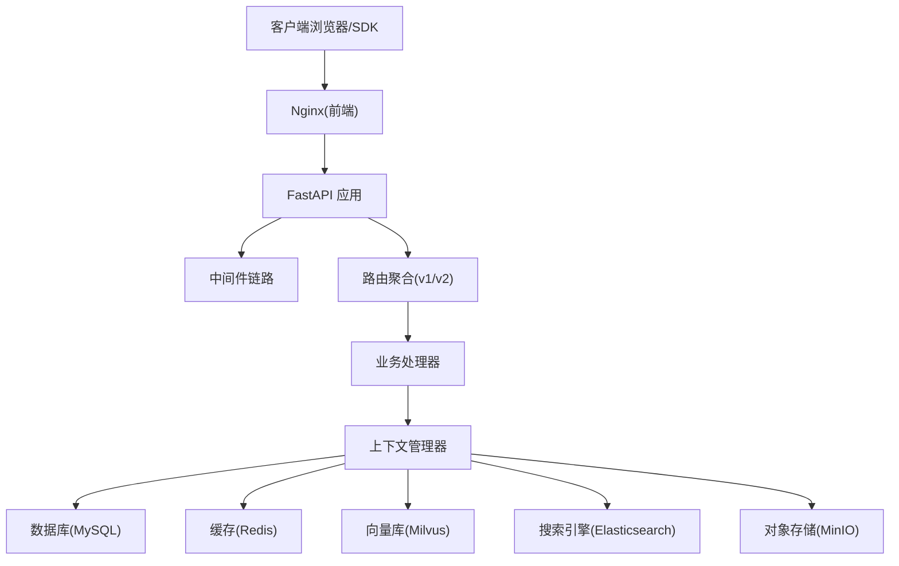
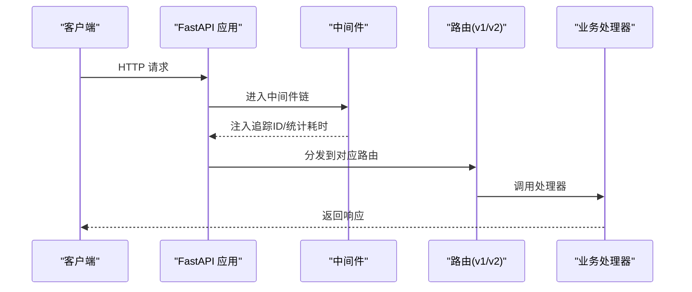
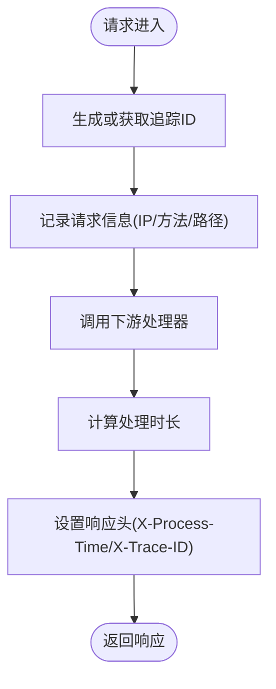
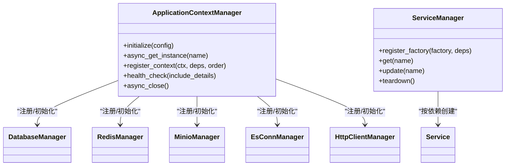
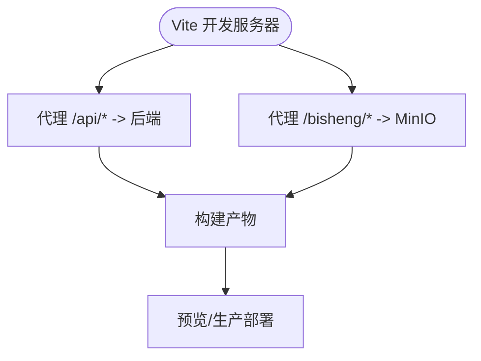
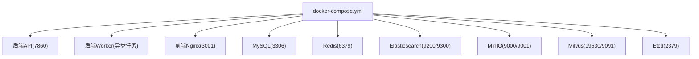
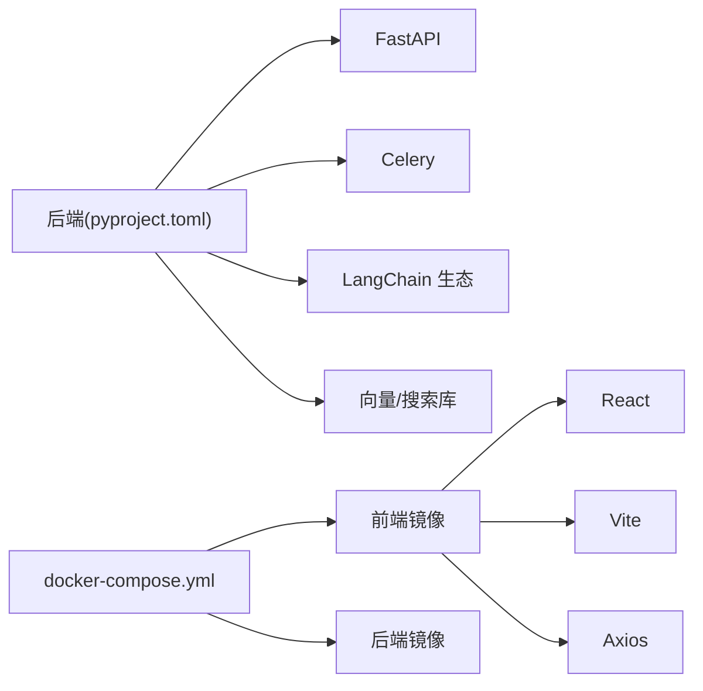
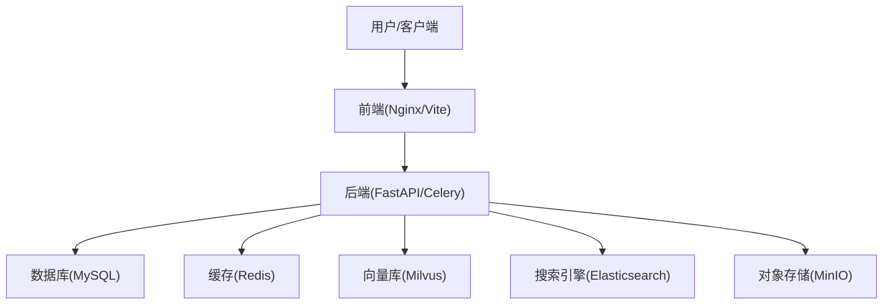

# 架构设计

<cite>
**本文引用的文件列表**
- [README.md](file://README.md)
- [main.py](file://src/backend/bisheng/main.py)
- [router.py](file://src/backend/bisheng/api/router.py)
- [server.py](file://src/backend/bisheng/server.py)
- [config.yaml](file://docker/bisheng/config/config.yaml)
- [docker-compose.yml](file://docker/docker-compose.yml)
- [package.json](file://src/frontend/platform/package.json)
- [vite.config.mts](file://src/frontend/platform/vite.config.mts)
- [http_middleware.py](file://src/backend/bisheng/utils/http_middleware.py)
- [manager.py](file://src/backend/bisheng/core/context/manager.py)
- [manager.py](file://src/backend/bisheng/services/manager.py)
- [pyproject.toml](file://src/backend/pyproject.toml)
</cite>

## 目录
1. [引言](#引言)
2. [项目结构](#项目结构)
3. [核心组件](#核心组件)
4. [架构总览](#架构总览)
5. [组件详细分析](#组件详细分析)
6. [依赖关系分析](#依赖关系分析)
7. [性能与可扩展性](#性能与可扩展性)
8. [故障排查指南](#故障排查指南)
9. [结论](#结论)
10. [附录](#附录)

## 引言
本架构设计文档面向 Bisheng 平台，目标是提供从高层设计理念到落地实现的完整蓝图。文档覆盖前后端分离、微服务化思路、容器化部署策略、组件交互、数据流、安全与可观测性、以及基础设施与可扩展性建议。同时，结合仓库中现有代码与配置，给出可操作的系统上下文图与组件分解图，帮助读者快速理解平台如何通过模块化与中间件体系支撑复杂的企业级应用编排与智能体工作流。

## 项目结构
Bisheng 采用“前后端分离 + 容器化部署”的组织方式：
- 后端基于 FastAPI，提供 REST API 与 RPC 接口，统一由主入口创建应用并挂载路由。
- 前端基于 Vite + React，开发态通过本地代理转发至后端 API；生产态由 Nginx 提供静态资源与反向代理。
- 基础设施通过 docker-compose 统一编排，包含 MySQL、Redis、Elasticsearch、MinIO、Milvus 等。

图表来源
- [main.py](file://src/backend/bisheng/main.py#L64-L102)
- [router.py](file://src/backend/bisheng/api/router.py#L1-L61)
- [http_middleware.py](file://src/backend/bisheng/utils/http_middleware.py#L12-L33)
- [manager.py](file://src/backend/bisheng/services/manager.py#L11-L96)
- [manager.py](file://src/backend/bisheng/core/context/manager.py#L23-L136)
- [docker-compose.yml](file://docker/docker-compose.yml#L1-L201)

章节来源
- [README.md](file://README.md#L60-L86)
- [docker-compose.yml](file://docker/docker-compose.yml#L1-L201)
- [main.py](file://src/backend/bisheng/main.py#L64-L102)
- [router.py](file://src/backend/bisheng/api/router.py#L1-L61)

## 核心组件
- 应用入口与生命周期
  - 主应用通过工厂方法创建 FastAPI 实例，注册异常处理器、CORS、中间件，并在 lifespan 中完成上下文初始化与默认数据注入。
- 路由与接口分层
  - v1 与 v2 两套路由前缀，分别承载业务接口与开放 RPC 接口，统一挂载到应用。
- 中间件体系
  - 自定义 HTTP 中间件负责请求追踪 ID 注入、处理时长统计与日志输出；WebSocket 中间件为实时会话提供追踪能力。
- 服务与上下文管理
  - 服务管理器按依赖顺序创建与复用服务；应用上下文管理器集中注册数据库、缓存、对象存储、搜索引擎、HTTP 客户端、提示词管理等基础设施上下文。
- 前后端代理与构建
  - 前端开发态通过 Vite 代理转发 API 与文件服务；生产态由 Nginx 提供静态资源与反向代理。

章节来源
- [main.py](file://src/backend/bisheng/main.py#L21-L102)
- [router.py](file://src/backend/bisheng/api/router.py#L1-L61)
- [http_middleware.py](file://src/backend/bisheng/utils/http_middleware.py#L12-L46)
- [manager.py](file://src/backend/bisheng/services/manager.py#L11-L96)
- [manager.py](file://src/backend/bisheng/core/context/manager.py#L23-L136)
- [vite.config.mts](file://src/frontend/platform/vite.config.mts#L138-L146)

## 架构总览
Bisheng 的整体架构遵循“单体后端 + 多租户/多组件上下文 + 容器化基础设施”的模式。后端以 FastAPI 为核心，通过中间件与上下文管理器解耦基础设施依赖；前端通过 Nginx 与 Vite 代理实现开发与生产的统一接入；基础设施通过 docker-compose 统一编排，便于企业私有化部署与横向扩展。

图表来源
- [main.py](file://src/backend/bisheng/main.py#L64-L102)
- [router.py](file://src/backend/bisheng/api/router.py#L1-L61)
- [manager.py](file://src/backend/bisheng/core/context/manager.py#L67-L98)
- [docker-compose.yml](file://docker/docker-compose.yml#L1-L201)

## 组件详细分析

### 后端应用与路由
- 应用创建与中间件
  - 创建 FastAPI 实例，注册 CORS、自定义中间件与 WebSocket 日志中间件；统一异常处理映射，确保错误响应一致。
- 路由聚合
  - v1 路由包含聊天、工作流、知识库、LLM、工具、邀请码、审计、报表等模块；v2 路由提供开放 RPC 接口。
- 生命周期
  - lifespan 在启动阶段初始化上下文、服务与默认数据，在关闭阶段释放资源与线程池。

图表来源
- [main.py](file://src/backend/bisheng/main.py#L64-L102)
- [router.py](file://src/backend/bisheng/api/router.py#L1-L61)
- [http_middleware.py](file://src/backend/bisheng/utils/http_middleware.py#L12-L33)

章节来源
- [main.py](file://src/backend/bisheng/main.py#L64-L102)
- [router.py](file://src/backend/bisheng/api/router.py#L1-L61)

### 中间件与日志追踪
- 自定义中间件
  - 注入 x-trace-id 或生成全局追踪 ID，记录请求 IP、方法与路径，计算处理时长并回写响应头。
- WebSocket 中间件
  - 为 WebSocket 会话注入追踪 ID，便于端到端链路追踪。
- 异常处理
  - 统一捕获 HTTP 异常、参数校验异常与业务错误码，返回结构化错误响应。

图表来源
- [http_middleware.py](file://src/backend/bisheng/utils/http_middleware.py#L12-L33)

章节来源
- [http_middleware.py](file://src/backend/bisheng/utils/http_middleware.py#L12-L46)
- [main.py](file://src/backend/bisheng/main.py#L21-L49)

### 上下文与服务管理
- 上下文管理器
  - 注册数据库、Redis、MinIO、ES、HTTP 客户端、提示词管理等上下文，按依赖顺序初始化与关闭，支持健康检查与状态查询。
- 服务管理器
  - 按依赖顺序创建服务实例，支持更新与销毁，便于在运行期调整配置或重启特定服务。

图表来源
- [manager.py](file://src/backend/bisheng/core/context/manager.py#L23-L136)
- [manager.py](file://src/backend/bisheng/services/manager.py#L11-L96)

章节来源
- [manager.py](file://src/backend/bisheng/core/context/manager.py#L23-L136)
- [manager.py](file://src/backend/bisheng/services/manager.py#L11-L96)

### 前端代理与构建
- 代理规则
  - 将 /api/ 与 /health 代理到后端 API；将 /bisheng 与 /tmp-dir 代理到 MinIO 文件服务；支持 WebSocket 代理。
- 构建优化
  - 按依赖拆分代码块，针对 Ace、ReactFlow、PDFJS、Dropzone 等进行手动分包，提升加载效率。
- 开发服务器
  - Vite 监听 3001 端口，支持热更新与代理调试。

图表来源
- [vite.config.mts](file://src/frontend/platform/vite.config.mts#L138-L146)
- [vite.config.mts](file://src/frontend/platform/vite.config.mts#L29-L60)

章节来源
- [vite.config.mts](file://src/frontend/platform/vite.config.mts#L138-L146)
- [package.json](file://src/frontend/platform/package.json#L76-L82)

### 容器化与基础设施编排
- 编排组件
  - 后端 API 与 Worker、前端 Nginx、MySQL、Redis、Elasticsearch、Milvus、Etcd、MinIO。
- 环境变量与配置
  - 通过环境变量传递 Milvus、ES、MinIO 等连接参数；后端配置文件读取这些变量并注入到上下文。
- 健康检查
  - 各服务均配置健康检查，确保依赖可用后再启动上层服务。

图表来源
- [docker-compose.yml](file://docker/docker-compose.yml#L1-L201)
- [config.yaml](file://docker/bisheng/config/config.yaml#L34-L57)

章节来源
- [docker-compose.yml](file://docker/docker-compose.yml#L1-L201)
- [config.yaml](file://docker/bisheng/config/config.yaml#L1-L88)

## 依赖关系分析
- 技术栈与版本
  - 后端：Python 3.10+，FastAPI、Celery、Redis、MySQL/PostgreSQL、Elasticsearch、Milvus、MinIO、LangChain 生态等。
  - 前端：React 18、Vite、TailwindCSS、Axios、React Router、Zustand 等。
- 关键依赖关系
  - 后端通过上下文管理器依赖数据库、缓存、对象存储与搜索引擎；通过服务管理器依赖会话、任务等服务。
  - 前端通过 Vite 代理与后端 API 通信，静态资源由 Nginx 提供。

图表来源
- [pyproject.toml](file://src/backend/pyproject.toml#L1-L87)
- [package.json](file://src/frontend/platform/package.json#L1-L126)
- [docker-compose.yml](file://docker/docker-compose.yml#L1-L201)

章节来源
- [pyproject.toml](file://src/backend/pyproject.toml#L1-L87)
- [package.json](file://src/frontend/platform/package.json#L1-L126)

## 性能与可扩展性
- 性能特性
  - 中间件统一注入追踪 ID 与处理时长，便于定位慢请求；日志配置支持按级别与内容过滤，降低噪声。
  - 前端构建按模块拆分，减少首屏体积；WebSocket 代理支持实时消息推送。
- 可扩展性
  - 上下文管理器支持新增基础设施上下文与依赖顺序控制；服务管理器支持按需创建与更新服务。
  - docker-compose 支持独立扩缩容后端 API 与 Worker；对象存储与搜索引擎可独立扩展。
- 建议
  - 在高并发场景下，建议引入负载均衡与水平扩展后端实例；对 Celery Worker 进行队列隔离与资源限制；对 Milvus/ES/MongoDB 等进行分片与副本配置。

[本节为通用指导，不直接分析具体文件]

## 故障排查指南
- 健康检查
  - 后端提供 /health 接口；各容器均配置健康检查，可通过 compose 查看状态。
- 日志与追踪
  - 中间件在请求进入与返回时记录日志并设置 X-Trace-ID，便于端到端追踪。
- 常见问题
  - 数据库/缓存不可用：检查上下文初始化顺序与连接参数；确认 docker-compose 健康检查通过。
  - 文件上传失败：检查 MinIO 端口与桶权限；确认前端代理路径正确。
  - WebSocket 不可用：确认代理配置与中间件已启用。

章节来源
- [main.py](file://src/backend/bisheng/main.py#L77-L80)
- [http_middleware.py](file://src/backend/bisheng/utils/http_middleware.py#L12-L33)
- [docker-compose.yml](file://docker/docker-compose.yml#L67-L72)

## 结论
Bisheng 通过“单体后端 + 多上下文 + 容器化编排”的架构，实现了前后端分离、可插拔的基础设施抽象与可扩展的部署形态。中间件与上下文管理器降低了模块耦合，使平台能够在企业场景中稳定地支撑复杂工作流与智能体编排。配合 docker-compose 与 Nginx，平台具备良好的私有化部署与运维弹性。

[本节为总结，不直接分析具体文件]

## 附录
- 系统上下文图（概念）

[该图为概念示意，不对应具体源文件]

- 技术栈与版本兼容要点
  - 后端 Python 版本要求与依赖范围参见后端工程配置；前端 Node 版本要求与依赖范围参见前端工程配置。
  - docker-compose 中的服务版本与端口映射应与实际部署环境保持一致。

章节来源
- [pyproject.toml](file://src/backend/pyproject.toml#L7-L8)
- [package.json](file://src/frontend/platform/package.json#L122-L124)
- [docker-compose.yml](file://docker/docker-compose.yml#L1-L201)