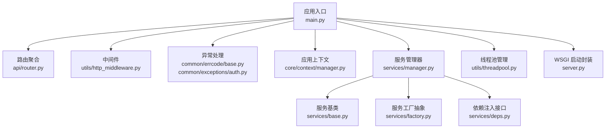
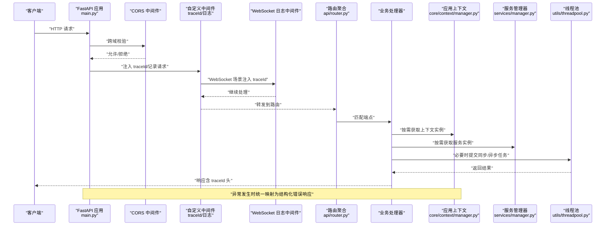
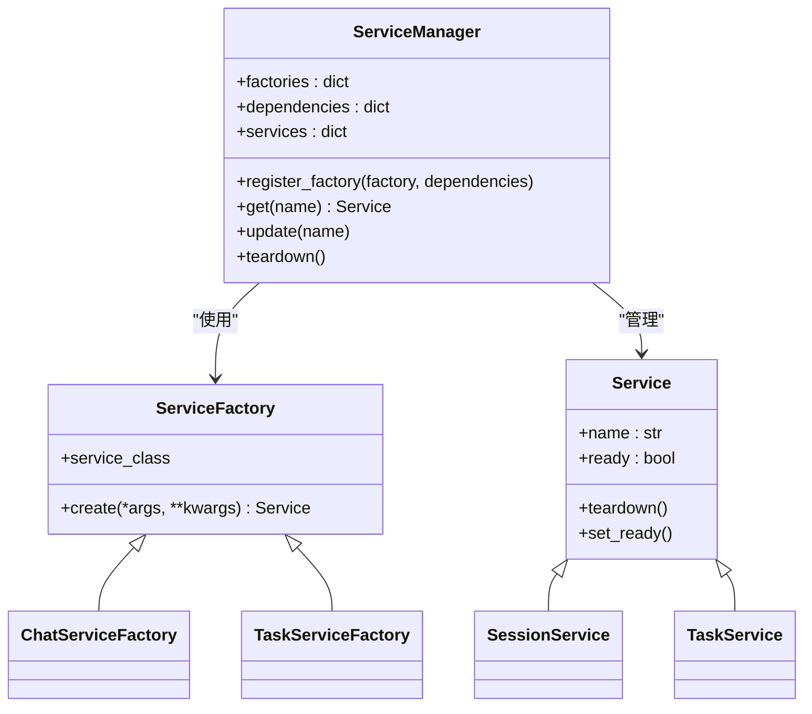
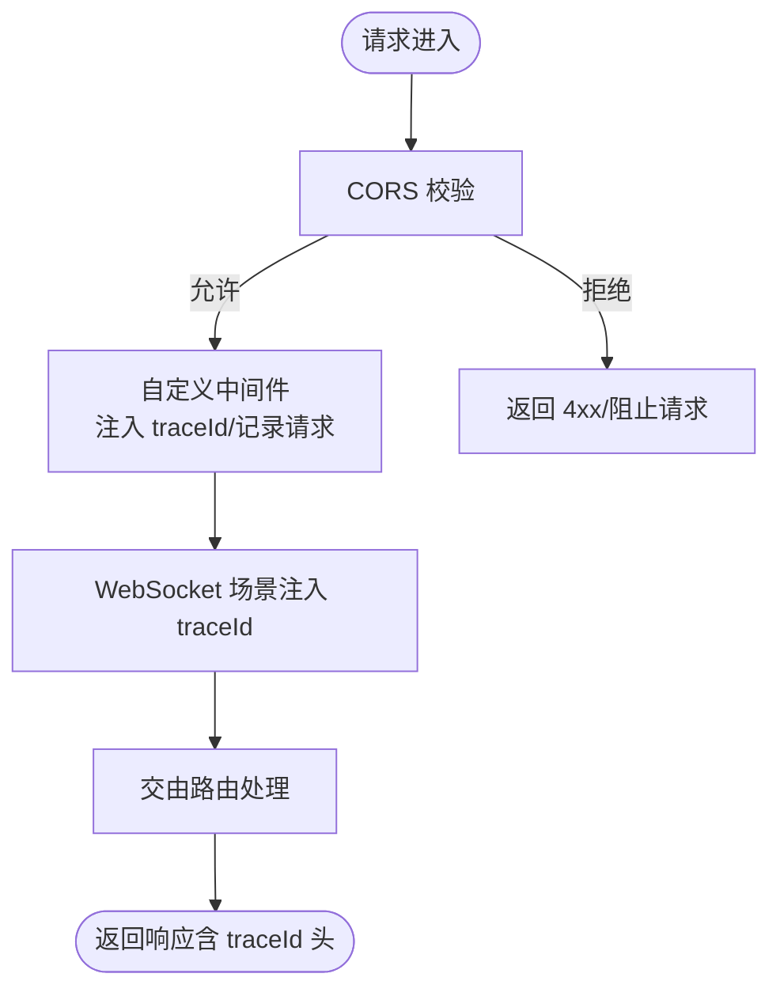
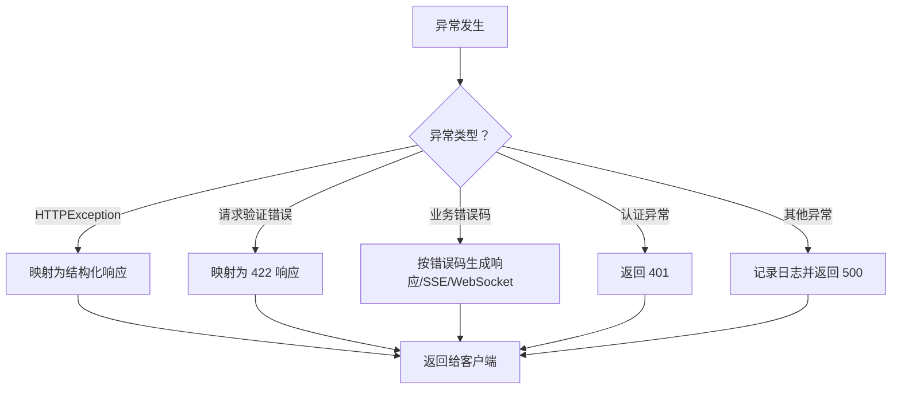
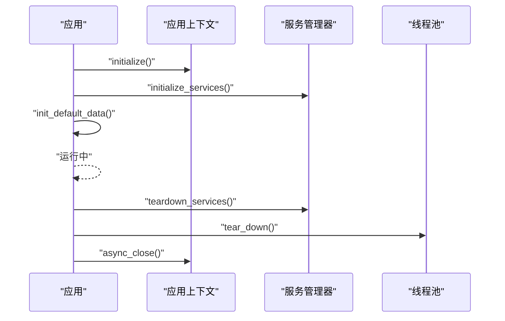
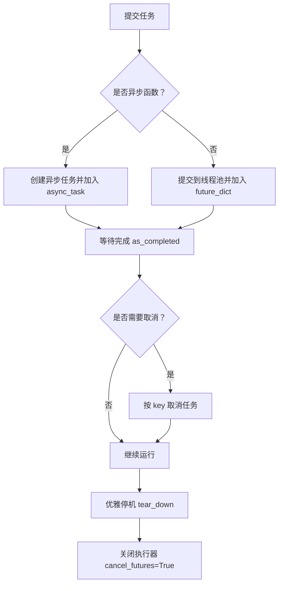
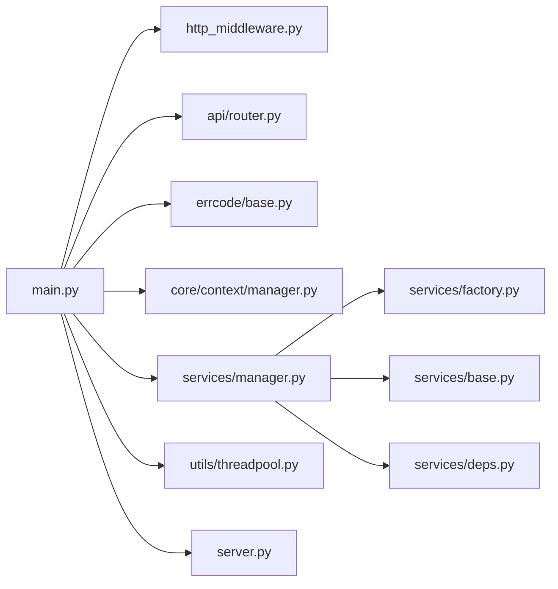

# 组件交互设计

<cite>
**本文引用的文件**
- [src/backend/bisheng/main.py](file://src/backend/bisheng/main.py)
- [src/backend/bisheng/server.py](file://src/backend/bisheng/server.py)
- [src/backend/bisheng/api/router.py](file://src/backend/bisheng/api/router.py)
- [src/backend/bisheng/utils/http_middleware.py](file://src/backend/bisheng/utils/http_middleware.py)
- [src/backend/bisheng/common/errcode/base.py](file://src/backend/bisheng/common/errcode/base.py)
- [src/backend/bisheng/common/exceptions/auth.py](file://src/backend/bisheng/common/exceptions/auth.py)
- [src/backend/bisheng/utils/exceptions.py](file://src/backend/bisheng/utils/exceptions.py)
- [src/backend/bisheng/core/context/manager.py](file://src/backend/bisheng/core/context/manager.py)
- [src/backend/bisheng/services/base.py](file://src/backend/bisheng/services/base.py)
- [src/backend/bisheng/services/factory.py](file://src/backend/bisheng/services/factory.py)
- [src/backend/bisheng/services/manager.py](file://src/backend/bisheng/services/manager.py)
- [src/backend/bisheng/services/deps.py](file://src/backend/bisheng/services/deps.py)
- [src/backend/bisheng/utils/threadpool.py](file://src/backend/bisheng/utils/threadpool.py)
</cite>

## 目录
1. [引言](#引言)
2. [项目结构](#项目结构)
3. [核心组件](#核心组件)
4. [架构总览](#架构总览)
5. [详细组件分析](#详细组件分析)
6. [依赖分析](#依赖分析)
7. [性能考虑](#性能考虑)
8. [故障排查指南](#故障排查指南)
9. [结论](#结论)
10. [附录](#附录)

## 引言
本文件面向 Bisheng 平台的组件交互设计，聚焦以下目标：
- 系统中各组件之间的交互模式与通信协议
- 服务工厂模式的应用：节点工厂、服务工厂的创建与管理机制
- 中间件体系：CORS、自定义中间件、WebSocket 中间件的作用与配置
- 异常处理机制与错误传播策略
- 生命周期管理与资源清理流程
- 组件依赖关系图与交互时序图
- 异步处理、并发控制与线程池管理策略

## 项目结构
后端采用 FastAPI 应用入口集中初始化，统一注册路由、中间件与异常处理器，并通过应用上下文与服务管理器完成基础设施与业务服务的生命周期管理。

图表来源
- [src/backend/bisheng/main.py](file://src/backend/bisheng/main.py#L64-L102)
- [src/backend/bisheng/api/router.py](file://src/backend/bisheng/api/router.py#L1-L61)
- [src/backend/bisheng/utils/http_middleware.py](file://src/backend/bisheng/utils/http_middleware.py#L1-L47)
- [src/backend/bisheng/common/errcode/base.py](file://src/backend/bisheng/common/errcode/base.py#L1-L97)
- [src/backend/bisheng/common/exceptions/auth.py](file://src/backend/bisheng/common/exceptions/auth.py#L1-L16)
- [src/backend/bisheng/core/context/manager.py](file://src/backend/bisheng/core/context/manager.py#L23-L290)
- [src/backend/bisheng/services/manager.py](file://src/backend/bisheng/services/manager.py#L11-L150)
- [src/backend/bisheng/services/base.py](file://src/backend/bisheng/services/base.py#L1-L13)
- [src/backend/bisheng/services/factory.py](file://src/backend/bisheng/services/factory.py#L1-L14)
- [src/backend/bisheng/services/deps.py](file://src/backend/bisheng/services/deps.py#L1-L50)
- [src/backend/bisheng/utils/threadpool.py](file://src/backend/bisheng/utils/threadpool.py#L1-L134)
- [src/backend/bisheng/server.py](file://src/backend/bisheng/server.py#L1-L21)

章节来源
- [src/backend/bisheng/main.py](file://src/backend/bisheng/main.py#L64-L102)
- [src/backend/bisheng/api/router.py](file://src/backend/bisheng/api/router.py#L1-L61)

## 核心组件
- 应用入口与生命周期
  - 应用创建、中间件注册、异常处理器注册、健康检查端点、调试开关等在入口集中实现。
  - 生命周期钩子负责初始化应用上下文、启动服务、加载默认数据、优雅关闭时清理线程池与上下文。
- 路由与端点
  - 聚合多条业务路由前缀，形成 v1/v2 两套 API 命名空间。
- 中间件体系
  - CORS 允许跨域访问；自定义中间件记录请求、注入追踪 ID、附加响应头；WebSocket 中间件注入追踪 ID。
- 异常处理
  - 统一异常映射到结构化响应；业务错误码支持多种输出格式（SSE、WebSocket 关闭消息等）；认证 JWT 错误单独处理。
- 应用上下文
  - 提供全局上下文注册、依赖顺序初始化、健康检查、反向顺序关闭与批量获取能力。
- 服务管理与工厂
  - 服务工厂抽象定义创建契约；服务管理器按依赖顺序创建服务实例，支持更新与整体销毁。
- 线程池管理
  - 封装线程池执行器，提供同步/异步任务提交、等待完成、取消、优雅停机等能力。

章节来源
- [src/backend/bisheng/main.py](file://src/backend/bisheng/main.py#L21-L61)
- [src/backend/bisheng/api/router.py](file://src/backend/bisheng/api/router.py#L23-L61)
- [src/backend/bisheng/utils/http_middleware.py](file://src/backend/bisheng/utils/http_middleware.py#L12-L47)
- [src/backend/bisheng/common/errcode/base.py](file://src/backend/bisheng/common/errcode/base.py#L9-L97)
- [src/backend/bisheng/common/exceptions/auth.py](file://src/backend/bisheng/common/exceptions/auth.py#L1-L16)
- [src/backend/bisheng/core/context/manager.py](file://src/backend/bisheng/core/context/manager.py#L23-L290)
- [src/backend/bisheng/services/factory.py](file://src/backend/bisheng/services/factory.py#L7-L14)
- [src/backend/bisheng/services/manager.py](file://src/backend/bisheng/services/manager.py#L11-L150)
- [src/backend/bisheng/utils/threadpool.py](file://src/backend/bisheng/utils/threadpool.py#L12-L134)

## 架构总览
下图展示从请求进入至服务返回的关键交互路径，以及异常与中间件的介入位置。

图表来源
- [src/backend/bisheng/main.py](file://src/backend/bisheng/main.py#L64-L102)
- [src/backend/bisheng/utils/http_middleware.py](file://src/backend/bisheng/utils/http_middleware.py#L12-L47)
- [src/backend/bisheng/api/router.py](file://src/backend/bisheng/api/router.py#L1-L61)
- [src/backend/bisheng/core/context/manager.py](file://src/backend/bisheng/core/context/manager.py#L133-L141)
- [src/backend/bisheng/services/manager.py](file://src/backend/bisheng/services/manager.py#L35-L42)
- [src/backend/bisheng/utils/threadpool.py](file://src/backend/bisheng/utils/threadpool.py#L23-L35)

## 详细组件分析

### 服务工厂与服务管理器
- 工厂抽象
  - 服务工厂以“服务类”为参数，定义统一的 create 接口，便于扩展不同服务的构造策略。
- 服务管理器
  - 按依赖顺序创建服务；支持依赖注入（通过 get 注入已创建的服务实例）；提供更新与整体销毁能力。
- 依赖注入接口
  - 通过依赖函数直接从服务管理器获取具体服务实例，简化路由层对服务的使用。

图表来源
- [src/backend/bisheng/services/factory.py](file://src/backend/bisheng/services/factory.py#L7-L14)
- [src/backend/bisheng/services/base.py](file://src/backend/bisheng/services/base.py#L4-L13)
- [src/backend/bisheng/services/manager.py](file://src/backend/bisheng/services/manager.py#L11-L150)

章节来源
- [src/backend/bisheng/services/factory.py](file://src/backend/bisheng/services/factory.py#L7-L14)
- [src/backend/bisheng/services/manager.py](file://src/backend/bisheng/services/manager.py#L11-L150)
- [src/backend/bisheng/services/deps.py](file://src/backend/bisheng/services/deps.py#L38-L49)

### 中间件体系
- CORS 中间件
  - 配置允许来源、方法与头部，满足前端跨域访问需求。
- 自定义中间件
  - 注入 traceId，记录请求与处理耗时，附加响应头便于链路追踪。
- WebSocket 日志中间件
  - 在 WebSocket 连接建立时注入 traceId，确保长连接场景的日志一致性。

图表来源
- [src/backend/bisheng/main.py](file://src/backend/bisheng/main.py#L81-L90)
- [src/backend/bisheng/utils/http_middleware.py](file://src/backend/bisheng/utils/http_middleware.py#L12-L47)

章节来源
- [src/backend/bisheng/main.py](file://src/backend/bisheng/main.py#L81-L90)
- [src/backend/bisheng/utils/http_middleware.py](file://src/backend/bisheng/utils/http_middleware.py#L12-L47)

### 异常处理与错误传播
- 统一异常映射
  - 对 HTTPException、请求验证错误、业务错误码、通用异常进行统一映射，保证响应结构一致。
- 业务错误码
  - 支持返回统一响应模型、SSE 事件、WebSocket 关闭消息等多种输出形式。
- 认证异常
  - JWT 解码失败等认证相关异常单独处理，返回 401。
- 未捕获异常
  - 记录异常日志并返回通用错误响应，避免敏感信息泄露。

图表来源
- [src/backend/bisheng/main.py](file://src/backend/bisheng/main.py#L21-L49)
- [src/backend/bisheng/common/errcode/base.py](file://src/backend/bisheng/common/errcode/base.py#L24-L97)
- [src/backend/bisheng/common/exceptions/auth.py](file://src/backend/bisheng/common/exceptions/auth.py#L1-L16)
- [src/backend/bisheng/utils/exceptions.py](file://src/backend/bisheng/utils/exceptions.py#L1-L36)

章节来源
- [src/backend/bisheng/main.py](file://src/backend/bisheng/main.py#L21-L49)
- [src/backend/bisheng/common/errcode/base.py](file://src/backend/bisheng/common/errcode/base.py#L9-L97)
- [src/backend/bisheng/common/exceptions/auth.py](file://src/backend/bisheng/common/exceptions/auth.py#L1-L16)
- [src/backend/bisheng/utils/exceptions.py](file://src/backend/bisheng/utils/exceptions.py#L1-L36)

### 生命周期管理与资源清理
- 应用生命周期
  - 初始化阶段：构建应用上下文、启动服务、加载默认数据。
  - 运行阶段：接收请求、执行业务逻辑。
  - 关闭阶段：销毁服务、关闭线程池、关闭应用上下文。
- 上下文管理
  - 以依赖顺序初始化与反向顺序关闭，确保资源释放顺序正确。
- 线程池清理
  - 关闭前取消待执行任务并关闭执行器，防止资源泄漏。

图表来源
- [src/backend/bisheng/main.py](file://src/backend/bisheng/main.py#L52-L61)
- [src/backend/bisheng/core/context/manager.py](file://src/backend/bisheng/core/context/manager.py#L227-L264)
- [src/backend/bisheng/services/manager.py](file://src/backend/bisheng/services/manager.py#L82-L97)
- [src/backend/bisheng/utils/threadpool.py](file://src/backend/bisheng/utils/threadpool.py#L105-L109)

章节来源
- [src/backend/bisheng/main.py](file://src/backend/bisheng/main.py#L52-L61)
- [src/backend/bisheng/core/context/manager.py](file://src/backend/bisheng/core/context/manager.py#L227-L264)
- [src/backend/bisheng/services/manager.py](file://src/backend/bisheng/services/manager.py#L82-L97)
- [src/backend/bisheng/utils/threadpool.py](file://src/backend/bisheng/utils/threadpool.py#L105-L109)

### 异步处理、并发控制与线程池管理
- 线程池封装
  - 提交同步与异步任务，分别维护 Future 列表；提供 as_completed 查询已完成任务；支持按 key 取消任务；提供统一关闭。
- 并发控制
  - 通过 max_workers 控制最大并发；内部锁保护共享状态；区分同步与异步任务队列。
- 异步等待
  - 提供按键集合查询已完成任务的能力，便于批处理场景的进度跟踪。

图表来源
- [src/backend/bisheng/utils/threadpool.py](file://src/backend/bisheng/utils/threadpool.py#L23-L109)

章节来源
- [src/backend/bisheng/utils/threadpool.py](file://src/backend/bisheng/utils/threadpool.py#L12-L134)

## 依赖分析
- 组件耦合与内聚
  - 应用入口对中间件、路由、异常处理高度内聚；通过上下文与服务管理器解耦业务模块。
- 直接与间接依赖
  - 路由依赖各业务模块；服务管理器依赖工厂与服务基类；线程池被业务逻辑间接使用。
- 生命周期依赖
  - 服务管理器与线程池在应用关闭阶段统一清理，避免资源泄漏。

图表来源
- [src/backend/bisheng/main.py](file://src/backend/bisheng/main.py#L64-L102)
- [src/backend/bisheng/api/router.py](file://src/backend/bisheng/api/router.py#L1-L61)
- [src/backend/bisheng/utils/http_middleware.py](file://src/backend/bisheng/utils/http_middleware.py#L1-L47)
- [src/backend/bisheng/common/errcode/base.py](file://src/backend/bisheng/common/errcode/base.py#L1-L97)
- [src/backend/bisheng/core/context/manager.py](file://src/backend/bisheng/core/context/manager.py#L1-L482)
- [src/backend/bisheng/services/manager.py](file://src/backend/bisheng/services/manager.py#L1-L150)
- [src/backend/bisheng/services/factory.py](file://src/backend/bisheng/services/factory.py#L1-L14)
- [src/backend/bisheng/services/base.py](file://src/backend/bisheng/services/base.py#L1-L13)
- [src/backend/bisheng/services/deps.py](file://src/backend/bisheng/services/deps.py#L1-L50)
- [src/backend/bisheng/utils/threadpool.py](file://src/backend/bisheng/utils/threadpool.py#L1-L134)
- [src/backend/bisheng/server.py](file://src/backend/bisheng/server.py#L1-L21)

章节来源
- [src/backend/bisheng/main.py](file://src/backend/bisheng/main.py#L64-L102)
- [src/backend/bisheng/services/manager.py](file://src/backend/bisheng/services/manager.py#L11-L150)

## 性能考虑
- 中间件开销
  - 自定义中间件仅做轻量日志与 traceId 注入，建议在生产环境保持开启以获得可观测性。
- 线程池大小
  - 根据 CPU 密集型与 IO 密集型任务比例调整 max_workers，避免过度竞争导致上下文切换开销增大。
- 异步与同步混合
  - 将 IO 密集型任务放入线程池，CPU 密集型任务尽量异步化或拆分，减少阻塞。
- 资源回收
  - 关闭阶段统一取消任务与关闭执行器，避免长时间运行导致内存与句柄泄漏。

## 故障排查指南
- 常见问题定位
  - 使用 traceId 定位请求链路；查看响应头中的处理时间与 traceId。
  - 认证失败时关注 401 返回与 JWT 解码错误。
  - 业务错误码统一映射为结构化响应，可据此快速定位模块与错误类型。
- 日志与监控
  - 异常处理器会记录异常堆栈；建议结合日志系统与链路追踪工具进行关联分析。
- 资源清理
  - 若出现线程池未释放或上下文未关闭，检查生命周期钩子是否正常执行。

章节来源
- [src/backend/bisheng/main.py](file://src/backend/bisheng/main.py#L21-L49)
- [src/backend/bisheng/utils/http_middleware.py](file://src/backend/bisheng/utils/http_middleware.py#L15-L33)
- [src/backend/bisheng/common/exceptions/auth.py](file://src/backend/bisheng/common/exceptions/auth.py#L1-L16)
- [src/backend/bisheng/utils/threadpool.py](file://src/backend/bisheng/utils/threadpool.py#L105-L109)

## 结论
Bisheng 平台通过统一的应用入口、中间件体系、异常处理与服务管理机制，实现了清晰的组件交互与良好的可维护性。服务工厂与服务管理器提供了灵活的服务创建与依赖注入能力；线程池管理保障了异步与并发场景下的稳定性；生命周期钩子确保资源的有序分配与回收。建议在生产环境中合理配置线程池大小与中间件策略，并持续完善错误码与日志体系以提升可观测性。

## 附录
- 启动方式
  - 应用入口支持直接运行与 Gunicorn 封装两种方式，便于开发与生产部署。
- 路由命名空间
  - v1 与 v2 两条路由前缀用于区分稳定与实验性接口，便于演进与兼容。

章节来源
- [src/backend/bisheng/main.py](file://src/backend/bisheng/main.py#L107-L113)
- [src/backend/bisheng/server.py](file://src/backend/bisheng/server.py#L4-L21)
- [src/backend/bisheng/api/router.py](file://src/backend/bisheng/api/router.py#L23-L61)