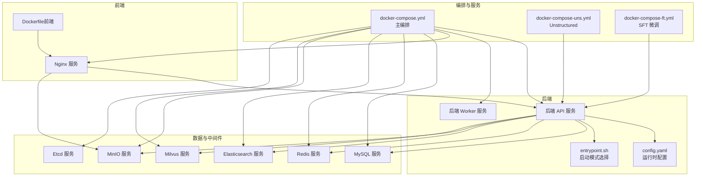
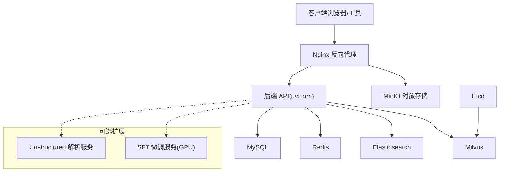
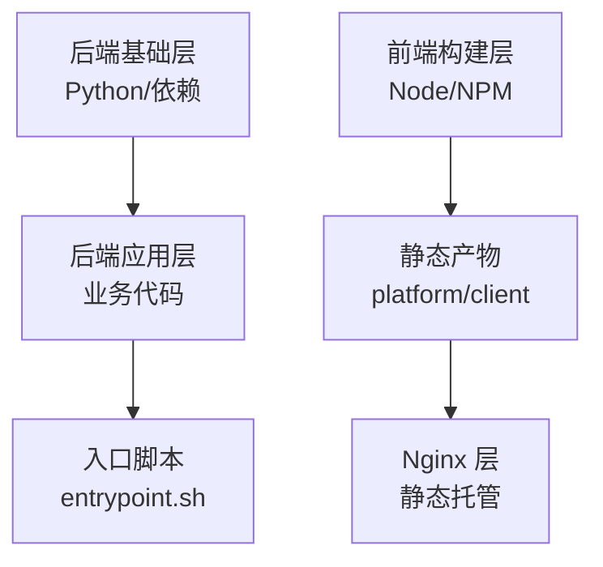
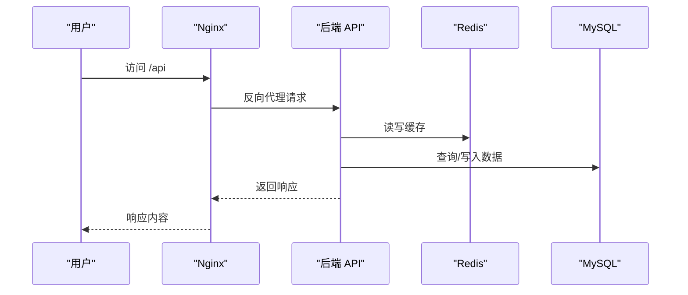
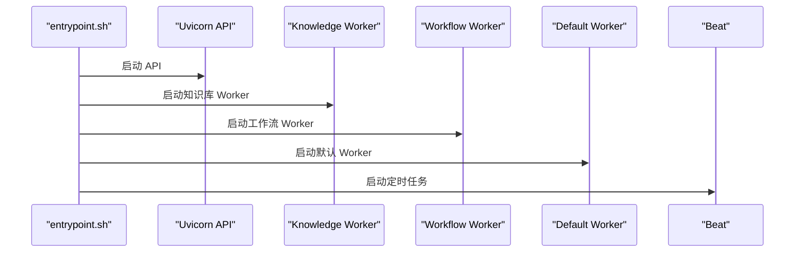
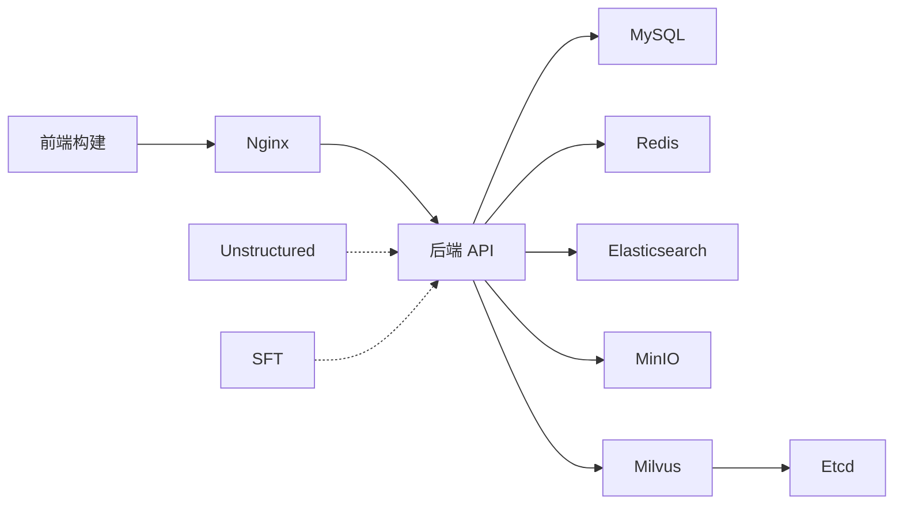

# 部署架构

<cite>
**本文引用的文件**
- [docker-compose.yml](file://docker/docker-compose.yml)
- [nginx.conf](file://docker/nginx/nginx.conf)
- [default.conf](file://docker/nginx/conf.d/default.conf)
- [websocket.conf](file://docker/nginx/conf.d/websocket.conf)
- [entrypoint.sh](file://docker/bisheng/entrypoint.sh)
- [config.yaml](file://docker/bisheng/config/config.yaml)
- [my.cnf](file://docker/mysql/conf/my.cnf)
- [redis.conf](file://docker/redis/redis.conf)
- [docker-compose-uns.yml](file://docker/docker-compose-uns.yml)
- [docker-compose-ft.yml](file://docker/docker-compose-ft.yml)
- [Dockerfile（前端）](file://src/frontend/Dockerfile)
- [Dockerfile（后端）](file://src/backend/Dockerfile)
- [base.Dockerfile（后端）](file://src/backend/base.Dockerfile)
- [config.yaml（微调）](file://docker/bisheng-ft/config.yaml)
- [config.yaml（unstructured）](file://docker/bisheng-uns/config.yaml)
</cite>

## 目录
1. [简介](#简介)
2. [项目结构](#项目结构)
3. [核心组件](#核心组件)
4. [架构总览](#架构总览)
5. [详细组件分析](#详细组件分析)
6. [依赖关系分析](#依赖关系分析)
7. [性能考虑](#性能考虑)
8. [故障排查指南](#故障排查指南)
9. [结论](#结论)
10. [附录](#附录)

## 简介
本文件面向 Bisheng 平台的容器化部署，系统性阐述镜像构建策略（含多阶段与分层优化）、Docker Compose 编排（服务依赖、网络与卷）、Nginx 反向代理与 WebSocket 支持、环境变量与配置注入机制，并给出生产部署最佳实践、安全加固、性能调优、监控与日志、健康检查以及部署拓扑与故障转移方案。

## 项目结构
围绕部署的关键目录与文件如下：
- docker/docker-compose.yml：平台主编排，定义 MySQL、Redis、后端 API、Worker、前端 Nginx、Elasticsearch、Etcd、MinIO、Milvus 等服务及其依赖、卷与健康检查。
- docker/nginx/*：Nginx 核心配置与站点配置，支持静态资源、反代后端 API、对象存储、WebSocket。
- docker/bisheng/*：后端应用入口脚本与运行时配置（数据库、缓存、向量库、对象存储、日志等）。
- docker/mysql/conf/my.cnf：MySQL 字符集与 SQL 模式配置。
- docker/redis/redis.conf：Redis 安全与网络配置示例（受保护模式、端口、超时等）。
- docker/docker-compose-uns.yml：Unstructured 文档解析服务编排。
- docker/docker-compose-ft.yml：SFT 微调服务编排（GPU 资源声明）。
- src/frontend/Dockerfile：前端多阶段构建与静态资源打包。
- src/backend/*：后端镜像构建（含基础镜像与后端镜像）。



图表来源
- [docker-compose.yml](file://docker/docker-compose.yml#L1-L201)
- [default.conf](file://docker/nginx/conf.d/default.conf#L1-L65)
- [entrypoint.sh](file://docker/bisheng/entrypoint.sh#L1-L67)
- [config.yaml](file://docker/bisheng/config/config.yaml#L1-L88)
- [Dockerfile（前端）](file://src/frontend/Dockerfile#L1-L12)

章节来源
- [docker-compose.yml](file://docker/docker-compose.yml#L1-L201)
- [docker/nginx/conf.d/default.conf](file://docker/nginx/conf.d/default.conf#L1-L65)
- [docker/bisheng/entrypoint.sh](file://docker/bisheng/entrypoint.sh#L1-L67)
- [docker/bisheng/config/config.yaml](file://docker/bisheng/config/config.yaml#L1-L88)
- [src/frontend/Dockerfile](file://src/frontend/Dockerfile#L1-L12)

## 核心组件
- 后端 API 与 Worker：通过统一镜像与入口脚本实现多启动模式；API 使用 Uvicorn，Worker 使用 Celery 及 Beat。
- 前端与 Nginx：多阶段构建前端产物并由 Nginx 提供静态资源与反向代理。
- 数据与中间件：MySQL、Redis、Elasticsearch、MinIO、Milvus、Etcd，均以健康检查与依赖条件编排。
- Unstructured 与 SFT：独立编排，分别用于文档解析与微调推理。

章节来源
- [docker-compose.yml](file://docker/docker-compose.yml#L41-L123)
- [docker-compose-uns.yml](file://docker/docker-compose-uns.yml#L1-L22)
- [docker-compose-ft.yml](file://docker/docker-compose-ft.yml#L1-L31)
- [entrypoint.sh](file://docker/bisheng/entrypoint.sh#L32-L66)
- [Dockerfile（前端）](file://src/frontend/Dockerfile#L1-L12)

## 架构总览
下图展示从客户端到后端 API、对象存储与向量/搜索基础设施的整体拓扑，以及 Nginx 的反向代理与 WebSocket 升级路径。



图表来源
- [docker-compose.yml](file://docker/docker-compose.yml#L1-L201)
- [default.conf](file://docker/nginx/conf.d/default.conf#L46-L64)
- [websocket.conf](file://docker/nginx/conf.d/websocket.conf#L17-L28)

## 详细组件分析

### 容器化镜像构建策略
- 后端镜像
  - 基础镜像与后端镜像分离，便于复用与升级。
  - 入口脚本支持多种启动模式：API、Worker、Knowledge、Workflow、Beat、Default、LinSight。
  - 建议在 CI 中缓存依赖层，减少重复安装。
- 前端镜像
  - 多阶段构建：先安装依赖并构建平台与客户端产物，再复制至 Nginx 镜像，减小最终镜像体积。
  - 静态资源分别挂载到平台与客户端目录，便于热更新与维护。



图表来源
- [base.Dockerfile（后端）](file://src/backend/base.Dockerfile)
- [Dockerfile（后端）](file://src/backend/Dockerfile)
- [Dockerfile（前端）](file://src/frontend/Dockerfile#L1-L12)
- [entrypoint.sh](file://docker/bisheng/entrypoint.sh#L1-L67)

章节来源
- [src/backend/base.Dockerfile](file://src/backend/base.Dockerfile)
- [src/backend/Dockerfile](file://src/backend/Dockerfile)
- [src/frontend/Dockerfile](file://src/frontend/Dockerfile#L1-L12)
- [docker/bisheng/entrypoint.sh](file://docker/bisheng/entrypoint.sh#L1-L67)

### Docker Compose 编排与服务依赖
- 服务依赖
  - 后端 API 依赖 MySQL 与 Redis 健康；Worker 依赖相同；Milvus 依赖 Etcd 与 MinIO；前端依赖后端。
- 网络与端口
  - MySQL:3306、Redis:6379、后端 API:7860、前端 Nginx:3001、ES:9200/9300、Milvus:19530/9091、MinIO:9000/9001、Unstructured:10001、SFT:8000。
- 卷挂载
  - MySQL 数据与配置、Redis 配置与持久化目录、后端配置与数据目录、ES 数据目录、Milvus 数据目录、MinIO 数据目录、Unstructured 配置、SFT 模型与输出目录。
- 健康检查
  - MySQL、Redis、后端 API、Worker、Milvus、MinIO、Unstructured、SFT 均配置健康检查，确保自动重启与编排顺序正确。



图表来源
- [docker-compose.yml](file://docker/docker-compose.yml#L41-L123)
- [default.conf](file://docker/nginx/conf.d/default.conf#L46-L59)

章节来源
- [docker-compose.yml](file://docker/docker-compose.yml#L1-L201)
- [docker-compose-uns.yml](file://docker/docker-compose-uns.yml#L1-L22)
- [docker-compose-ft.yml](file://docker/docker-compose-ft.yml#L1-L31)

### Nginx 反向代理与负载均衡
- 反向代理
  - /api 路径转发至后端 API；/workspace/ 路径映射到前端客户端构建产物；/bisheng 与 /tmp-dir 转发至 MinIO。
- WebSocket 支持
  - 通过 $http_upgrade 与 $connection_upgrade 映射，配合后端 API 的长连接能力。
- 静态资源与缓存
  - gzip 开启；禁止 index.html 浏览器缓存；静态资源按目录映射。
- 跨域与安全头
  - 设置跨域与防点击劫持头。

```mermaid
flowchart TD
IN["请求进入 Nginx"] --> LOC{"匹配 location"}
LOC --> |"/api"| API["转发到 backend:7860"]
LOC --> |"/workspace/..."| FE["静态资源映射"]
LOC --> |"/bisheng|"/tmp-dir"| MIN["转发到 MinIO:9000"]
API --> WS{"Upgrade 为 WebSocket?"}
WS --> |是| WSP["设置 Upgrade/Connection 并转发"]
WS --> |否| API
```

图表来源
- [default.conf](file://docker/nginx/conf.d/default.conf#L19-L64)
- [websocket.conf](file://docker/nginx/conf.d/websocket.conf#L17-L28)

章节来源
- [nginx.conf](file://docker/nginx/nginx.conf#L1-L32)
- [default.conf](file://docker/nginx/conf.d/default.conf#L1-L65)
- [websocket.conf](file://docker/nginx/conf.d/websocket.conf#L1-L29)

### 环境变量管理与配置注入
- 后端运行时配置
  - 数据库 URL、Redis URL、Celery Broker、向量库 Milvus 与 Elasticsearch、对象存储 MinIO 参数均通过环境变量注入。
  - 日志配置支持文件轮转与过滤。
- Compose 环境变量
  - 多数敏感参数在 Compose 中直接声明，如 MySQL Root 密码、MinIO 访问密钥、ETCD 参数等。
- 建议
  - 生产环境使用外部密钥管理（如 KMS/Secrets Manager），避免明文写入 Compose。
  - 对外暴露的端口与凭据需最小化，仅在必要时开放。

章节来源
- [config.yaml](file://docker/bisheng/config/config.yaml#L1-L88)
- [docker-compose.yml](file://docker/docker-compose.yml#L8-L58)
- [docker-compose-uns.yml](file://docker/docker-compose-uns.yml#L7-L12)
- [docker-compose-ft.yml](file://docker/docker-compose-ft.yml#L8-L16)

### 后端启动流程与任务队列
- 启动模式
  - api：启动 Uvicorn 服务；worker：启动多类 Celery Worker 与 Beat；knowledge/workflow/default/linsight：分别启动对应队列 Worker。
- 任务队列
  - 不同类型任务路由到不同队列，保证吞吐与隔离。



图表来源
- [entrypoint.sh](file://docker/bisheng/entrypoint.sh#L32-L66)

章节来源
- [entrypoint.sh](file://docker/bisheng/entrypoint.sh#L1-L67)
- [config.yaml](file://docker/bisheng/config/config.yaml#L26-L33)

### 数据与中间件配置
- MySQL
  - 字符集与排序规则配置，SQL 模式严格化，保障一致性与兼容性。
- Redis
  - 受保护模式关闭（开发环境示例），端口、超时、TCP backlog 等参数可按需调整。
- Elasticsearch
  - 暴露 HTTP 与传输端口，数据目录持久化。
- Milvus
  - 依赖 Etcd 与 MinIO，健康检查端口与数据目录挂载。
- MinIO
  - 控制台与服务端口映射，健康检查与数据持久化。

章节来源
- [my.cnf](file://docker/mysql/conf/my.cnf#L1-L13)
- [redis.conf](file://docker/redis/redis.conf#L111-L111)
- [docker-compose.yml](file://docker/docker-compose.yml#L124-L201)

### 扩展服务：Unstructured 与 SFT
- Unstructured
  - 提供 OCR/解析服务，健康检查与配置挂载。
- SFT 微调
  - GPU 资源声明，共享内存与模型/输出目录挂载，健康检查。

章节来源
- [docker-compose-uns.yml](file://docker/docker-compose-uns.yml#L1-L22)
- [docker-compose-ft.yml](file://docker/docker-compose-ft.yml#L1-L31)
- [config.yaml（微调）](file://docker/bisheng-ft/config.yaml#L1-L4)

## 依赖关系分析
- 服务耦合
  - 后端 API 强依赖 MySQL 与 Redis；Milvus 依赖 Etcd 与 MinIO；前端依赖后端；Unstructured/SFT 作为可选后端扩展。
- 间接依赖
  - Elasticsearch 与 MinIO 作为外部依赖，通过后端配置集中管理。
- 循环依赖
  - 无循环依赖，依赖方向清晰。



图表来源
- [docker-compose.yml](file://docker/docker-compose.yml#L1-L201)
- [Dockerfile（前端）](file://src/frontend/Dockerfile#L1-L12)

章节来源
- [docker-compose.yml](file://docker/docker-compose.yml#L1-L201)

## 性能考虑
- 镜像与分层
  - 多阶段构建减少最终镜像体积；缓存 pip/npm 依赖层；按变更频率排序 COPY 指令。
- 后端并发
  - Uvicorn workers 数量与 CPU/内存匹配；Celery 并发与队列隔离提升吞吐。
- 存储与 IO
  - MySQL/ES/Milvus/MinIO 数据目录持久化；合理设置卷驱动与磁盘配额。
- 网络与代理
  - Nginx gzip、长连接与超时参数；WebSocket 升级路径优化。
- 资源限制
  - SFT 服务设置共享内存与 GPU 资源；Worker 并发与队列数量按任务类型拆分。

[本节为通用指导，无需列出具体文件来源]

## 故障排查指南
- 健康检查失败
  - 查看各服务健康检查命令与间隔；确认依赖服务已就绪。
- 端口冲突
  - 检查宿主机端口占用与容器端口映射。
- 权限与卷
  - 确认挂载目录权限与 SELinux/AppArmor 策略；卷路径存在且可写。
- 日志定位
  - 后端日志文件与轮转配置；Nginx 访问/错误日志；容器日志查看。
- 配置问题
  - 环境变量注入是否生效；配置文件挂载路径与权限；数据库连接字符串与加密。

章节来源
- [docker-compose.yml](file://docker/docker-compose.yml#L15-L21)
- [docker-compose.yml](file://docker/docker-compose.yml#L34-L39)
- [docker-compose.yml](file://docker/docker-compose.yml#L67-L72)
- [docker-compose.yml](file://docker/docker-compose.yml#L170-L174)
- [config.yaml](file://docker/bisheng/config/config.yaml#L62-L88)
- [nginx.conf](file://docker/nginx/nginx.conf#L5-L6)

## 结论
本文基于仓库现有编排与配置，给出了 Bisheng 平台的容器化部署架构说明，覆盖镜像构建、编排依赖、代理与 WebSocket、配置注入、生产最佳实践、安全加固、性能调优与故障排查。建议在生产环境中进一步完善密钥管理、网络隔离、资源配额与可观测性体系。

[本节为总结性内容，无需列出具体文件来源]

## 附录

### 部署拓扑与故障转移
- 主备/多活建议
  - MySQL：主从复制或高可用方案；Redis：哨兵/集群；Milvus：HA 组件（Etcd/MinIO）高可用。
- 故障转移
  - 通过健康检查与自动重启实现快速恢复；对外部服务（ES/MinIO）增加重试与降级策略。

[本节为概念性内容，无需列出具体文件来源]