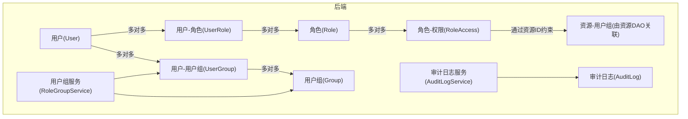
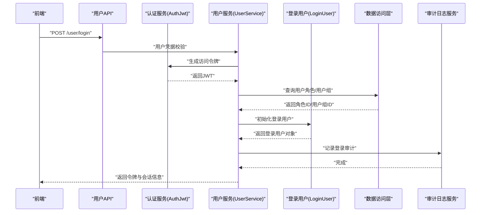
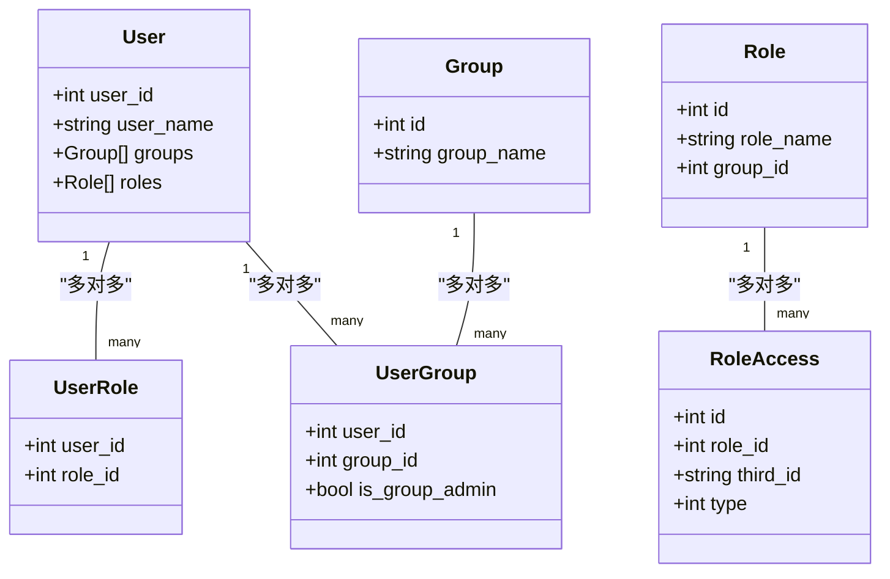
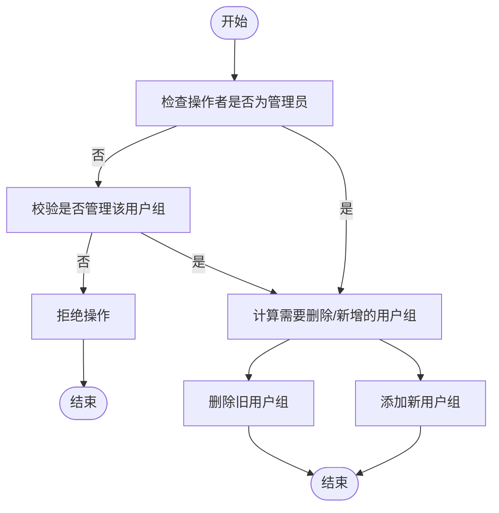
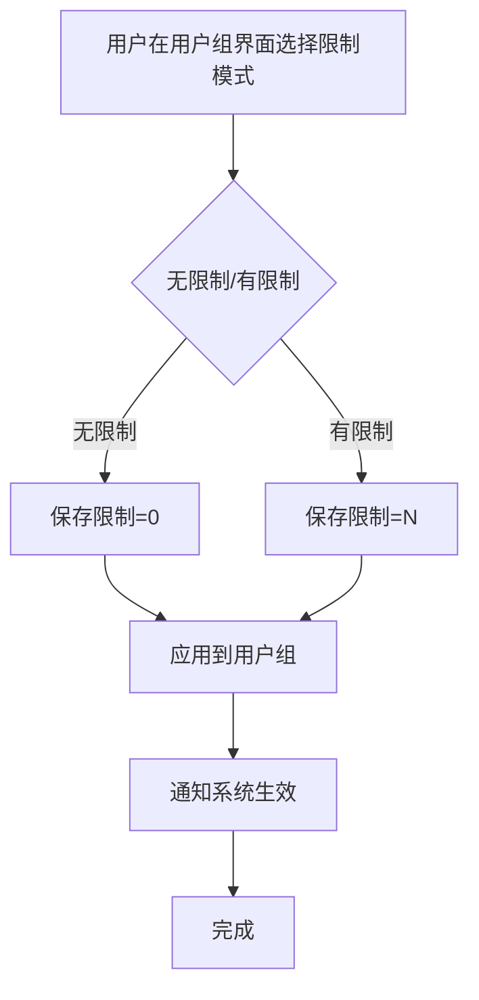
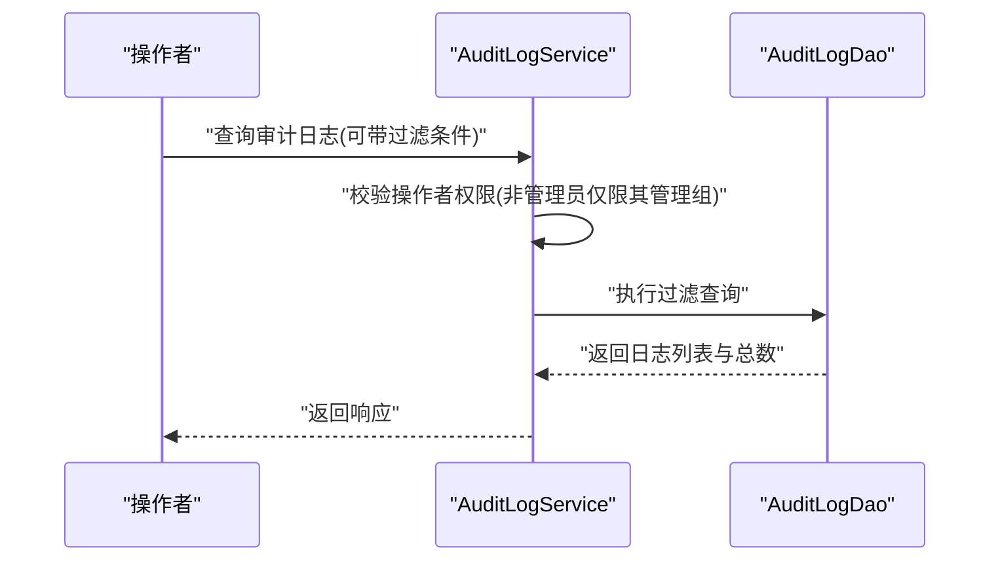
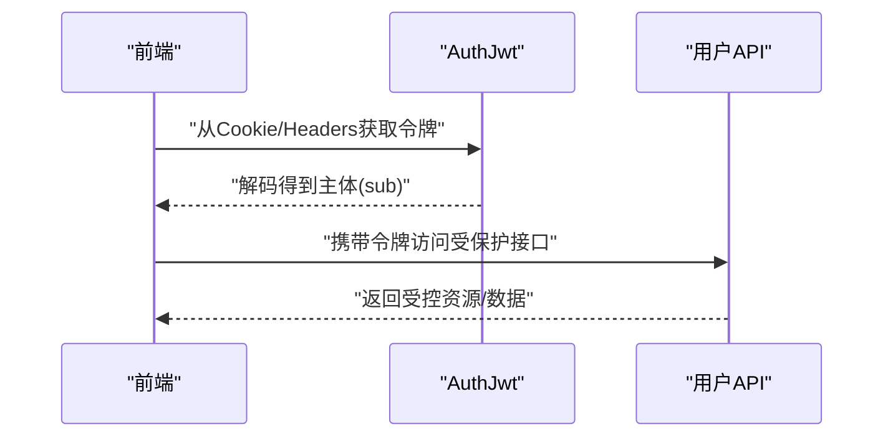
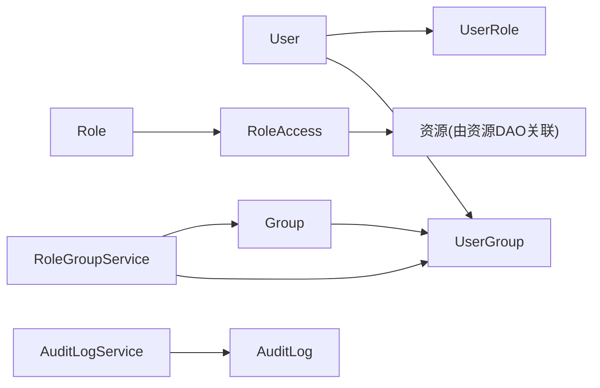

# 用户权限管理

<cite>
**本文引用的文件**
- [src/backend/bisheng/user/domain/models/user.py](file://src/backend/bisheng/user/domain/models/user.py)
- [src/backend/bisheng/user/domain/models/user_role.py](file://src/backend/bisheng/user/domain/models/user_role.py)
- [src/backend/bisheng/database/models/role.py](file://src/backend/bisheng/database/models/role.py)
- [src/backend/bisheng/database/models/role_access.py](file://src/backend/bisheng/database/models/role_access.py)
- [src/backend/bisheng/database/models/group.py](file://src/backend/bisheng/database/models/group.py)
- [src/backend/bisheng/database/models/user_group.py](file://src/backend/bisheng/database/models/user_group.py)
- [src/backend/bisheng/api/services/role_group_service.py](file://src/backend/bisheng/api/services/role_group_service.py)
- [src/backend/bisheng/api/services/audit_log.py](file://src/backend/bisheng/api/services/audit_log.py)
- [src/backend/bisheng/database/models/audit_log.py](file://src/backend/bisheng/database/models/audit_log.py)
- [src/backend/bisheng/user/api/user.py](file://src/backend/bisheng/user/api/user.py)
- [src/backend/bisheng/user/domain/services/auth.py](file://src/backend/bisheng/user/domain/services/auth.py)
- [src/backend/bisheng/services/auth/utils.py](file://src/backend/bisheng/services/auth/utils.py)
- [src/backend/bisheng/services/settings/auth.py](file://src/backend/bisheng/services/settings/auth.py)
- [src/frontend/client/src/hooks/Roles/useHasAccess.ts](file://src/frontend/client/src/hooks/Roles/useHasAccess.ts)
- [src/frontend/client/src/components/SidePanel/Builder/ActionsAuth.tsx](file://src/frontend/client/src/components/SidePanel/Builder/ActionsAuth.tsx)
- [src/frontend/platform/src/pages/SystemPage/components/EditUserGroup.tsx](file://src/frontend/platform/src/pages/SystemPage/components/EditUserGroup.tsx)
- [src/frontend/platform/src/pages/SystemPage/components/UserGroup.tsx](file://src/frontend/platform/src/pages/SystemPage/components/UserGroup.tsx)
</cite>

## 目录
1. [简介](#简介)
2. [项目结构](#项目结构)
3. [核心组件](#核心组件)
4. [架构总览](#架构总览)
5. [详细组件分析](#详细组件分析)
6. [依赖分析](#依赖分析)
7. [性能考虑](#性能考虑)
8. [故障排除指南](#故障排除指南)
9. [结论](#结论)
10. [附录](#附录)

## 简介
本技术文档面向 Bisheng 的用户与权限管理体系，系统化阐述基于角色的访问控制（RBAC）模型设计与实现，覆盖用户、角色、权限三者之间的关联与继承关系；详解用户组管理（组织架构建模、权限继承、批量管理）；说明流量控制与配额（按用户组的资源限制）；解释审计日志体系（操作记录、安全事件追踪与合规）；并提供认证与授权实现细节（JWT 令牌管理、会话管理、安全策略配置），以及管理员最佳实践与故障排除建议。

## 项目结构
围绕权限与用户管理的关键模块分布如下：
- 后端领域模型与服务
  - 用户域模型：用户、用户-角色关联
  - 角色与权限：角色、角色-资源权限映射
  - 组织与用户组：用户组、用户-用户组关联
  - 权限服务：用户组服务、审计日志服务
- 前端鉴权与展示
  - 鉴权 Hook 与前端权限判断
  - 用户组界面与流控配置交互

图表来源
- [src/backend/bisheng/user/domain/models/user.py](file://src/backend/bisheng/user/domain/models/user.py#L39-L48)
- [src/backend/bisheng/user/domain/models/user_role.py](file://src/backend/bisheng/user/domain/models/user_role.py#L32-L34)
- [src/backend/bisheng/database/models/role.py](file://src/backend/bisheng/database/models/role.py#L24-L26)
- [src/backend/bisheng/database/models/role_access.py](file://src/backend/bisheng/database/models/role_access.py#L23-L24)
- [src/backend/bisheng/database/models/group.py](file://src/backend/bisheng/database/models/group.py#L25-L27)
- [src/backend/bisheng/database/models/user_group.py](file://src/backend/bisheng/database/models/user_group.py#L34-L35)
- [src/backend/bisheng/api/services/role_group_service.py](file://src/backend/bisheng/api/services/role_group_service.py#L32-L192)
- [src/backend/bisheng/api/services/audit_log.py](file://src/backend/bisheng/api/services/audit_log.py#L34-L800)

章节来源
- [src/backend/bisheng/user/domain/models/user.py](file://src/backend/bisheng/user/domain/models/user.py#L18-L48)
- [src/backend/bisheng/user/domain/models/user_role.py](file://src/backend/bisheng/user/domain/models/user_role.py#L13-L34)
- [src/backend/bisheng/database/models/role.py](file://src/backend/bisheng/database/models/role.py#L14-L31)
- [src/backend/bisheng/database/models/role_access.py](file://src/backend/bisheng/database/models/role_access.py#L13-L32)
- [src/backend/bisheng/database/models/group.py](file://src/backend/bisheng/database/models/group.py#L14-L32)
- [src/backend/bisheng/database/models/user_group.py](file://src/backend/bisheng/database/models/user_group.py#L12-L32)
- [src/backend/bisheng/api/services/role_group_service.py](file://src/backend/bisheng/api/services/role_group_service.py#L32-L192)
- [src/backend/bisheng/api/services/audit_log.py](file://src/backend/bisheng/api/services/audit_log.py#L34-L800)

## 核心组件
- 用户与角色
  - 用户实体包含基础信息与与角色的关系；角色实体包含组归属与名称等字段；用户-角色关联用于建立多对多关系。
- 角色与权限
  - 角色-权限映射以“类型+资源ID”表达细粒度权限；支持批量查询与更新。
- 用户组与组织架构
  - 用户组用于组织建模；用户-用户组关联支持成员与管理员标识；用户组服务负责用户组的增删改查与批量替换。
- 审计日志
  - 审计日志服务统一记录用户行为、系统变更与会话事件，并支持按用户组过滤与导出。

章节来源
- [src/backend/bisheng/user/domain/models/user.py](file://src/backend/bisheng/user/domain/models/user.py#L18-L48)
- [src/backend/bisheng/user/domain/models/user_role.py](file://src/backend/bisheng/user/domain/models/user_role.py#L13-L34)
- [src/backend/bisheng/database/models/role.py](file://src/backend/bisheng/database/models/role.py#L14-L31)
- [src/backend/bisheng/database/models/role_access.py](file://src/backend/bisheng/database/models/role_access.py#L13-L32)
- [src/backend/bisheng/database/models/group.py](file://src/backend/bisheng/database/models/group.py#L14-L32)
- [src/backend/bisheng/database/models/user_group.py](file://src/backend/bisheng/database/models/user_group.py#L12-L32)
- [src/backend/bisheng/api/services/role_group_service.py](file://src/backend/bisheng/api/services/role_group_service.py#L32-L192)
- [src/backend/bisheng/api/services/audit_log.py](file://src/backend/bisheng/api/services/audit_log.py#L34-L800)

## 架构总览
下图展示了从用户登录到权限校验、资源访问与审计记录的端到端流程。

图表来源
- [src/backend/bisheng/user/api/user.py](file://src/backend/bisheng/user/api/user.py#L107-L109)
- [src/backend/bisheng/user/domain/services/auth.py](file://src/backend/bisheng/user/domain/services/auth.py#L257-L281)
- [src/backend/bisheng/api/services/audit_log.py](file://src/backend/bisheng/api/services/audit_log.py#L510-L517)

## 详细组件分析

### RBAC 权限模型与实现
- 模型关系
  - 用户与角色：多对多，通过用户-角色表维护
  - 角色与权限：多对多，权限以“类型+资源ID”表达
  - 用户组与用户：多对多，支持管理员标识
- 权限类型与资源
  - 权限类型涵盖知识库读写、技能/工作流读写、助手读写、工具读写、看板读写、前端菜单等
  - 资源ID可为具体对象ID或抽象类型
- 权限继承与组合
  - 用户通过其角色集合获得权限；角色可授予多个资源的同类型权限
  - 支持批量查询用户可访问的资源ID集合，便于前端快速判断

图表来源
- [src/backend/bisheng/user/domain/models/user.py](file://src/backend/bisheng/user/domain/models/user.py#L39-L48)
- [src/backend/bisheng/user/domain/models/user_role.py](file://src/backend/bisheng/user/domain/models/user_role.py#L32-L34)
- [src/backend/bisheng/database/models/role.py](file://src/backend/bisheng/database/models/role.py#L24-L26)
- [src/backend/bisheng/database/models/role_access.py](file://src/backend/bisheng/database/models/role_access.py#L23-L24)
- [src/backend/bisheng/database/models/group.py](file://src/backend/bisheng/database/models/group.py#L25-L27)
- [src/backend/bisheng/database/models/user_group.py](file://src/backend/bisheng/database/models/user_group.py#L34-L35)

章节来源
- [src/backend/bisheng/database/models/role_access.py](file://src/backend/bisheng/database/models/role_access.py#L49-L66)
- [src/backend/bisheng/user/domain/services/auth.py](file://src/backend/bisheng/user/domain/services/auth.py#L251-L254)

### 用户组管理与权限继承
- 组织架构建模
  - 用户组用于划分业务域或团队；默认组ID常量用于系统保留
  - 用户-用户组支持普通成员与管理员两种身份
- 权限继承
  - 用户通过所属用户组间接继承角色权限；资源权限通常绑定到用户组
- 批量管理
  - 支持批量替换用户的用户组归属，管理员仅能操作其有管理权限的用户组
  - 删除用户组时需确保无成员且清理管理员

图表来源
- [src/backend/bisheng/api/services/role_group_service.py](file://src/backend/bisheng/api/services/role_group_service.py#L161-L192)
- [src/backend/bisheng/database/models/user_group.py](file://src/backend/bisheng/database/models/user_group.py#L117-L149)

章节来源
- [src/backend/bisheng/database/models/group.py](file://src/backend/bisheng/database/models/group.py#L10-L11)
- [src/backend/bisheng/database/models/user_group.py](file://src/backend/bisheng/database/models/user_group.py#L12-L32)
- [src/backend/bisheng/api/services/role_group_service.py](file://src/backend/bisheng/api/services/role_group_service.py#L58-L110)

### 流量控制与配额管理
- 用户组级流控
  - 前端提供“无限制/有限制”切换与每分钟上限输入，保存时仅提交变更
  - 系统侧通过用户组维度进行资源限制与配额控制
- 实施要点
  - 限制值初始化时接收一次，避免异步加载导致状态错乱
  - 变更通过后端接口持久化并广播（如使用消息队列）

图表来源
- [src/frontend/platform/src/pages/SystemPage/components/EditUserGroup.tsx](file://src/frontend/platform/src/pages/SystemPage/components/EditUserGroup.tsx#L39-L90)
- [src/frontend/platform/src/pages/SystemPage/components/UserGroup.tsx](file://src/frontend/platform/src/pages/SystemPage/components/UserGroup.tsx#L93-L113)

章节来源
- [src/frontend/platform/src/pages/SystemPage/components/EditUserGroup.tsx](file://src/frontend/platform/src/pages/SystemPage/components/EditUserGroup.tsx#L19-L90)
- [src/frontend/platform/src/pages/SystemPage/components/UserGroup.tsx](file://src/frontend/platform/src/pages/SystemPage/components/UserGroup.tsx#L93-L113)

### 审计日志系统
- 记录范围
  - 用户登录、用户组/角色创建/更新/删除、知识库上传/删除文件、会话消息、看板创建/更新/删除等
- 过滤与导出
  - 支持按用户组、操作人、时间范围、系统ID、事件类型过滤
  - 支持会话消息导出为 CSV 并上传至对象存储
- 权限控制
  - 非管理员仅能查看其管理用户组内的日志

图表来源
- [src/backend/bisheng/api/services/audit_log.py](file://src/backend/bisheng/api/services/audit_log.py#L36-L55)
- [src/backend/bisheng/database/models/audit_log.py](file://src/backend/bisheng/database/models/audit_log.py#L101-L136)

章节来源
- [src/backend/bisheng/api/services/audit_log.py](file://src/backend/bisheng/api/services/audit_log.py#L34-L800)
- [src/backend/bisheng/database/models/audit_log.py](file://src/backend/bisheng/database/models/audit_log.py#L94-L136)

### 认证与授权实现细节
- JWT 令牌管理
  - 登录成功后生成访问令牌，设置到 Cookie；支持从请求头或 WebSocket 中解析
  - 令牌包含签发方、过期时间等声明，解码后提取主体信息
- 会话管理
  - 登录后将当前会话写入缓存，延长有效时间
- 安全策略配置
  - 密钥、算法、过期时间等在设置中集中配置
- 前端鉴权
  - 前端 Hook 依据用户角色与权限类型判断页面元素与操作可用性

图表来源
- [src/backend/bisheng/user/domain/services/auth.py](file://src/backend/bisheng/user/domain/services/auth.py#L34-L93)
- [src/backend/bisheng/user/api/user.py](file://src/backend/bisheng/user/api/user.py#L78-L92)
- [src/backend/bisheng/services/settings/auth.py](file://src/backend/bisheng/services/settings/auth.py#L13-L38)
- [src/frontend/client/src/hooks/Roles/useHasAccess.ts](file://src/frontend/client/src/hooks/Roles/useHasAccess.ts#L17-L45)

章节来源
- [src/backend/bisheng/user/domain/services/auth.py](file://src/backend/bisheng/user/domain/services/auth.py#L257-L281)
- [src/backend/bisheng/services/auth/utils.py](file://src/backend/bisheng/services/auth/utils.py#L238-L331)
- [src/frontend/client/src/components/SidePanel/Builder/ActionsAuth.tsx](file://src/frontend/client/src/components/SidePanel/Builder/ActionsAuth.tsx#L199-L232)

## 依赖分析
- 组件耦合
  - 用户域模型与角色/用户组模型通过中间表解耦，便于扩展
  - 权限服务与审计服务通过 DAO 层访问数据库，职责清晰
- 外部依赖
  - JWT 解析与签名、密码加密、Redis 缓存、对象存储等

图表来源
- [src/backend/bisheng/user/domain/models/user.py](file://src/backend/bisheng/user/domain/models/user.py#L39-L48)
- [src/backend/bisheng/user/domain/models/user_role.py](file://src/backend/bisheng/user/domain/models/user_role.py#L32-L34)
- [src/backend/bisheng/database/models/role.py](file://src/backend/bisheng/database/models/role.py#L24-L26)
- [src/backend/bisheng/database/models/role_access.py](file://src/backend/bisheng/database/models/role_access.py#L23-L24)
- [src/backend/bisheng/database/models/group.py](file://src/backend/bisheng/database/models/group.py#L25-L27)
- [src/backend/bisheng/database/models/user_group.py](file://src/backend/bisheng/database/models/user_group.py#L34-L35)
- [src/backend/bisheng/api/services/role_group_service.py](file://src/backend/bisheng/api/services/role_group_service.py#L32-L192)
- [src/backend/bisheng/api/services/audit_log.py](file://src/backend/bisheng/api/services/audit_log.py#L34-L800)

章节来源
- [src/backend/bisheng/user/domain/models/user.py](file://src/backend/bisheng/user/domain/models/user.py#L18-L48)
- [src/backend/bisheng/user/domain/models/user_role.py](file://src/backend/bisheng/user/domain/models/user_role.py#L13-L34)
- [src/backend/bisheng/database/models/role.py](file://src/backend/bisheng/database/models/role.py#L14-L31)
- [src/backend/bisheng/database/models/role_access.py](file://src/backend/bisheng/database/models/role_access.py#L13-L32)
- [src/backend/bisheng/database/models/group.py](file://src/backend/bisheng/database/models/group.py#L14-L32)
- [src/backend/bisheng/database/models/user_group.py](file://src/backend/bisheng/database/models/user_group.py#L12-L32)
- [src/backend/bisheng/api/services/role_group_service.py](file://src/backend/bisheng/api/services/role_group_service.py#L32-L192)
- [src/backend/bisheng/api/services/audit_log.py](file://src/backend/bisheng/api/services/audit_log.py#L34-L800)

## 性能考虑
- 查询优化
  - 使用批量查询减少往返次数（如批量获取角色、权限、用户组）
  - 利用索引字段（如用户名、组ID、类型）加速过滤
- 异步化
  - 审计日志与部分查询采用异步 DAO，提升并发能力
- 缓存
  - 登录会话与用户角色/权限结果可结合缓存降低数据库压力

## 故障排除指南
- 登录失败
  - 检查用户名是否存在、密码是否正确、账户是否激活
  - 查看错误密码键值清理逻辑，确认未被误封禁
- 权限不足
  - 确认用户角色是否包含所需权限类型与资源ID
  - 检查用户组是否正确继承角色权限
- 用户组管理异常
  - 管理员仅能操作其管理的用户组；若提示无权限，检查当前操作者管理的用户组集合
  - 删除用户组前需清空成员并清理管理员
- 审计日志为空
  - 非管理员仅能看到其管理用户组的日志；确认过滤条件与权限范围

章节来源
- [src/backend/bisheng/user/api/user.py](file://src/backend/bisheng/user/api/user.py#L97-L109)
- [src/backend/bisheng/user/domain/services/auth.py](file://src/backend/bisheng/user/domain/services/auth.py#L85-L93)
- [src/backend/bisheng/api/services/role_group_service.py](file://src/backend/bisheng/api/services/role_group_service.py#L161-L192)
- [src/backend/bisheng/api/services/audit_log.py](file://src/backend/bisheng/api/services/audit_log.py#L36-L55)

## 结论
Bisheng 的权限体系以 RBAC 为核心，通过用户-角色-权限三层映射与用户组组织建模，实现了灵活而可审计的权限控制。配合 JWT 会话管理、前端权限钩子与用户组级流控，满足多场景下的安全与合规需求。建议在生产环境中强化密钥轮换、最小权限原则与定期审计复核。

## 附录
- 最佳实践
  - 为每个业务域建立独立用户组，避免权限过度集中
  - 将常用权限抽象为角色模板，减少重复配置
  - 对敏感操作启用二次确认与审计留痕
  - 定期清理无效用户与冗余角色，保持权限矩阵简洁
- 常用路径参考
  - 用户登录与会话：[src/backend/bisheng/user/api/user.py](file://src/backend/bisheng/user/api/user.py#L78-L92)
  - JWT 令牌生成与解析：[src/backend/bisheng/user/domain/services/auth.py](file://src/backend/bisheng/user/domain/services/auth.py#L34-L93)
  - 用户组批量替换：[src/backend/bisheng/api/services/role_group_service.py](file://src/backend/bisheng/api/services/role_group_service.py#L161-L192)
  - 审计日志查询与导出：[src/backend/bisheng/api/services/audit_log.py](file://src/backend/bisheng/api/services/audit_log.py#L36-L800)