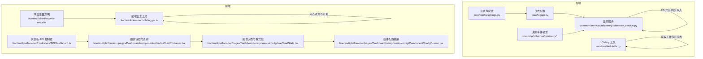
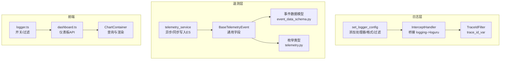
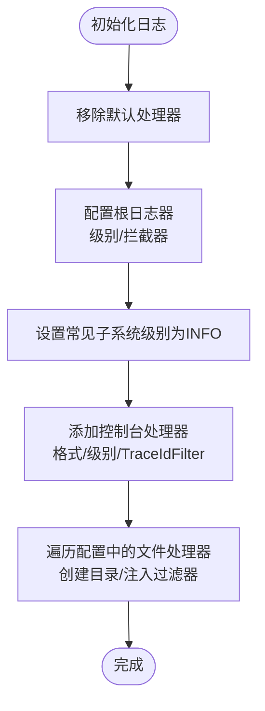
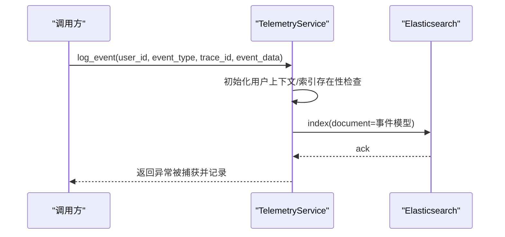
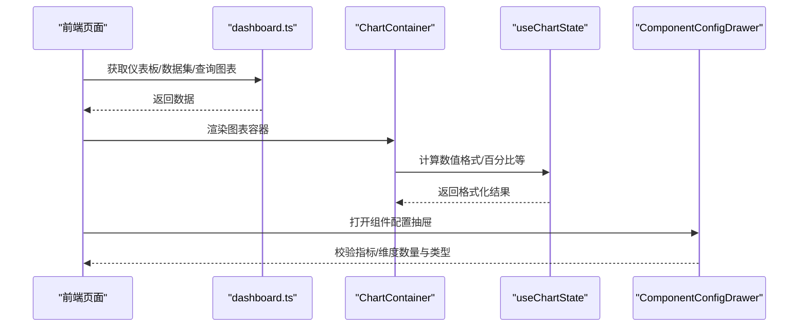
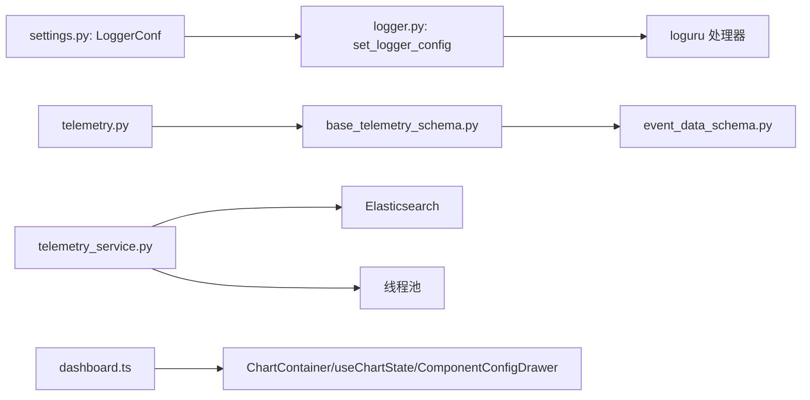

# 监控和日志

<cite>
**本文引用的文件**
- [src/backend/bisheng/core/logger.py](file://src/backend/bisheng/core/logger.py)
- [src/backend/bisheng/core/config/settings.py](file://src/backend/bisheng/core/config/settings.py)
- [src/backend/bisheng/common/schemas/telemetry/base_telemetry_schema.py](file://src/backend/bisheng/common/schemas/telemetry/base_telemetry_schema.py)
- [src/backend/bisheng/common/schemas/telemetry/event_data_schema.py](file://src/backend/bisheng/common/schemas/telemetry/event_data_schema.py)
- [src/backend/bisheng/common/constants/enums/telemetry.py](file://src/backend/bisheng/common/constants/enums/telemetry.py)
- [src/backend/bisheng/common/services/telemetry/telemetry_service.py](file://src/backend/bisheng/common/services/telemetry/telemetry_service.py)
- [src/backend/bisheng/services/task/utils.py](file://src/backend/bisheng/services/task/utils.py)
- [src/frontend/client/src/utils/logger.ts](file://src/frontend/client/src/utils/logger.ts)
- [src/frontend/client/src/vite-env.d.ts](file://src/frontend/client/src/vite-env.d.ts)
- [src/frontend/platform/src/controllers/API/dashboard.ts](file://src/frontend/platform/src/controllers/API/dashboard.ts)
- [src/frontend/platform/src/pages/Dashboard/components/config/useChartState.tsx](file://src/frontend/platform/src/pages/Dashboard/components/config/useChartState.tsx)
- [src/frontend/platform/src/pages/Dashboard/components/config/ComponentConfigDrawer.tsx](file://src/frontend/platform/src/pages/Dashboard/components/config/ComponentConfigDrawer.tsx)
- [src/frontend/platform/src/pages/Dashboard/components/charts/ChartContainer.tsx](file://src/frontend/platform/src/pages/Dashboard/components/charts/ChartContainer.tsx)
</cite>

## 目录
1. [简介](#简介)
2. [项目结构](#项目结构)
3. [核心组件](#核心组件)
4. [架构总览](#架构总览)
5. [详细组件分析](#详细组件分析)
6. [依赖分析](#依赖分析)
7. [性能考量](#性能考量)
8. [故障排除指南](#故障排除指南)
9. [结论](#结论)
10. [附录](#附录)

## 简介
本文件面向运维与开发团队，系统化梳理 Bisheng 的监控与日志体系，覆盖以下主题：
- 日志配置：设计理念（级别、格式、过滤与输出目标）、链路追踪 ID 注入、拦截器与多处理器管线
- 性能监控：指标采集、异步/同步记录、后台任务调度、Celery 工作节点状态观测
- Telemetry 事件系统：事件类型枚举、事件载荷模型、异步写入 Elasticsearch、线程池同步落库
- 错误追踪与调试：异常捕获、堆栈回溯、前端日志过滤与开关
- 监控仪表板：数据集与图表查询接口、组件配置与刷新机制、可视化展示流程

## 项目结构
围绕“日志”“遥测”“前端日志”“仪表板”四个维度，后端通过统一的日志配置模块与 Telemetry 服务对接 Elasticsearch；前端提供可选的日志开关与过滤能力，并通过 API 控制器访问 Telemetry 仪表板数据。

图示来源
- [src/backend/bisheng/core/logger.py](file://src/backend/bisheng/core/logger.py#L51-L97)
- [src/backend/bisheng/core/config/settings.py](file://src/backend/bisheng/core/config/settings.py#L23-L48)
- [src/backend/bisheng/common/schemas/telemetry/base_telemetry_schema.py](file://src/backend/bisheng/common/schemas/telemetry/base_telemetry_schema.py#L32-L56)
- [src/backend/bisheng/common/services/telemetry/telemetry_service.py](file://src/backend/bisheng/common/services/telemetry/telemetry_service.py#L193-L283)
- [src/backend/bisheng/services/task/utils.py](file://src/backend/bisheng/services/task/utils.py#L9-L22)
- [src/frontend/client/src/utils/logger.ts](file://src/frontend/client/src/utils/logger.ts#L1-L49)
- [src/frontend/client/src/vite-env.d.ts](file://src/frontend/client/src/vite-env.d.ts#L3-L11)
- [src/frontend/platform/src/controllers/API/dashboard.ts](file://src/frontend/platform/src/controllers/API/dashboard.ts#L10-L198)
- [src/frontend/platform/src/pages/Dashboard/components/charts/ChartContainer.tsx](file://src/frontend/platform/src/pages/Dashboard/components/charts/ChartContainer.tsx#L1-L26)
- [src/frontend/platform/src/pages/Dashboard/components/config/useChartState.tsx](file://src/frontend/platform/src/pages/Dashboard/components/config/useChartState.tsx#L606-L642)
- [src/frontend/platform/src/pages/Dashboard/components/config/ComponentConfigDrawer.tsx](file://src/frontend/platform/src/pages/Dashboard/components/config/ComponentConfigDrawer.tsx#L285-L344)

章节来源
- [src/backend/bisheng/core/logger.py](file://src/backend/bisheng/core/logger.py#L1-L98)
- [src/backend/bisheng/core/config/settings.py](file://src/backend/bisheng/core/config/settings.py#L23-L48)
- [src/backend/bisheng/common/schemas/telemetry/base_telemetry_schema.py](file://src/backend/bisheng/common/schemas/telemetry/base_telemetry_schema.py#L32-L56)
- [src/backend/bisheng/common/schemas/telemetry/event_data_schema.py](file://src/backend/bisheng/common/schemas/telemetry/event_data_schema.py#L8-L159)
- [src/backend/bisheng/common/constants/enums/telemetry.py](file://src/backend/bisheng/common/constants/enums/telemetry.py#L39-L89)
- [src/backend/bisheng/common/services/telemetry/telemetry_service.py](file://src/backend/bisheng/common/services/telemetry/telemetry_service.py#L193-L283)
- [src/backend/bisheng/services/task/utils.py](file://src/backend/bisheng/services/task/utils.py#L9-L22)
- [src/frontend/client/src/utils/logger.ts](file://src/frontend/client/src/utils/logger.ts#L1-L49)
- [src/frontend/client/src/vite-env.d.ts](file://src/frontend/client/src/vite-env.d.ts#L3-L11)
- [src/frontend/platform/src/controllers/API/dashboard.ts](file://src/frontend/platform/src/controllers/API/dashboard.ts#L10-L198)
- [src/frontend/platform/src/pages/Dashboard/components/charts/ChartContainer.tsx](file://src/frontend/platform/src/pages/Dashboard/components/charts/ChartContainer.tsx#L1-L26)
- [src/frontend/platform/src/pages/Dashboard/components/config/useChartState.tsx](file://src/frontend/platform/src/pages/Dashboard/components/config/useChartState.tsx#L606-L642)
- [src/frontend/platform/src/pages/Dashboard/components/config/ComponentConfigDrawer.tsx](file://src/frontend/platform/src/pages/Dashboard/components/config/ComponentConfigDrawer.tsx#L285-L344)

## 核心组件
- 后端日志系统
  - 统一日志配置入口，支持控制台与文件处理器、格式模板、Trace ID 过滤、拦截器桥接 Python logging
- Telemetry 事件系统
  - 事件类型枚举、通用事件模型与用户上下文、事件数据载荷模型、异步/同步写入 Elasticsearch、线程池兜底
- 前端日志与仪表板
  - 可选日志开关与标签过滤、仪表板 API 调用、图表容器与状态管理、组件配置抽屉

章节来源
- [src/backend/bisheng/core/logger.py](file://src/backend/bisheng/core/logger.py#L51-L97)
- [src/backend/bisheng/common/schemas/telemetry/base_telemetry_schema.py](file://src/backend/bisheng/common/schemas/telemetry/base_telemetry_schema.py#L32-L56)
- [src/backend/bisheng/common/schemas/telemetry/event_data_schema.py](file://src/backend/bisheng/common/schemas/telemetry/event_data_schema.py#L8-L159)
- [src/backend/bisheng/common/constants/enums/telemetry.py](file://src/backend/bisheng/common/constants/enums/telemetry.py#L39-L89)
- [src/frontend/client/src/utils/logger.ts](file://src/frontend/client/src/utils/logger.ts#L1-L49)
- [src/frontend/platform/src/controllers/API/dashboard.ts](file://src/frontend/platform/src/controllers/API/dashboard.ts#L10-L198)

## 架构总览
后端以统一日志配置为入口，将 Python logging 与 loguru 对接，同时通过 Telemetry 服务将用户行为、应用运行等事件异步写入 Elasticsearch。前端提供可选日志工具与仪表板 API，用于观测与分析。

图示来源
- [src/backend/bisheng/core/logger.py](file://src/backend/bisheng/core/logger.py#L19-L49)
- [src/backend/bisheng/common/schemas/telemetry/base_telemetry_schema.py](file://src/backend/bisheng/common/schemas/telemetry/base_telemetry_schema.py#L32-L56)
- [src/backend/bisheng/common/schemas/telemetry/event_data_schema.py](file://src/backend/bisheng/common/schemas/telemetry/event_data_schema.py#L8-L159)
- [src/backend/bisheng/common/constants/enums/telemetry.py](file://src/backend/bisheng/common/constants/enums/telemetry.py#L39-L89)
- [src/backend/bisheng/common/services/telemetry/telemetry_service.py](file://src/backend/bisheng/common/services/telemetry/telemetry_service.py#L193-L283)
- [src/frontend/client/src/utils/logger.ts](file://src/frontend/client/src/utils/logger.ts#L1-L49)
- [src/frontend/platform/src/controllers/API/dashboard.ts](file://src/frontend/platform/src/controllers/API/dashboard.ts#L10-L198)
- [src/frontend/platform/src/pages/Dashboard/components/charts/ChartContainer.tsx](file://src/frontend/platform/src/pages/Dashboard/components/charts/ChartContainer.tsx#L1-L26)

## 详细组件分析

### 日志配置与链路追踪
- 设计理念
  - 级别与格式：通过配置对象统一设定日志级别与格式模板，支持动态解析环境变量占位符
  - 输出目标：支持控制台与文件处理器，自动创建目录，按需注入 Trace ID 过滤器
  - 拦截桥接：将 Python logging 的 Handler 重定向至 loguru，保证第三方库日志统一输出
  - 降噪策略：对常见高噪声子系统设置 INFO 级别，降低噪音
- 关键实现要点
  - Trace ID 注入：通过 ContextVar 与自定义 Filter 将 trace_id 写入每条日志的 extra 字段
  - 多处理器：支持多个 sink（控制台/文件），每个可独立设置过滤函数
  - 安全性：关闭 propagate，避免重复输出；开启 backtrace，保留异常堆栈
- 使用建议
  - 在请求入口生成 trace_id 并注入上下文，在跨服务调用时透传
  - 为不同模块或功能域配置独立 sink 与过滤器，便于分层定位

图示来源
- [src/backend/bisheng/core/logger.py](file://src/backend/bisheng/core/logger.py#L51-L97)

章节来源
- [src/backend/bisheng/core/logger.py](file://src/backend/bisheng/core/logger.py#L1-L98)
- [src/backend/bisheng/core/config/settings.py](file://src/backend/bisheng/core/config/settings.py#L23-L48)

### Telemetry 事件系统
- 事件模型
  - 通用事件：包含事件 ID、事件类型、时间戳、用户上下文、Trace ID、事件数据载荷
  - 用户上下文：用户标识、名称、用户组与角色信息
  - 事件数据：按事件类型派生的具体载荷，如登录、会话、工具调用、模型调用、应用存活/进程等
- 事件类型枚举
  - 覆盖登录、会话、应用、知识库、文件解析、反馈、工具调用、模型调用、应用存活/进程等
- 写入策略
  - 异步写入：使用信号量限流，避免瞬时高峰冲击 ES；失败仅记录日志不阻断主流程
  - 同步写入：通过线程池提交任务，保证在异步不可用时仍可持久化
- 兼容性与扩展
  - 事件载荷序列化时自动扁平化字段名，便于后续聚合与检索

图示来源
- [src/backend/bisheng/common/services/telemetry/telemetry_service.py](file://src/backend/bisheng/common/services/telemetry/telemetry_service.py#L193-L283)
- [src/backend/bisheng/common/schemas/telemetry/base_telemetry_schema.py](file://src/backend/bisheng/common/schemas/telemetry/base_telemetry_schema.py#L32-L56)
- [src/backend/bisheng/common/schemas/telemetry/event_data_schema.py](file://src/backend/bisheng/common/schemas/telemetry/event_data_schema.py#L8-L159)
- [src/backend/bisheng/common/constants/enums/telemetry.py](file://src/backend/bisheng/common/constants/enums/telemetry.py#L39-L89)

章节来源
- [src/backend/bisheng/common/services/telemetry/telemetry_service.py](file://src/backend/bisheng/common/services/telemetry/telemetry_service.py#L193-L283)
- [src/backend/bisheng/common/schemas/telemetry/base_telemetry_schema.py](file://src/backend/bisheng/common/schemas/telemetry/base_telemetry_schema.py#L32-L56)
- [src/backend/bisheng/common/schemas/telemetry/event_data_schema.py](file://src/backend/bisheng/common/schemas/telemetry/event_data_schema.py#L8-L159)
- [src/backend/bisheng/common/constants/enums/telemetry.py](file://src/backend/bisheng/common/constants/enums/telemetry.py#L39-L89)

### 前端日志与仪表板
- 前端日志
  - 开关与过滤：通过环境变量控制是否启用日志与过滤标签，仅在开发模式或显式开启时输出
  - 格式化：自动为带标签的日志加上前缀，便于快速定位来源
- 仪表板
  - API：提供仪表板 CRUD、复制、发布、数据集列表、图表查询等接口
  - 图表容器：封装查询参数、刷新触发、数据转换（堆叠/普通）与渲染
  - 配置抽屉：限制指标/维度数量、校验图表类型与必填项、提示冲突配置

图示来源
- [src/frontend/platform/src/controllers/API/dashboard.ts](file://src/frontend/platform/src/controllers/API/dashboard.ts#L10-L198)
- [src/frontend/platform/src/pages/Dashboard/components/charts/ChartContainer.tsx](file://src/frontend/platform/src/pages/Dashboard/components/charts/ChartContainer.tsx#L1-L26)
- [src/frontend/platform/src/pages/Dashboard/components/config/useChartState.tsx](file://src/frontend/platform/src/pages/Dashboard/components/config/useChartState.tsx#L606-L642)
- [src/frontend/platform/src/pages/Dashboard/components/config/ComponentConfigDrawer.tsx](file://src/frontend/platform/src/pages/Dashboard/components/config/ComponentConfigDrawer.tsx#L285-L344)

章节来源
- [src/frontend/client/src/utils/logger.ts](file://src/frontend/client/src/utils/logger.ts#L1-L49)
- [src/frontend/client/src/vite-env.d.ts](file://src/frontend/client/src/vite-env.d.ts#L3-L11)
- [src/frontend/platform/src/controllers/API/dashboard.ts](file://src/frontend/platform/src/controllers/API/dashboard.ts#L10-L198)
- [src/frontend/platform/src/pages/Dashboard/components/charts/ChartContainer.tsx](file://src/frontend/platform/src/pages/Dashboard/components/charts/ChartContainer.tsx#L1-L26)
- [src/frontend/platform/src/pages/Dashboard/components/config/useChartState.tsx](file://src/frontend/platform/src/pages/Dashboard/components/config/useChartState.tsx#L606-L642)
- [src/frontend/platform/src/pages/Dashboard/components/config/ComponentConfigDrawer.tsx](file://src/frontend/platform/src/pages/Dashboard/components/config/ComponentConfigDrawer.tsx#L285-L344)

## 依赖分析
- 日志配置依赖
  - 设置模块提供 LoggerConf，支持解析环境变量占位符与动态过滤函数
  - 日志模块负责拦截 Python logging、注入 Trace ID、添加多处理器
- Telemetry 依赖
  - 事件模型依赖枚举类型与事件数据模型
  - 服务依赖 ES 连接与线程池，提供异步/同步两种写入路径
- 前端依赖
  - 仪表板 API 依赖后端 Telemetry 接口；图表组件依赖状态与配置抽屉进行校验与格式化

图示来源
- [src/backend/bisheng/core/config/settings.py](file://src/backend/bisheng/core/config/settings.py#L23-L48)
- [src/backend/bisheng/core/logger.py](file://src/backend/bisheng/core/logger.py#L51-L97)
- [src/backend/bisheng/common/constants/enums/telemetry.py](file://src/backend/bisheng/common/constants/enums/telemetry.py#L39-L89)
- [src/backend/bisheng/common/schemas/telemetry/base_telemetry_schema.py](file://src/backend/bisheng/common/schemas/telemetry/base_telemetry_schema.py#L32-L56)
- [src/backend/bisheng/common/schemas/telemetry/event_data_schema.py](file://src/backend/bisheng/common/schemas/telemetry/event_data_schema.py#L8-L159)
- [src/backend/bisheng/common/services/telemetry/telemetry_service.py](file://src/backend/bisheng/common/services/telemetry/telemetry_service.py#L193-L283)
- [src/frontend/platform/src/controllers/API/dashboard.ts](file://src/frontend/platform/src/controllers/API/dashboard.ts#L10-L198)
- [src/frontend/platform/src/pages/Dashboard/components/charts/ChartContainer.tsx](file://src/frontend/platform/src/pages/Dashboard/components/charts/ChartContainer.tsx#L1-L26)
- [src/frontend/platform/src/pages/Dashboard/components/config/useChartState.tsx](file://src/frontend/platform/src/pages/Dashboard/components/config/useChartState.tsx#L606-L642)
- [src/frontend/platform/src/pages/Dashboard/components/config/ComponentConfigDrawer.tsx](file://src/frontend/platform/src/pages/Dashboard/components/config/ComponentConfigDrawer.tsx#L285-L344)

章节来源
- [src/backend/bisheng/core/config/settings.py](file://src/backend/bisheng/core/config/settings.py#L23-L48)
- [src/backend/bisheng/core/logger.py](file://src/backend/bisheng/core/logger.py#L51-L97)
- [src/backend/bisheng/common/constants/enums/telemetry.py](file://src/backend/bisheng/common/constants/enums/telemetry.py#L39-L89)
- [src/backend/bisheng/common/schemas/telemetry/base_telemetry_schema.py](file://src/backend/bisheng/common/schemas/telemetry/base_telemetry_schema.py#L32-L56)
- [src/backend/bisheng/common/schemas/telemetry/event_data_schema.py](file://src/backend/bisheng/common/schemas/telemetry/event_data_schema.py#L8-L159)
- [src/backend/bisheng/common/services/telemetry/telemetry_service.py](file://src/backend/bisheng/common/services/telemetry/telemetry_service.py#L193-L283)
- [src/frontend/platform/src/controllers/API/dashboard.ts](file://src/frontend/platform/src/controllers/API/dashboard.ts#L10-L198)
- [src/frontend/platform/src/pages/Dashboard/components/charts/ChartContainer.tsx](file://src/frontend/platform/src/pages/Dashboard/components/charts/ChartContainer.tsx#L1-L26)
- [src/frontend/platform/src/pages/Dashboard/components/config/useChartState.tsx](file://src/frontend/platform/src/pages/Dashboard/components/config/useChartState.tsx#L606-L642)
- [src/frontend/platform/src/pages/Dashboard/components/config/ComponentConfigDrawer.tsx](file://src/frontend/platform/src/pages/Dashboard/components/config/ComponentConfigDrawer.tsx#L285-L344)

## 性能考量
- 日志性能
  - 使用队列与异步处理器，避免阻塞业务线程
  - 通过 Trace ID 过滤减少无效输出，提升检索效率
- Telemetry 写入
  - 异步写入采用信号量限流，防止 ES 峰值压力
  - 同步写入通过线程池兜底，确保在异步失败时仍可持久化
- 前端渲染
  - 图表数据转换与格式化逻辑应避免在渲染热路径中做重型计算
  - 组件配置抽屉对指标/维度数量进行上限控制，防止过度聚合导致性能下降

章节来源
- [src/backend/bisheng/core/logger.py](file://src/backend/bisheng/core/logger.py#L77-L93)
- [src/backend/bisheng/common/services/telemetry/telemetry_service.py](file://src/backend/bisheng/common/services/telemetry/telemetry_service.py#L193-L283)
- [src/frontend/platform/src/pages/Dashboard/components/config/useChartState.tsx](file://src/frontend/platform/src/pages/Dashboard/components/config/useChartState.tsx#L606-L642)
- [src/frontend/platform/src/pages/Dashboard/components/config/ComponentConfigDrawer.tsx](file://src/frontend/platform/src/pages/Dashboard/components/config/ComponentConfigDrawer.tsx#L285-L344)

## 故障排除指南
- 日志无法输出或格式异常
  - 检查日志级别与格式模板是否正确加载
  - 确认环境变量占位符解析是否成功
  - 查看拦截器是否生效，以及是否被其他处理器覆盖
- Trace ID 缺失
  - 确认请求上下文中是否设置了 trace_id
  - 检查 TraceIdFilter 是否正确注入到日志记录
- Telemetry 写入失败
  - 观察异步写入异常日志，确认 ES 连接与索引初始化
  - 若异步失败，检查同步写入线程池是否正常
- 前端日志未显示
  - 确认开发模式或开关变量已启用
  - 检查标签过滤规则是否屏蔽了目标日志
- 仪表板数据为空
  - 校验数据集配置与查询参数
  - 检查图表类型与指标/维度配置是否满足约束

章节来源
- [src/backend/bisheng/core/logger.py](file://src/backend/bisheng/core/logger.py#L51-L97)
- [src/backend/bisheng/common/services/telemetry/telemetry_service.py](file://src/backend/bisheng/common/services/telemetry/telemetry_service.py#L193-L283)
- [src/frontend/client/src/utils/logger.ts](file://src/frontend/client/src/utils/logger.ts#L1-L49)
- [src/frontend/platform/src/controllers/API/dashboard.ts](file://src/frontend/platform/src/controllers/API/dashboard.ts#L10-L198)

## 结论
Bisheng 的监控与日志体系以统一日志配置与 Telemetry 事件系统为核心，结合前端可选日志与仪表板 API，形成从“可观测（日志/事件）—可度量（指标/图表）—可诊断（Trace ID/异常）”的闭环。建议在生产环境中：
- 明确日志级别与格式规范，合理拆分 sink 与过滤器
- 为关键路径注入 Trace ID，建立端到端关联
- 通过 Telemetry 事件沉淀用户行为与系统健康指标，配合仪表板持续优化
- 对 Celery 工作节点状态进行定期巡检，保障异步任务稳定性

## 附录
- 配置项参考
  - 日志级别与格式：见日志配置类
  - Telemetry ES 地址：优先使用独立配置，否则回退到向量存储 ES
  - Celery Beat 任务：包含 Telemetry 中间表增量同步任务计划
- 最佳实践
  - 为每个外部服务调用生成唯一 trace_id 并贯穿请求链路
  - 将高频事件降采样或聚合，避免 ES 压力过大
  - 仪表板指标命名与阈值应与业务 SLA 对齐，定期复盘

章节来源
- [src/backend/bisheng/core/config/settings.py](file://src/backend/bisheng/core/config/settings.py#L250-L346)
- [src/backend/bisheng/services/task/utils.py](file://src/backend/bisheng/services/task/utils.py#L9-L22)