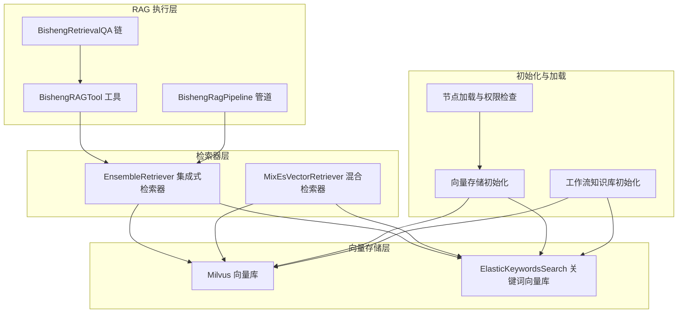
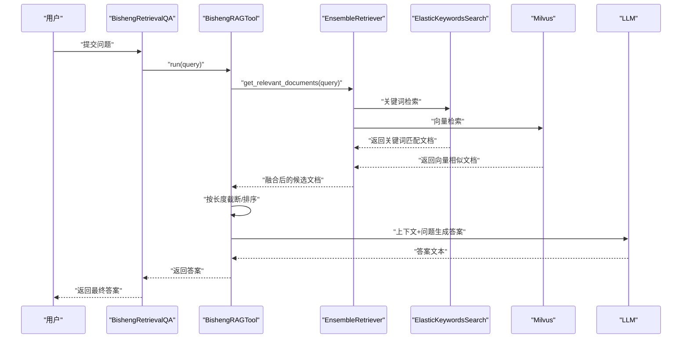
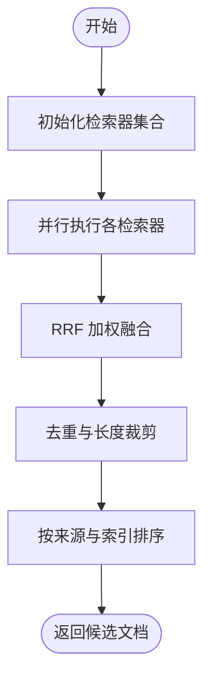
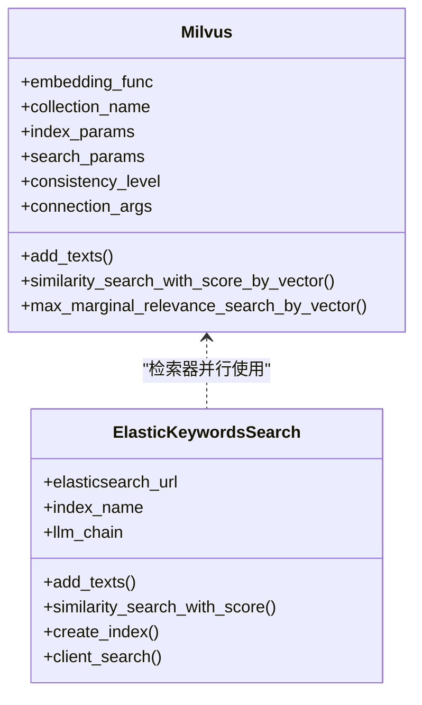
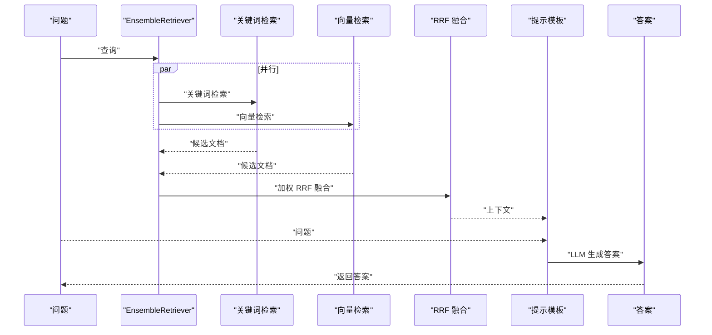
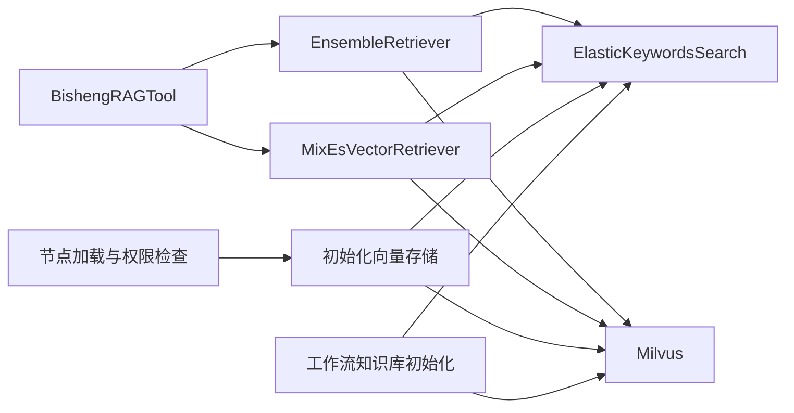

# RAG 工作流程

<cite>
**本文引用的文件**
- [src/backend/bisheng_langchain/rag/bisheng_rag_chain.py](file://src/backend/bisheng_langchain/rag/bisheng_rag_chain.py)
- [src/backend/bisheng_langchain/rag/bisheng_rag_tool.py](file://src/backend/bisheng_langchain/rag/bisheng_rag_tool.py)
- [src/backend/bisheng_langchain/rag/bisheng_rag_pipeline.py](file://src/backend/bisheng_langchain/rag/bisheng_rag_pipeline.py)
- [src/backend/bisheng_langchain/vectorstores/milvus.py](file://src/backend/bisheng_langchain/vectorstores/milvus.py)
- [src/backend/bisheng_langchain/vectorstores/elastic_keywords_search.py](file://src/backend/bisheng_langchain/vectorstores/elastic_keywords_search.py)
- [src/backend/bisheng_langchain/retrievers/ensemble.py](file://src/backend/bisheng_langchain/retrievers/ensemble.py)
- [src/backend/bisheng_langchain/retrievers/mix_es_vector.py](file://src/backend/bisheng_langchain/retrievers/mix_es_vector.py)
- [src/backend/bisheng/interface/initialize/vector_store.py](file://src/backend/bisheng/interface/initialize/vector_store.py)
- [src/backend/bisheng/interface/initialize/loading.py](file://src/backend/bisheng/interface/initialize/loading.py)
- [src/backend/bisheng/workflow/common/knowledge.py](file://src/backend/bisheng/workflow/common/knowledge.py)
- [src/backend/bisheng/api/services/workstation/workstation.py](file://src/backend/bisheng/api/services/workstation/workstation.py)
</cite>

## 目录
1. [引言](#引言)
2. [项目结构](#项目结构)
3. [核心组件](#核心组件)
4. [架构总览](#架构总览)
5. [详细组件分析](#详细组件分析)
6. [依赖关系分析](#依赖关系分析)
7. [性能考虑](#性能考虑)
8. [故障排查指南](#故障排查指南)
9. [结论](#结论)

## 引言
本文件面向 Bisheng RAG 的完整工作流程，系统化阐述从“查询理解”到“相关文档检索”再到“上下文构建与答案生成”的四个核心阶段，并深入解析知识库向量存储的初始化过程（Milvus 与 Elasticsearch 的配置与连接），以及检索链（RAG Chain）的执行流程、检索管道设计（多阶段检索、并行处理与结果聚合）、性能优化策略（检索速度、内存使用与准确性）。

## 项目结构
围绕 RAG 的核心代码主要分布在以下模块：
- 向量存储层：Milvus 与 Elasticsearch 关键词向量封装
- 检索器层：集成式检索器（RRF 融合）与混合检索器（关键词优先/向量优先/交错）
- RAG 执行层：工具类与链式调用封装
- 初始化与加载：向量存储初始化、权限检查与检索器装配
- 工作流集成：知识库多向量存储初始化与检索工具装配

图表来源
- [src/backend/bisheng_langchain/rag/bisheng_rag_chain.py](file://src/backend/bisheng_langchain/rag/bisheng_rag_chain.py#L46-L101)
- [src/backend/bisheng_langchain/rag/bisheng_rag_tool.py](file://src/backend/bisheng_langchain/rag/bisheng_rag_tool.py#L36-L146)
- [src/backend/bisheng_langchain/retrievers/ensemble.py](file://src/backend/bisheng_langchain/retrievers/ensemble.py#L18-L118)
- [src/backend/bisheng_langchain/retrievers/mix_es_vector.py](file://src/backend/bisheng_langchain/retrievers/mix_es_vector.py#L8-L68)
- [src/backend/bisheng_langchain/vectorstores/milvus.py](file://src/backend/bisheng_langchain/vectorstores/milvus.py#L26-L115)
- [src/backend/bisheng_langchain/vectorstores/elastic_keywords_search.py](file://src/backend/bisheng_langchain/vectorstores/elastic_keywords_search.py#L48-L133)
- [src/backend/bisheng/interface/initialize/vector_store.py](file://src/backend/bisheng/interface/initialize/vector_store.py#L212-L272)
- [src/backend/bisheng/interface/initialize/loading.py](file://src/backend/bisheng/interface/initialize/loading.py#L507-L549)
- [src/backend/bisheng/workflow/common/knowledge.py](file://src/backend/bisheng/workflow/common/knowledge.py#L276-L303)

章节来源
- [src/backend/bisheng_langchain/rag/bisheng_rag_chain.py](file://src/backend/bisheng_langchain/rag/bisheng_rag_chain.py#L1-L155)
- [src/backend/bisheng_langchain/rag/bisheng_rag_tool.py](file://src/backend/bisheng_langchain/rag/bisheng_rag_tool.py#L1-L317)
- [src/backend/bisheng_langchain/rag/bisheng_rag_pipeline.py](file://src/backend/bisheng_langchain/rag/bisheng_rag_pipeline.py#L1-L321)
- [src/backend/bisheng_langchain/vectorstores/milvus.py](file://src/backend/bisheng_langchain/vectorstores/milvus.py#L1-L967)
- [src/backend/bisheng_langchain/vectorstores/elastic_keywords_search.py](file://src/backend/bisheng_langchain/vectorstores/elastic_keywords_search.py#L1-L392)
- [src/backend/bisheng_langchain/retrievers/ensemble.py](file://src/backend/bisheng_langchain/retrievers/ensemble.py#L1-L191)
- [src/backend/bisheng_langchain/retrievers/mix_es_vector.py](file://src/backend/bisheng_langchain/retrievers/mix_es_vector.py#L1-L113)
- [src/backend/bisheng/interface/initialize/vector_store.py](file://src/backend/bisheng/interface/initialize/vector_store.py#L207-L288)
- [src/backend/bisheng/interface/initialize/loading.py](file://src/backend/bisheng/interface/initialize/loading.py#L507-L549)
- [src/backend/bisheng/workflow/common/knowledge.py](file://src/backend/bisheng/workflow/common/knowledge.py#L276-L303)
- [src/backend/bisheng/api/services/workstation/workstation.py](file://src/backend/bisheng/api/services/workstation/workstation.py#L196-L226)

## 核心组件
- BishengRetrievalQA：封装检索与 LLM 推理的链式组件，负责将问题与检索到的上下文送入 QA 提示模板并生成最终答案。
- BishengRAGTool：RAG 执行工具，负责初始化嵌入、Milvus/Elasticsearch、多种检索器（关键词、向量、混合、更小块向量），执行检索与重排，构造上下文并调用 QA 链。
- EnsembleRetriever：多检索器加权 RRF 融合，支持异步并行检索与去重聚合。
- MixEsVectorRetriever：关键词与向量检索器的组合策略（关键词优先、向量优先、交错）。
- Milvus/ElasticKeywordsSearch：向量存储封装，提供相似度检索、批量写入、索引与搜索参数管理等能力。
- 初始化与加载：通过接口层完成向量存储实例化、权限校验与检索器装配；工作流层完成多知识库向量存储的统一初始化与检索工具装配。

章节来源
- [src/backend/bisheng_langchain/rag/bisheng_rag_chain.py](file://src/backend/bisheng_langchain/rag/bisheng_rag_chain.py#L46-L155)
- [src/backend/bisheng_langchain/rag/bisheng_rag_tool.py](file://src/backend/bisheng_langchain/rag/bisheng_rag_tool.py#L36-L272)
- [src/backend/bisheng_langchain/retrievers/ensemble.py](file://src/backend/bisheng_langchain/retrievers/ensemble.py#L18-L191)
- [src/backend/bisheng_langchain/retrievers/mix_es_vector.py](file://src/backend/bisheng_langchain/retrievers/mix_es_vector.py#L8-L113)
- [src/backend/bisheng_langchain/vectorstores/milvus.py](file://src/backend/bisheng_langchain/vectorstores/milvus.py#L26-L967)
- [src/backend/bisheng_langchain/vectorstores/elastic_keywords_search.py](file://src/backend/bisheng_langchain/vectorstores/elastic_keywords_search.py#L48-L392)
- [src/backend/bisheng/interface/initialize/vector_store.py](file://src/backend/bisheng/interface/initialize/vector_store.py#L212-L272)
- [src/backend/bisheng/interface/initialize/loading.py](file://src/backend/bisheng/interface/initialize/loading.py#L507-L549)
- [src/backend/bisheng/workflow/common/knowledge.py](file://src/backend/bisheng/workflow/common/knowledge.py#L276-L303)
- [src/backend/bisheng/api/services/workstation/workstation.py](file://src/backend/bisheng/api/services/workstation/workstation.py#L196-L226)

## 架构总览
下图展示从“查询输入”到“答案输出”的端到端流程，涵盖查询理解、相关文档检索、上下文构建与答案生成四阶段，以及向量存储初始化与检索器装配的关键步骤。

图表来源
- [src/backend/bisheng_langchain/rag/bisheng_rag_chain.py](file://src/backend/bisheng_langchain/rag/bisheng_rag_chain.py#L103-L154)
- [src/backend/bisheng_langchain/rag/bisheng_rag_tool.py](file://src/backend/bisheng_langchain/rag/bisheng_rag_tool.py#L208-L255)
- [src/backend/bisheng_langchain/retrievers/ensemble.py](file://src/backend/bisheng_langchain/retrievers/ensemble.py#L88-L118)
- [src/backend/bisheng_langchain/vectorstores/elastic_keywords_search.py](file://src/backend/bisheng_langchain/vectorstores/elastic_keywords_search.py#L222-L259)
- [src/backend/bisheng_langchain/vectorstores/milvus.py](file://src/backend/bisheng_langchain/vectorstores/milvus.py#L622-L740)

## 详细组件分析

### 查询理解与输入预处理
- BishengRAGTool 在运行时根据配置或传入参数选择 LLM 与嵌入模型，若未显式提供则从 YAML 参数中加载。
- 输入预处理包括：按最大内容长度裁剪候选文档、按文档来源与分片索引排序以保证上下文连贯性。

章节来源
- [src/backend/bisheng_langchain/rag/bisheng_rag_tool.py](file://src/backend/bisheng_langchain/rag/bisheng_rag_tool.py#L36-L146)
- [src/backend/bisheng_langchain/rag/bisheng_rag_tool.py](file://src/backend/bisheng_langchain/rag/bisheng_rag_tool.py#L208-L232)

### 相关文档检索与多阶段策略
- 多种检索器并行执行：关键词检索（ElasticKeywordsSearch）、向量检索（Milvus）、混合检索（关键词/向量组合策略）、更小块向量检索（提升细粒度召回）。
- 集成式检索器采用加权 RRF（Reciprocal Rank Fusion）进行结果融合，支持异步并行与去重，提升召回质量与稳定性。

图表来源
- [src/backend/bisheng_langchain/retrievers/ensemble.py](file://src/backend/bisheng_langchain/retrievers/ensemble.py#L88-L191)
- [src/backend/bisheng_langchain/rag/bisheng_rag_tool.py](file://src/backend/bisheng_langchain/rag/bisheng_rag_tool.py#L208-L232)

章节来源
- [src/backend/bisheng_langchain/retrievers/ensemble.py](file://src/backend/bisheng_langchain/retrievers/ensemble.py#L18-L191)
- [src/backend/bisheng_langchain/retrievers/mix_es_vector.py](file://src/backend/bisheng_langchain/retrievers/mix_es_vector.py#L8-L113)
- [src/backend/bisheng_langchain/rag/bisheng_rag_tool.py](file://src/backend/bisheng_langchain/rag/bisheng_rag_tool.py#L148-L172)

### 上下文构建与提示工程
- 使用 LangChain 的“拼接文档链”将候选文档与问题拼接至提示模板，支持可选的自定义 QA 提示模板。
- 支持回调注入，便于在链路中插入日志与监控。

章节来源
- [src/backend/bisheng_langchain/rag/bisheng_rag_chain.py](file://src/backend/bisheng_langchain/rag/bisheng_rag_chain.py#L131-L154)
- [src/backend/bisheng_langchain/rag/bisheng_rag_tool.py](file://src/backend/bisheng_langchain/rag/bisheng_rag_tool.py#L136-L146)

### 答案生成与链式调用
- BishengRetrievalQA 将问题与上下文送入 LLM，生成最终答案；支持返回源文档以便溯源。
- BishengRAGTool.run/arun 提供同步与异步两种执行方式，便于在不同场景下使用。

章节来源
- [src/backend/bisheng_langchain/rag/bisheng_rag_chain.py](file://src/backend/bisheng_langchain/rag/bisheng_rag_chain.py#L103-L154)
- [src/backend/bisheng_langchain/rag/bisheng_rag_tool.py](file://src/backend/bisheng_langchain/rag/bisheng_rag_tool.py#L234-L259)

### 知识库向量存储初始化（Milvus 与 Elasticsearch）
- Milvus 初始化：支持连接参数、索引参数、搜索参数、一致性级别、分区字段与元数据过滤表达式；自动创建连接别名、集合、索引与加载。
- Elasticsearch 关键词向量：支持基于 Jieba 或 LLM 的关键词抽取，构建映射并执行关键词匹配检索；兼容 ES 7/8 版本的搜索接口。

图表来源
- [src/backend/bisheng_langchain/vectorstores/milvus.py](file://src/backend/bisheng_langchain/vectorstores/milvus.py#L26-L232)
- [src/backend/bisheng_langchain/vectorstores/elastic_keywords_search.py](file://src/backend/bisheng_langchain/vectorstores/elastic_keywords_search.py#L48-L133)

章节来源
- [src/backend/bisheng_langchain/vectorstores/milvus.py](file://src/backend/bisheng_langchain/vectorstores/milvus.py#L101-L232)
- [src/backend/bisheng_langchain/vectorstores/elastic_keywords_search.py](file://src/backend/bisheng_langchain/vectorstores/elastic_keywords_search.py#L106-L133)

### 检索链（RAG Chain）执行流程
- 从问题输入开始，依次经过：检索器集合并行检索 → RRF 融合 → 去重与长度裁剪 → 排序 → LLM 提示模板 → 答案生成。
- 支持返回源文档，便于审计与溯源。

图表来源
- [src/backend/bisheng_langchain/retrievers/ensemble.py](file://src/backend/bisheng_langchain/retrievers/ensemble.py#L88-L191)
- [src/backend/bisheng_langchain/rag/bisheng_rag_chain.py](file://src/backend/bisheng_langchain/rag/bisheng_rag_chain.py#L103-L154)

章节来源
- [src/backend/bisheng_langchain/rag/bisheng_rag_chain.py](file://src/backend/bisheng_langchain/rag/bisheng_rag_chain.py#L46-L155)
- [src/backend/bisheng_langchain/rag/bisheng_rag_tool.py](file://src/backend/bisheng_langchain/rag/bisheng_rag_tool.py#L208-L255)

### 检索管道设计：多阶段、并行与聚合
- 多阶段：关键词抽取（可选 LLM）、关键词检索、向量检索、混合策略、RRF 融合。
- 并行处理：EnsembleRetriever 对多个检索器并行执行，降低整体延迟。
- 结果聚合：RRF 融合与去重，确保高质量与多样性兼顾；可选按来源与索引排序以增强上下文连贯性。

章节来源
- [src/backend/bisheng_langchain/retrievers/ensemble.py](file://src/backend/bisheng_langchain/retrievers/ensemble.py#L18-L191)
- [src/backend/bisheng_langchain/retrievers/mix_es_vector.py](file://src/backend/bisheng_langchain/retrievers/mix_es_vector.py#L8-L113)
- [src/backend/bisheng_langchain/rag/bisheng_rag_tool.py](file://src/backend/bisheng_langchain/rag/bisheng_rag_tool.py#L208-L232)

### 工作流中的知识库向量存储初始化
- 工作流层根据知识库 ID 列表批量初始化 Milvus 与 Elasticsearch 向量存储，支持多知识库的向量检索器与关键词检索器的统一装配。
- 工作流服务层将多检索器封装为统一的检索工具，支持 RRF 去零分与按来源与索引排序。

章节来源
- [src/backend/bisheng/workflow/common/knowledge.py](file://src/backend/bisheng/workflow/common/knowledge.py#L276-L303)
- [src/backend/bisheng/api/services/workstation/workstation.py](file://src/backend/bisheng/api/services/workstation/workstation.py#L196-L226)

## 依赖关系分析
- 组件耦合：BishengRAGTool 作为核心协调者，依赖多种检索器与向量存储；EnsembleRetriever 与 MixEsVectorRetriever 作为检索器层，解耦于具体向量存储实现。
- 外部依赖：Milvus 与 Elasticsearch 客户端、LangChain 链式组件、提示模板与 LLM 接口。
- 初始化链路：接口层负责向量存储实例化与权限检查；工作流层负责多知识库向量存储的统一装配。

图表来源
- [src/backend/bisheng_langchain/rag/bisheng_rag_tool.py](file://src/backend/bisheng_langchain/rag/bisheng_rag_tool.py#L148-L172)
- [src/backend/bisheng_langchain/retrievers/ensemble.py](file://src/backend/bisheng_langchain/retrievers/ensemble.py#L18-L118)
- [src/backend/bisheng_langchain/retrievers/mix_es_vector.py](file://src/backend/bisheng_langchain/retrievers/mix_es_vector.py#L8-L68)
- [src/backend/bisheng/interface/initialize/vector_store.py](file://src/backend/bisheng/interface/initialize/vector_store.py#L212-L272)
- [src/backend/bisheng/interface/initialize/loading.py](file://src/backend/bisheng/interface/initialize/loading.py#L507-L549)
- [src/backend/bisheng/workflow/common/knowledge.py](file://src/backend/bisheng/workflow/common/knowledge.py#L276-L303)

章节来源
- [src/backend/bisheng/interface/initialize/vector_store.py](file://src/backend/bisheng/interface/initialize/vector_store.py#L212-L272)
- [src/backend/bisheng/interface/initialize/loading.py](file://src/backend/bisheng/interface/initialize/loading.py#L507-L549)
- [src/backend/bisheng/workflow/common/knowledge.py](file://src/backend/bisheng/workflow/common/knowledge.py#L276-L303)

## 性能考虑
- 检索速度提升
  - 并行检索：EnsembleRetriever 并行执行多个检索器，显著降低端到端延迟。
  - RRF 融合：在保持召回质量的同时减少冗余，避免重复计算。
  - 搜索参数优化：合理设置 Milvus 的 ef/nprobe 与索引类型，平衡精度与速度。
- 内存使用优化
  - 文档长度裁剪：在返回上下文前按最大内容长度进行裁剪，控制 LLM 输入规模。
  - 去重与排序：先去重再裁剪，避免无效内容进入 LLM。
- 准确性改进策略
  - 混合策略：根据业务场景选择关键词优先、向量优先或交错策略。
  - 分片与更小块向量检索：提升细粒度召回，改善长文档定位能力。
  - 提示模板与排序：按来源与索引排序，增强上下文连贯性与可读性。

章节来源
- [src/backend/bisheng_langchain/retrievers/ensemble.py](file://src/backend/bisheng_langchain/retrievers/ensemble.py#L88-L191)
- [src/backend/bisheng_langchain/retrievers/mix_es_vector.py](file://src/backend/bisheng_langchain/retrievers/mix_es_vector.py#L8-L113)
- [src/backend/bisheng_langchain/rag/bisheng_rag_tool.py](file://src/backend/bisheng_langchain/rag/bisheng_rag_tool.py#L208-L232)
- [src/backend/bisheng_langchain/vectorstores/milvus.py](file://src/backend/bisheng_langchain/vectorstores/milvus.py#L124-L184)

## 故障排查指南
- Milvus 连接异常
  - 现象：插入/查询时报连接不存在或超时。
  - 处理：检查连接参数（host/port/uri/address）、TLS 配置与用户认证；确认连接别名复用与重连逻辑。
- Elasticsearch 搜索异常
  - 现象：关键词检索失败或版本兼容问题。
  - 处理：确认 ES 版本分支（7.x/8.x）的映射与搜索接口差异；检查索引是否存在与映射是否正确。
- 检索结果质量不佳
  - 现象：召回不足或相关性差。
  - 处理：调整检索器权重、RRF 常数 c、关键词抽取策略（LLM/Jieba）与检索参数（k/ef/nprobe）。
- 工作流检索工具装配失败
  - 现象：多知识库检索器未生效或权限校验失败。
  - 处理：核对知识库 ID 列表、集合名称与索引名称映射，确认权限检查与嵌入模型选择。

章节来源
- [src/backend/bisheng_langchain/vectorstores/milvus.py](file://src/backend/bisheng_langchain/vectorstores/milvus.py#L533-L543)
- [src/backend/bisheng_langchain/vectorstores/elastic_keywords_search.py](file://src/backend/bisheng_langchain/vectorstores/elastic_keywords_search.py#L316-L344)
- [src/backend/bisheng/interface/initialize/loading.py](file://src/backend/bisheng/interface/initialize/loading.py#L507-L549)
- [src/backend/bisheng/workflow/common/knowledge.py](file://src/backend/bisheng/workflow/common/knowledge.py#L276-L303)

## 结论
Bisheng RAG 通过“查询理解—相关文档检索—上下文构建—答案生成”的清晰分层，结合 Milvus 与 Elasticsearch 的双通道检索、EnsembleRetriever 的 RRF 融合与 MixEsVectorRetriever 的策略化组合，实现了高召回、高并发与高可用的 RAG 流程。配合工作流层的多知识库统一初始化与检索工具装配，系统在企业级场景中具备良好的扩展性与稳定性。建议在生产环境中持续优化检索参数、提示模板与混合策略，并结合监控与日志完善可观测性与可维护性。