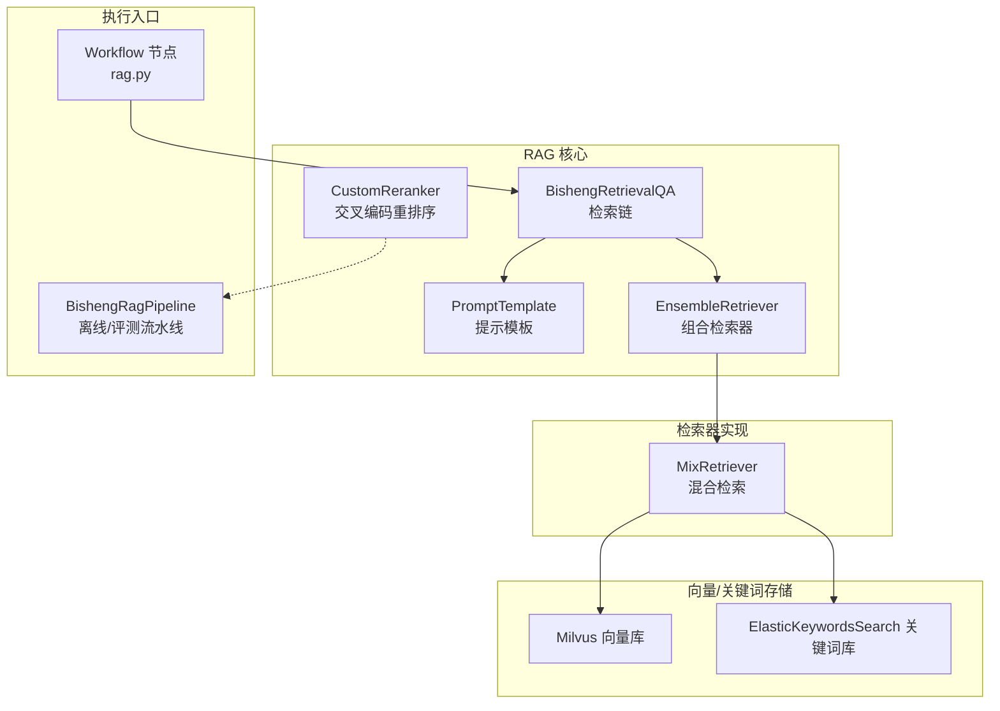
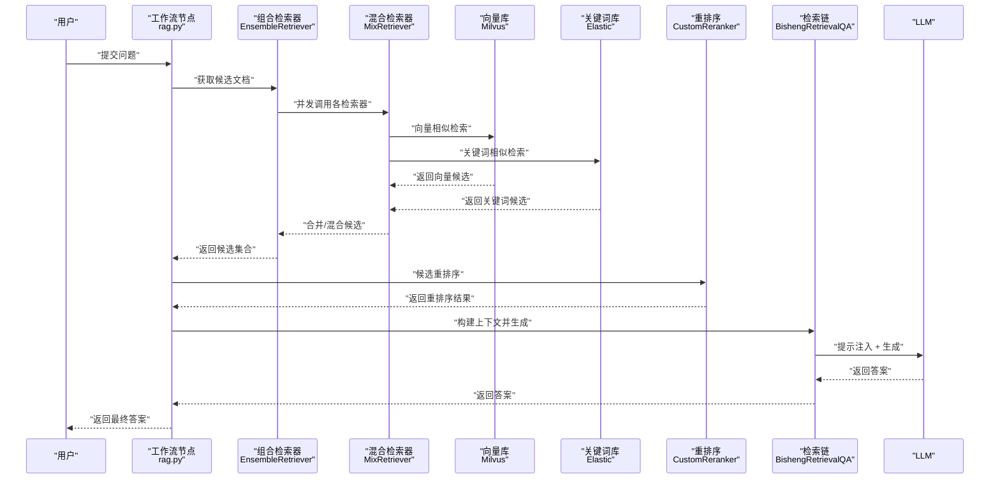
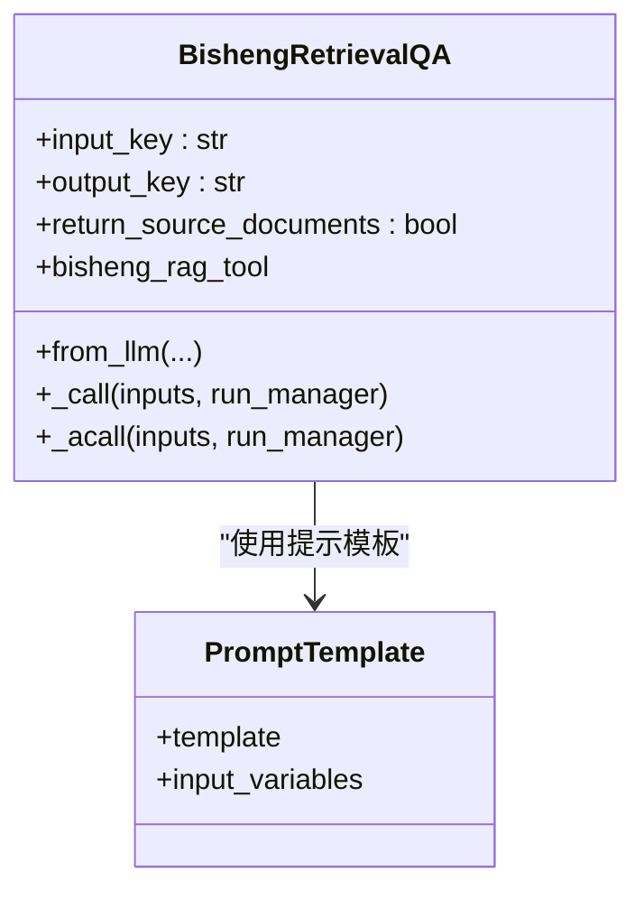
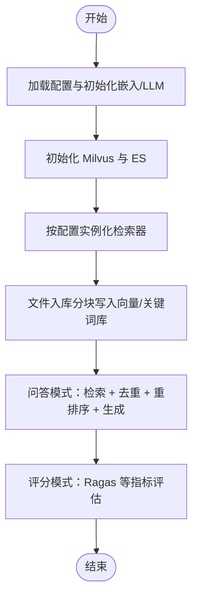
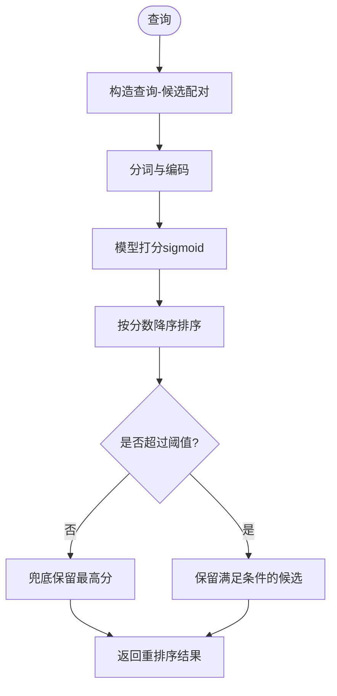
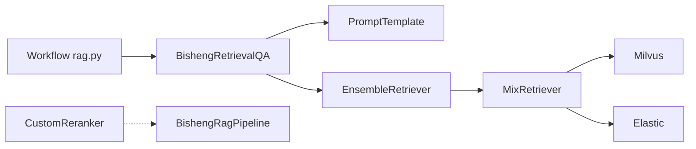

# RAG 检索系统

<cite>
**本文引用的文件**
- [src/backend/bisheng_langchain/rag/bisheng_rag_chain.py](file://src/backend/bisheng_langchain/rag/bisheng_rag_chain.py)
- [src/backend/bisheng_langchain/rag/bisheng_rag_pipeline.py](file://src/backend/bisheng_langchain/rag/bisheng_rag_pipeline.py)
- [src/backend/bisheng_langchain/rag/rerank/rerank.py](file://src/backend/bisheng_langchain/rag/rerank/rerank.py)
- [src/backend/bisheng_langchain/rag/prompts/prompt.py](file://src/backend/bisheng_langchain/rag/prompts/prompt.py)
- [src/backend/bisheng_langchain/rag/init_retrievers/mix_retriever.py](file://src/backend/bisheng_langchain/rag/init_retrievers/mix_retriever.py)
- [src/backend/bisheng_langchain/retrievers/ensemble.py](file://src/backend/bisheng_langchain/retrievers/ensemble.py)
- [src/backend/bisheng/workflow/nodes/rag/rag.py](file://src/backend/bisheng/workflow/nodes/rag/rag.py)
- [src/backend/bisheng/core/ai/rerank/common_rerank.py](file://src/backend/bisheng/core/ai/rerank/common_rerank.py)
- [src/backend/bisheng/core/ai/rerank/xinference/client/restful/restful_client.py](file://src/backend/bisheng/core/ai/rerank/xinference/client/restful/restful_client.py)
</cite>

## 目录
1. [简介](#简介)
2. [项目结构](#项目结构)
3. [核心组件](#核心组件)
4. [架构总览](#架构总览)
5. [组件详解](#组件详解)
6. [依赖关系分析](#依赖关系分析)
7. [性能优化建议](#性能优化建议)
8. [故障排查指南](#故障排查指南)
9. [结论](#结论)
10. [附录](#附录)

## 简介
本文件面向 Bisheng RAG 检索增强生成系统，系统性阐述从“查询理解、相关文档检索、上下文构建、答案生成”的完整工作流，并深入解析检索链（RAG Chain）、提示工程、上下文注入与输出格式化、重排序（Rerank）机制（含交叉编码器、重排序算法与结果优化策略）、以及检索管道（Pipeline）设计（多阶段检索、并行处理与结果聚合）。同时提供性能优化与排障建议，帮助读者在实际部署中获得更优的检索速度、更低的内存占用与更高的准确性。

## 项目结构
围绕 RAG 的关键目录与文件如下：
- 检索链与工具：bisheng_rag_chain.py、bisheng_rag_tool.py（由链导入）
- 检索管道：bisheng_rag_pipeline.py、init_retrievers 下的多种检索器
- 提示工程：prompts/prompt.py
- 重排序：rerank/rerank.py、core/ai/rerank 下的通用重排序实现
- 组合检索器：retrievers/ensemble.py
- 工作流节点：workflow/nodes/rag/rag.py（集成检索与问答）

图表来源
- [src/backend/bisheng_langchain/rag/bisheng_rag_chain.py](file://src/backend/bisheng_langchain/rag/bisheng_rag_chain.py#L46-L155)
- [src/backend/bisheng_langchain/rag/prompts/prompt.py](file://src/backend/bisheng_langchain/rag/prompts/prompt.py#L9-L53)
- [src/backend/bisheng_langchain/rag/rerank/rerank.py](file://src/backend/bisheng_langchain/rag/rerank/rerank.py#L5-L48)
- [src/backend/bisheng_langchain/rag/init_retrievers/mix_retriever.py](file://src/backend/bisheng_langchain/rag/init_retrievers/mix_retriever.py#L10-L103)
- [src/backend/bisheng_langchain/retrievers/ensemble.py](file://src/backend/bisheng_langchain/retrievers/ensemble.py#L98-L150)
- [src/backend/bisheng/workflow/nodes/rag/rag.py](file://src/backend/bisheng/workflow/nodes/rag/rag.py#L64-L89)
- [src/backend/bisheng_langchain/rag/bisheng_rag_pipeline.py](file://src/backend/bisheng_langchain/rag/bisheng_rag_pipeline.py#L26-L321)

章节来源
- [src/backend/bisheng_langchain/rag/bisheng_rag_chain.py](file://src/backend/bisheng_langchain/rag/bisheng_rag_chain.py#L1-L155)
- [src/backend/bisheng_langchain/rag/bisheng_rag_pipeline.py](file://src/backend/bisheng_langchain/rag/bisheng_rag_pipeline.py#L1-L321)
- [src/backend/bisheng_langchain/rag/prompts/prompt.py](file://src/backend/bisheng_langchain/rag/prompts/prompt.py#L1-L53)
- [src/backend/bisheng_langchain/rag/rerank/rerank.py](file://src/backend/bisheng_langchain/rag/rerank/rerank.py#L1-L48)
- [src/backend/bisheng_langchain/rag/init_retrievers/mix_retriever.py](file://src/backend/bisheng_langchain/rag/init_retrievers/mix_retriever.py#L1-L103)
- [src/backend/bisheng_langchain/retrievers/ensemble.py](file://src/backend/bisheng_langchain/retrievers/ensemble.py#L98-L150)
- [src/backend/bisheng/workflow/nodes/rag/rag.py](file://src/backend/bisheng/workflow/nodes/rag/rag.py#L64-L89)

## 核心组件
- 检索链（RAG Chain）：封装“检索 + 提示 + 生成”的调用，支持同步与异步运行，可选择返回源文档。
- 检索器：支持关键词与向量双通道，提供混合拼接策略与分块策略配置。
- 组合检索器：对多个检索器的结果进行加权互惠倒数融合（RRF）等聚合。
- 重排序：本地交叉编码器与远程重排序服务两种实现，支持阈值过滤与排序。
- 提示工程：内置多套提示模板，覆盖基础问答与通用场景。
- 离线流水线：负责文件入库、检索、重排序、问答与评分全流程。

章节来源
- [src/backend/bisheng_langchain/rag/bisheng_rag_chain.py](file://src/backend/bisheng_langchain/rag/bisheng_rag_chain.py#L46-L155)
- [src/backend/bisheng_langchain/rag/init_retrievers/mix_retriever.py](file://src/backend/bisheng_langchain/rag/init_retrievers/mix_retriever.py#L10-L103)
- [src/backend/bisheng_langchain/retrievers/ensemble.py](file://src/backend/bisheng_langchain/retrievers/ensemble.py#L98-L150)
- [src/backend/bisheng_langchain/rag/rerank/rerank.py](file://src/backend/bisheng_langchain/rag/rerank/rerank.py#L5-L48)
- [src/backend/bisheng_langchain/rag/prompts/prompt.py](file://src/backend/bisheng_langchain/rag/prompts/prompt.py#L9-L53)
- [src/backend/bisheng_langchain/rag/bisheng_rag_pipeline.py](file://src/backend/bisheng_langchain/rag/bisheng_rag_pipeline.py#L26-L321)

## 架构总览
下图展示从查询到最终答案的关键交互路径，涵盖检索、重排序、提示注入与生成：

图表来源
- [src/backend/bisheng/workflow/nodes/rag/rag.py](file://src/backend/bisheng/workflow/nodes/rag/rag.py#L64-L89)
- [src/backend/bisheng_langchain/retrievers/ensemble.py](file://src/backend/bisheng_langchain/retrievers/ensemble.py#L98-L150)
- [src/backend/bisheng_langchain/rag/init_retrievers/mix_retriever.py](file://src/backend/bisheng_langchain/rag/init_retrievers/mix_retriever.py#L62-L103)
- [src/backend/bisheng_langchain/rag/rerank/rerank.py](file://src/backend/bisheng_langchain/rag/rerank/rerank.py#L28-L48)
- [src/backend/bisheng_langchain/rag/bisheng_rag_chain.py](file://src/backend/bisheng_langchain/rag/bisheng_rag_chain.py#L103-L155)

## 组件详解

### 检索链（RAG Chain）与提示工程
- 检索链职责：接收查询，委托底层检索工具完成检索、上下文构建与生成；支持返回源文档以便溯源。
- 提示工程：提供基础问答模板与通用模板，系统消息强调“基于上下文回答、避免臆造、必要时指出未知”，并允许在模板中注入上下文与问题变量。
- 上下文注入：通过链内部的文档列表注入到提示模板，再交由 LLM 生成最终答案。
- 输出格式化：链返回标准化字典，包含答案与可选的源文档列表。

图表来源
- [src/backend/bisheng_langchain/rag/bisheng_rag_chain.py](file://src/backend/bisheng_langchain/rag/bisheng_rag_chain.py#L46-L155)
- [src/backend/bisheng_langchain/rag/prompts/prompt.py](file://src/backend/bisheng_langchain/rag/prompts/prompt.py#L9-L53)

章节来源
- [src/backend/bisheng_langchain/rag/bisheng_rag_chain.py](file://src/backend/bisheng_langchain/rag/bisheng_rag_chain.py#L46-L155)
- [src/backend/bisheng_langchain/rag/prompts/prompt.py](file://src/backend/bisheng_langchain/rag/prompts/prompt.py#L9-L53)

### 检索器与检索管道
- 混合检索器（MixRetriever）：对文档分别进行关键词与向量分块，写入关键词库与向量库；检索时支持“关键词优先”“向量优先”“交错混合”三种拼接策略。
- 组合检索器（EnsembleRetriever）：对多个检索器并行执行，汇总候选后采用加权互惠倒数融合（RRF）进行重排，提升召回质量。
- 检索管道（BishengRagPipeline）：支持文件入库、检索与重排序、问答生成、指标评分；可按配置启用去重、重排序与不同提示类型。

图表来源
- [src/backend/bisheng_langchain/rag/bisheng_rag_pipeline.py](file://src/backend/bisheng_langchain/rag/bisheng_rag_pipeline.py#L26-L321)
- [src/backend/bisheng_langchain/rag/init_retrievers/mix_retriever.py](file://src/backend/bisheng_langchain/rag/init_retrievers/mix_retriever.py#L10-L103)
- [src/backend/bisheng_langchain/retrievers/ensemble.py](file://src/backend/bisheng_langchain/retrievers/ensemble.py#L98-L150)

章节来源
- [src/backend/bisheng_langchain/rag/init_retrievers/mix_retriever.py](file://src/backend/bisheng_langchain/rag/init_retrievers/mix_retriever.py#L10-L103)
- [src/backend/bisheng_langchain/retrievers/ensemble.py](file://src/backend/bisheng_langchain/retrievers/ensemble.py#L98-L150)
- [src/backend/bisheng_langchain/rag/bisheng_rag_pipeline.py](file://src/backend/bisheng_langchain/rag/bisheng_rag_pipeline.py#L26-L321)

### 重排序（Rerank）机制
- 本地交叉编码器：基于 Transformers 的序列分类模型，对每条候选与查询进行打分，按置信度排序并可设置阈值过滤，兜底确保至少保留一条。
- 远程重排序服务：通过 RESTful 客户端调用外部重排序模型，支持异步压缩接口，返回排序后的结果并按原文顺序还原。
- 结果优化策略：阈值过滤、去重、最小化空结果风险（兜底保留最高分）。

图表来源
- [src/backend/bisheng_langchain/rag/rerank/rerank.py](file://src/backend/bisheng_langchain/rag/rerank/rerank.py#L14-L48)
- [src/backend/bisheng/core/ai/rerank/common_rerank.py](file://src/backend/bisheng/core/ai/rerank/common_rerank.py#L82-L111)
- [src/backend/bisheng/core/ai/rerank/xinference/client/restful/restful_client.py](file://src/backend/bisheng/core/ai/rerank/xinference/client/restful/restful_client.py#L148-L159)

章节来源
- [src/backend/bisheng_langchain/rag/rerank/rerank.py](file://src/backend/bisheng_langchain/rag/rerank/rerank.py#L5-L48)
- [src/backend/bisheng/core/ai/rerank/common_rerank.py](file://src/backend/bisheng/core/ai/rerank/common_rerank.py#L82-L111)
- [src/backend/bisheng/core/ai/rerank/xinference/client/restful/restful_client.py](file://src/backend/bisheng/core/ai/rerank/xinference/client/restful/restful_client.py#L148-L159)

### 工作流节点中的 RAG 集成
- 节点在执行时初始化多路检索器与重排序模型，调用检索函数获取源文档，随后构建问答链并注入上下文生成答案。
- 异常处理：当检索失败时回退为包含错误信息的文档，保障流程可用性。

章节来源
- [src/backend/bisheng/workflow/nodes/rag/rag.py](file://src/backend/bisheng/workflow/nodes/rag/rag.py#L64-L89)

## 依赖关系分析
- 检索链依赖提示模板与检索工具，后者进一步依赖组合检索器与具体检索器实现。
- 组合检索器对多个检索器并行调用，减少整体延迟。
- 重排序模块既可作为本地组件，也可对接远程服务，提升扩展性。
- 离线流水线贯穿“入库—检索—重排序—问答—评分”的完整链路。

图表来源
- [src/backend/bisheng_langchain/rag/bisheng_rag_chain.py](file://src/backend/bisheng_langchain/rag/bisheng_rag_chain.py#L46-L155)
- [src/backend/bisheng_langchain/rag/bisheng_rag_pipeline.py](file://src/backend/bisheng_langchain/rag/bisheng_rag_pipeline.py#L26-L321)
- [src/backend/bisheng_langchain/rag/init_retrievers/mix_retriever.py](file://src/backend/bisheng_langchain/rag/init_retrievers/mix_retriever.py#L10-L103)
- [src/backend/bisheng/workflow/nodes/rag/rag.py](file://src/backend/bisheng/workflow/nodes/rag/rag.py#L64-L89)

章节来源
- [src/backend/bisheng_langchain/rag/bisheng_rag_chain.py](file://src/backend/bisheng_langchain/rag/bisheng_rag_chain.py#L46-L155)
- [src/backend/bisheng_langchain/rag/bisheng_rag_pipeline.py](file://src/backend/bisheng_langchain/rag/bisheng_rag_pipeline.py#L26-L321)
- [src/backend/bisheng_langchain/rag/init_retrievers/mix_retriever.py](file://src/backend/bisheng_langchain/rag/init_retrievers/mix_retriever.py#L10-L103)
- [src/backend/bisheng/workflow/nodes/rag/rag.py](file://src/backend/bisheng/workflow/nodes/rag/rag.py#L64-L89)

## 性能优化建议
- 检索速度
  - 并行检索：组合检索器已对多个检索器并行执行，建议在配置中合理设置检索器数量与权重，避免过度并行导致资源争用。
  - 去重与裁剪：在检索后尽早去重与限制上下文长度，降低后续重排序与生成压力。
- 内存使用
  - 分块策略：混合检索器支持对关键词与向量分别分块，建议根据文档特性调整分块大小与重叠，平衡召回与内存。
  - 重排序阈值：适当提高重排序阈值，减少候选数量，降低显存与 CPU 占用。
- 准确性提升
  - 提示工程：优先使用通用模板，确保系统消息强调“基于上下文回答、避免臆造”，并在模板中显式注入上下文与问题。
  - 重排序策略：结合本地交叉编码器与远程服务，针对不同领域数据选择最优模型；必要时开启阈值兜底，避免空结果。
- 扩展性
  - 远程重排序：通过 RESTful 接口接入外部重排序服务，便于弹性扩容与模型迭代。
  - 离线流水线：利用流水线进行批处理与评分，持续优化检索与生成效果。

## 故障排查指南
- 检索失败回退
  - 工作流节点在检索异常时会回退为包含错误信息的文档，便于定位问题来源。
- 重排序异常
  - 本地重排序：检查模型路径、设备与阈值设置；确认候选文本非空。
  - 远程重排序：检查服务端状态码与响应体，确认请求头与端点配置正确。
- 提示注入无效
  - 确认提示模板包含上下文与问题变量，链在调用时会将上下文注入模板后再交给 LLM。

章节来源
- [src/backend/bisheng/workflow/nodes/rag/rag.py](file://src/backend/bisheng/workflow/nodes/rag/rag.py#L75-L83)
- [src/backend/bisheng/core/ai/rerank/common_rerank.py](file://src/backend/bisheng/core/ai/rerank/common_rerank.py#L82-L111)
- [src/backend/bisheng_langchain/rag/rerank/rerank.py](file://src/backend/bisheng_langchain/rag/rerank/rerank.py#L14-L48)

## 结论
Bisheng RAG 系统以“检索链 + 多路检索器 + 重排序 + 提示工程”为核心，形成可扩展、可评测的完整检索增强生成方案。通过组合检索器并行召回、本地/远程重排序优化排序质量、完善的提示模板与上下文注入机制，系统在准确性与性能之间取得良好平衡。配合离线流水线与评分体系，可实现持续优化与稳定交付。

## 附录
- 关键流程路径参考
  - 检索链调用：[src/backend/bisheng_langchain/rag/bisheng_rag_chain.py](file://src/backend/bisheng_langchain/rag/bisheng_rag_chain.py#L103-L155)
  - 检索与重排序：[src/backend/bisheng_langchain/rag/bisheng_rag_pipeline.py](file://src/backend/bisheng_langchain/rag/bisheng_rag_pipeline.py#L167-L204)
  - 混合检索器：[src/backend/bisheng_langchain/rag/init_retrievers/mix_retriever.py](file://src/backend/bisheng_langchain/rag/init_retrievers/mix_retriever.py#L62-L103)
  - 组合检索器（RRF）：[src/backend/bisheng_langchain/retrievers/ensemble.py](file://src/backend/bisheng_langchain/retrievers/ensemble.py#L98-L150)
  - 本地重排序：[src/backend/bisheng_langchain/rag/rerank/rerank.py](file://src/backend/bisheng_langchain/rag/rerank/rerank.py#L28-L48)
  - 远程重排序服务：[src/backend/bisheng/core/ai/rerank/common_rerank.py](file://src/backend/bisheng/core/ai/rerank/common_rerank.py#L82-L111)
  - 提示模板：[src/backend/bisheng_langchain/rag/prompts/prompt.py](file://src/backend/bisheng_langchain/rag/prompts/prompt.py#L9-L53)
  - 工作流节点集成：[src/backend/bisheng/workflow/nodes/rag/rag.py](file://src/backend/bisheng/workflow/nodes/rag/rag.py#L64-L89)