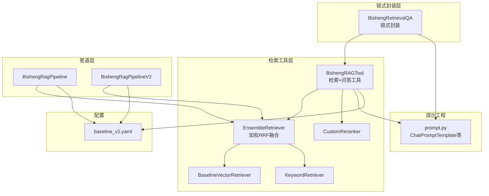
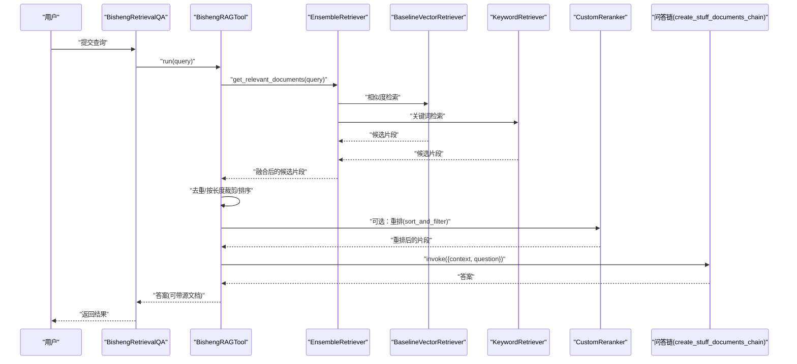
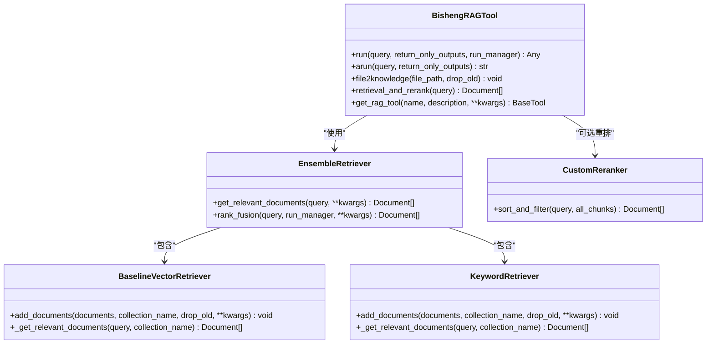
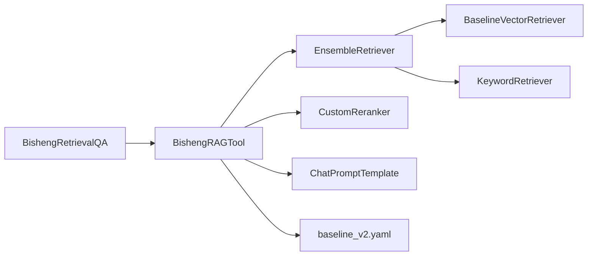
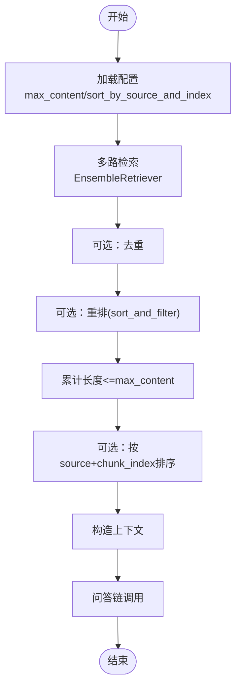

# RAG 检索链

<cite>
**本文档引用的文件**
- [src/backend/bisheng_langchain/rag/bisheng_rag_chain.py](file://src/backend/bisheng_langchain/rag/bisheng_rag_chain.py)
- [src/backend/bisheng_langchain/rag/bisheng_rag_tool.py](file://src/backend/bisheng_langchain/rag/bisheng_rag_tool.py)
- [src/backend/bisheng_langchain/rag/bisheng_rag_pipeline.py](file://src/backend/bisheng_langchain/rag/bisheng_rag_pipeline.py)
- [src/backend/bisheng_langchain/rag/bisheng_rag_pipeline_v2.py](file://src/backend/bisheng_langchain/rag/bisheng_rag_pipeline_v2.py)
- [src/backend/bisheng_langchain/rag/config/baseline_v2.yaml](file://src/backend/bisheng_langchain/rag/config/baseline_v2.yaml)
- [src/backend/bisheng_langchain/rag/prompts/prompt.py](file://src/backend/bisheng_langchain/rag/prompts/prompt.py)
- [src/backend/bisheng_langchain/rag/init_retrievers/baseline_vector_retriever.py](file://src/backend/bisheng_langchain/rag/init_retrievers/baseline_vector_retriever.py)
- [src/backend/bisheng_langchain/rag/init_retrievers/keyword_retriever.py](file://src/backend/bisheng_langchain/rag/init_retrievers/keyword_retriever.py)
- [src/backend/bisheng_langchain/rag/rerank/rerank.py](file://src/backend/bisheng_langchain/rag/rerank/rerank.py)
- [src/backend/bisheng_langchain/retrievers/ensemble.py](file://src/backend/bisheng_langchain/retrievers/ensemble.py)
- [src/backend/bisheng_langchain/rag/utils.py](file://src/backend/bisheng_langchain/rag/utils.py)
</cite>

## 目录
1. [简介](#简介)
2. [项目结构](#项目结构)
3. [核心组件](#核心组件)
4. [架构总览](#架构总览)
5. [详细组件分析](#详细组件分析)
6. [依赖关系分析](#依赖关系分析)
7. [性能考量](#性能考量)
8. [故障排查指南](#故障排查指南)
9. [结论](#结论)
10. [附录](#附录)

## 简介
本文件面向 Bisheng RAG 的检索链（RAG Chain）实现，系统化阐述链式调用机制、上下文传递与结果处理流程；文档化提示工程（Prompt Engineering）的实现，包括系统提示、用户提示与上下文注入的技术细节；深入说明上下文构建策略，包括相关文档的选择标准、上下文窗口管理与信息压缩技术；解释输出格式化与后处理机制，包括答案提取、引用标注与结果验证；最后提供检索链的配置选项与自定义方法，包括参数调优、性能监控与错误处理策略。

## 项目结构
围绕 RAG 检索链的关键模块组织如下：
- 链式封装层：BishengRetrievalQA 将检索工具包装为 LangChain Chain，负责输入输出键、异步/同步调用与源文档返回控制。
- 检索工具层：BishengRAGTool 负责初始化向量库、关键词库、多种检索器与问答链，执行检索、重排、上下文裁剪与问答调用。
- 管道层：BishengRagPipeline 与 BishengRagPipelineV2 提供批量入库、检索重排、问答与评估的完整流水线。
- 提示工程：prompt.py 定义多种提示模板（基础模板、中文聊天模板、通用模板）。
- 检索器实现：BaselineVectorRetriever、KeywordRetriever 等具体检索器。
- 集成检索器：EnsembleRetriever 使用加权 Reciprocal Rank Fusion 融合多路检索结果。
- 重排器：CustomReranker 基于双塔模型对候选片段进行打分与过滤。
- 工具函数：utils.py 提供按名称导入各类组件的能力。

图表来源
- [src/backend/bisheng_langchain/rag/bisheng_rag_chain.py](file://src/backend/bisheng_langchain/rag/bisheng_rag_chain.py#L46-L155)
- [src/backend/bisheng_langchain/rag/bisheng_rag_tool.py](file://src/backend/bisheng_langchain/rag/bisheng_rag_tool.py#L36-L317)
- [src/backend/bisheng_langchain/retrievers/ensemble.py](file://src/backend/bisheng_langchain/retrievers/ensemble.py#L18-L191)
- [src/backend/bisheng_langchain/rag/init_retrievers/baseline_vector_retriever.py](file://src/backend/bisheng_langchain/rag/init_retrievers/baseline_vector_retriever.py#L10-L58)
- [src/backend/bisheng_langchain/rag/init_retrievers/keyword_retriever.py](file://src/backend/bisheng_langchain/rag/init_retrievers/keyword_retriever.py#L10-L58)
- [src/backend/bisheng_langchain/rag/rerank/rerank.py](file://src/backend/bisheng_langchain/rag/rerank/rerank.py#L5-L48)
- [src/backend/bisheng_langchain/rag/bisheng_rag_pipeline.py](file://src/backend/bisheng_langchain/rag/bisheng_rag_pipeline.py#L26-L321)
- [src/backend/bisheng_langchain/rag/bisheng_rag_pipeline_v2.py](file://src/backend/bisheng_langchain/rag/bisheng_rag_pipeline_v2.py#L29-L366)
- [src/backend/bisheng_langchain/rag/prompts/prompt.py](file://src/backend/bisheng_langchain/rag/prompts/prompt.py#L1-L53)
- [src/backend/bisheng_langchain/rag/config/baseline_v2.yaml](file://src/backend/bisheng_langchain/rag/config/baseline_v2.yaml#L1-L91)

章节来源
- [src/backend/bisheng_langchain/rag/bisheng_rag_chain.py](file://src/backend/bisheng_langchain/rag/bisheng_rag_chain.py#L1-L155)
- [src/backend/bisheng_langchain/rag/bisheng_rag_tool.py](file://src/backend/bisheng_langchain/rag/bisheng_rag_tool.py#L1-L317)
- [src/backend/bisheng_langchain/rag/bisheng_rag_pipeline.py](file://src/backend/bisheng_langchain/rag/bisheng_rag_pipeline.py#L1-L321)
- [src/backend/bisheng_langchain/rag/bisheng_rag_pipeline_v2.py](file://src/backend/bisheng_langchain/rag/bisheng_rag_pipeline_v2.py#L1-L366)
- [src/backend/bisheng_langchain/rag/config/baseline_v2.yaml](file://src/backend/bisheng_langchain/rag/config/baseline_v2.yaml#L1-L91)
- [src/backend/bisheng_langchain/rag/prompts/prompt.py](file://src/backend/bisheng_langchain/rag/prompts/prompt.py#L1-L53)
- [src/backend/bisheng_langchain/rag/init_retrievers/baseline_vector_retriever.py](file://src/backend/bisheng_langchain/rag/init_retrievers/baseline_vector_retriever.py#L1-L58)
- [src/backend/bisheng_langchain/rag/init_retrievers/keyword_retriever.py](file://src/backend/bisheng_langchain/rag/init_retrievers/keyword_retriever.py#L1-L58)
- [src/backend/bisheng_langchain/rag/rerank/rerank.py](file://src/backend/bisheng_langchain/rag/rerank/rerank.py#L1-L48)
- [src/backend/bisheng_langchain/retrievers/ensemble.py](file://src/backend/bisheng_langchain/retrievers/ensemble.py#L1-L191)
- [src/backend/bisheng_langchain/rag/utils.py](file://src/backend/bisheng_langchain/rag/utils.py#L1-L204)

## 核心组件
- BishengRetrievalQA：LangChain 链式封装，负责接收查询、选择是否返回源文档，并委托 BishengRAGTool 执行检索与问答。
- BishengRAGTool：核心检索与问答工具，负责：
  - 初始化嵌入、向量库、关键词库与多种检索器（关键词、向量、混合、更小块）。
  - 组装问答链（使用 create_stuff_documents_chain 与指定提示模板）。
  - 执行检索、去重、重排、上下文裁剪与问答调用。
- EnsembleRetriever：多路检索器融合，采用加权 Reciprocal Rank Fusion（RRF）聚合结果，提升召回稳定性。
- 具体检索器：
  - BaselineVectorRetriever：基于 Milvus 向量库的相似度检索。
  - KeywordRetriever：基于 Elasticsearch 关键词检索。
- CustomReranker：基于预训练模型对候选片段进行匹配打分与阈值过滤。
- Pipeline：批处理入库、检索重排与问答评估的流水线，支持配置驱动与可插拔组件。

章节来源
- [src/backend/bisheng_langchain/rag/bisheng_rag_chain.py](file://src/backend/bisheng_langchain/rag/bisheng_rag_chain.py#L46-L155)
- [src/backend/bisheng_langchain/rag/bisheng_rag_tool.py](file://src/backend/bisheng_langchain/rag/bisheng_rag_tool.py#L36-L317)
- [src/backend/bisheng_langchain/retrievers/ensemble.py](file://src/backend/bisheng_langchain/retrievers/ensemble.py#L18-L191)
- [src/backend/bisheng_langchain/rag/init_retrievers/baseline_vector_retriever.py](file://src/backend/bisheng_langchain/rag/init_retrievers/baseline_vector_retriever.py#L10-L58)
- [src/backend/bisheng_langchain/rag/init_retrievers/keyword_retriever.py](file://src/backend/bisheng_langchain/rag/init_retrievers/keyword_retriever.py#L10-L58)
- [src/backend/bisheng_langchain/rag/rerank/rerank.py](file://src/backend/bisheng_langchain/rag/rerank/rerank.py#L5-L48)
- [src/backend/bisheng_langchain/rag/bisheng_rag_pipeline.py](file://src/backend/bisheng_langchain/rag/bisheng_rag_pipeline.py#L26-L321)
- [src/backend/bisheng_langchain/rag/bisheng_rag_pipeline_v2.py](file://src/backend/bisheng_langchain/rag/bisheng_rag_pipeline_v2.py#L29-L366)

## 架构总览
下图展示从查询到最终答案的端到端流程，涵盖检索、重排、上下文裁剪与问答链调用：

图表来源
- [src/backend/bisheng_langchain/rag/bisheng_rag_chain.py](file://src/backend/bisheng_langchain/rag/bisheng_rag_chain.py#L103-L155)
- [src/backend/bisheng_langchain/rag/bisheng_rag_tool.py](file://src/backend/bisheng_langchain/rag/bisheng_rag_tool.py#L208-L256)
- [src/backend/bisheng_langchain/retrievers/ensemble.py](file://src/backend/bisheng_langchain/retrievers/ensemble.py#L44-L118)
- [src/backend/bisheng_langchain/rag/init_retrievers/baseline_vector_retriever.py](file://src/backend/bisheng_langchain/rag/init_retrievers/baseline_vector_retriever.py#L44-L58)
- [src/backend/bisheng_langchain/rag/init_retrievers/keyword_retriever.py](file://src/backend/bisheng_langchain/rag/init_retrievers/keyword_retriever.py#L44-L58)
- [src/backend/bisheng_langchain/rag/rerank/rerank.py](file://src/backend/bisheng_langchain/rag/rerank/rerank.py#L28-L48)

## 详细组件分析

### BishengRetrievalQA（链式封装）
- 输入输出键：通过 input_key/output_key 控制输入输出字段名；当 return_source_documents 为真时，输出包含 source_documents。
- 异步/同步调用：_call/_acall 分别委托 BishengRAGTool.run/arun，支持回调管理。
- 参数来源：from_llm 接收 LLM、向量库、关键词库、提示模板、最大上下文长度、排序开关等。

章节来源
- [src/backend/bisheng_langchain/rag/bisheng_rag_chain.py](file://src/backend/bisheng_langchain/rag/bisheng_rag_chain.py#L46-L155)

### BishengRAGTool（检索与问答工具）
- 初始化流程：
  - 加载 baseline_v2.yaml 配置，动态更新 max_content 与排序开关。
  - 按需初始化 LLM、嵌入、Milvus、Elasticsearch（可选 LLM 提取关键词）。
  - 构建多种检索器并组装 EnsembleRetriever。
  - 创建问答链（create_stuff_documents_chain），使用指定提示模板。
- 检索与重排：
  - retrieval_and_rerank：先获取候选，再按 max_content 裁剪，必要时按 source 与 chunk_index 排序。
  - 支持可选重排器（CustomReranker）对候选进行打分与过滤。
- 问答调用：
  - run/arun：构造上下文与问题（若提示模板需要），调用问答链并返回答案；可同时返回源文档。
- 工具化封装：
  - get_rag_tool：将工具函数包装为 LangChain Tool，便于在代理或工具流中复用。

图表来源
- [src/backend/bisheng_langchain/rag/bisheng_rag_tool.py](file://src/backend/bisheng_langchain/rag/bisheng_rag_tool.py#L36-L317)
- [src/backend/bisheng_langchain/retrievers/ensemble.py](file://src/backend/bisheng_langchain/retrievers/ensemble.py#L18-L191)
- [src/backend/bisheng_langchain/rag/init_retrievers/baseline_vector_retriever.py](file://src/backend/bisheng_langchain/rag/init_retrievers/baseline_vector_retriever.py#L10-L58)
- [src/backend/bisheng_langchain/rag/init_retrievers/keyword_retriever.py](file://src/backend/bisheng_langchain/rag/init_retrievers/keyword_retriever.py#L10-L58)
- [src/backend/bisheng_langchain/rag/rerank/rerank.py](file://src/backend/bisheng_langchain/rag/rerank/rerank.py#L5-L48)

章节来源
- [src/backend/bisheng_langchain/rag/bisheng_rag_tool.py](file://src/backend/bisheng_langchain/rag/bisheng_rag_tool.py#L36-L317)

### EnsembleRetriever（多路检索融合）
- 采用加权 Reciprocal Rank Fusion（RRF）对多路检索结果进行融合，平衡不同检索器的优劣。
- 支持同步与异步 rank_fusion/arank_fusion，内部维护权重列表与常数 c。

章节来源
- [src/backend/bisheng_langchain/retrievers/ensemble.py](file://src/backend/bisheng_langchain/retrievers/ensemble.py#L18-L191)

### 具体检索器
- BaselineVectorRetriever：基于 Milvus 的相似度检索，支持分块、元数据注入（如 chunk_index、可选标题与来源拼接）。
- KeywordRetriever：基于 Elasticsearch 的关键词检索，同样支持分块与元数据注入。

章节来源
- [src/backend/bisheng_langchain/rag/init_retrievers/baseline_vector_retriever.py](file://src/backend/bisheng_langchain/rag/init_retrievers/baseline_vector_retriever.py#L10-L58)
- [src/backend/bisheng_langchain/rag/init_retrievers/keyword_retriever.py](file://src/backend/bisheng_langchain/rag/init_retrievers/keyword_retriever.py#L10-L58)

### 重排器（CustomReranker）
- 使用预训练分类模型对 query 与 chunk 进行匹配打分，采用 sigmoid 归一化得分并按阈值过滤，若无满足阈值的结果则保留最高分片段。

章节来源
- [src/backend/bisheng_langchain/rag/rerank/rerank.py](file://src/backend/bisheng_langchain/rag/rerank/rerank.py#L5-L48)

### 提示工程（Prompt Engineering）
- prompt.py 提供多种提示模板：
  - BASE_PROMPT：基础问答模板，要求严格基于上下文回答。
  - CHAT_PROMPT：中文聊天模板，强调基于参考文本回答、保留图片 Markdown 格式、处理多源差异。
  - CHAT_PROMPT_GENERAL：通用模板，强调准确性、事实校验与详细回答。
- BishengRAGTool 与 BishengRetrievalQA 均可通过配置或显式传参选择提示模板，并将问题注入到模板变量中。

章节来源
- [src/backend/bisheng_langchain/rag/prompts/prompt.py](file://src/backend/bisheng_langchain/rag/prompts/prompt.py#L1-L53)
- [src/backend/bisheng_langchain/rag/bisheng_rag_chain.py](file://src/backend/bisheng_langchain/rag/bisheng_rag_chain.py#L27-L43)
- [src/backend/bisheng_langchain/rag/bisheng_rag_tool.py](file://src/backend/bisheng_langchain/rag/bisheng_rag_tool.py#L136-L146)

### 上下文构建策略
- 相关文档选择标准：
  - 多路检索器并行召回，EnsembleRetriever 使用 RRF 融合，提升召回稳定性。
  - 支持可选重排器（CustomReranker）对候选进行二次筛选。
- 上下文窗口管理与信息压缩：
  - 按 max_content 字符长度累加裁剪，避免超过 LLM 上下文上限。
  - 可选按 source 与 chunk_index 排序，保证上下文连贯性。
- 去重与清洗：
  - 管道版本提供删除重复内容的逻辑，减少冗余上下文。

章节来源
- [src/backend/bisheng_langchain/rag/bisheng_rag_tool.py](file://src/backend/bisheng_langchain/rag/bisheng_rag_tool.py#L208-L232)
- [src/backend/bisheng_langchain/rag/bisheng_rag_pipeline_v2.py](file://src/backend/bisheng_langchain/rag/bisheng_rag_pipeline_v2.py#L200-L246)
- [src/backend/bisheng_langchain/rag/bisheng_rag_pipeline.py](file://src/backend/bisheng_langchain/rag/bisheng_rag_pipeline.py#L181-L204)

### 输出格式化与后处理
- 答案提取：问答链返回 output_text，BishengRAGTool.run 返回纯文本答案；可选返回源文档。
- 引用标注：通过返回的源文档（metadata 中包含 source、chunk_index 等）进行引用标注。
- 结果验证：异常捕获与日志记录，确保流程健壮性。

章节来源
- [src/backend/bisheng_langchain/rag/bisheng_rag_tool.py](file://src/backend/bisheng_langchain/rag/bisheng_rag_tool.py#L234-L256)
- [src/backend/bisheng_langchain/rag/bisheng_rag_pipeline.py](file://src/backend/bisheng_langchain/rag/bisheng_rag_pipeline.py#L257-L277)
- [src/backend/bisheng_langchain/rag/bisheng_rag_pipeline_v2.py](file://src/backend/bisheng_langchain/rag/bisheng_rag_pipeline_v2.py#L292-L322)

### 配置选项与自定义方法
- 配置文件（baseline_v2.yaml）关键项：
  - data：数据路径、问题文件、保存路径。
  - milvus/elasticsearch：连接参数、是否删除旧集合。
  - embedding/chat_llm：类型、模型、代理与温度等。
  - loader：文档加载器类型与接口地址。
  - retriever：检索器类型、分块策略、检索参数、是否追加辅助信息、后缀等。
  - post_retrieval：是否去重、是否重排、重排器参数、是否按 source+index 排序。
  - generate：是否启用检索、最大上下文长度、链类型、提示模板类型。
  - metric：评估指标与列名映射。
- 自定义方法：
  - 通过 YAML 动态切换 LLM、嵌入、检索器与提示模板。
  - 在 BishengRAGTool 中可直接传入自定义 vector_store、keyword_store、QA_PROMPT。
  - 通过 utils.import_by_type 与 import_class 实现按名称动态导入组件，便于扩展新检索器、提示模板或重排器。

章节来源
- [src/backend/bisheng_langchain/rag/config/baseline_v2.yaml](file://src/backend/bisheng_langchain/rag/config/baseline_v2.yaml#L1-L91)
- [src/backend/bisheng_langchain/rag/bisheng_rag_tool.py](file://src/backend/bisheng_langchain/rag/bisheng_rag_tool.py#L38-L146)
- [src/backend/bisheng_langchain/rag/utils.py](file://src/backend/bisheng_langchain/rag/utils.py#L35-L82)

## 依赖关系分析
- 组件耦合：
  - BishengRetrievalQA 与 BishengRAGTool：前者作为后者的外部封装，职责清晰分离。
  - BishengRAGTool 与 EnsembleRetriever：强依赖，用于多路检索融合。
  - EnsembleRetriever 与具体检索器：弱耦合，便于替换与扩展。
  - BishengRAGTool 与 CustomReranker：可选依赖，按配置启用。
- 外部依赖：
  - LangChain 核心链与提示模板。
  - Milvus/Elasticsearch 向量/关键词检索后端。
  - Transformers/PyTorch 用于重排模型推理。

图表来源
- [src/backend/bisheng_langchain/rag/bisheng_rag_chain.py](file://src/backend/bisheng_langchain/rag/bisheng_rag_chain.py#L46-L155)
- [src/backend/bisheng_langchain/rag/bisheng_rag_tool.py](file://src/backend/bisheng_langchain/rag/bisheng_rag_tool.py#L36-L317)
- [src/backend/bisheng_langchain/retrievers/ensemble.py](file://src/backend/bisheng_langchain/retrievers/ensemble.py#L18-L191)
- [src/backend/bisheng_langchain/rag/init_retrievers/baseline_vector_retriever.py](file://src/backend/bisheng_langchain/rag/init_retrievers/baseline_vector_retriever.py#L10-L58)
- [src/backend/bisheng_langchain/rag/init_retrievers/keyword_retriever.py](file://src/backend/bisheng_langchain/rag/init_retrievers/keyword_retriever.py#L10-L58)
- [src/backend/bisheng_langchain/rag/rerank/rerank.py](file://src/backend/bisheng_langchain/rag/rerank/rerank.py#L5-L48)
- [src/backend/bisheng_langchain/rag/config/baseline_v2.yaml](file://src/backend/bisheng_langchain/rag/config/baseline_v2.yaml#L1-L91)

## 性能考量
- 检索效率：
  - EnsembleRetriever 使用 RRF 融合，减少单一检索器偏差，提高召回稳定性。
  - 可配置 k 值与分块大小，平衡召回质量与性能。
- 上下文控制：
  - 通过 max_content 对候选片段进行长度裁剪，避免超出 LLM 上下文限制。
  - 可选按 source+chunk_index 排序，减少跨文档跳跃带来的理解负担。
- 重排成本：
  - 重排器使用 GPU 推理，建议合理设置阈值与批处理策略以降低延迟。
- I/O 与并发：
  - 管道版本支持异步客户端（httpx.AsyncClient），可在高并发场景下提升吞吐。

## 故障排查指南
- 常见问题与定位：
  - 问答链异常：捕获异常并记录日志，返回错误信息；检查提示模板变量是否齐全（如 question）。
  - 空上下文：确认检索器是否成功召回，检查分块与元数据注入逻辑。
  - 重排失败：检查重排模型路径与设备配置，确认阈值设置合理。
- 日志与监控：
  - 关键步骤均记录日志（候选数量、去重前后、重排前后、排序前后），便于定位瓶颈。
- 错误处理策略：
  - 在问答阶段捕获异常并兜底返回错误文本，避免中断流程。
  - 管道模式下对每个问题单独 try-except，保证批处理稳定性。

章节来源
- [src/backend/bisheng_langchain/rag/bisheng_rag_tool.py](file://src/backend/bisheng_langchain/rag/bisheng_rag_tool.py#L234-L256)
- [src/backend/bisheng_langchain/rag/bisheng_rag_pipeline.py](file://src/backend/bisheng_langchain/rag/bisheng_rag_pipeline.py#L257-L277)
- [src/backend/bisheng_langchain/rag/bisheng_rag_pipeline_v2.py](file://src/backend/bisheng_langchain/rag/bisheng_rag_pipeline_v2.py#L292-L322)

## 结论
Bisheng RAG 检索链通过链式封装、工具化检索与可插拔的提示模板，实现了从查询到答案的完整闭环。其多路检索融合与上下文裁剪策略有效提升了检索稳定性与上下文质量；可选重排器进一步优化了相关性。配置驱动的设计使得参数调优与扩展变得简单直观，适合在不同业务场景中快速落地与迭代。

## 附录
- 关键流程图（上下文构建与裁剪）

图表来源
- [src/backend/bisheng_langchain/rag/bisheng_rag_tool.py](file://src/backend/bisheng_langchain/rag/bisheng_rag_tool.py#L208-L232)
- [src/backend/bisheng_langchain/rag/bisheng_rag_pipeline_v2.py](file://src/backend/bisheng_langchain/rag/bisheng_rag_pipeline_v2.py#L200-L246)
- [src/backend/bisheng_langchain/rag/rerank/rerank.py](file://src/backend/bisheng_langchain/rag/rerank/rerank.py#L28-L48)