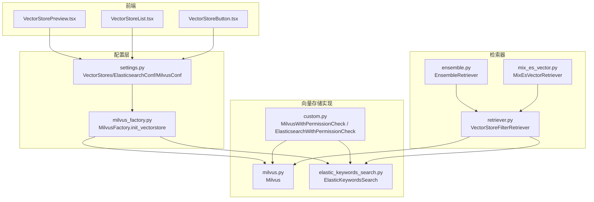
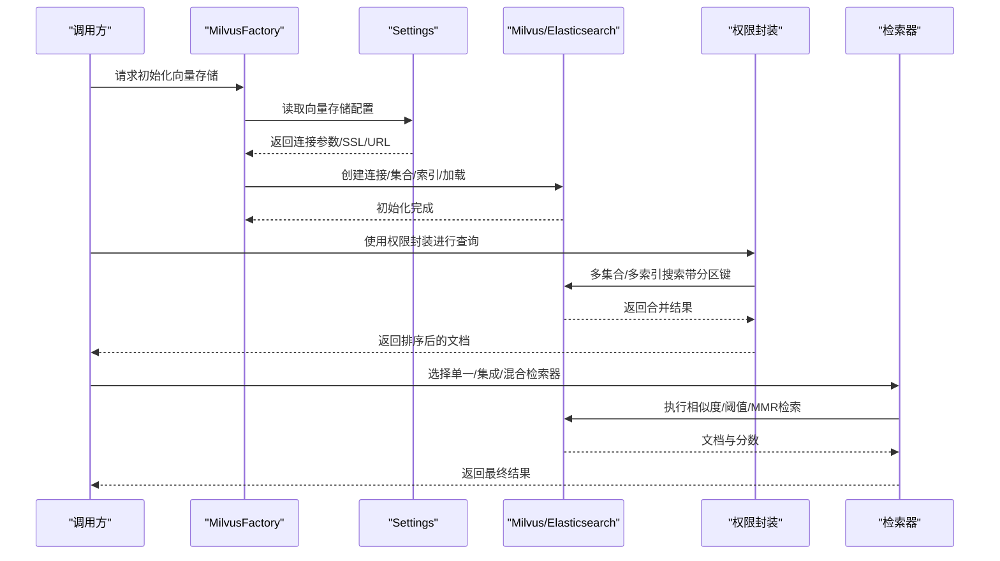
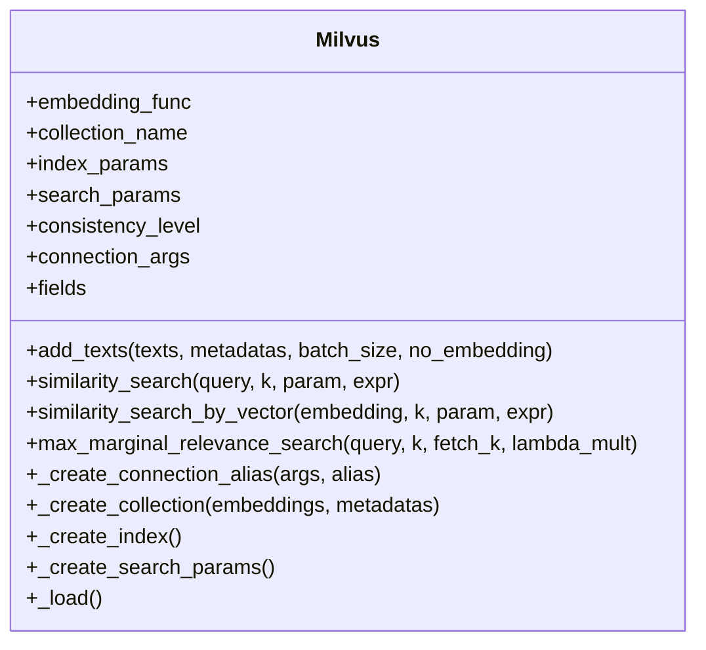
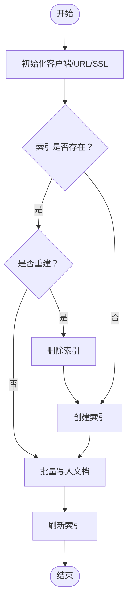
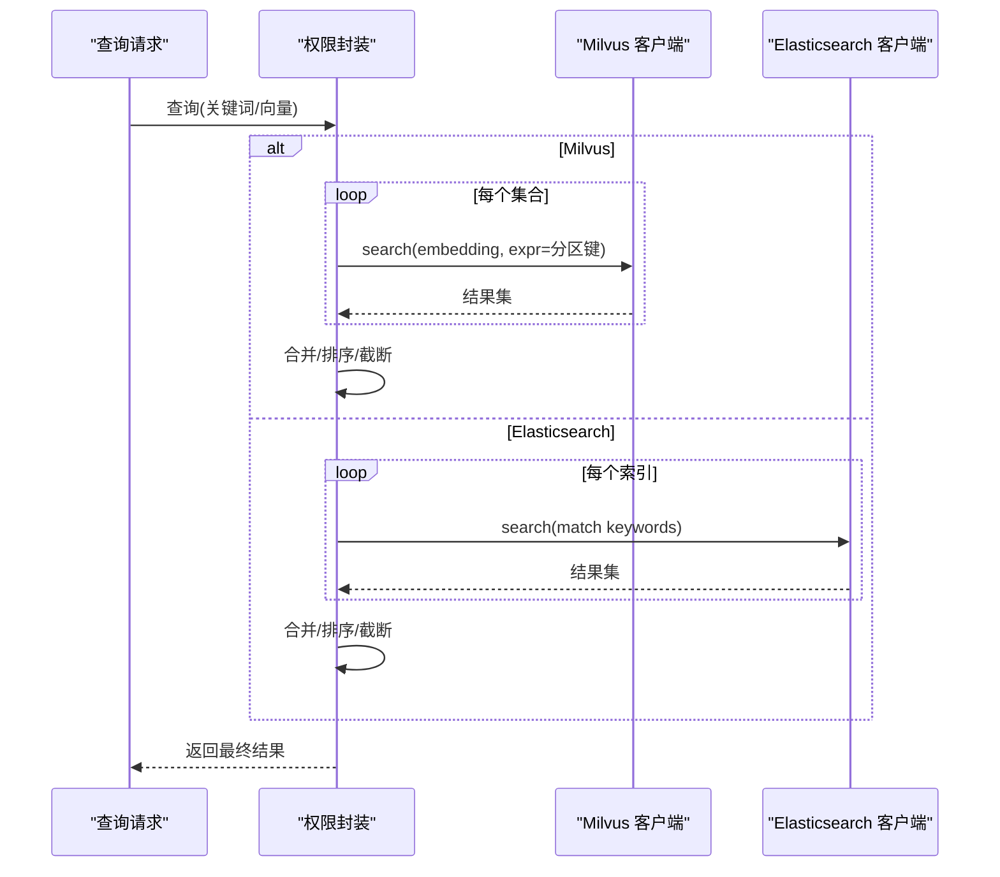
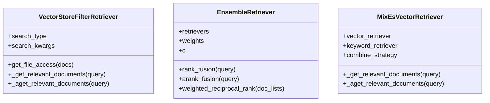
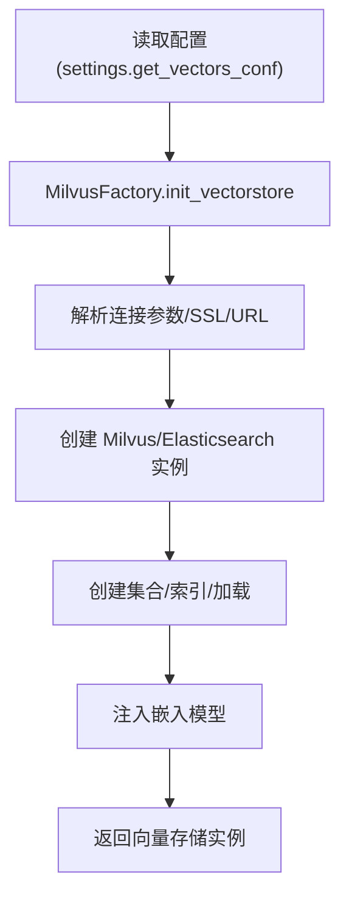
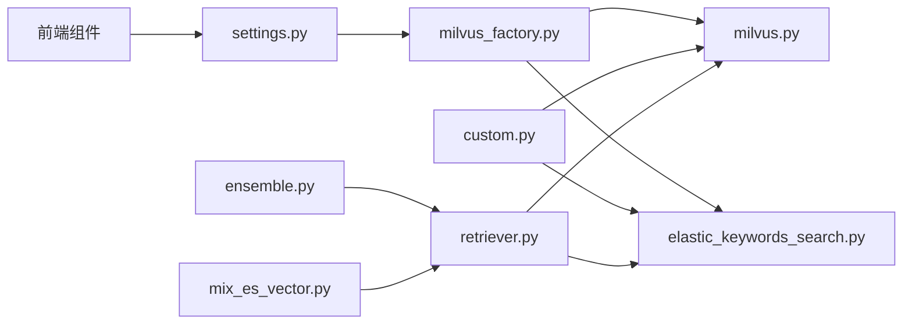

# 向量存储集成

<cite>
**本文引用的文件**
- [milvus.py](file://src/backend/bisheng_langchain/vectorstores/milvus.py)
- [elastic_keywords_search.py](file://src/backend/bisheng_langchain/vectorstores/elastic_keywords_search.py)
- [retriever.py](file://src/backend/bisheng_langchain/vectorstores/retriever.py)
- [ensemble.py](file://src/backend/bisheng_langchain/retrievers/ensemble.py)
- [mix_es_vector.py](file://src/backend/bisheng_langchain/retrievers/mix_es_vector.py)
- [custom.py](file://src/backend/bisheng/interface/vector_store/custom.py)
- [constants.py](file://src/backend/bisheng/interface/vector_store/constants.py)
- [settings.py](file://src/backend/bisheng/core/config/settings.py)
- [milvus_factory.py](file://src/backend/bisheng/knowledge/rag/milvus_factory.py)
- [vectorstore_metadata.py](file://src/backend/bisheng/common/constants/vectorstore_metadata.py)
- [embedding.py](file://src/backend/bisheng/llm/domain/llm/embedding.py)
- [vectorstores.py](file://src/backend/bisheng/template/frontend_node/vectorstores.py)
- [VectorStorePreview.tsx](file://src/frontend/client/src/components/Files/VectorStore/VectorStorePreview.tsx)
- [VectorStoreList.tsx](file://src/frontend/client/src/components/Files/VectorStore/VectorStoreList.tsx)
- [VectorStoreButton.tsx](file://src/frontend/client/src/components/Files/VectorStore/VectorStoreButton.tsx)
</cite>

## 目录
1. [简介](#简介)
2. [项目结构](#项目结构)
3. [核心组件](#核心组件)
4. [架构总览](#架构总览)
5. [详细组件分析](#详细组件分析)
6. [依赖关系分析](#依赖关系分析)
7. [性能考量](#性能考量)
8. [故障排查指南](#故障排查指南)
9. [结论](#结论)
10. [附录](#附录)

## 简介
本技术文档面向 Bisheng 的向量存储集成系统，聚焦于 Milvus 与 Elasticsearch 的统一接入与检索编排，覆盖以下主题：
- 连接配置与认证机制（含 TLS、用户名密码、URI/地址兼容）
- 初始化流程（集合/索引创建、字段推断、分区键、一致性级别）
- 检索器设计（单一、多检索器、混合检索器与权限控制）
- 多向量存储协调（多集合/多索引搜索、权限过滤、结果融合）
- 性能优化策略（批处理写入、默认索引参数、搜索参数、一致性级别）
- 监控与维护（容量与使用度量、扩容建议）

## 项目结构
围绕向量存储的关键目录与文件：
- 向量存储实现层：Milvus 与 Elasticsearch 的封装类
- 检索器层：单一检索器、集成检索器（RRF 融合）、关键词+向量混合检索器
- 权限控制层：基于多集合/多索引的权限检查封装
- 配置层：全局向量存储配置、连接参数解析、SSL/URL 解析
- 前端展示层：向量存储列表、预览与操作按钮

**图表来源**
- [settings.py](file://src/backend/bisheng/core/config/settings.py#L65-L100)
- [milvus_factory.py](file://src/backend/bisheng/knowledge/rag/milvus_factory.py#L13-L25)
- [milvus.py](file://src/backend/bisheng_langchain/vectorstores/milvus.py#L26-L116)
- [elastic_keywords_search.py](file://src/backend/bisheng_langchain/vectorstores/elastic_keywords_search.py#L48-L133)
- [custom.py](file://src/backend/bisheng/interface/vector_store/custom.py#L23-L634)
- [retriever.py](file://src/backend/bisheng_langchain/vectorstores/retriever.py#L18-L95)
- [ensemble.py](file://src/backend/bisheng_langchain/retrievers/ensemble.py#L18-L191)
- [mix_es_vector.py](file://src/backend/bisheng_langchain/retrievers/mix_es_vector.py#L8-L113)
- [VectorStorePreview.tsx](file://src/frontend/client/src/components/Files/VectorStore/VectorStorePreview.tsx#L128-L183)
- [VectorStoreList.tsx](file://src/frontend/client/src/components/Files/VectorStore/VectorStoreList.tsx#L1-L22)
- [VectorStoreButton.tsx](file://src/frontend/client/src/components/Files/VectorStore/VectorStoreButton.tsx#L1-L18)

**章节来源**
- [settings.py](file://src/backend/bisheng/core/config/settings.py#L65-L100)
- [milvus_factory.py](file://src/backend/bisheng/knowledge/rag/milvus_factory.py#L13-L25)
- [milvus.py](file://src/backend/bisheng_langchain/vectorstores/milvus.py#L26-L116)
- [elastic_keywords_search.py](file://src/backend/bisheng_langchain/vectorstores/elastic_keywords_search.py#L48-L133)
- [custom.py](file://src/backend/bisheng/interface/vector_store/custom.py#L23-L634)
- [retriever.py](file://src/backend/bisheng_langchain/vectorstores/retriever.py#L18-L95)
- [ensemble.py](file://src/backend/bisheng_langchain/retrievers/ensemble.py#L18-L191)
- [mix_es_vector.py](file://src/backend/bisheng_langchain/retrievers/mix_es_vector.py#L8-L113)
- [VectorStorePreview.tsx](file://src/frontend/client/src/components/Files/VectorStore/VectorStorePreview.tsx#L128-L183)
- [VectorStoreList.tsx](file://src/frontend/client/src/components/Files/VectorStore/VectorStoreList.tsx#L1-L22)
- [VectorStoreButton.tsx](file://src/frontend/client/src/components/Files/VectorStore/VectorStoreButton.tsx#L1-L18)

## 核心组件
- Milvus 向量存储封装：支持连接复用、集合/索引自动创建、字段推断、批量插入、一致性级别、分区键、搜索参数生成与加载。
- Elasticsearch 关键词向量封装：支持文本索引创建、关键词抽取（jieba 或 LLM）、版本兼容搜索接口、删除与刷新。
- 权限控制封装：多集合/多索引只读搜索，按知识域分区键过滤，统一评分与排序。
- 检索器：单一检索器（相似度、阈值、MMR），集成检索器（加权 Reciprocal Rank Fusion），混合检索器（关键词优先/向量优先/交错融合）。
- 配置中心：向量存储配置、连接参数解析、SSL/URL 解析、加密字段解密。

**章节来源**
- [milvus.py](file://src/backend/bisheng_langchain/vectorstores/milvus.py#L26-L116)
- [elastic_keywords_search.py](file://src/backend/bisheng_langchain/vectorstores/elastic_keywords_search.py#L48-L133)
- [custom.py](file://src/backend/bisheng/interface/vector_store/custom.py#L23-L634)
- [retriever.py](file://src/backend/bisheng_langchain/vectorstores/retriever.py#L18-L95)
- [ensemble.py](file://src/backend/bisheng_langchain/retrievers/ensemble.py#L18-L191)
- [mix_es_vector.py](file://src/backend/bisheng_langchain/retrievers/mix_es_vector.py#L8-L113)
- [settings.py](file://src/backend/bisheng/core/config/settings.py#L65-L100)

## 架构总览
系统通过工厂与配置层统一初始化 Milvus/Elasticsearch，结合权限封装与检索器层实现多维度检索与融合。

**图表来源**
- [milvus_factory.py](file://src/backend/bisheng/knowledge/rag/milvus_factory.py#L13-L25)
- [settings.py](file://src/backend/bisheng/core/config/settings.py#L65-L100)
- [milvus.py](file://src/backend/bisheng_langchain/vectorstores/milvus.py#L287-L296)
- [custom.py](file://src/backend/bisheng/interface/vector_store/custom.py#L23-L634)
- [retriever.py](file://src/backend/bisheng_langchain/vectorstores/retriever.py#L18-L95)
- [ensemble.py](file://src/backend/bisheng_langchain/retrievers/ensemble.py#L18-L191)
- [mix_es_vector.py](file://src/backend/bisheng_langchain/retrievers/mix_es_vector.py#L8-L113)

## 详细组件分析

### Milvus 向量存储封装
- 连接与别名管理：支持 host/port、uri、address 三种地址格式，自动复用已存在连接，避免重复建立。
- 集合/索引/加载：首次写入时根据元数据推断字段类型，创建集合；自动生成默认索引参数（HNSW/AUTOINDEX），并加载集合。
- 写入策略：批量插入（默认 1000），支持 no_embedding 模式；异常重连与批内错误处理。
- 查询能力：支持相似度、向量检索、MMR、阈值过滤；支持分区键与元数据表达式组合过滤。
- 一致性与字段：可配置一致性级别；主键自增、文本/向量字段命名约定；分区键字段用于多租户隔离。

**图表来源**
- [milvus.py](file://src/backend/bisheng_langchain/vectorstores/milvus.py#L26-L116)
- [milvus.py](file://src/backend/bisheng_langchain/vectorstores/milvus.py#L448-L544)
- [milvus.py](file://src/backend/bisheng_langchain/vectorstores/milvus.py#L546-L740)
- [milvus.py](file://src/backend/bisheng_langchain/vectorstores/milvus.py#L742-L800)

**章节来源**
- [milvus.py](file://src/backend/bisheng_langchain/vectorstores/milvus.py#L26-L116)
- [milvus.py](file://src/backend/bisheng_langchain/vectorstores/milvus.py#L287-L296)
- [milvus.py](file://src/backend/bisheng_langchain/vectorstores/milvus.py#L448-L544)
- [milvus.py](file://src/backend/bisheng_langchain/vectorstores/milvus.py#L546-L740)
- [milvus.py](file://src/backend/bisheng_langchain/vectorstores/milvus.py#L742-L800)

### Elasticsearch 关键词向量封装
- 索引创建：根据 ES 版本（7.x/8.x）选择 mappings/映射体差异；支持 drop_old 删除重建。
- 关键词抽取：优先使用 LLM 提取关键词，失败回退到 jieba；支持 match/match_phrase 查询策略。
- 搜索接口：兼容不同版本的 search 接口；支持 post_filter；返回文档与分数。
- 写入与删除：批量写入与删除，支持刷新索引。

**图表来源**
- [elastic_keywords_search.py](file://src/backend/bisheng_langchain/vectorstores/elastic_keywords_search.py#L106-L147)
- [elastic_keywords_search.py](file://src/backend/bisheng_langchain/vectorstores/elastic_keywords_search.py#L140-L194)
- [elastic_keywords_search.py](file://src/backend/bisheng_langchain/vectorstores/elastic_keywords_search.py#L316-L344)

**章节来源**
- [elastic_keywords_search.py](file://src/backend/bisheng_langchain/vectorstores/elastic_keywords_search.py#L48-L133)
- [elastic_keywords_search.py](file://src/backend/bisheng_langchain/vectorstores/elastic_keywords_search.py#L140-L194)
- [elastic_keywords_search.py](file://src/backend/bisheng_langchain/vectorstores/elastic_keywords_search.py#L222-L259)
- [elastic_keywords_search.py](file://src/backend/bisheng_langchain/vectorstores/elastic_keywords_search.py#L316-L344)

### 权限控制封装（多集合/多索引）
- Milvus 多集合搜索：支持多个集合与对应分区键，逐集合搜索后合并排序，按知识域权限隔离。
- Elasticsearch 多索引搜索：对多个索引执行关键词匹配，合并后排序，同样支持权限过滤。

**图表来源**
- [custom.py](file://src/backend/bisheng/interface/vector_store/custom.py#L23-L634)
- [custom.py](file://src/backend/bisheng/interface/vector_store/custom.py#L258-L450)
- [custom.py](file://src/backend/bisheng/interface/vector_store/custom.py#L492-L560)

**章节来源**
- [custom.py](file://src/backend/bisheng/interface/vector_store/custom.py#L23-L634)

### 检索器设计
- 单一检索器：支持相似度、相似度阈值、MMR 三种搜索类型，可扩展为向量/关键词/混合。
- 集成检索器：加权 Reciprocal Rank Fusion（RRF），对多个检索器结果进行融合排序。
- 混合检索器：关键词优先、向量优先、交错融合三种策略，兼顾语义与关键词命中。

**图表来源**
- [retriever.py](file://src/backend/bisheng_langchain/vectorstores/retriever.py#L18-L95)
- [ensemble.py](file://src/backend/bisheng_langchain/retrievers/ensemble.py#L18-L191)
- [mix_es_vector.py](file://src/backend/bisheng_langchain/retrievers/mix_es_vector.py#L8-L113)

**章节来源**
- [retriever.py](file://src/backend/bisheng_langchain/vectorstores/retriever.py#L18-L95)
- [ensemble.py](file://src/backend/bisheng_langchain/retrievers/ensemble.py#L18-L191)
- [mix_es_vector.py](file://src/backend/bisheng_langchain/retrievers/mix_es_vector.py#L8-L113)

### 配置与初始化
- 全局配置：VectorStores 包含 MilvusConf 与 ElasticsearchConf，支持连接参数 JSON 字符串解析、SSL/URL 解析、加密字段解密。
- 工厂初始化：MilvusFactory 从配置读取连接参数，构造 URI（host:port → http://host:port），并传入元数据字段 Schema。
- 嵌入模型：通过 LLMService 获取知识库对应的嵌入模型，用于向量检索与写入。

**图表来源**
- [settings.py](file://src/backend/bisheng/core/config/settings.py#L65-L100)
- [settings.py](file://src/backend/bisheng/core/config/settings.py#L305-L345)
- [milvus_factory.py](file://src/backend/bisheng/knowledge/rag/milvus_factory.py#L13-L25)
- [embedding.py](file://src/backend/bisheng/llm/domain/llm/embedding.py#L69-L159)

**章节来源**
- [settings.py](file://src/backend/bisheng/core/config/settings.py#L65-L100)
- [settings.py](file://src/backend/bisheng/core/config/settings.py#L305-L345)
- [milvus_factory.py](file://src/backend/bisheng/knowledge/rag/milvus_factory.py#L13-L25)
- [embedding.py](file://src/backend/bisheng/llm/domain/llm/embedding.py#L69-L159)

### 前端展示与交互
- 列表与预览：展示向量存储大小、文件计数、过期策略等信息，支持删除与新增。
- 操作入口：提供“添加存储”按钮，配合后端配置与初始化流程。

**章节来源**
- [VectorStorePreview.tsx](file://src/frontend/client/src/components/Files/VectorStore/VectorStorePreview.tsx#L128-L183)
- [VectorStoreList.tsx](file://src/frontend/client/src/components/Files/VectorStore/VectorStoreList.tsx#L1-L22)
- [VectorStoreButton.tsx](file://src/frontend/client/src/components/Files/VectorStore/VectorStoreButton.tsx#L1-L18)

## 依赖关系分析
- 组件耦合：Milvus/Elasticsearch 封装依赖 LangChain 向量存储基类；权限封装继承 LangChain 原生 Milvus 类以扩展多集合搜索。
- 检索器层：单一检索器依赖具体向量存储；集成/混合检索器依赖多个单一检索器。
- 配置层：工厂与初始化流程依赖 Settings；前端组件依赖配置项。

**图表来源**
- [settings.py](file://src/backend/bisheng/core/config/settings.py#L65-L100)
- [milvus_factory.py](file://src/backend/bisheng/knowledge/rag/milvus_factory.py#L13-L25)
- [milvus.py](file://src/backend/bisheng_langchain/vectorstores/milvus.py#L26-L116)
- [elastic_keywords_search.py](file://src/backend/bisheng_langchain/vectorstores/elastic_keywords_search.py#L48-L133)
- [custom.py](file://src/backend/bisheng/interface/vector_store/custom.py#L23-L634)
- [retriever.py](file://src/backend/bisheng_langchain/vectorstores/retriever.py#L18-L95)
- [ensemble.py](file://src/backend/bisheng_langchain/retrievers/ensemble.py#L18-L191)
- [mix_es_vector.py](file://src/backend/bisheng_langchain/retrievers/mix_es_vector.py#L8-L113)

**章节来源**
- [settings.py](file://src/backend/bisheng/core/config/settings.py#L65-L100)
- [milvus_factory.py](file://src/backend/bisheng/knowledge/rag/milvus_factory.py#L13-L25)
- [milvus.py](file://src/backend/bisheng_langchain/vectorstores/milvus.py#L26-L116)
- [elastic_keywords_search.py](file://src/backend/bisheng_langchain/vectorstores/elastic_keywords_search.py#L48-L133)
- [custom.py](file://src/backend/bisheng/interface/vector_store/custom.py#L23-L634)
- [retriever.py](file://src/backend/bisheng_langchain/vectorstores/retriever.py#L18-L95)
- [ensemble.py](file://src/backend/bisheng_langchain/retrievers/ensemble.py#L18-L191)
- [mix_es_vector.py](file://src/backend/bisheng_langchain/retrievers/mix_es_vector.py#L8-L113)

## 性能考量
- 批处理写入：Milvus 默认批大小 1000，减少网络往返与事务开销；ES 批量写入与刷新策略可按场景调整。
- 索引与搜索参数：默认 HNSW/AUTOINDEX，按索引类型生成搜索参数；可根据数据规模与延迟目标调整 ef/nprobe 等参数。
- 连接复用：Milvus 支持基于地址与用户复用连接，降低握手成本。
- 一致性级别：可按读写一致性需求选择 Session/Strong/Bounded/Eventually。
- 权限过滤：多集合/多索引搜索会增加查询次数，建议在权限粒度允许下合并集合或索引，减少跨集合/跨索引查询。
- 分区键：利用分区键过滤可显著缩小搜索空间，提升检索效率。

[本节为通用指导，无需特定文件分析]

## 故障排查指南
- 连接失败/超时：检查 host/port/uri 地址格式与可达性；确认 TLS 配置（单向/双向）与证书路径；查看连接复用逻辑是否命中已有连接。
- 写入异常：关注批内异常与重连逻辑；确认集合/索引已创建且字段类型一致；检查元数据字段是否缺失或类型不匹配。
- 查询无结果：确认分区键与元数据表达式是否正确拼接；检查搜索参数与索引类型是否匹配；验证一致性级别是否满足读取需求。
- 权限问题：多集合/多索引搜索需确保用户具备相应访问权限；核对 partition_key 与 metadata_expr 是否正确。
- 前端显示异常：确认配置项（URL/SSL/加密字段）解析正常；检查前端组件渲染逻辑与数据结构。

**章节来源**
- [milvus.py](file://src/backend/bisheng_langchain/vectorstores/milvus.py#L234-L286)
- [milvus.py](file://src/backend/bisheng_langchain/vectorstores/milvus.py#L531-L544)
- [elastic_keywords_search.py](file://src/backend/bisheng_langchain/vectorstores/elastic_keywords_search.py#L364-L391)
- [custom.py](file://src/backend/bisheng/interface/vector_store/custom.py#L461-L634)
- [settings.py](file://src/backend/bisheng/core/config/settings.py#L305-L345)

## 结论
Bisheng 的向量存储集成通过统一配置与工厂初始化，结合 Milvus 与 Elasticsearch 的封装，实现了：
- 可靠的连接与初始化流程（集合/索引创建、字段推断、分区键、一致性级别）
- 灵活的检索器体系（单一、集成、混合）
- 多向量存储的权限控制与结果融合
- 前后端协同的可视化与运维入口

在生产环境中，建议结合业务数据规模与查询特征，优化索引参数、批处理大小与一致性级别，并通过权限封装与分区键实现安全可控的多租户检索。

[本节为总结性内容，无需特定文件分析]

## 附录
- 元数据字段 Schema：定义了知识库向量存储的标准元数据字段，便于检索与权限控制。
- 前端节点注册：向量化存储节点在前端节点模板中注册，供工作流/节点图使用。

**章节来源**
- [vectorstore_metadata.py](file://src/backend/bisheng/common/constants/vectorstore_metadata.py#L3-L17)
- [vectorstores.py](file://src/backend/bisheng/template/frontend_node/vectorstores.py)