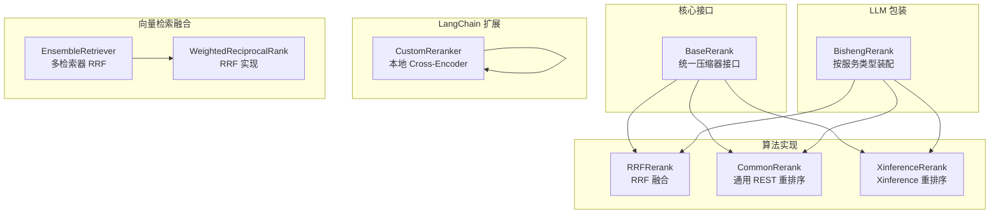
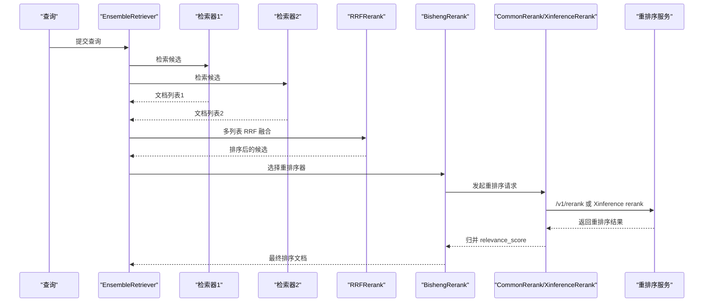
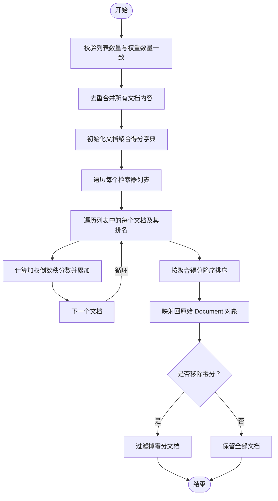
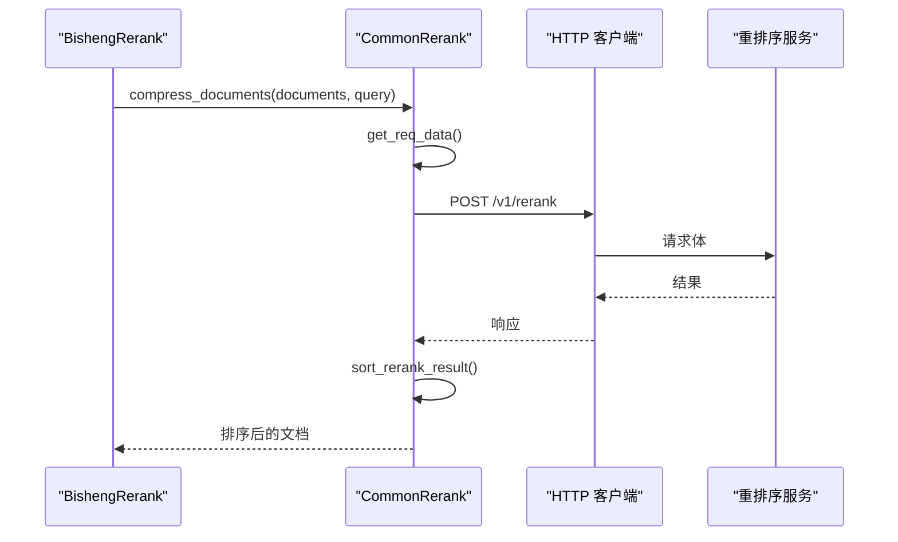
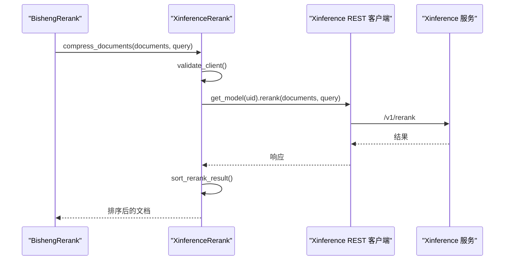
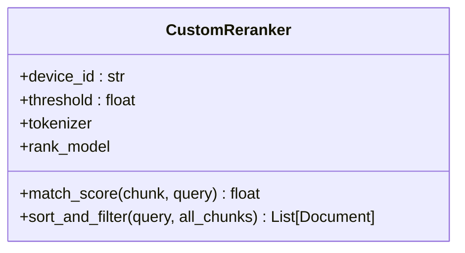
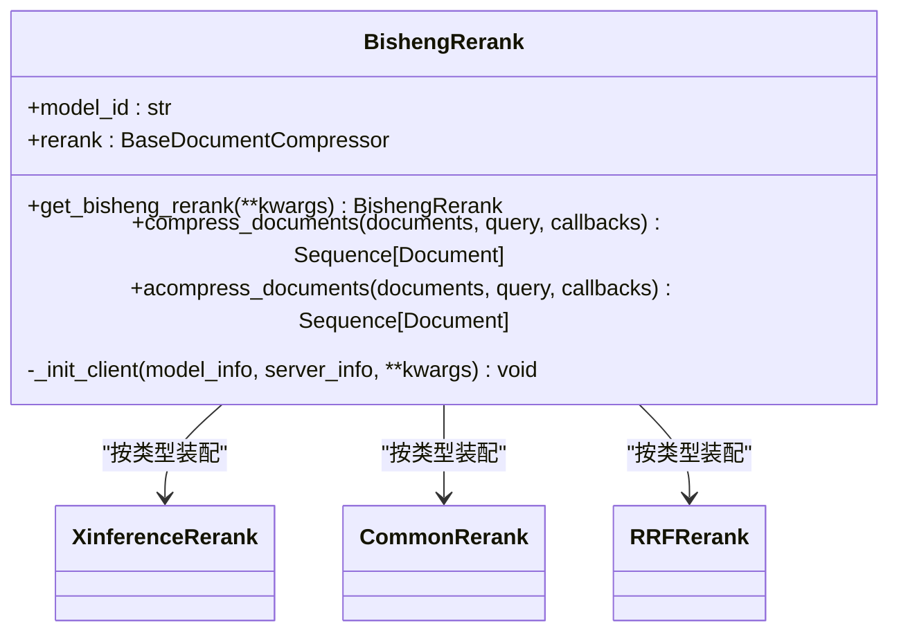
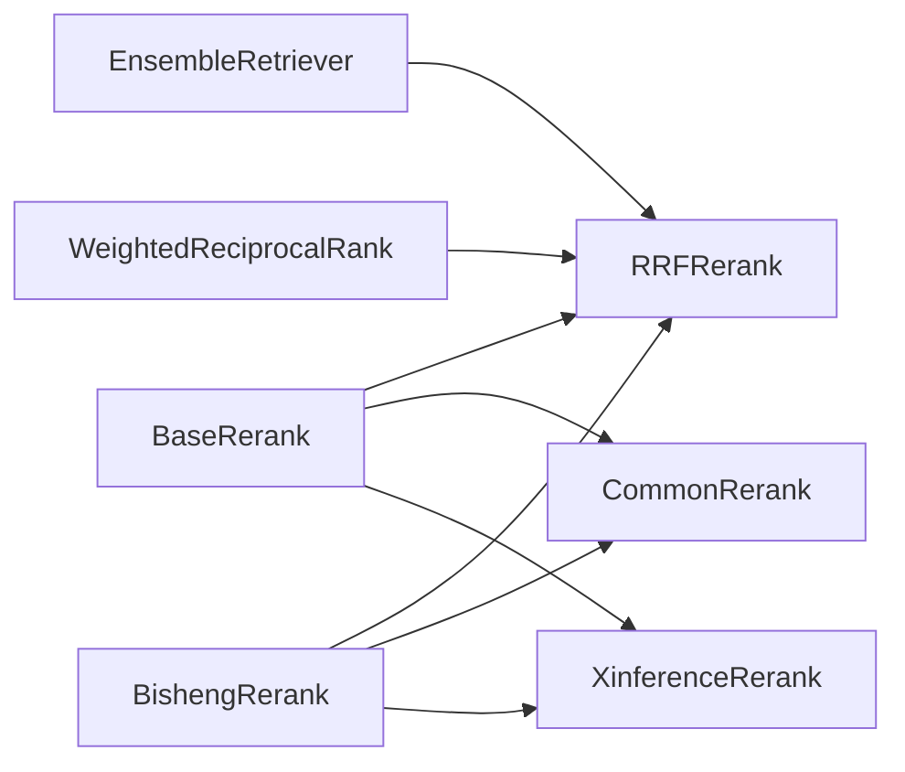

# 重排序系统

<cite>
**本文引用的文件**
- [src/backend/bisheng/core/ai/base.py](file://src/backend/bisheng/core/ai/base.py)
- [src/backend/bisheng/core/ai/rerank/rrf_rerank.py](file://src/backend/bisheng/core/ai/rerank/rrf_rerank.py)
- [src/backend/bisheng/core/ai/rerank/common_rerank.py](file://src/backend/bisheng/core/ai/rerank/common_rerank.py)
- [src/backend/bisheng/core/ai/rerank/xinference_rerank.py](file://src/backend/bisheng/core/ai/rerank/xinference_rerank.py)
- [src/backend/bisheng/core/ai/rerank/xinference/client/restful/restful_client.py](file://src/backend/bisheng/core/ai/rerank/xinference/client/restful/restful_client.py)
- [src/backend/bisheng/llm/domain/llm/rerank.py](file://src/backend/bisheng/llm/domain/llm/rerank.py)
- [src/backend/bisheng_langchain/rag/rerank/rerank.py](file://src/backend/bisheng_langchain/rag/rerank/rerank.py)
- [src/backend/bisheng/core/vectorstore/ensemble_retriever.py](file://src/backend/bisheng/core/vectorstore/ensemble_retriever.py)
- [src/backend/bisheng_langchain/retrievers/ensemble.py](file://src/backend/bisheng_langchain/retrievers/ensemble.py)
- [src/backend/bisheng/api/services/evaluation.py](file://src/backend/bisheng/api/services/evaluation.py)
- [src/backend/bisheng_langchain/rag/scoring/ragas_score.py](file://src/backend/bisheng_langchain/rag/scoring/ragas_score.py)
- [docker/bisheng/config/config.yaml](file://docker/bisheng/config/config.yaml)
</cite>

## 目录
1. [简介](#简介)
2. [项目结构](#项目结构)
3. [核心组件](#核心组件)
4. [架构总览](#架构总览)
5. [详细组件分析](#详细组件分析)
6. [依赖关系分析](#依赖关系分析)
7. [性能考量](#性能考量)
8. [故障排查指南](#故障排查指南)
9. [结论](#结论)
10. [附录](#附录)

## 简介
本技术文档面向 Bisheng 的重排序（Rerank）系统，系统性阐述重排序机制的核心原理与实现，重点覆盖以下方面：
- 交叉编码器（Cross-Encoder）的工作原理与应用场景
- 多种重排序算法实现：Xinference 重排序、通用重排序、RRF（Reciprocal Rank Fusion）重排序
- 性能优化策略：批量处理、缓存机制、计算资源管理
- 结果评估与验证：准确性指标、性能基准、质量控制
- 配置指南与最佳实践：模型选择、参数调优、部署优化

## 项目结构
围绕重排序功能，后端在“核心 AI 组件”“LLM 包装层”“LangChain 扩展”“向量检索融合”等模块协同完成：
- 核心接口与基类：定义统一的文档压缩器接口与排序归并能力
- 算法实现：RRF 融合、通用 REST 接口重排序、Xinference 重排序
- LLM 包装：按服务类型自动装配对应重排序客户端
- LangChain 扩展：本地交叉编码器重排序
- 向量检索融合：多检索器结果的 RRF 融合与去重
- 评估体系：指标评分与报告生成

图表来源
- [src/backend/bisheng/core/ai/base.py](file://src/backend/bisheng/core/ai/base.py#L116-L150)
- [src/backend/bisheng/core/ai/rerank/rrf_rerank.py](file://src/backend/bisheng/core/ai/rerank/rrf_rerank.py#L10-L84)
- [src/backend/bisheng/core/ai/rerank/common_rerank.py](file://src/backend/bisheng/core/ai/rerank/common_rerank.py#L12-L112)
- [src/backend/bisheng/core/ai/rerank/xinference_rerank.py](file://src/backend/bisheng/core/ai/rerank/xinference_rerank.py#L12-L45)
- [src/backend/bisheng/llm/domain/llm/rerank.py](file://src/backend/bisheng/llm/domain/llm/rerank.py#L50-L117)
- [src/backend/bisheng_langchain/rag/rerank/rerank.py](file://src/backend/bisheng_langchain/rag/rerank/rerank.py#L5-L48)
- [src/backend/bisheng/core/vectorstore/ensemble_retriever.py](file://src/backend/bisheng/core/vectorstore/ensemble_retriever.py#L32-L62)
- [src/backend/bisheng_langchain/retrievers/ensemble.py](file://src/backend/bisheng_langchain/retrievers/ensemble.py#L147-L181)

章节来源
- [src/backend/bisheng/core/ai/base.py](file://src/backend/bisheng/core/ai/base.py#L116-L150)
- [src/backend/bisheng/core/vectorstore/ensemble_retriever.py](file://src/backend/bisheng/core/vectorstore/ensemble_retriever.py#L32-L62)

## 核心组件
- 统一接口 BaseRerank：定义 compress_documents 与异步 acompress_documents，以及 sort_rerank_result 的结果归并工具
- RRF 重排序 RRFRerank：对多检索器返回的候选列表进行加权倒数秩融合，支持移除零分文档
- 通用重排序 CommonRerank：通过 /v1/rerank 接口调用外部重排序服务，支持同步与异步
- Xinference 重排序 XinferenceRerank：通过 Xinference RESTful 客户端调用 rerank 接口
- LLM 包装 BishengRerank：根据服务类型自动选择对应重排序客户端，并注入参数
- LangChain 本地交叉编码器 CustomReranker：使用 Transformers 加载本地 Cross-Encoder 模型进行排序
- 向量检索融合 EnsembleRetriever 与 WeightedReciprocalRank：对多检索器结果做 RRF 聚合与去重

章节来源
- [src/backend/bisheng/core/ai/base.py](file://src/backend/bisheng/core/ai/base.py#L116-L150)
- [src/backend/bisheng/core/ai/rerank/rrf_rerank.py](file://src/backend/bisheng/core/ai/rerank/rrf_rerank.py#L10-L84)
- [src/backend/bisheng/core/ai/rerank/common_rerank.py](file://src/backend/bisheng/core/ai/rerank/common_rerank.py#L12-L112)
- [src/backend/bisheng/core/ai/rerank/xinference_rerank.py](file://src/backend/bisheng/core/ai/rerank/xinference_rerank.py#L12-L45)
- [src/backend/bisheng/llm/domain/llm/rerank.py](file://src/backend/bisheng/llm/domain/llm/rerank.py#L50-L117)
- [src/backend/bisheng_langchain/rag/rerank/rerank.py](file://src/backend/bisheng_langchain/rag/rerank/rerank.py#L5-L48)
- [src/backend/bisheng/core/vectorstore/ensemble_retriever.py](file://src/backend/bisheng/core/vectorstore/ensemble_retriever.py#L32-L62)
- [src/backend/bisheng_langchain/retrievers/ensemble.py](file://src/backend/bisheng_langchain/retrievers/ensemble.py#L147-L181)

## 架构总览
下图展示从检索到重排序的整体流程，以及各组件间的交互关系。

图表来源
- [src/backend/bisheng/core/vectorstore/ensemble_retriever.py](file://src/backend/bisheng/core/vectorstore/ensemble_retriever.py#L32-L62)
- [src/backend/bisheng/core/ai/rerank/rrf_rerank.py](file://src/backend/bisheng/core/ai/rerank/rrf_rerank.py#L39-L84)
- [src/backend/bisheng/llm/domain/llm/rerank.py](file://src/backend/bisheng/llm/domain/llm/rerank.py#L50-L117)
- [src/backend/bisheng/core/ai/rerank/common_rerank.py](file://src/backend/bisheng/core/ai/rerank/common_rerank.py#L62-L112)
- [src/backend/bisheng/core/ai/rerank/xinference_rerank.py](file://src/backend/bisheng/core/ai/rerank/xinference_rerank.py#L29-L45)

## 详细组件分析

### RRF（Reciprocal Rank Fusion）重排序
- 设计要点
  - 输入为多个检索器返回的候选列表，每个列表内部有序
  - 使用加权倒数秩公式对每个文档聚合得分，权重来自各检索器的重要性
  - 可选移除零分文档，避免无效结果影响最终排序
- 关键流程
  - 校验输入列表数量与权重数量一致
  - 去重合并所有文档内容
  - 遍历每个列表，按排名位置计算加权分数并累加
  - 按聚合分数降序排序，映射回原始 Document 对象
- 参数与行为
  - 权重 weights：默认均分，也可按检索器重要性自定义
  - 常数 c：平衡高排名与低排名的影响
  - remove_zero_score：是否剔除聚合得分为 0 的文档

图表来源
- [src/backend/bisheng/core/ai/rerank/rrf_rerank.py](file://src/backend/bisheng/core/ai/rerank/rrf_rerank.py#L39-L84)
- [src/backend/bisheng/core/vectorstore/ensemble_retriever.py](file://src/backend/bisheng/core/vectorstore/ensemble_retriever.py#L32-L62)
- [src/backend/bisheng_langchain/retrievers/ensemble.py](file://src/backend/bisheng_langchain/retrievers/ensemble.py#L152-L181)

章节来源
- [src/backend/bisheng/core/ai/rerank/rrf_rerank.py](file://src/backend/bisheng/core/ai/rerank/rrf_rerank.py#L10-L84)
- [src/backend/bisheng/core/vectorstore/ensemble_retriever.py](file://src/backend/bisheng/core/vectorstore/ensemble_retriever.py#L32-L62)
- [src/backend/bisheng_langchain/retrievers/ensemble.py](file://src/backend/bisheng_langchain/retrievers/ensemble.py#L147-L181)

### 通用重排序（CommonRerank）
- 适用场景
  - 与 vLLM、Open-source Inference 等兼容 /v1/rerank 接口的服务
- 核心能力
  - 构造请求体：包含 query、documents、model 等字段
  - 同步与异步请求：支持同步与异步客户端
  - 结果解析与排序：调用统一的 sort_rerank_result 将 relevance_score 写入元数据
- 错误处理
  - 请求失败抛出异常，包含状态码与响应文本

图表来源
- [src/backend/bisheng/core/ai/rerank/common_rerank.py](file://src/backend/bisheng/core/ai/rerank/common_rerank.py#L46-L112)
- [src/backend/bisheng/llm/domain/llm/rerank.py](file://src/backend/bisheng/llm/domain/llm/rerank.py#L50-L117)

章节来源
- [src/backend/bisheng/core/ai/rerank/common_rerank.py](file://src/backend/bisheng/core/ai/rerank/common_rerank.py#L12-L112)
- [src/backend/bisheng/llm/domain/llm/rerank.py](file://src/backend/bisheng/llm/domain/llm/rerank.py#L50-L117)

### Xinference 重排序（XinferenceRerank）
- 适用场景
  - Xinference 自建推理平台提供的重排序模型
- 核心能力
  - 自动规范化 base_url，去除末尾 /v1
  - 通过 RESTful 客户端调用 /v1/rerank 接口
  - 解析结果并写入 relevance_score
- 错误处理
  - 请求失败抛出异常，包含错误详情

图表来源
- [src/backend/bisheng/core/ai/rerank/xinference_rerank.py](file://src/backend/bisheng/core/ai/rerank/xinference_rerank.py#L12-L45)
- [src/backend/bisheng/core/ai/rerank/xinference/client/restful/restful_client.py](file://src/backend/bisheng/core/ai/rerank/xinference/client/restful/restful_client.py#L147-L203)
- [src/backend/bisheng/llm/domain/llm/rerank.py](file://src/backend/bisheng/llm/domain/llm/rerank.py#L50-L117)

章节来源
- [src/backend/bisheng/core/ai/rerank/xinference_rerank.py](file://src/backend/bisheng/core/ai/rerank/xinference_rerank.py#L12-L45)
- [src/backend/bisheng/core/ai/rerank/xinference/client/restful/restful_client.py](file://src/backend/bisheng/core/ai/rerank/xinference/client/restful/restful_client.py#L147-L203)
- [src/backend/bisheng/llm/domain/llm/rerank.py](file://src/backend/bisheng/llm/domain/llm/rerank.py#L50-L117)

### LangChain 本地交叉编码器（CustomReranker）
- 适用场景
  - 本地部署的 Cross-Encoder 模型，无需外部服务
- 核心能力
  - 使用 Transformers 加载模型与分词器
  - 对每条 chunk 与 query 计算匹配分数，使用 sigmoid 归一化
  - 支持阈值过滤与兜底保留最高分
- 注意事项
  - 需要 GPU/CPU 资源，建议合理设置设备与批大小

图表来源
- [src/backend/bisheng_langchain/rag/rerank/rerank.py](file://src/backend/bisheng_langchain/rag/rerank/rerank.py#L5-L48)

章节来源
- [src/backend/bisheng_langchain/rag/rerank/rerank.py](file://src/backend/bisheng_langchain/rag/rerank/rerank.py#L5-L48)

### LLM 包装与服务类型适配（BishengRerank）
- 适配服务类型
  - Xinference、LlamaCPP、vLLM、Qwen、QianFan、Silicon 等
- 参数映射
  - 不同服务类型将配置映射到对应重排序客户端的参数
- 生命周期
  - 初始化时校验模型与服务可用性，构造具体重排序器实例
  - 提供同步与异步 compress_documents 方法

图表来源
- [src/backend/bisheng/llm/domain/llm/rerank.py](file://src/backend/bisheng/llm/domain/llm/rerank.py#L50-L117)
- [src/backend/bisheng/core/ai/base.py](file://src/backend/bisheng/core/ai/base.py#L116-L150)

章节来源
- [src/backend/bisheng/llm/domain/llm/rerank.py](file://src/backend/bisheng/llm/domain/llm/rerank.py#L50-L117)

## 依赖关系分析
- 组件耦合
  - BaseRerank 作为抽象基类，被 RRFRerank、CommonRerank、XinferenceRerank 实现
  - BishengRerank 通过工厂式参数映射选择具体实现
  - EnsembleRetriever 与 WeightedReciprocalRank 依赖 RRFRerank 进行融合
- 外部依赖
  - HTTP 客户端用于通用重排序
  - Xinference RESTful 客户端用于 Xinference 重排序
  - Transformers 用于本地 Cross-Encoder

图表来源
- [src/backend/bisheng/core/ai/base.py](file://src/backend/bisheng/core/ai/base.py#L116-L150)
- [src/backend/bisheng/core/ai/rerank/rrf_rerank.py](file://src/backend/bisheng/core/ai/rerank/rrf_rerank.py#L10-L84)
- [src/backend/bisheng/core/ai/rerank/common_rerank.py](file://src/backend/bisheng/core/ai/rerank/common_rerank.py#L12-L112)
- [src/backend/bisheng/core/ai/rerank/xinference_rerank.py](file://src/backend/bisheng/core/ai/rerank/xinference_rerank.py#L12-L45)
- [src/backend/bisheng/llm/domain/llm/rerank.py](file://src/backend/bisheng/llm/domain/llm/rerank.py#L50-L117)
- [src/backend/bisheng/core/vectorstore/ensemble_retriever.py](file://src/backend/bisheng/core/vectorstore/ensemble_retriever.py#L32-L62)
- [src/backend/bisheng_langchain/retrievers/ensemble.py](file://src/backend/bisheng_langchain/retrievers/ensemble.py#L147-L181)

章节来源
- [src/backend/bisheng/core/ai/base.py](file://src/backend/bisheng/core/ai/base.py#L116-L150)
- [src/backend/bisheng/llm/domain/llm/rerank.py](file://src/backend/bisheng/llm/domain/llm/rerank.py#L50-L117)
- [src/backend/bisheng/core/vectorstore/ensemble_retriever.py](file://src/backend/bisheng/core/vectorstore/ensemble_retriever.py#L32-L62)

## 性能考量
- 批量处理
  - 通用与 Xinference 重排序均支持一次请求处理多文档，减少网络往返
  - 建议在上游检索阶段控制 top_k，避免过大的候选集导致重排序耗时增加
- 缓存机制
  - Redis 作为缓存与队列后端，可用于缓存检索中间结果与会话状态
  - 配置示例见容器编排配置文件
- 计算资源管理
  - 本地 Cross-Encoder 需要 GPU/CPU 资源，建议限制并发与批大小
  - 外部服务重排序需考虑网络延迟与限流策略
- RRF 调参
  - c 值影响高排名与低排名的平衡，建议结合业务召回质量进行调优
  - 权重分配反映各检索器的相对重要性

章节来源
- [docker/bisheng/config/config.yaml](file://docker/bisheng/config/config.yaml#L6-L25)
- [src/backend/bisheng/core/ai/rerank/common_rerank.py](file://src/backend/bisheng/core/ai/rerank/common_rerank.py#L62-L112)
- [src/backend/bisheng/core/ai/rerank/xinference_rerank.py](file://src/backend/bisheng/core/ai/rerank/xinference_rerank.py#L29-L45)
- [src/backend/bisheng/core/ai/rerank/rrf_rerank.py](file://src/backend/bisheng/core/ai/rerank/rrf_rerank.py#L26-L29)

## 故障排查指南
- 通用重排序
  - 现象：HTTP 状态码非 200
  - 排查：检查 base_url、api_key、model 名称与服务端可达性
  - 参考：请求与响应处理逻辑
- Xinference 重排序
  - 现象：Xinference 接口调用失败
  - 排查：确认 model_uid 存在、base_url 规范化、认证头正确
  - 参考：RESTful 客户端 rerank 方法
- RRF 融合
  - 现象：结果为空或顺序异常
  - 排查：确认输入列表数量与权重一致、c 值合理、是否启用移除零分
- 评估与质量控制
  - 使用评估服务与 Ragas 指标生成评分报告，定位排序质量问题

章节来源
- [src/backend/bisheng/core/ai/rerank/common_rerank.py](file://src/backend/bisheng/core/ai/rerank/common_rerank.py#L82-L86)
- [src/backend/bisheng/core/ai/rerank/xinference/client/restful/restful_client.py](file://src/backend/bisheng/core/ai/rerank/xinference/client/restful/restful_client.py#L196-L203)
- [src/backend/bisheng/core/ai/rerank/rrf_rerank.py](file://src/backend/bisheng/core/ai/rerank/rrf_rerank.py#L55-L56)
- [src/backend/bisheng/api/services/evaluation.py](file://src/backend/bisheng/api/services/evaluation.py#L358-L425)
- [src/backend/bisheng_langchain/rag/scoring/ragas_score.py](file://src/backend/bisheng_langchain/rag/scoring/ragas_score.py#L130-L144)

## 结论
Bisheng 的重排序系统以统一接口为基础，结合 RRF 融合、通用 REST 接口与 Xinference 重排序，形成灵活可扩展的排序链路。通过合理的参数调优、缓存与资源管理，可在不同服务形态与硬件条件下获得稳定且高质量的排序效果。配合评估体系，能够持续监控与改进排序质量。

## 附录
- 配置建议
  - 服务类型：根据部署形态选择 Xinference、vLLM、Qwen 等
  - 参数映射：确保 base_url、api_key、model_uid 等参数正确传递
  - RRF：合理设置 c 与权重，必要时开启移除零分
  - 缓存：利用 Redis 缓存检索中间结果，降低重复计算
- 最佳实践
  - 上游检索阶段控制候选规模，避免重排序阶段超载
  - 本地 Cross-Encoder 优先用于小规模、低延迟场景
  - 外部服务重排序适合大规模、高精度场景，注意限流与降级