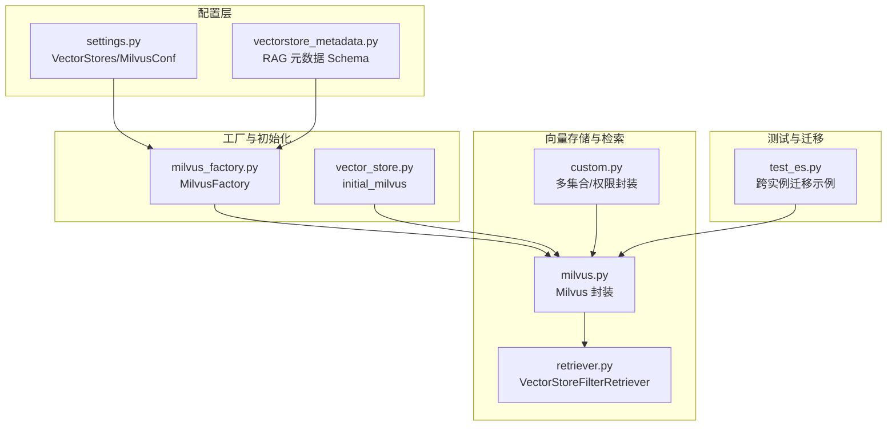
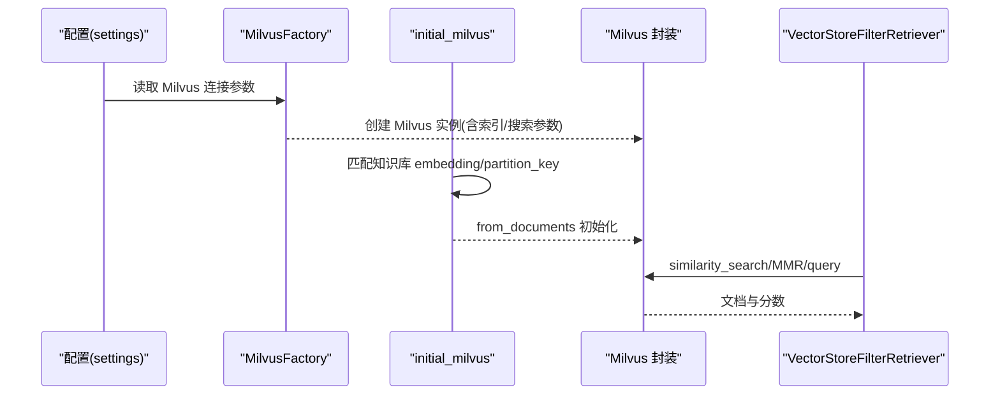
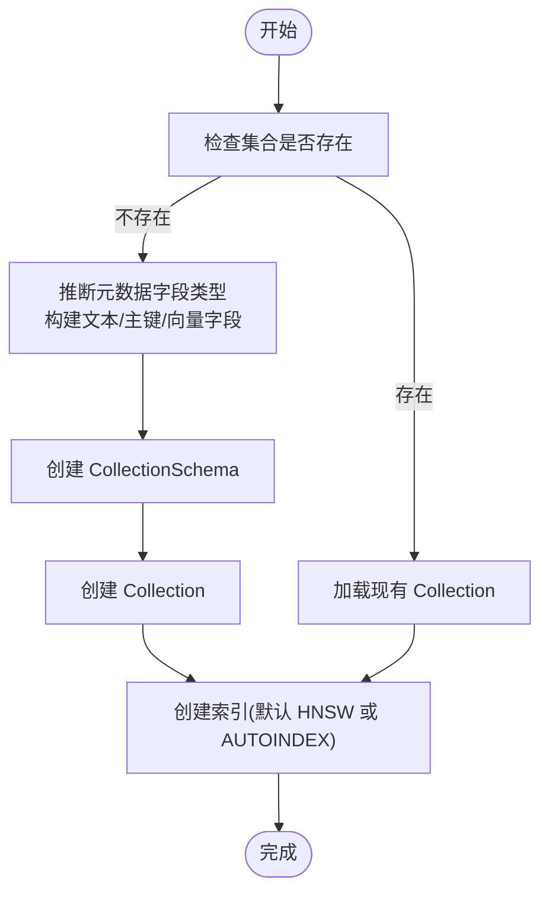
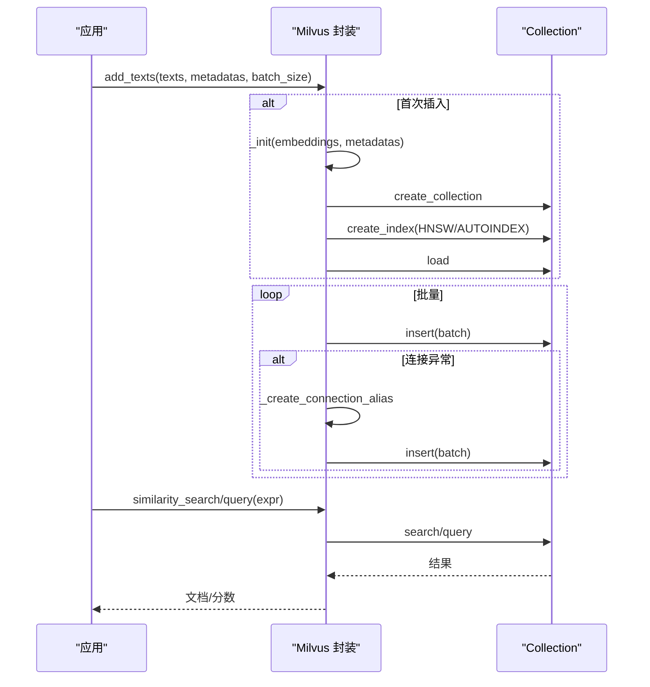
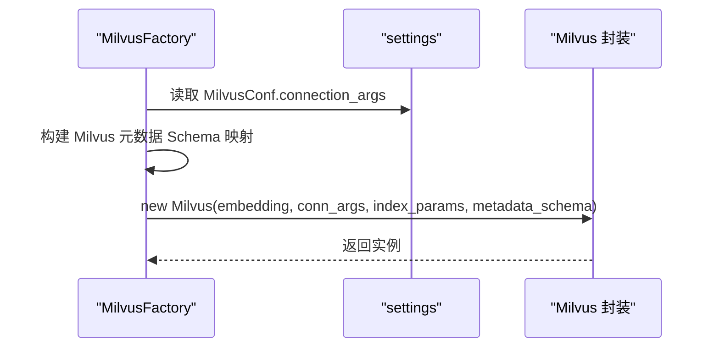
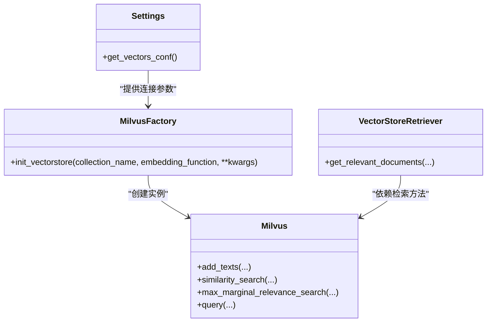

# Milvus 向量数据库集成

<cite>
**本文引用的文件**
- [milvus.py](file://src/backend/bisheng_langchain/vectorstores/milvus.py)
- [milvus_factory.py](file://src/backend/bisheng/knowledge/rag/milvus_factory.py)
- [settings.py](file://src/backend/bisheng/core/config/settings.py)
- [vectorstore_metadata.py](file://src/backend/bisheng/common/constants/vectorstore_metadata.py)
- [custom.py](file://src/backend/bisheng/interface/vector_store/custom.py)
- [vector_store.py](file://src/backend/bisheng/interface/initialize/vector_store.py)
- [retriever.py](file://src/backend/bisheng_langchain/vectorstores/retriever.py)
- [test_es.py](file://src/backend/test/test_es.py)
</cite>

## 目录
1. [简介](#简介)
2. [项目结构](#项目结构)
3. [核心组件](#核心组件)
4. [架构总览](#架构总览)
5. [详细组件分析](#详细组件分析)
6. [依赖关系分析](#依赖关系分析)
7. [性能与优化建议](#性能与优化建议)
8. [故障排查指南](#故障排查指南)
9. [结论](#结论)
10. [附录：配置与参数参考](#附录配置与参数参考)

## 简介
本文件面向在 Bisheng 平台中集成 Milvus 向量数据库的开发者与运维人员，系统性阐述 Milvus 连接配置、集合管理、索引策略、向量数据的增删改查（含批量与 MMR）、以及连接池与资源监控的最佳实践。文档基于仓库中的实际实现进行提炼，确保可操作性与可追溯性。

## 项目结构
围绕 Milvus 的集成主要分布在以下模块：
- 向量存储封装与检索器：langchain 封装的 Milvus 实现、自定义检索器
- 工厂与初始化：MilvusFactory 负责从配置生成 Milvus 实例；接口层负责从配置与知识库匹配 embedding 初始化
- 配置模型：settings 中的 VectorStores/MilvusConf 提供连接参数来源
- 元数据 Schema：RAG 元数据字段定义与 Milvus 字段映射
- 测试与迁移：包含跨实例数据迁移示例

图示来源
- [settings.py](file://src/backend/bisheng/core/config/settings.py#L65-L79)
- [milvus_factory.py](file://src/backend/bisheng/knowledge/rag/milvus_factory.py#L13-L59)
- [milvus.py](file://src/backend/bisheng_langchain/vectorstores/milvus.py#L26-L233)
- [vector_store.py](file://src/backend/bisheng/interface/initialize/vector_store.py#L212-L238)
- [retriever.py](file://src/backend/bisheng_langchain/vectorstores/retriever.py#L18-L95)
- [custom.py](file://src/backend/bisheng/interface/vector_store/custom.py#L115-L179)
- [test_es.py](file://src/backend/test/test_es.py#L49-L89)

章节来源
- [settings.py](file://src/backend/bisheng/core/config/settings.py#L65-L79)
- [milvus_factory.py](file://src/backend/bisheng/knowledge/rag/milvus_factory.py#L13-L59)
- [milvus.py](file://src/backend/bisheng_langchain/vectorstores/milvus.py#L26-L233)
- [vector_store.py](file://src/backend/bisheng/interface/initialize/vector_store.py#L212-L238)
- [retriever.py](file://src/backend/bisheng_langchain/vectorstores/retriever.py#L18-L95)
- [custom.py](file://src/backend/bisheng/interface/vector_store/custom.py#L115-L179)
- [test_es.py](file://src/backend/test/test_es.py#L49-L89)

## 核心组件
- Milvus 封装类：提供连接、集合创建/加载、索引创建、搜索、MMR、批量插入、查询等能力
- MilvusFactory：从全局配置生成 Milvus 实例，支持元数据字段映射
- 接口初始化：根据知识库信息匹配 embedding，自动注入 partition_key 与搜索参数
- 检索器：统一的相似度/阈值/最大边际相关（MMR）检索入口
- 多集合/权限封装：支持多集合搜索与分区键过滤
- 配置模型：VectorStores/MilvusConf 提供连接参数来源
- 元数据 Schema：RAG 元数据字段到 Milvus 数据类型的映射

章节来源
- [milvus.py](file://src/backend/bisheng_langchain/vectorstores/milvus.py#L26-L233)
- [milvus_factory.py](file://src/backend/bisheng/knowledge/rag/milvus_factory.py#L13-L59)
- [vector_store.py](file://src/backend/bisheng/interface/initialize/vector_store.py#L212-L238)
- [retriever.py](file://src/backend/bisheng_langchain/vectorstores/retriever.py#L18-L95)
- [custom.py](file://src/backend/bisheng/interface/vector_store/custom.py#L115-L179)
- [settings.py](file://src/backend/bisheng/core/config/settings.py#L65-L79)
- [vectorstore_metadata.py](file://src/backend/bisheng/common/constants/vectorstore_metadata.py#L3-L17)

## 架构总览
下图展示 Milvus 集成在平台中的调用链路：配置 → 工厂/初始化 → Milvus 封装 → 检索器/查询。

图示来源
- [settings.py](file://src/backend/bisheng/core/config/settings.py#L65-L79)
- [milvus_factory.py](file://src/backend/bisheng/knowledge/rag/milvus_factory.py#L13-L59)
- [vector_store.py](file://src/backend/bisheng/interface/initialize/vector_store.py#L212-L238)
- [milvus.py](file://src/backend/bisheng_langchain/vectorstores/milvus.py#L890-L938)
- [retriever.py](file://src/backend/bisheng_langchain/vectorstores/retriever.py#L45-L75)

## 详细组件分析

### Milvus 连接配置与认证
- 连接参数来源
  - 支持 host/port、uri、address 三种地址形式；优先级按 host/port > uri > address
  - 用户名/密码用于 RPC 请求头附加；TLS 可通过 secure 与证书路径启用
- 连接复用
  - 基于已存在连接的地址与用户信息尝试复用 alias，避免重复建立连接
- 认证与 TLS
  - 用户名/密码为空字符串时，不强制要求；TLS 通过 secure 与证书路径开启
- 默认连接参数
  - 提供 DEFAULT_MILVUS_CONNECTION 作为默认值

章节来源
- [milvus.py](file://src/backend/bisheng_langchain/vectorstores/milvus.py#L17-L23)
- [milvus.py](file://src/backend/bisheng_langchain/vectorstores/milvus.py#L237-L285)
- [milvus.py](file://src/backend/bisheng_langchain/vectorstores/milvus.py#L56-L82)

### 集合管理与 Schema 定义
- 集合创建
  - 首次插入时根据首条文本嵌入维度与元数据推断字段类型，创建集合
  - 文本字段固定为 VARCHAR(max_length=65535)，主键为 INT64 自增
  - 向量字段类型由嵌入维度推断，支持浮点或二进制向量
  - 分区键字段可选，通过 partition_field 标记
- 字段类型映射
  - 元数据字段类型通过 infer_dtype_bydata 推断，VARCHAR、INT8/16/32/64、FLOAT、DOUBLE、JSON、BOOL 等
  - 不识别类型会抛出异常
- 集合加载与一致性级别
  - 创建索引后执行 load，支持指定一致性级别

图示来源
- [milvus.py](file://src/backend/bisheng_langchain/vectorstores/milvus.py#L297-L360)
- [milvus.py](file://src/backend/bisheng_langchain/vectorstores/milvus.py#L383-L428)

章节来源
- [milvus.py](file://src/backend/bisheng_langchain/vectorstores/milvus.py#L297-L360)
- [milvus.py](file://src/backend/bisheng_langchain/vectorstores/milvus.py#L383-L428)

### 索引类型选择与参数
- 默认索引
  - 若未显式传入 index_params，默认使用 HNSW；若失败（如云服务），回退至 AUTOINDEX
- 搜索参数
  - 根据当前索引类型与 metric_type 自动生成 default_search_params
  - 支持 IVF_FLAT/SQ8/PQ、HNSW、RHNSW_*、IVF_HNSW、ANNOY、AUTOINDEX 等
- 适用场景与特点
  - HNSW：通用近似最近邻，适合大规模高维向量检索，召回与性能平衡较好
  - IVF_*：倒排粗排 + 精排，nprobe 控制候选集大小，适合对召回率敏感场景
  - ANNOY：轻量快速，适合中小规模或对内存敏感场景
  - AUTOINDEX：云托管环境自动选择最优索引，无需手工调参
  - RHNSW_*：随机化 HNSW 变体，通常 ef 较小，适合快速检索
  - IVF_HNSW：混合策略，兼顾粗排与精排，适合大体量场景

章节来源
- [milvus.py](file://src/backend/bisheng_langchain/vectorstores/milvus.py#L123-L184)
- [milvus.py](file://src/backend/bisheng_langchain/vectorstores/milvus.py#L383-L428)
- [milvus.py](file://src/backend/bisheng_langchain/vectorstores/milvus.py#L429-L440)

### 向量数据的插入、查询与删除
- 插入（批量）
  - 支持批量插入，按 batch_size 切分；默认 1000
  - 首次插入触发集合初始化（创建集合/索引/加载）
  - 断线重连：捕获连接异常后重建 alias 并重试
- 查询
  - similarity_search/similarity_search_by_vector：返回文档列表
  - similarity_search_with_score/_by_vector：返回文档与分数
  - 支持过滤表达式 expr 与元数据表达式 metadata_expr
  - 支持 partition_key 多租户过滤
- 删除
  - 通过 query 获取向量后，按主键删除（示例见测试文件）

图示来源
- [milvus.py](file://src/backend/bisheng_langchain/vectorstores/milvus.py#L448-L544)
- [milvus.py](file://src/backend/bisheng_langchain/vectorstores/milvus.py#L546-L740)
- [milvus.py](file://src/backend/bisheng_langchain/vectorstores/milvus.py#L890-L938)

章节来源
- [milvus.py](file://src/backend/bisheng_langchain/vectorstores/milvus.py#L448-L544)
- [milvus.py](file://src/backend/bisheng_langchain/vectorstores/milvus.py#L546-L740)
- [milvus.py](file://src/backend/bisheng_langchain/vectorstores/milvus.py#L890-L938)
- [test_es.py](file://src/backend/test/test_es.py#L49-L89)

### MMR（最大边际相关）与检索器
- MMR 搜索
  - 支持基于查询向量与候选结果的 MMR 重排，lambda_mult 控制多样性
- 检索器
  - 统一的检索器封装，支持 similarity、similarity_score_threshold、mmr 三种检索类型
  - 可结合访问控制 URL 对命中结果进行二次过滤

章节来源
- [milvus.py](file://src/backend/bisheng_langchain/vectorstores/milvus.py#L742-L887)
- [retriever.py](file://src/backend/bisheng_langchain/vectorstores/retriever.py#L18-L95)

### 多集合与权限封装
- 多集合搜索
  - 支持同时连接多个集合，按各自 partition_key 过滤并合并排序
- 权限控制
  - 在搜索表达式中自动拼接 partition_field 过滤，保障多租户隔离

章节来源
- [custom.py](file://src/backend/bisheng/interface/vector_store/custom.py#L115-L179)
- [custom.py](file://src/backend/bisheng/interface/vector_store/custom.py#L418-L450)

### 工厂与初始化流程
- 工厂
  - 从配置读取 connection_args，必要时将 host/port 组装为 uri
  - 将 RAG 元数据 Schema 映射为 Milvus 字段定义
- 初始化
  - 从知识库匹配 embedding 与 collection_name
  - 自动注入 partition_key 与搜索参数，调用 from_documents 完成初始化

图示来源
- [milvus_factory.py](file://src/backend/bisheng/knowledge/rag/milvus_factory.py#L13-L59)
- [settings.py](file://src/backend/bisheng/core/config/settings.py#L65-L79)

章节来源
- [milvus_factory.py](file://src/backend/bisheng/knowledge/rag/milvus_factory.py#L13-L59)
- [vector_store.py](file://src/backend/bisheng/interface/initialize/vector_store.py#L212-L238)

## 依赖关系分析
- 组件耦合
  - Milvus 封装直接依赖 pymilvus（Collection/connections/utility）
  - 工厂依赖 settings 与 RagMetadataFieldSchema
  - 初始化依赖知识库模型与 embedding 服务
- 关系图

图示来源
- [milvus_factory.py](file://src/backend/bisheng/knowledge/rag/milvus_factory.py#L13-L59)
- [milvus.py](file://src/backend/bisheng_langchain/vectorstores/milvus.py#L26-L233)
- [settings.py](file://src/backend/bisheng/core/config/settings.py#L336-L337)
- [retriever.py](file://src/backend/bisheng_langchain/vectorstores/retriever.py#L18-L95)

章节来源
- [milvus_factory.py](file://src/backend/bisheng/knowledge/rag/milvus_factory.py#L13-L59)
- [milvus.py](file://src/backend/bisheng_langchain/vectorstores/milvus.py#L26-L233)
- [settings.py](file://src/backend/bisheng/core/config/settings.py#L336-L337)
- [retriever.py](file://src/backend/bisheng_langchain/vectorstores/retriever.py#L18-L95)

## 性能与优化建议
- 批量写入
  - 使用较大的 batch_size（默认 1000）减少 RPC 次数；结合目标集群吞吐调整
- 索引选择
  - 大规模场景优先 HNSW/AUTOINDEX；对召回率敏感场景可考虑 IVF_* 并调优 nprobe
  - 需要快速检索且对精度有容忍时可选 ANNOY
- 搜索参数
  - 根据业务阈值设置 similarity_score_threshold；MMR 通过 lambda_mult 控制多样性
- 连接与重试
  - 利用连接复用避免频繁握手；出现连接异常自动重建 alias 并重试
- 多租户与过滤
  - 使用 partition_key 与 metadata_expr 减少无关扫描，提升查询效率

[本节为通用建议，无需特定文件引用]

## 故障排查指南
- 连接失败
  - 检查 host/port/uri 是否正确；确认用户名/密码与 TLS 配置
  - 观察日志中连接异常与重试记录
- 集合创建失败
  - 元数据字段类型不被识别会报错；请修正字段类型或提供显式 schema
- 索引创建失败
  - 若默认 HNSW 失败，系统会回退 AUTOINDEX；可在云托管环境下确认可用索引
- 查询无结果
  - 确认集合已 load；检查 expr 与 partition_key 是否正确拼接
  - 检查 consistency_level 与写入是否已完成刷新

章节来源
- [milvus.py](file://src/backend/bisheng_langchain/vectorstores/milvus.py#L237-L285)
- [milvus.py](file://src/backend/bisheng_langchain/vectorstores/milvus.py#L314-L325)
- [milvus.py](file://src/backend/bisheng_langchain/vectorstores/milvus.py#L408-L420)
- [milvus.py](file://src/backend/bisheng_langchain/vectorstores/milvus.py#L710-L720)

## 结论
本集成以 Milvus 封装为核心，配合工厂与初始化流程，实现了从配置驱动到检索可用的完整链路。通过合理的索引策略、批量写入与连接复用，可在保证性能的同时满足多租户与权限控制需求。建议在生产环境中结合业务规模与数据特征持续调优索引与搜索参数，并完善监控与告警体系。

[本节为总结，无需特定文件引用]

## 附录：配置与参数参考

- 连接参数（来自 DEFAULT_MILVUS_CONNECTION 与 Milvus.__init__ 注释）
  - host/port：主机与端口
  - uri/address：统一资源标识符或地址
  - user/password：认证凭据
  - secure：启用 TLS
  - client_key_path/client_pem_path/ca_pem_path/server_pem_path/server_name：TLS 证书路径与名称
- 集合字段约定
  - 主键：int64 自增（primary_field）
  - 文本：varchar（text_field）
  - 向量：根据嵌入维度推断（vector_field）
  - 分区键：partition_field（可选）
- 元数据 Schema 映射
  - RAG 元数据字段到 Milvus 数据类型的映射由工厂完成，支持 text/int64/json/bool 等

章节来源
- [milvus.py](file://src/backend/bisheng_langchain/vectorstores/milvus.py#L17-L23)
- [milvus.py](file://src/backend/bisheng_langchain/vectorstores/milvus.py#L56-L82)
- [milvus.py](file://src/backend/bisheng_langchain/vectorstores/milvus.py#L193-L203)
- [milvus_factory.py](file://src/backend/bisheng/knowledge/rag/milvus_factory.py#L27-L49)
- [vectorstore_metadata.py](file://src/backend/bisheng/common/constants/vectorstore_metadata.py#L3-L17)