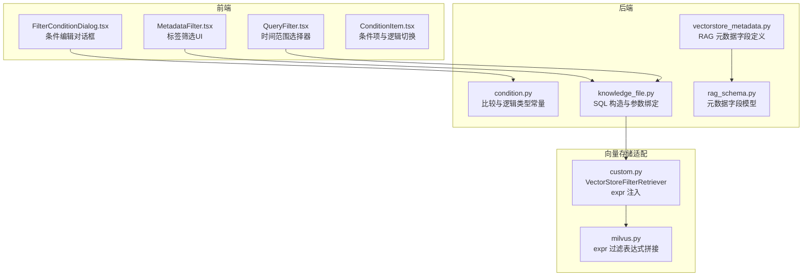
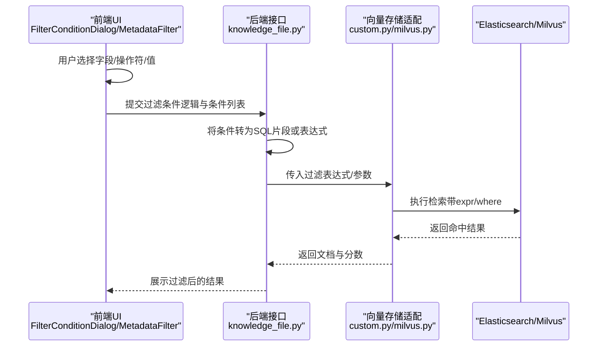
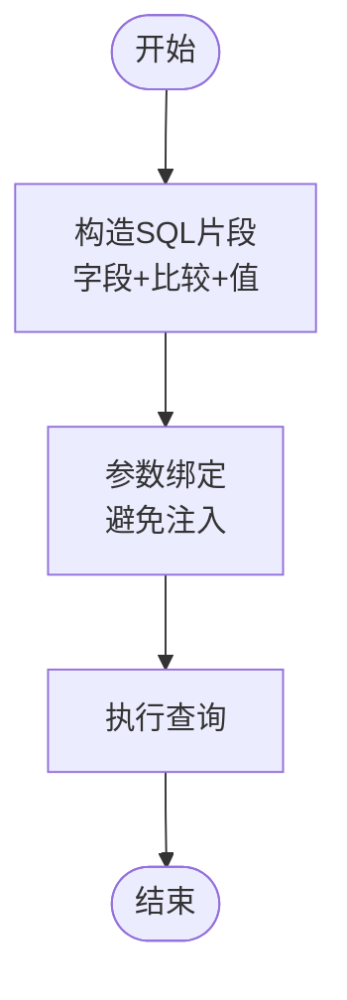
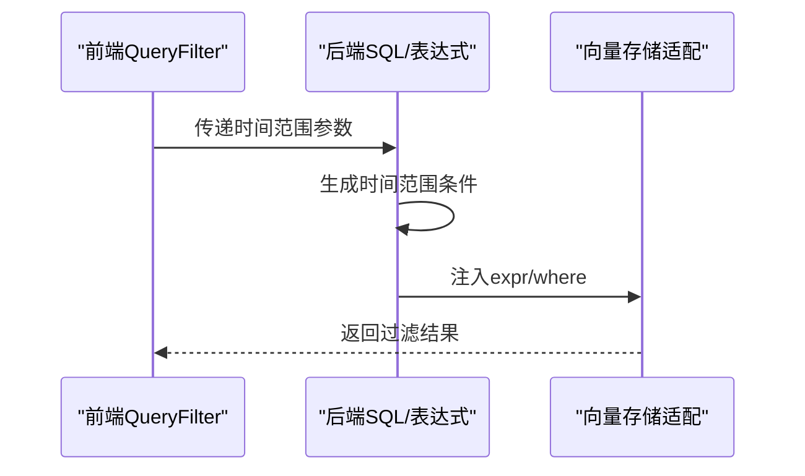
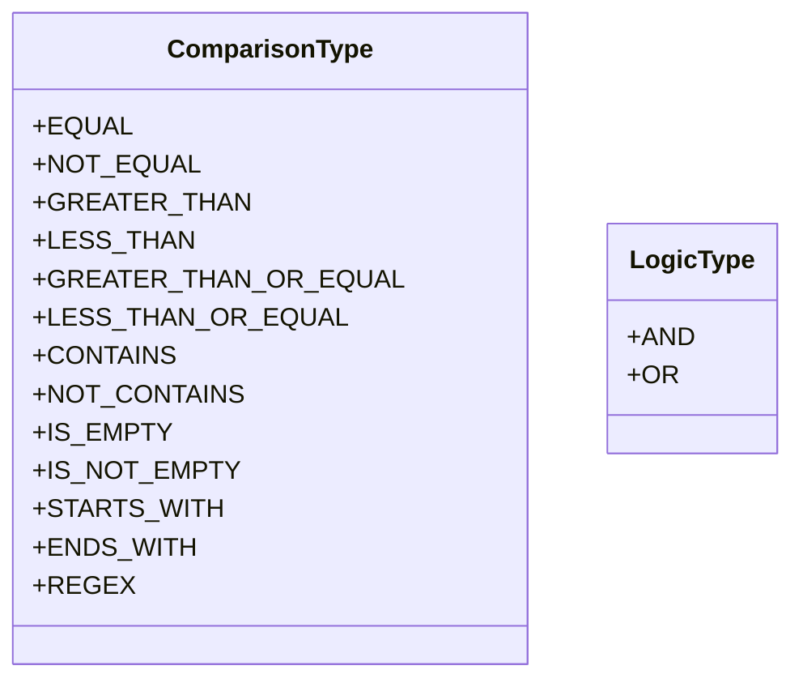
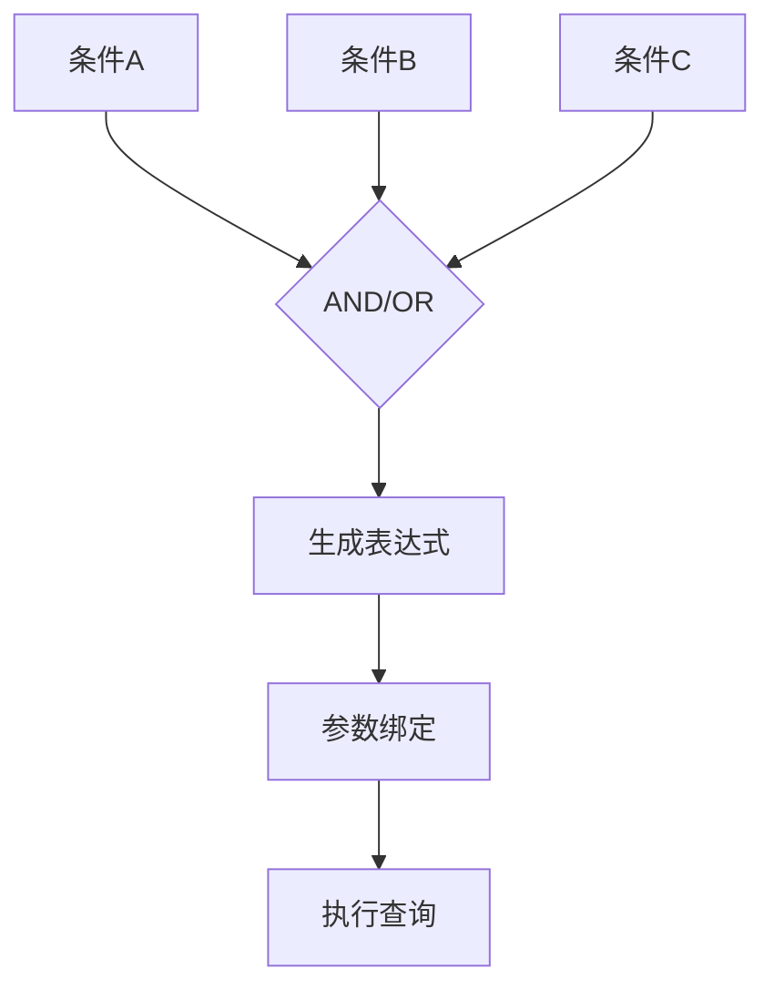
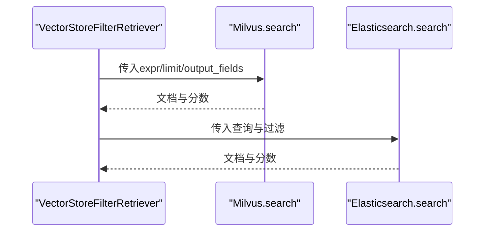
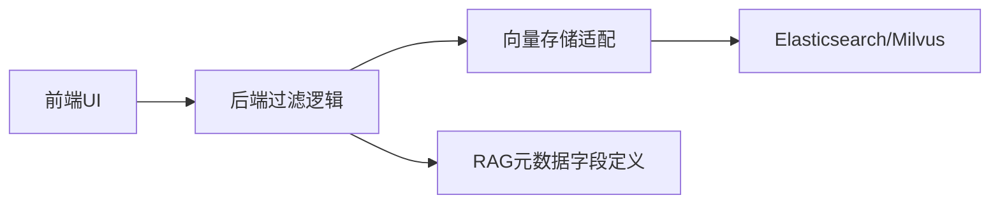

# 元数据过滤机制

<cite>
**本文引用的文件**
- [src/backend/bisheng/workflow/common/condition.py](file://src/backend/bisheng/workflow/common/condition.py)
- [src/backend/bisheng/knowledge/domain/models/knowledge_file.py](file://src/backend/bisheng/knowledge/domain/models/knowledge_file.py)
- [src/backend/bisheng/common/constants/vectorstore_metadata.py](file://src/backend/bisheng/common/constants/vectorstore_metadata.py)
- [src/backend/bisheng/common/schemas/rag_schema.py](file://src/backend/bisheng/common/schemas/rag_schema.py)
- [src/backend/bisheng_langchain/vectorstores/milvus.py](file://src/backend/bisheng_langchain/vectorstores/milvus.py)
- [src/backend/bisheng/interface/vector_store/custom.py](file://src/backend/bisheng/interface/vector_store/custom.py)
- [src/backend/bisheng/interface/initialize/loading.py](file://src/backend/bisheng/interface/initialize/loading.py)
- [src/frontend/platform/src/pages/BuildPage/flow/FlowNode/component/MetadataFilter.tsx](file://src/frontend/platform/src/pages/BuildPage/flow/FlowNode/component/MetadataFilter.tsx)
- [src/frontend/platform/src/pages/Dashboard/components/config/FilterConditionDialog.tsx](file://src/frontend/platform/src/pages/Dashboard/components/config/FilterConditionDialog.tsx)
- [src/frontend/platform/src/pages/Dashboard/components/charts/QueryFilter.tsx](file://src/frontend/platform/src/pages/Dashboard/components/charts/QueryFilter.tsx)
- [src/frontend/platform/src/pages/KnowledgePage/components/MetadataDialog.tsx](file://src/frontend/platform/src/pages/KnowledgePage/components/MetadataDialog.tsx)
- [src/frontend/platform/src/pages/BuildPage/flow/FlowNode/component/ConditionItem.tsx](file://src/frontend/platform/src/pages/BuildPage/flow/FlowNode/component/ConditionItem.tsx)
</cite>

## 目录
1. [简介](#简介)
2. [项目结构](#项目结构)
3. [核心组件](#核心组件)
4. [架构总览](#架构总览)
5. [组件详解](#组件详解)
6. [依赖关系分析](#依赖关系分析)
7. [性能考量](#性能考量)
8. [故障排查指南](#故障排查指南)
9. [结论](#结论)
10. [附录](#附录)

## 简介
本文件系统性阐述本仓库中的“元数据过滤机制”，覆盖以下方面：
- 标签筛选与索引建立：基于知识库元数据字段的索引与查询策略
- 时间范围查询：时间戳字段处理、范围查询语法与前端交互
- 自定义字段过滤：文本匹配、数值比较与布尔条件组合
- 过滤器组合策略：AND/OR/NOT 逻辑与优先级
- 性能优化：索引设计、查询计划与缓存策略
- 配置语法：DSL 查询语言、表达式解析与错误处理

## 项目结构
围绕元数据过滤的关键代码分布在后端服务层（Python）、向量存储适配层（LangChain 扩展）以及前端配置界面（React）。下图概览了主要模块与交互路径。

图表来源
- [src/frontend/platform/src/pages/BuildPage/flow/FlowNode/component/MetadataFilter.tsx](file://src/frontend/platform/src/pages/BuildPage/flow/FlowNode/component/MetadataFilter.tsx#L575-L652)
- [src/frontend/platform/src/pages/Dashboard/components/config/FilterConditionDialog.tsx](file://src/frontend/platform/src/pages/Dashboard/components/config/FilterConditionDialog.tsx#L442-L821)
- [src/frontend/platform/src/pages/Dashboard/components/charts/QueryFilter.tsx](file://src/frontend/platform/src/pages/Dashboard/components/charts/QueryFilter.tsx#L35-L107)
- [src/frontend/platform/src/pages/BuildPage/flow/FlowNode/component/ConditionItem.tsx](file://src/frontend/platform/src/pages/BuildPage/flow/FlowNode/component/ConditionItem.tsx#L314-L337)
- [src/backend/bisheng/workflow/common/condition.py](file://src/backend/bisheng/workflow/common/condition.py#L1-L19)
- [src/backend/bisheng/knowledge/domain/models/knowledge_file.py](file://src/backend/bisheng/knowledge/domain/models/knowledge_file.py#L378-L404)
- [src/backend/bisheng/common/constants/vectorstore_metadata.py](file://src/backend/bisheng/common/constants/vectorstore_metadata.py#L1-L18)
- [src/backend/bisheng/common/schemas/rag_schema.py](file://src/backend/bisheng/common/schemas/rag_schema.py#L1-L11)
- [src/backend/bisheng_langchain/vectorstores/milvus.py](file://src/backend/bisheng_langchain/vectorstores/milvus.py#L683-L861)
- [src/backend/bisheng/interface/vector_store/custom.py](file://src/backend/bisheng/interface/vector_store/custom.py#L380-L579)

章节来源
- [src/backend/bisheng/workflow/common/condition.py](file://src/backend/bisheng/workflow/common/condition.py#L1-L19)
- [src/backend/bisheng/knowledge/domain/models/knowledge_file.py](file://src/backend/bisheng/knowledge/domain/models/knowledge_file.py#L378-L404)
- [src/backend/bisheng/common/constants/vectorstore_metadata.py](file://src/backend/bisheng/common/constants/vectorstore_metadata.py#L1-L18)
- [src/backend/bisheng/common/schemas/rag_schema.py](file://src/backend/bisheng/common/schemas/rag_schema.py#L1-L11)
- [src/backend/bisheng_langchain/vectorstores/milvus.py](file://src/backend/bisheng_langchain/vectorstores/milvus.py#L683-L861)
- [src/backend/bisheng/interface/vector_store/custom.py](file://src/backend/bisheng/interface/vector_store/custom.py#L380-L579)
- [src/frontend/platform/src/pages/BuildPage/flow/FlowNode/component/MetadataFilter.tsx](file://src/frontend/platform/src/pages/BuildPage/flow/FlowNode/component/MetadataFilter.tsx#L575-L652)
- [src/frontend/platform/src/pages/Dashboard/components/config/FilterConditionDialog.tsx](file://src/frontend/platform/src/pages/Dashboard/components/config/FilterConditionDialog.tsx#L442-L821)
- [src/frontend/platform/src/pages/Dashboard/components/charts/QueryFilter.tsx](file://src/frontend/platform/src/pages/Dashboard/components/charts/QueryFilter.tsx#L35-L107)
- [src/frontend/platform/src/pages/KnowledgePage/components/MetadataDialog.tsx](file://src/frontend/platform/src/pages/KnowledgePage/components/MetadataDialog.tsx#L488-L511)
- [src/frontend/platform/src/pages/BuildPage/flow/FlowNode/component/ConditionItem.tsx](file://src/frontend/platform/src/pages/BuildPage/flow/FlowNode/component/ConditionItem.tsx#L314-L337)

## 核心组件
- 比较与逻辑类型：定义比较操作符与 AND/OR 逻辑类型，用于前端条件构建与后端 SQL/表达式生成。
- 知识库文件模型：将前端过滤条件转换为 SQL 片段，并通过参数绑定安全执行。
- 向量存储适配：在 Milvus/Elasticsearch 检索中注入 expr 过滤表达式，支持元数据字段过滤。
- RAG 元数据字段：统一定义知识库元数据字段类型与约束，确保前后端一致。
- 前端过滤 UI：提供标签筛选、条件编辑、时间范围选择与逻辑切换等交互能力。

章节来源
- [src/backend/bisheng/workflow/common/condition.py](file://src/backend/bisheng/workflow/common/condition.py#L1-L19)
- [src/backend/bisheng/knowledge/domain/models/knowledge_file.py](file://src/backend/bisheng/knowledge/domain/models/knowledge_file.py#L378-L404)
- [src/backend/bisheng/common/constants/vectorstore_metadata.py](file://src/backend/bisheng/common/constants/vectorstore_metadata.py#L1-L18)
- [src/backend/bisheng/common/schemas/rag_schema.py](file://src/backend/bisheng/common/schemas/rag_schema.py#L1-L11)
- [src/backend/bisheng_langchain/vectorstores/milvus.py](file://src/backend/bisheng_langchain/vectorstores/milvus.py#L683-L861)
- [src/backend/bisheng/interface/vector_store/custom.py](file://src/backend/bisheng/interface/vector_store/custom.py#L380-L579)
- [src/frontend/platform/src/pages/BuildPage/flow/FlowNode/component/MetadataFilter.tsx](file://src/frontend/platform/src/pages/BuildPage/flow/FlowNode/component/MetadataFilter.tsx#L575-L652)
- [src/frontend/platform/src/pages/Dashboard/components/config/FilterConditionDialog.tsx](file://src/frontend/platform/src/pages/Dashboard/components/config/FilterConditionDialog.tsx#L442-L821)
- [src/frontend/platform/src/pages/Dashboard/components/charts/QueryFilter.tsx](file://src/frontend/platform/src/pages/Dashboard/components/charts/QueryFilter.tsx#L35-L107)

## 架构总览
下图展示从前端到后端再到向量存储的过滤链路，重点体现元数据过滤表达式的生成与传递。

图表来源
- [src/frontend/platform/src/pages/Dashboard/components/config/FilterConditionDialog.tsx](file://src/frontend/platform/src/pages/Dashboard/components/config/FilterConditionDialog.tsx#L442-L821)
- [src/frontend/platform/src/pages/BuildPage/flow/FlowNode/component/MetadataFilter.tsx](file://src/frontend/platform/src/pages/BuildPage/flow/FlowNode/component/MetadataFilter.tsx#L575-L652)
- [src/backend/bisheng/knowledge/domain/models/knowledge_file.py](file://src/backend/bisheng/knowledge/domain/models/knowledge_file.py#L378-L404)
- [src/backend/bisheng/interface/vector_store/custom.py](file://src/backend/bisheng/interface/vector_store/custom.py#L380-L579)
- [src/backend/bisheng_langchain/vectorstores/milvus.py](file://src/backend/bisheng_langchain/vectorstores/milvus.py#L683-L861)

## 组件详解

### 标签筛选与索引建立
- 前端标签筛选 UI 支持对元数据字段进行选择与过滤，结合搜索与下拉选择增强体验。
- 后端将用户选择的标签条件映射为 SQL 片段，并通过参数绑定避免注入风险。
- 索引层面，RAG 元数据字段在知识库中具备统一类型定义，便于后续建立倒排索引或字段索引以提升查询效率。

图表来源
- [src/backend/bisheng/knowledge/domain/models/knowledge_file.py](file://src/backend/bisheng/knowledge/domain/models/knowledge_file.py#L378-L404)
- [src/frontend/platform/src/pages/BuildPage/flow/FlowNode/component/MetadataFilter.tsx](file://src/frontend/platform/src/pages/BuildPage/flow/FlowNode/component/MetadataFilter.tsx#L575-L652)

章节来源
- [src/backend/bisheng/knowledge/domain/models/knowledge_file.py](file://src/backend/bisheng/knowledge/domain/models/knowledge_file.py#L378-L404)
- [src/frontend/platform/src/pages/BuildPage/flow/FlowNode/component/MetadataFilter.tsx](file://src/frontend/platform/src/pages/BuildPage/flow/FlowNode/component/MetadataFilter.tsx#L575-L652)
- [src/frontend/platform/src/pages/KnowledgePage/components/MetadataDialog.tsx](file://src/frontend/platform/src/pages/KnowledgePage/components/MetadataDialog.tsx#L488-L511)

### 时间范围查询机制
- 前端时间范围选择器支持动态/固定区间、粒度控制（日/时等），并将起止时间作为查询参数传递。
- 后端根据配置生成 SQL WHERE 条件或表达式，确保时间戳字段参与过滤。
- 向量存储适配层在检索时将时间范围表达式与其它元数据条件合并，形成最终过滤表达式。

图表来源
- [src/frontend/platform/src/pages/Dashboard/components/charts/QueryFilter.tsx](file://src/frontend/platform/src/pages/Dashboard/components/charts/QueryFilter.tsx#L35-L107)
- [src/backend/bisheng/knowledge/domain/models/knowledge_file.py](file://src/backend/bisheng/knowledge/domain/models/knowledge_file.py#L378-L404)
- [src/backend/bisheng/interface/vector_store/custom.py](file://src/backend/bisheng/interface/vector_store/custom.py#L380-L579)

章节来源
- [src/frontend/platform/src/pages/Dashboard/components/charts/QueryFilter.tsx](file://src/frontend/platform/src/pages/Dashboard/components/charts/QueryFilter.tsx#L35-L107)
- [src/backend/bisheng/knowledge/domain/models/knowledge_file.py](file://src/backend/bisheng/knowledge/domain/models/knowledge_file.py#L378-L404)

### 自定义字段过滤
- 字段类型与操作符：字符串与数值类型分别支持不同的比较操作符；空值判断提供专用操作符。
- 条件组合：支持条件项之间的 AND/OR 切换，以及枚举类型的 in 操作。
- 表达式生成：前端将条件序列化为可传输结构，后端将其转换为 SQL 或 expr 表达式。

图表来源
- [src/backend/bisheng/workflow/common/condition.py](file://src/backend/bisheng/workflow/common/condition.py#L1-L19)

章节来源
- [src/frontend/platform/src/pages/Dashboard/components/config/FilterConditionDialog.tsx](file://src/frontend/platform/src/pages/Dashboard/components/config/FilterConditionDialog.tsx#L442-L821)
- [src/frontend/platform/src/pages/BuildPage/flow/FlowNode/component/ConditionItem.tsx](file://src/frontend/platform/src/pages/BuildPage/flow/FlowNode/component/ConditionItem.tsx#L314-L337)
- [src/backend/bisheng/workflow/common/condition.py](file://src/backend/bisheng/workflow/common/condition.py#L1-L19)

### 过滤器组合策略
- AND/OR 逻辑：通过全局逻辑开关控制多个条件的整体关系；条件项之间可通过竖线与 Badge 切换逻辑。
- 优先级与括号：当存在额外过滤子句时，后端会为复合条件添加括号以保证优先级。
- NOT 逻辑：当前实现未直接暴露 NOT 操作符，但可通过“不包含/非等于”等组合达到否定效果。

图表来源
- [src/frontend/platform/src/pages/BuildPage/flow/FlowNode/component/ConditionItem.tsx](file://src/frontend/platform/src/pages/BuildPage/flow/FlowNode/component/ConditionItem.tsx#L314-L337)
- [src/backend/bisheng/knowledge/domain/models/knowledge_file.py](file://src/backend/bisheng/knowledge/domain/models/knowledge_file.py#L378-L404)

章节来源
- [src/frontend/platform/src/pages/BuildPage/flow/FlowNode/component/ConditionItem.tsx](file://src/frontend/platform/src/pages/BuildPage/flow/FlowNode/component/ConditionItem.tsx#L314-L337)
- [src/backend/bisheng/knowledge/domain/models/knowledge_file.py](file://src/backend/bisheng/knowledge/domain/models/knowledge_file.py#L378-L404)

### 向量检索中的元数据过滤
- Milvus：支持在 search 调用中传入 expr，同时可叠加分区键与内置元数据表达式。
- Elasticsearch：通过 bool must/should 子句组织关键词匹配与元数据过滤。
- 适配器注入：VectorStoreFilterRetriever 在检索前将过滤表达式注入到底层检索调用。

图表来源
- [src/backend/bisheng/interface/vector_store/custom.py](file://src/backend/bisheng/interface/vector_store/custom.py#L380-L579)
- [src/backend/bisheng_langchain/vectorstores/milvus.py](file://src/backend/bisheng_langchain/vectorstores/milvus.py#L683-L861)

章节来源
- [src/backend/bisheng/interface/vector_store/custom.py](file://src/backend/bisheng/interface/vector_store/custom.py#L380-L579)
- [src/backend/bisheng_langchain/vectorstores/milvus.py](file://src/backend/bisheng_langchain/vectorstores/milvus.py#L683-L861)

## 依赖关系分析
- 前端依赖后端提供的字段类型与操作符集合，确保 UI 与后端语义一致。
- 后端依赖 RAG 元数据字段定义，保证字段名、类型与约束的一致性。
- 向量存储适配层依赖后端生成的表达式，负责将其正确注入到底层检索 API。

图表来源
- [src/backend/bisheng/common/constants/vectorstore_metadata.py](file://src/backend/bisheng/common/constants/vectorstore_metadata.py#L1-L18)
- [src/backend/bisheng/common/schemas/rag_schema.py](file://src/backend/bisheng/common/schemas/rag_schema.py#L1-L11)
- [src/backend/bisheng/interface/vector_store/custom.py](file://src/backend/bisheng/interface/vector_store/custom.py#L380-L579)

章节来源
- [src/backend/bisheng/common/constants/vectorstore_metadata.py](file://src/backend/bisheng/common/constants/vectorstore_metadata.py#L1-L18)
- [src/backend/bisheng/common/schemas/rag_schema.py](file://src/backend/bisheng/common/schemas/rag_schema.py#L1-L11)
- [src/backend/bisheng/interface/vector_store/custom.py](file://src/backend/bisheng/interface/vector_store/custom.py#L380-L579)

## 性能考量
- 索引设计
  - 文本字段：建议对高频过滤字段建立倒排索引或分词索引，减少全表扫描。
  - 数值字段：对时间戳与数值范围查询，建议建立数值索引或范围索引。
  - 枚举/标签字段：建立基数较小的字段索引，提高 in/等值查询效率。
- 查询计划
  - 将最窄选择性的条件前置，减少中间结果集规模。
  - 对复合条件使用括号明确优先级，避免不必要的全量扫描。
- 缓存策略
  - 对热点查询结果进行客户端缓存，降低重复请求。
  - 向量检索结果可按会话维度缓存，结合失效策略避免陈旧数据。
- 表达式优化
  - 在 Milvus 中尽量使用高效表达式，避免复杂正则导致全表扫描。
  - Elasticsearch 使用 bool must/should 控制权重与选择性，提升命中率。

## 故障排查指南
- SQL 注入与参数绑定
  - 确保所有外部输入通过参数绑定注入，避免字符串拼接。
- 表达式语法错误
  - 检查 expr 语法是否符合底层引擎要求；必要时拆分复杂表达式。
- 字段类型不匹配
  - 确认前端选择的操作符与字段类型兼容；例如数值字段不应使用 contains。
- 时间范围边界
  - 明确时间粒度与边界，避免跨天/跨月等边界问题导致漏查。
- 权限与分区
  - 若使用分区键，需确保 expr 中包含分区条件，避免跨分区访问。

章节来源
- [src/backend/bisheng/knowledge/domain/models/knowledge_file.py](file://src/backend/bisheng/knowledge/domain/models/knowledge_file.py#L378-L404)
- [src/backend/bisheng_langchain/vectorstores/milvus.py](file://src/backend/bisheng_langchain/vectorstores/milvus.py#L683-L861)
- [src/backend/bisheng/interface/vector_store/custom.py](file://src/backend/bisheng/interface/vector_store/custom.py#L380-L579)

## 结论
本项目的元数据过滤机制通过“前端条件构建 + 后端表达式生成 + 向量存储适配”的三层协作，实现了标签筛选、时间范围查询与自定义字段过滤的统一能力。配合合理的索引设计、查询计划与缓存策略，可在保证功能灵活性的同时获得良好的性能表现。

## 附录
- DSL 查询语言与表达式解析
  - SQL DSL：由前端条件序列化为结构化对象，后端转换为 SQL 片段并参数化执行。
  - 表达式 DSL：向量检索采用 expr 形式，需遵循底层引擎语法规范。
- 错误处理机制
  - 前端：对空值、非法操作符进行校验与提示。
  - 后端：对表达式语法与参数进行严格校验，异常时返回明确错误信息。