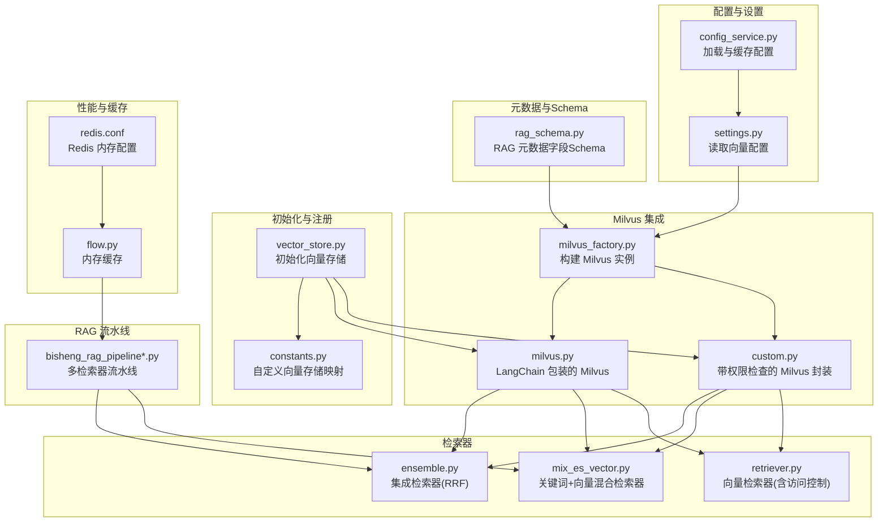
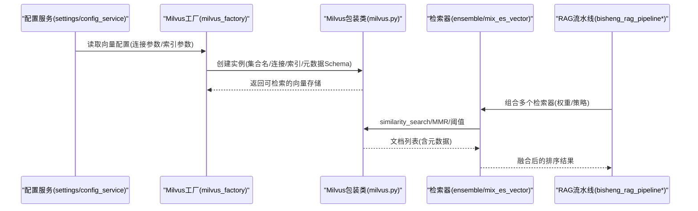
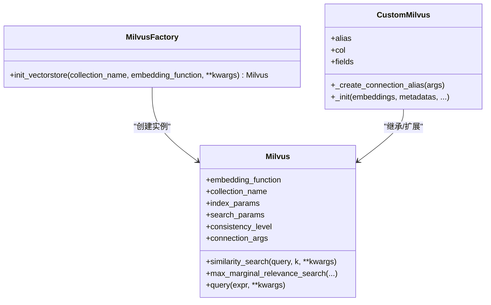
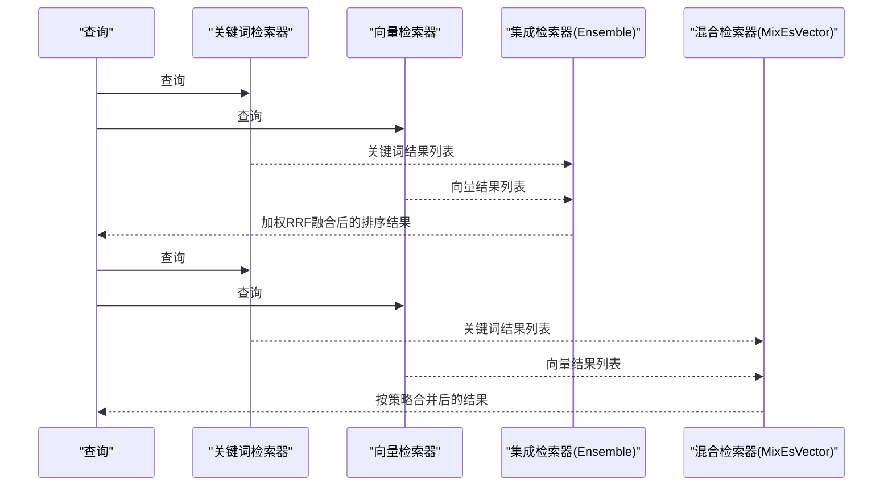
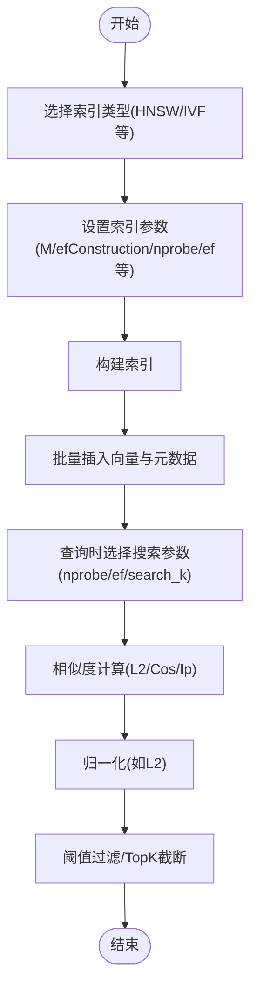
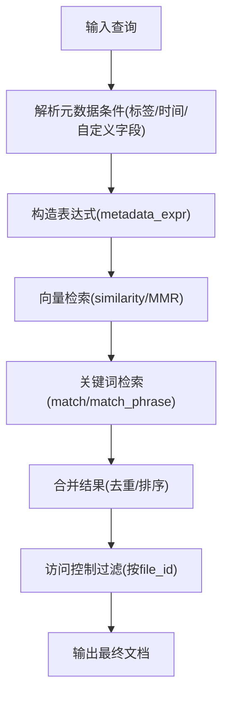
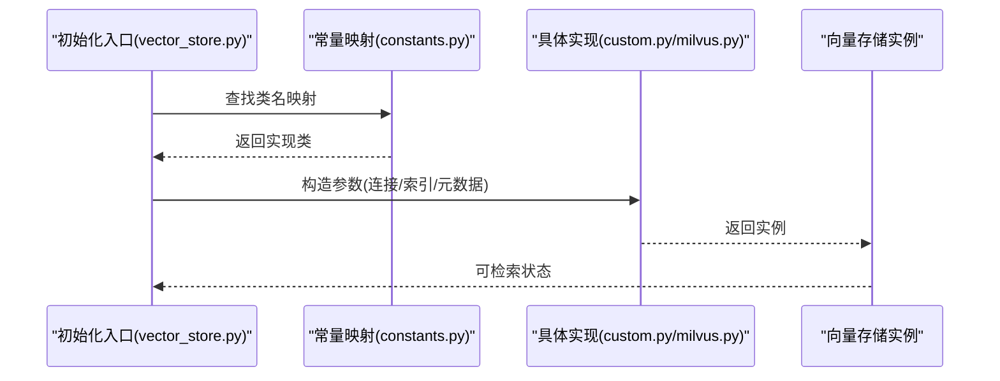
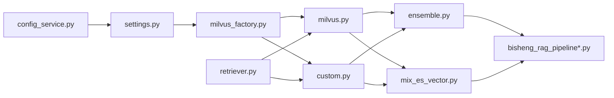

# 向量存储管理

<cite>
**本文引用的文件**
- [milvus.py](file://src/backend/bisheng_langchain/vectorstores/milvus.py)
- [milvus_factory.py](file://src/backend/bisheng/knowledge/rag/milvus_factory.py)
- [ensemble.py](file://src/backend/bisheng_langchain/retrievers/ensemble.py)
- [mix_es_vector.py](file://src/backend/bisheng_langchain/retrievers/mix_es_vector.py)
- [retriever.py](file://src/backend/bisheng_langchain/vectorstores/retriever.py)
- [custom.py](file://src/backend/bisheng/interface/vector_store/custom.py)
- [constants.py](file://src/backend/bisheng/interface/vector_store/constants.py)
- [vector_store.py](file://src/backend/bisheng/interface/initialize/vector_store.py)
- [settings.py](file://src/backend/bisheng/core/config/settings.py)
- [config_service.py](file://src/backend/bisheng/common/services/config_service.py)
- [rag_schema.py](file://src/backend/bisheng/common/schemas/rag_schema.py)
- [bisheng_rag_pipeline.py](file://src/backend/bisheng_langchain/rag/bisheng_rag_pipeline.py)
- [bisheng_rag_pipeline_v2.py](file://src/backend/bisheng_langchain/rag/bisheng_rag_pipeline_v2.py)
- [elastic_keywords_search.py](file://src/backend/bisheng_langchain/vectorstores/elastic_keywords_search.py)
- [flow.py](file://src/backend/bisheng/core/cache/flow.py)
- [redis.conf](file://docker/redis/redis.conf)
</cite>

## 目录
1. [简介](#简介)
2. [项目结构](#项目结构)
3. [核心组件](#核心组件)
4. [架构总览](#架构总览)
5. [详细组件分析](#详细组件分析)
6. [依赖关系分析](#依赖关系分析)
7. [性能考量与调优](#性能考量与调优)
8. [故障排查指南](#故障排查指南)
9. [结论](#结论)

## 简介
本文件面向 Bisheng 的向量存储管理子系统，聚焦于 Milvus 向量数据库的集成方式（连接配置、集合管理、索引参数）、检索器架构（单一、集成与混合检索器）以及相似度计算与元数据过滤机制，并提供性能调优建议（批量写入、查询缓存与内存管理）。内容基于仓库中实际实现进行技术性解读，帮助开发者与运维人员快速理解并高效使用该系统。

## 项目结构
围绕向量存储的关键目录与文件如下：
- 向量存储实现：Milvus LangChain 包装类、工厂类、检索器封装与权限过滤检索器
- 检索器组合：集成检索器（RRF 融合）、关键词与向量混合检索器
- 元数据与配置：RAG 元数据字段 Schema、配置服务与设置读取
- 初始化与注册：向量存储初始化入口、自定义向量存储常量映射
- 性能与缓存：内存缓存与 Redis 配置

图表来源
- [milvus_factory.py](file://src/backend/bisheng/knowledge/rag/milvus_factory.py#L16-L59)
- [milvus.py](file://src/backend/bisheng_langchain/vectorstores/milvus.py#L101-L213)
- [custom.py](file://src/backend/bisheng/interface/vector_store/custom.py#L115-L179)
- [ensemble.py](file://src/backend/bisheng_langchain/retrievers/ensemble.py#L18-L42)
- [mix_es_vector.py](file://src/backend/bisheng_langchain/retrievers/mix_es_vector.py#L8-L24)
- [retriever.py](file://src/backend/bisheng_langchain/vectorstores/retriever.py#L18-L28)
- [vector_store.py](file://src/backend/bisheng/interface/initialize/vector_store.py#L275-L288)
- [constants.py](file://src/backend/bisheng/interface/vector_store/constants.py#L1-L6)
- [rag_schema.py](file://src/backend/bisheng/common/schemas/rag_schema.py#L7-L11)
- [settings.py](file://src/backend/bisheng/core/config/settings.py#L336-L345)
- [config_service.py](file://src/backend/bisheng/common/services/config_service.py#L58-L96)
- [bisheng_rag_pipeline.py](file://src/backend/bisheng_langchain/rag/bisheng_rag_pipeline.py#L161-L179)
- [flow.py](file://src/backend/bisheng/core/cache/flow.py#L8-L49)
- [redis.conf](file://docker/redis/redis.conf#L1908-L2080)

章节来源
- [milvus_factory.py](file://src/backend/bisheng/knowledge/rag/milvus_factory.py#L1-L59)
- [milvus.py](file://src/backend/bisheng_langchain/vectorstores/milvus.py#L101-L213)
- [ensemble.py](file://src/backend/bisheng_langchain/retrievers/ensemble.py#L18-L42)
- [mix_es_vector.py](file://src/backend/bisheng_langchain/retrievers/mix_es_vector.py#L8-L24)
- [retriever.py](file://src/backend/bisheng_langchain/vectorstores/retriever.py#L18-L28)
- [vector_store.py](file://src/backend/bisheng/interface/initialize/vector_store.py#L275-L288)
- [constants.py](file://src/backend/bisheng/interface/vector_store/constants.py#L1-L6)
- [rag_schema.py](file://src/backend/bisheng/common/schemas/rag_schema.py#L7-L11)
- [settings.py](file://src/backend/bisheng/core/config/settings.py#L336-L345)
- [config_service.py](file://src/backend/bisheng/common/services/config_service.py#L58-L96)
- [bisheng_rag_pipeline.py](file://src/backend/bisheng_langchain/rag/bisheng_rag_pipeline.py#L161-L179)
- [flow.py](file://src/backend/bisheng/core/cache/flow.py#L8-L49)
- [redis.conf](file://docker/redis/redis.conf#L1908-L2080)

## 核心组件
- Milvus 工厂：负责从全局配置读取连接参数，构造默认索引参数，生成 Milvus 实例；支持元数据字段 Schema 注入。
- Milvus 包装类：提供向量集合的连接、索引与搜索参数配置，默认使用 HNSW/L2；支持 relevance 分数归一化。
- 自定义向量存储封装：在 Milvus 基础上增加多集合与分区键能力，以及连接别名管理与权限检查。
- 检索器体系：单一检索器（相似度、阈值、MMR）、集成检索器（加权 Reciprocal Rank Fusion）、关键词+向量混合检索器（多种融合策略）。
- 权限过滤检索器：对返回文档进行访问控制过滤，按需屏蔽无权限的内容。
- 初始化与注册：统一的向量存储初始化入口，支持多种后端（含 MilvusWithPermissionCheck）。
- 元数据 Schema：定义 RAG 场景下的扩展字段类型与参数。
- 配置服务：从 YAML/数据库/环境变量加载配置，提供向量与 ES 配置读取接口。

章节来源
- [milvus_factory.py](file://src/backend/bisheng/knowledge/rag/milvus_factory.py#L16-L59)
- [milvus.py](file://src/backend/bisheng_langchain/vectorstores/milvus.py#L101-L213)
- [custom.py](file://src/backend/bisheng/interface/vector_store/custom.py#L115-L179)
- [ensemble.py](file://src/backend/bisheng_langchain/retrievers/ensemble.py#L18-L42)
- [mix_es_vector.py](file://src/backend/bisheng_langchain/retrievers/mix_es_vector.py#L8-L24)
- [retriever.py](file://src/backend/bisheng_langchain/vectorstores/retriever.py#L18-L28)
- [vector_store.py](file://src/backend/bisheng/interface/initialize/vector_store.py#L275-L288)
- [rag_schema.py](file://src/backend/bisheng/common/schemas/rag_schema.py#L7-L11)
- [settings.py](file://src/backend/bisheng/core/config/settings.py#L336-L345)
- [config_service.py](file://src/backend/bisheng/common/services/config_service.py#L58-L96)

## 架构总览
下图展示从配置到 Milvus 连接、集合管理、索引参数、检索器组合与结果返回的整体流程。

图表来源
- [settings.py](file://src/backend/bisheng/core/config/settings.py#L336-L345)
- [config_service.py](file://src/backend/bisheng/common/services/config_service.py#L58-L96)
- [milvus_factory.py](file://src/backend/bisheng/knowledge/rag/milvus_factory.py#L16-L59)
- [milvus.py](file://src/backend/bisheng_langchain/vectorstores/milvus.py#L101-L213)
- [ensemble.py](file://src/backend/bisheng_langchain/retrievers/ensemble.py#L88-L118)
- [mix_es_vector.py](file://src/backend/bisheng_langchain/retrievers/mix_es_vector.py#L25-L68)
- [bisheng_rag_pipeline.py](file://src/backend/bisheng_langchain/rag/bisheng_rag_pipeline.py#L161-L179)

## 详细组件分析

### Milvus 集成与集合管理
- 连接配置：工厂从全局配置读取连接参数，若包含 host/port 则拼接为 uri；支持传入元数据 Schema。
- 集合与字段：内部约定主键、文本、向量与分区字段名称；支持自动主键与一致性级别设置。
- 索引与搜索参数：默认使用 HNSW/L2；提供多种索引类型的默认搜索参数字典。
- 相似度归一化：提供 L2 归一化的相关性分数函数，便于阈值与排序。

图表来源
- [milvus_factory.py](file://src/backend/bisheng/knowledge/rag/milvus_factory.py#L16-L59)
- [milvus.py](file://src/backend/bisheng_langchain/vectorstores/milvus.py#L101-L213)
- [custom.py](file://src/backend/bisheng/interface/vector_store/custom.py#L115-L179)

章节来源
- [milvus_factory.py](file://src/backend/bisheng/knowledge/rag/milvus_factory.py#L16-L59)
- [milvus.py](file://src/backend/bisheng_langchain/vectorstores/milvus.py#L123-L184)
- [milvus.py](file://src/backend/bisheng_langchain/vectorstores/milvus.py#L940-L947)

### 检索器架构：单一、集成与混合
- 单一检索器：支持 similarity、similarity_score_threshold、mmr 三种搜索类型，可按阈值过滤或最大边际相关性重排。
- 集成检索器（RRF）：对多个检索器的结果进行加权 Reciprocal Rank 融合，支持异步与同步两种执行路径。
- 混合检索器（关键词+向量）：支持 keyword_front、vector_front、mix 三种融合策略，按策略合并关键词与向量检索结果。

图表来源
- [ensemble.py](file://src/backend/bisheng_langchain/retrievers/ensemble.py#L88-L118)
- [ensemble.py](file://src/backend/bisheng_langchain/retrievers/ensemble.py#L152-L191)
- [mix_es_vector.py](file://src/backend/bisheng_langchain/retrievers/mix_es_vector.py#L25-L68)
- [mix_es_vector.py](file://src/backend/bisheng_langchain/retrievers/mix_es_vector.py#L70-L113)

章节来源
- [retriever.py](file://src/backend/bisheng_langchain/vectorstores/retriever.py#L45-L75)
- [ensemble.py](file://src/backend/bisheng_langchain/retrievers/ensemble.py#L18-L42)
- [ensemble.py](file://src/backend/bisheng_langchain/retrievers/ensemble.py#L88-L118)
- [ensemble.py](file://src/backend/bisheng_langchain/retrievers/ensemble.py#L152-L191)
- [mix_es_vector.py](file://src/backend/bisheng_langchain/retrievers/mix_es_vector.py#L8-L24)
- [mix_es_vector.py](file://src/backend/bisheng_langchain/retrievers/mix_es_vector.py#L25-L68)

### 相似度计算与索引参数
- 相似度与归一化：Milvus 包装类提供 L2 距离的归一化函数，便于在阈值与评分中使用。
- 索引类型与参数：默认使用 HNSW/L2；同时提供 IVF_FLAT/IVF_SQ8/IVF_PQ/HNSW/RHNSW/IVF_HNSW/ANNOY/AUTOINDEX 等索引的默认搜索参数字典，便于按索引类型选择合适的 nprobe/ef/search_k 等超参。
- 关键词检索：关键词检索器同样提供相似度归一化函数，用于与向量结果统一排序。

图表来源
- [milvus.py](file://src/backend/bisheng_langchain/vectorstores/milvus.py#L123-L184)
- [milvus.py](file://src/backend/bisheng_langchain/vectorstores/milvus.py#L940-L947)
- [elastic_keywords_search.py](file://src/backend/bisheng_langchain/vectorstores/elastic_keywords_search.py#L213-L220)

章节来源
- [milvus.py](file://src/backend/bisheng_langchain/vectorstores/milvus.py#L123-L184)
- [milvus.py](file://src/backend/bisheng_langchain/vectorstores/milvus.py#L940-L947)
- [elastic_keywords_search.py](file://src/backend/bisheng_langchain/vectorstores/elastic_keywords_search.py#L196-L220)

### 元数据过滤机制
- 元数据字段 Schema：RAG 元数据字段支持 text/boolean/int* /float/double/json 等类型，便于在 Milvus 中定义扩展字段。
- 表达式查询：Milvus 包装类支持 metadata_expr，允许在查询时通过表达式进行元数据过滤（如标签、时间范围等）。
- 访问控制：权限过滤检索器根据 file_id 请求访问控制接口，对无权限文档进行内容屏蔽或标记。

图表来源
- [rag_schema.py](file://src/backend/bisheng/common/schemas/rag_schema.py#L7-L11)
- [milvus.py](file://src/backend/bisheng_langchain/vectorstores/milvus.py#L203-L204)
- [retriever.py](file://src/backend/bisheng_langchain/vectorstores/retriever.py#L77-L94)

章节来源
- [rag_schema.py](file://src/backend/bisheng/common/schemas/rag_schema.py#L7-L11)
- [milvus.py](file://src/backend/bisheng_langchain/vectorstores/milvus.py#L203-L204)
- [retriever.py](file://src/backend/bisheng_langchain/vectorstores/retriever.py#L77-L94)

### 初始化与注册
- 初始化入口：统一的向量存储初始化函数，支持 MilvusWithPermissionCheck 等自定义实现。
- 常量映射：将自定义向量存储类名映射到具体实现，便于运行时动态选择。

图表来源
- [vector_store.py](file://src/backend/bisheng/interface/initialize/vector_store.py#L275-L288)
- [constants.py](file://src/backend/bisheng/interface/vector_store/constants.py#L1-L6)
- [custom.py](file://src/backend/bisheng/interface/vector_store/custom.py#L115-L179)
- [milvus.py](file://src/backend/bisheng_langchain/vectorstores/milvus.py#L101-L213)

章节来源
- [vector_store.py](file://src/backend/bisheng/interface/initialize/vector_store.py#L275-L288)
- [constants.py](file://src/backend/bisheng/interface/vector_store/constants.py#L1-L6)
- [custom.py](file://src/backend/bisheng/interface/vector_store/custom.py#L115-L179)
- [milvus.py](file://src/backend/bisheng_langchain/vectorstores/milvus.py#L101-L213)

## 依赖关系分析
- 配置层：settings 与 config_service 提供全局配置读取与缓存，milvus_factory 依赖其返回的向量配置。
- 存储层：milvus.py 与 custom.py 提供 Milvus 的基础与增强能力；retriever.py 提供访问控制与搜索类型校验。
- 检索层：ensemble 与 mix_es_vector 组合多个检索器；bisheng_rag_pipeline 调用检索器并汇总结果。
- 初始化层：vector_store 与 constants 完成类映射与实例化。

图表来源
- [settings.py](file://src/backend/bisheng/core/config/settings.py#L336-L345)
- [config_service.py](file://src/backend/bisheng/common/services/config_service.py#L58-L96)
- [milvus_factory.py](file://src/backend/bisheng/knowledge/rag/milvus_factory.py#L16-L59)
- [milvus.py](file://src/backend/bisheng_langchain/vectorstores/milvus.py#L101-L213)
- [custom.py](file://src/backend/bisheng/interface/vector_store/custom.py#L115-L179)
- [ensemble.py](file://src/backend/bisheng_langchain/retrievers/ensemble.py#L18-L42)
- [mix_es_vector.py](file://src/backend/bisheng_langchain/retrievers/mix_es_vector.py#L8-L24)
- [retriever.py](file://src/backend/bisheng_langchain/vectorstores/retriever.py#L18-L28)
- [bisheng_rag_pipeline.py](file://src/backend/bisheng_langchain/rag/bisheng_rag_pipeline.py#L161-L179)

章节来源
- [settings.py](file://src/backend/bisheng/core/config/settings.py#L336-L345)
- [config_service.py](file://src/backend/bisheng/common/services/config_service.py#L58-L96)
- [milvus_factory.py](file://src/backend/bisheng/knowledge/rag/milvus_factory.py#L16-L59)
- [milvus.py](file://src/backend/bisheng_langchain/vectorstores/milvus.py#L101-L213)
- [custom.py](file://src/backend/bisheng/interface/vector_store/custom.py#L115-L179)
- [ensemble.py](file://src/backend/bisheng_langchain/retrievers/ensemble.py#L18-L42)
- [mix_es_vector.py](file://src/backend/bisheng_langchain/retrievers/mix_es_vector.py#L8-L24)
- [retriever.py](file://src/backend/bisheng_langchain/vectorstores/retriever.py#L18-L28)
- [bisheng_rag_pipeline.py](file://src/backend/bisheng_langchain/rag/bisheng_rag_pipeline.py#L161-L179)

## 性能考量与调优
- 批量插入优化
  - 使用 Milvus 的批量写入接口，减少网络往返与事务开销。
  - 合理设置分区键与分片策略，避免单集合过大导致写入与查询退化。
- 查询缓存策略
  - 使用内存缓存（LRU）缓存热点查询结果，降低重复查询成本。
  - 结合 Redis 缓存长尾查询与复杂表达式结果，注意过期时间与淘汰策略。
- 内存管理最佳实践
  - Redis 内存配置应结合业务峰值与请求量设定，合理设置客户端缓冲上限与内存上限，避免 OOM。
  - 对大文档内容采用外部存储或分块策略，减少向量库中的冗余字段占用。
- 索引与搜索参数
  - 根据数据规模与查询延迟目标选择合适索引类型（HNSW/IVF），并调整 nprobe/ef/search_k 等参数。
  - 在 L2 距离场景下建议对向量做归一化，提升相似度稳定性与阈值有效性。

章节来源
- [flow.py](file://src/backend/bisheng/core/cache/flow.py#L8-L49)
- [redis.conf](file://docker/redis/redis.conf#L1908-L2080)
- [milvus.py](file://src/backend/bisheng_langchain/vectorstores/milvus.py#L123-L184)
- [milvus.py](file://src/backend/bisheng_langchain/vectorstores/milvus.py#L940-L947)

## 故障排查指南
- 连接失败
  - 检查配置服务是否正确加载向量配置，确认 host/port 或 uri 是否正确。
  - 若使用权限封装类，确认连接别名未被其他线程关闭。
- 索引构建异常
  - 确认索引类型与 metric_type 一致；检查索引参数（如 M/efConstruction/nprobe/ef）是否合理。
- 查询结果为空或异常
  - 检查 metadata_expr 表达式是否正确；验证字段类型与取值范围。
  - 对关键词检索，确认查询策略（match/match_phrase）与 must_or_should 设置。
- 权限过滤问题
  - 检查访问控制接口返回状态与 file_id 映射；确认屏蔽逻辑是否生效。

章节来源
- [config_service.py](file://src/backend/bisheng/common/services/config_service.py#L58-L96)
- [milvus_factory.py](file://src/backend/bisheng/knowledge/rag/milvus_factory.py#L16-L59)
- [custom.py](file://src/backend/bisheng/interface/vector_store/custom.py#L166-L168)
- [milvus.py](file://src/backend/bisheng_langchain/vectorstores/milvus.py#L123-L184)
- [retriever.py](file://src/backend/bisheng_langchain/vectorstores/retriever.py#L77-L94)

## 结论
Bisheng 的向量存储管理以 Milvus 为核心，结合工厂模式与 LangChain 包装，提供了灵活的连接配置、索引参数与元数据过滤能力。通过单一、集成与混合检索器的组合，系统在召回质量与性能之间取得平衡。配合初始化入口与配置服务，能够快速适配不同部署环境。建议在生产环境中关注索引参数调优、查询缓存与内存配置，以获得更稳定的性能表现。