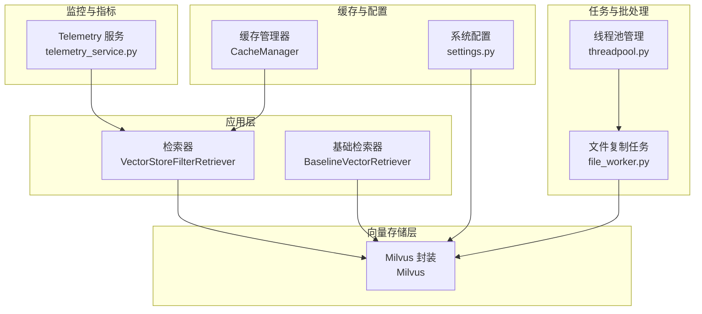
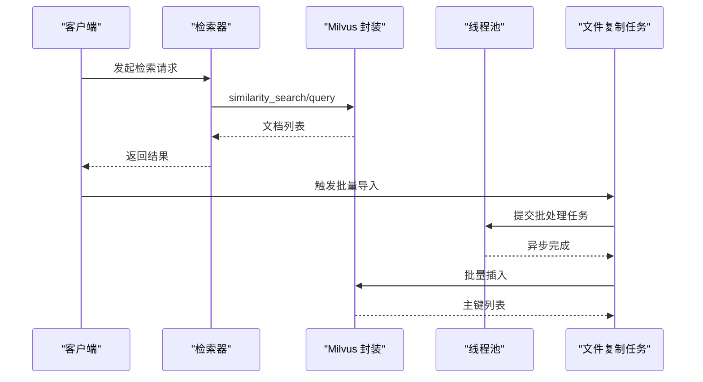
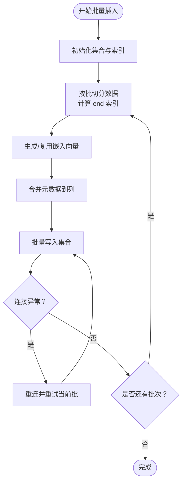
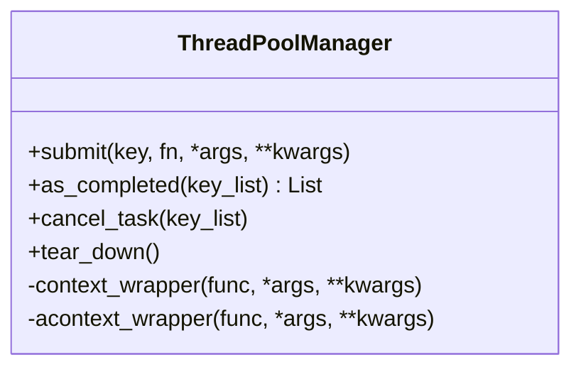
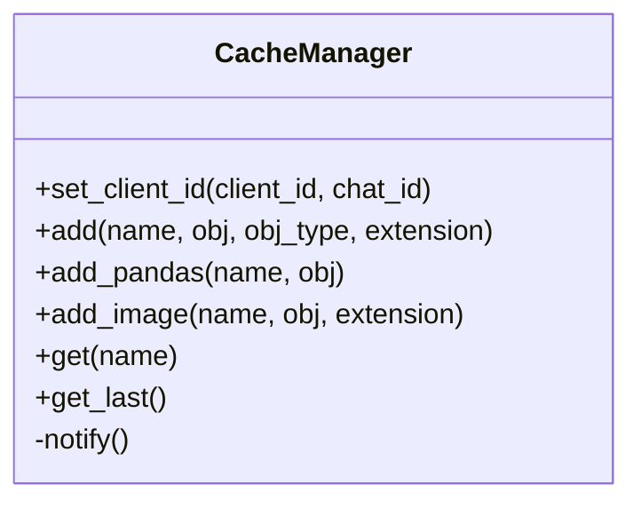
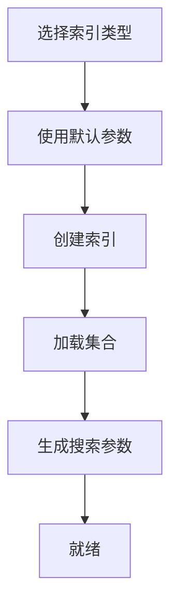
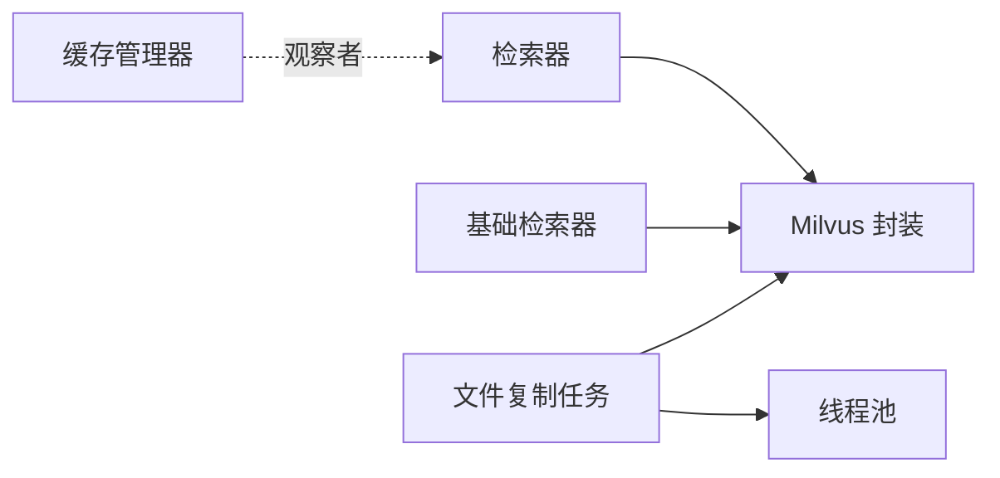

# 性能调优指南

<cite>
**本文引用的文件**
- [milvus.py](file://src/backend/bisheng_langchain/vectorstores/milvus.py)
- [milvus.py（初始化与索引）](file://src/backend/bisheng/core/vectorstore/__init__.py)
- [retriever.py](file://src/backend/bisheng_langchain/vectorstores/retriever.py)
- [baseline_vector_retriever.py](file://src/backend/bisheng/rag/init_retrievers/baseline_vector_retriever.py)
- [file_worker.py](file://src/backend/bisheng/worker/knowledge/file_worker.py)
- [settings.py](file://src/backend/bisheng/core/config/settings.py)
- [manager.py](file://src/backend/bisheng/core/cache/manager.py)
- [threadpool.py](file://src/backend/bisheng/utils/threadpool.py)
- [redis.conf](file://docker/redis/redis.conf)
- [telemetry_service.py](file://src/backend/bisheng/common/services/telemetry/telemetry_service.py)
- [config.py](file://src/backend/bisheng/common/models/config.py)
- [jcloud.yml](file://src/backend/bisheng/jcloud.yml)
</cite>

## 目录
1. [简介](#简介)
2. [项目结构](#项目结构)
3. [核心组件](#核心组件)
4. [架构总览](#架构总览)
5. [详细组件分析](#详细组件分析)
6. [依赖分析](#依赖分析)
7. [性能考量](#性能考量)
8. [故障排查指南](#故障排查指南)
9. [结论](#结论)
10. [附录](#附录)

## 简介
本指南面向向量存储系统的性能调优实践，围绕批量插入优化、查询缓存机制、内存管理、索引优化、监控指标采集、容量规划与故障恢复进行系统性梳理。结合仓库中的 Milvus 向量存储封装、检索器、工作流任务、线程池与缓存管理等模块，给出可落地的优化策略与实操建议。

## 项目结构
- 向量存储层：基于 Milvus 的封装，支持批量插入、索引与搜索参数配置。
- 检索层：提供相似度检索、阈值过滤与最大边际相关（MMR）检索。
- 工作流与任务：知识库复制、迁移与批量写入流程，包含分页与批处理。
- 并发与缓存：线程池管理与客户端级缓存管理器。
- 配置与监控：系统配置模型、Telemetry 指标索引与统计服务。

**图表来源**
- [milvus.py](file://src/backend/bisheng_langchain/vectorstores/milvus.py#L448-L544)
- [retriever.py](file://src/backend/bisheng_langchain/vectorstores/retriever.py#L18-L95)
- [baseline_vector_retriever.py](file://src/backend/bisheng/rag/init_retrievers/baseline_vector_retriever.py#L34-L57)
- [file_worker.py](file://src/backend/bisheng/worker/knowledge/file_worker.py#L25-L84)
- [threadpool.py](file://src/backend/bisheng/utils/threadpool.py#L12-L134)
- [manager.py](file://src/backend/bisheng/core/cache/manager.py#L53-L155)
- [settings.py](file://src/backend/bisheng/core/config/settings.py#L210-L346)
- [telemetry_service.py](file://src/backend/bisheng/common/services/telemetry/telemetry_service.py#L77-L111)

**章节来源**
- [milvus.py](file://src/backend/bisheng_langchain/vectorstores/milvus.py#L1-L967)
- [retriever.py](file://src/backend/bisheng_langchain/vectorstores/retriever.py#L1-L95)
- [baseline_vector_retriever.py](file://src/backend/bisheng/rag/init_retrievers/baseline_vector_retriever.py#L34-L57)
- [file_worker.py](file://src/backend/bisheng/worker/knowledge/file_worker.py#L1-L200)
- [threadpool.py](file://src/backend/bisheng/utils/threadpool.py#L1-L134)
- [manager.py](file://src/backend/bisheng/core/cache/manager.py#L1-L156)
- [settings.py](file://src/backend/bisheng/core/config/settings.py#L1-L346)
- [telemetry_service.py](file://src/backend/bisheng/common/services/telemetry/telemetry_service.py#L77-L111)

## 核心组件
- 向量存储封装（Milvus）：负责集合创建、字段推断、索引创建与加载、批量插入、搜索与 MMR 搜索。
- 检索器：支持相似度、阈值过滤与 MMR 三种检索模式，并可对结果进行访问控制过滤。
- 基础检索器：在初始化阶段从文档批量构建向量集合。
- 文件复制与批量写入：分页查询源知识库向量，按批写入目标集合，支持集合结构复用。
- 线程池与缓存：统一任务提交、等待与取消；客户端级缓存管理。
- 配置与监控：系统配置模型、Telemetry 指标索引初始化与同步。

**章节来源**
- [milvus.py](file://src/backend/bisheng_langchain/vectorstores/milvus.py#L26-L544)
- [retriever.py](file://src/backend/bisheng_langchain/vectorstores/retriever.py#L18-L95)
- [baseline_vector_retriever.py](file://src/backend/bisheng/rag/init_retrievers/baseline_vector_retriever.py#L34-L57)
- [file_worker.py](file://src/backend/bisheng/worker/knowledge/file_worker.py#L167-L198)
- [threadpool.py](file://src/backend/bisheng/utils/threadpool.py#L12-L134)
- [manager.py](file://src/backend/bisheng/core/cache/manager.py#L53-L155)
- [settings.py](file://src/backend/bisheng/core/config/settings.py#L210-L346)
- [telemetry_service.py](file://src/backend/bisheng/common/services/telemetry/telemetry_service.py#L77-L111)

## 架构总览
下图展示从检索请求到向量存储的端到端调用链路，以及批处理与缓存的关键节点。

**图表来源**
- [retriever.py](file://src/backend/bisheng_langchain/vectorstores/retriever.py#L45-L75)
- [milvus.py](file://src/backend/bisheng_langchain/vectorstores/milvus.py#L546-L740)
- [file_worker.py](file://src/backend/bisheng/worker/knowledge/file_worker.py#L25-L84)
- [threadpool.py](file://src/backend/bisheng/utils/threadpool.py#L23-L56)

## 详细组件分析

### 批量插入优化策略
- 批大小与超时：封装提供可配置的批大小与单批超时，避免单次插入过大导致阻塞或超时。
- 连接重试与异常处理：当连接断开时自动重连并重试当前批次，保证稳定性。
- 元数据合并：将元数据按字段聚合后转为列式批量写入，减少列构造成本。
- 初始化与索引：首次插入时根据嵌入维度与元数据推断集合结构并创建索引，提升后续查询效率。

**图表来源**
- [milvus.py](file://src/backend/bisheng_langchain/vectorstores/milvus.py#L448-L544)

**章节来源**
- [milvus.py](file://src/backend/bisheng_langchain/vectorstores/milvus.py#L448-L544)

### 并发控制与线程池
- 统一任务提交：支持同步与异步任务提交，记录等待与执行耗时，便于观测。
- 键控任务队列：以 key 分组管理 Future/Task，支持按组查询完成状态与取消未完成任务。
- 资源清理：提供优雅关闭接口，取消挂起任务并释放线程池。

**图表来源**
- [threadpool.py](file://src/backend/bisheng/utils/threadpool.py#L12-L134)

**章节来源**
- [threadpool.py](file://src/backend/bisheng/utils/threadpool.py#L12-L134)

### 内存管理与缓存
- 客户端级缓存：按 client_id 与 chat_id 维度隔离缓存，支持添加图片、Pandas 对象等，自动通知观察者。
- 缓存扩展：通过扩展名映射与类型识别，确保对象序列化与持久化的一致性。
- Redis 配置：启用主动碎片整理、客户端侧缓存与失效表上限，平衡内存占用与命中率。

**图表来源**
- [manager.py](file://src/backend/bisheng/core/cache/manager.py#L53-L155)
- [redis.conf](file://docker/redis/redis.conf#L821-L844)
- [redis.conf](file://docker/redis/redis.conf#L2179-L2205)

**章节来源**
- [manager.py](file://src/backend/bisheng/core/cache/manager.py#L53-L155)
- [redis.conf](file://docker/redis/redis.conf#L821-L844)
- [redis.conf](file://docker/redis/redis.conf#L2179-L2205)

### 查询缓存机制
- 缓存策略：基于客户端维度的内存缓存，适合短期高频重复查询场景。
- 失效策略：通过通知机制触发观察者更新，或在上下文切换时重置当前缓存。
- 命中率优化：结合检索器的搜索类型与参数，减少不必要的重复嵌入与查询。

**章节来源**
- [manager.py](file://src/backend/bisheng/core/cache/manager.py#L53-L155)
- [retriever.py](file://src/backend/bisheng_langchain/vectorstores/retriever.py#L18-L95)

### 索引优化技术
- 索引类型选择：默认使用 HNSW，若环境不支持则回退至 AUTOINDEX；支持 IVF_FLAT/SQ8/PQ、HNSW、RHNSW、IVF_HNSW、ANNOY 等。
- 参数调优：不同索引类型的 nprobe、ef、search_k 等参数在默认字典中定义，可根据数据规模与查询延迟动态调整。
- 索引重建：首次插入时自动创建索引并加载；如需重建，可删除旧集合后重新初始化。

**图表来源**
- [milvus.py](file://src/backend/bisheng_langchain/vectorstores/milvus.py#L383-L440)
- [milvus.py（初始化与索引）](file://src/backend/bisheng/core/vectorstore/__init__.py#L1-L12)

**章节来源**
- [milvus.py](file://src/backend/bisheng_langchain/vectorstores/milvus.py#L123-L184)
- [milvus.py](file://src/backend/bisheng_langchain/vectorstores/milvus.py#L383-L440)
- [milvus.py（初始化与索引）](file://src/backend/bisheng/core/vectorstore/__init__.py#L1-L12)

### 监控指标采集
- Telemetry 索引：首次使用时自动创建索引并处理并发创建冲突，确保指标写入可用。
- 指标范围：建议采集查询延迟、吞吐量、资源利用率（CPU/内存/网络）、向量存储写入耗时与错误率。
- 可视化：前端仪表盘组件可用于展示指标卡片与趋势。

**章节来源**
- [telemetry_service.py](file://src/backend/bisheng/common/services/telemetry/telemetry_service.py#L77-L111)

### 容量规划与扩容
- 数据增长预测：结合文件数量、单文件向量条数与集合大小估算，预留 20%-30% 空间。
- 硬件配置：CPU 核数与内存按并发与批大小线性增加；网络带宽满足 Milvus/Redis 吞吐。
- 扩容策略：水平扩展 Milvus 集群与 Redis 实例；通过配置中心动态调整批大小与线程池大小。

**章节来源**
- [settings.py](file://src/backend/bisheng/core/config/settings.py#L210-L346)
- [jcloud.yml](file://src/backend/bisheng/jcloud.yml#L1-L2)

### 故障恢复与断点续传
- 断点续传：文件复制任务采用分页拉取与逐页处理，失败重试后可从断点继续。
- 数据一致性：复制过程中同步元数据与主键字段，确保目标集合 schema 一致。
- 性能回滚：当索引或批大小调整导致性能下降，可回退到上一版本参数并记录变更日志。

**章节来源**
- [file_worker.py](file://src/backend/bisheng/worker/knowledge/file_worker.py#L41-L77)
- [file_worker.py](file://src/backend/bisheng/worker/knowledge/file_worker.py#L167-L198)

## 依赖分析
- 检索器依赖向量存储封装的相似度与 MMR 接口。
- 基础检索器在初始化阶段直接调用向量存储的批量构建接口。
- 文件复制任务依赖 Milvus 封装进行查询与批量写入。
- 线程池用于异步调度任务，降低主线程阻塞风险。
- 缓存管理器与检索器解耦，通过观察者模式实现松耦合。

**图表来源**
- [retriever.py](file://src/backend/bisheng_langchain/vectorstores/retriever.py#L18-L95)
- [baseline_vector_retriever.py](file://src/backend/bisheng/rag/init_retrievers/baseline_vector_retriever.py#L34-L57)
- [file_worker.py](file://src/backend/bisheng/worker/knowledge/file_worker.py#L25-L84)
- [threadpool.py](file://src/backend/bisheng/utils/threadpool.py#L12-L134)
- [manager.py](file://src/backend/bisheng/core/cache/manager.py#L53-L155)

**章节来源**
- [retriever.py](file://src/backend/bisheng_langchain/vectorstores/retriever.py#L18-L95)
- [baseline_vector_retriever.py](file://src/backend/bisheng/rag/init_retrievers/baseline_vector_retriever.py#L34-L57)
- [file_worker.py](file://src/backend/bisheng/worker/knowledge/file_worker.py#L25-L84)
- [threadpool.py](file://src/backend/bisheng/utils/threadpool.py#L12-L134)
- [manager.py](file://src/backend/bisheng/core/cache/manager.py#L53-L155)

## 性能考量
- 批大小：根据网络与 Milvus 写入能力调整，默认 1000 条/批，结合延迟与错误率微调。
- 并发：线程池大小与 CPU 核数匹配，避免过度并发导致上下文切换开销。
- 内存：启用 Redis 主动碎片整理与客户端侧缓存上限，防止内存膨胀。
- 索引：大数据集优先 HNSW/AUTOINDEX，小数据集可考虑 IVF 类型；按查询延迟与召回率权衡 nprobe/ef。
- 监控：建立查询延迟分布、吞吐量与资源利用率基线，异常时快速定位瓶颈。

[本节为通用指导，无需具体文件分析]

## 故障排查指南
- 插入异常：关注连接断开与 Milvus 异常日志，确认重连与批大小设置。
- 检索慢：检查索引类型与搜索参数，必要时重建索引或调整 nprobe/ef。
- 缓存问题：确认客户端维度缓存隔离与通知机制是否生效。
- 任务堆积：检查线程池完成状态与取消逻辑，避免长时间挂起任务。

**章节来源**
- [milvus.py](file://src/backend/bisheng_langchain/vectorstores/milvus.py#L530-L544)
- [threadpool.py](file://src/backend/bisheng/utils/threadpool.py#L58-L109)
- [manager.py](file://src/backend/bisheng/core/cache/manager.py#L53-L155)

## 结论
通过合理的批大小、并发与内存管理策略，结合 Milvus 索引参数调优与 Telemetry 指标监控，可在大规模向量数据场景下获得稳定且高效的性能表现。同时，完善的任务断点续传与故障恢复机制，能够保障生产环境的连续性与可靠性。

[本节为总结，无需具体文件分析]

## 附录
- 关键配置项参考：数据库连接、Redis 地址、向量存储与 Telemetry 配置。
- 建议的监控指标：P50/P95 查询延迟、QPS、写入速率、索引构建耗时、缓存命中率、内存碎片率。

**章节来源**
- [settings.py](file://src/backend/bisheng/core/config/settings.py#L210-L346)
- [config.py](file://src/backend/bisheng/common/models/config.py#L12-L89)