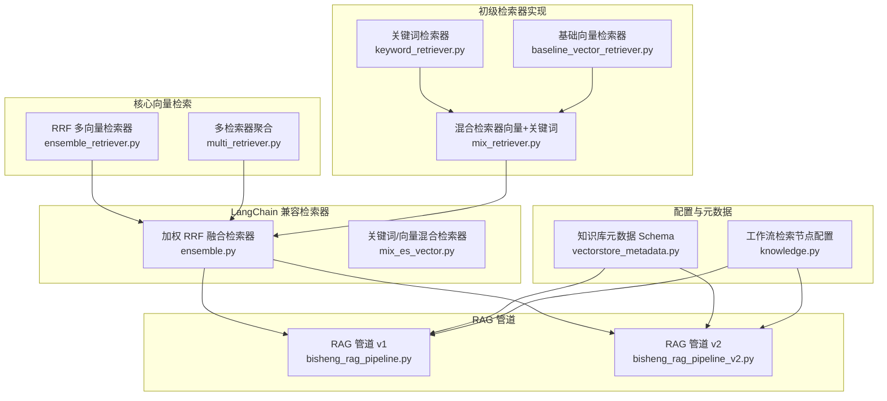
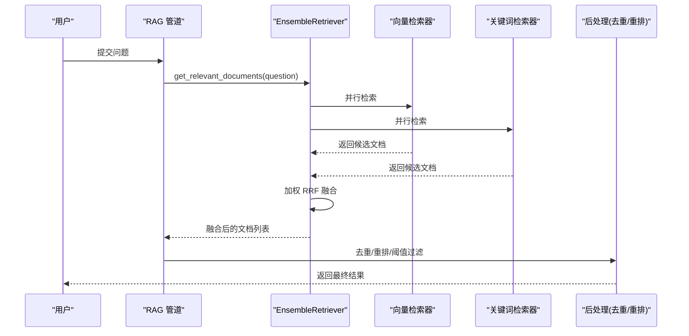
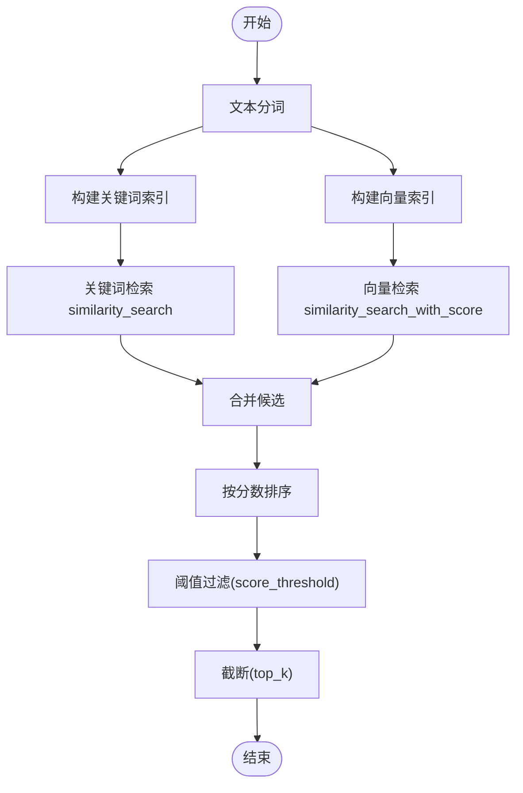
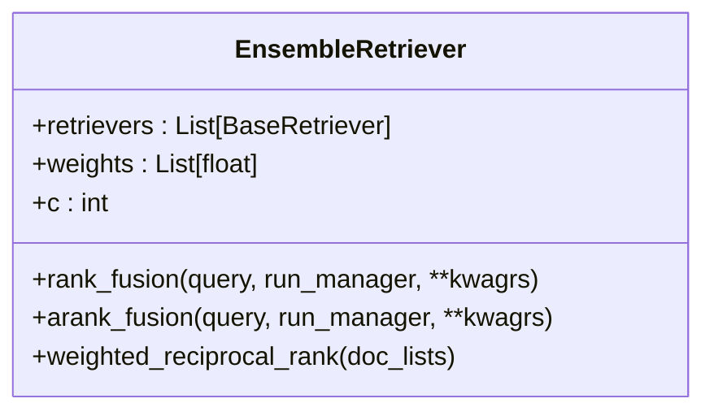
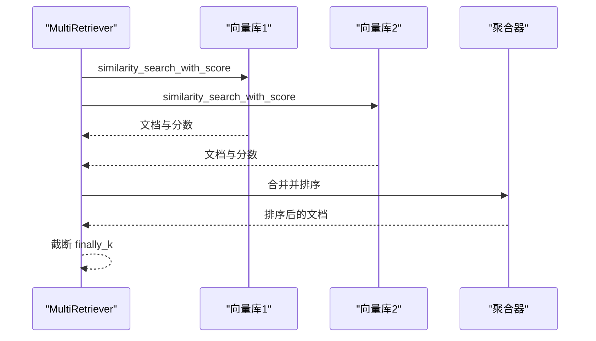
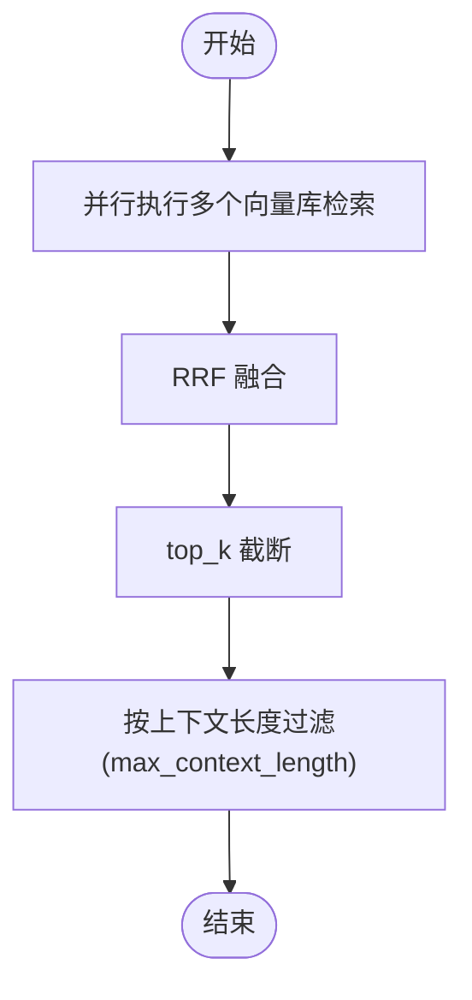
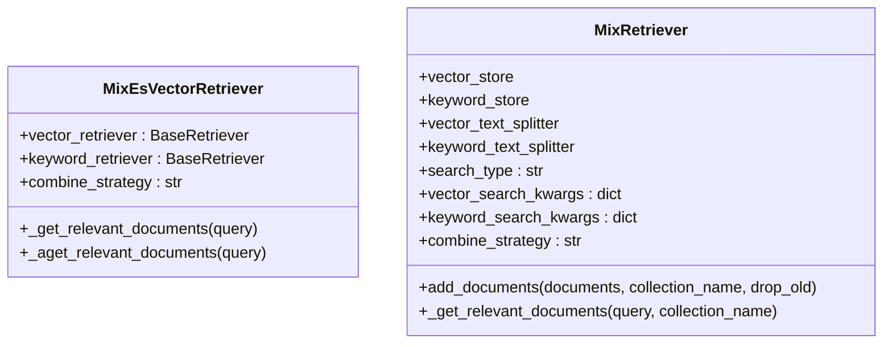
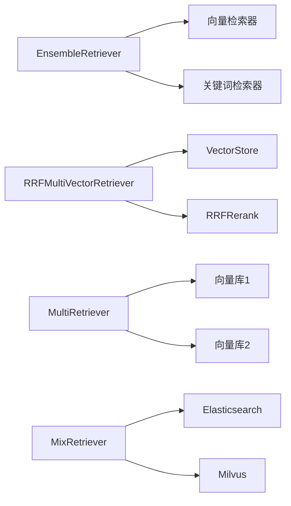

# 检索器架构设计

<cite>
**本文引用的文件**
- [ensemble_retriever.py](file://src/backend/bisheng/core/vectorstore/ensemble_retriever.py)
- [multi_retriever.py](file://src/backend/bisheng/core/vectorstore/multi_retriever.py)
- [ensemble.py](file://src/backend/bisheng_langchain/retrievers/ensemble.py)
- [mix_es_vector.py](file://src/backend/bisheng_langchain/retrievers/mix_es_vector.py)
- [mix_retriever.py](file://src/backend/bisheng_langchain/rag/init_retrievers/mix_retriever.py)
- [baseline_vector_retriever.py](file://src/backend/bisheng_langchain/rag/init_retrievers/baseline_vector_retriever.py)
- [keyword_retriever.py](file://src/backend/bisheng_langchain/rag/init_retrievers/keyword_retriever.py)
- [bisheng_rag_pipeline.py](file://src/backend/bisheng_langchain/rag/bisheng_rag_pipeline.py)
- [bisheng_rag_pipeline_v2.py](file://src/backend/bisheng_langchain/rag/bisheng_rag_pipeline_v2.py)
- [vectorstore_metadata.py](file://src/backend/bisheng/common/constants/vectorstore_metadata.py)
- [knowledge.py](file://src/backend/bisheng/workflow/common/knowledge.py)
</cite>

## 目录
1. [简介](#简介)
2. [项目结构](#项目结构)
3. [核心组件](#核心组件)
4. [架构总览](#架构总览)
5. [组件详解](#组件详解)
6. [依赖关系分析](#依赖关系分析)
7. [性能考量](#性能考量)
8. [故障排查指南](#故障排查指南)
9. [结论](#结论)
10. [附录](#附录)

## 简介
本技术文档系统性阐述检索器架构设计，覆盖以下主题：
- 单一检索器的工作原理：向量相似度计算、结果排序与阈值过滤机制
- 集成检索器（Ensemble Retriever）的设计模式：多检索器组合策略、权重分配与结果融合算法
- 多检索器（Multi Retriever）的实现机制：并行查询优化、结果去重与评分聚合
- 检索器配置选项：top_k 参数、score_threshold 设置与 metadata 过滤规则
- 检索器性能评估方法：召回率、精确率与响应时间的测量指标

## 项目结构
检索器相关代码主要分布在如下位置：
- 核心向量检索与融合：src/backend/bisheng/core/vectorstore
- LangChain 兼容检索器：src/backend/bisheng_langchain/retrievers
- 初级检索器实现（分词、向量/关键词检索）：src/backend/bisheng_langchain/rag/init_retrievers
- RAG 管道与后处理：src/backend/bisheng_langchain/rag
- 元数据与工作流配置：src/backend/bisheng/common/constants 与 src/backend/bisheng/workflow

图表来源
- [ensemble_retriever.py](file://src/backend/bisheng/core/vectorstore/ensemble_retriever.py#L26-L139)
- [multi_retriever.py](file://src/backend/bisheng/core/vectorstore/multi_retriever.py#L10-L48)
- [ensemble.py](file://src/backend/bisheng_langchain/retrievers/ensemble.py#L18-L191)
- [mix_es_vector.py](file://src/backend/bisheng_langchain/retrievers/mix_es_vector.py#L8-L113)
- [keyword_retriever.py](file://src/backend/bisheng_langchain/rag/init_retrievers/keyword_retriever.py#L10-L58)
- [baseline_vector_retriever.py](file://src/backend/bisheng_langchain/rag/init_retrievers/baseline_vector_retriever.py#L10-L58)
- [mix_retriever.py](file://src/backend/bisheng_langchain/rag/init_retrievers/mix_retriever.py#L10-L103)
- [bisheng_rag_pipeline.py](file://src/backend/bisheng_langchain/rag/bisheng_rag_pipeline.py#L26-L200)
- [bisheng_rag_pipeline_v2.py](file://src/backend/bisheng_langchain/rag/bisheng_rag_pipeline_v2.py#L29-L200)
- [vectorstore_metadata.py](file://src/backend/bisheng/common/constants/vectorstore_metadata.py#L1-L18)
- [knowledge.py](file://src/backend/bisheng/workflow/common/knowledge.py#L185-L211)

章节来源
- [ensemble_retriever.py](file://src/backend/bisheng/core/vectorstore/ensemble_retriever.py#L1-L139)
- [multi_retriever.py](file://src/backend/bisheng/core/vectorstore/multi_retriever.py#L1-L48)
- [ensemble.py](file://src/backend/bisheng_langchain/retrievers/ensemble.py#L1-L191)
- [mix_es_vector.py](file://src/backend/bisheng_langchain/retrievers/mix_es_vector.py#L1-L113)
- [keyword_retriever.py](file://src/backend/bisheng_langchain/rag/init_retrievers/keyword_retriever.py#L1-L58)
- [baseline_vector_retriever.py](file://src/backend/bisheng_langchain/rag/init_retrievers/baseline_vector_retriever.py#L1-L58)
- [mix_retriever.py](file://src/backend/bisheng_langchain/rag/init_retrievers/mix_retriever.py#L1-L103)
- [bisheng_rag_pipeline.py](file://src/backend/bisheng_langchain/rag/bisheng_rag_pipeline.py#L1-L200)
- [bisheng_rag_pipeline_v2.py](file://src/backend/bisheng_langchain/rag/bisheng_rag_pipeline_v2.py#L1-L200)
- [vectorstore_metadata.py](file://src/backend/bisheng/common/constants/vectorstore_metadata.py#L1-L18)
- [knowledge.py](file://src/backend/bisheng/workflow/common/knowledge.py#L185-L211)

## 核心组件
- RRF 多向量检索器（RRFMultiVectorRetriever）
  - 基于 Reciprocal Rank Fusion 的多向量检索器，支持同步/异步调用与按上下文长度截断
  - 关键参数：vector_store_params（向量库实例、检索参数、权重）、top_k、rrf_c、remove_zero_score、max_context_length
- 加权 RRF 融合检索器（EnsembleRetriever）
  - 对多个检索器的结果进行加权 RRF 融合，支持等权或自定义权重
  - 关键参数：retrievers、weights、c
- 多检索器聚合（MultiRetriever）
  - 并行执行多个向量库的 similarity_search_with_score，统一排序与截断
  - 关键参数：vectors、search_kwargs、finally_k
- 混合检索器（MixRetriever、MixEsVectorRetriever）
  - 向量与关键词检索器的组合策略：keyword_front、vector_front、mix
  - 支持分词与索引构建、检索与结果拼接
- 初级检索器
  - KeywordRetriever：关键词检索
  - BaselineVectorRetriever：基础向量检索
  - MixRetriever：向量+关键词混合检索

章节来源
- [ensemble_retriever.py](file://src/backend/bisheng/core/vectorstore/ensemble_retriever.py#L18-L139)
- [ensemble.py](file://src/backend/bisheng_langchain/retrievers/ensemble.py#L18-L191)
- [multi_retriever.py](file://src/backend/bisheng/core/vectorstore/multi_retriever.py#L10-L48)
- [mix_es_vector.py](file://src/backend/bisheng_langchain/retrievers/mix_es_vector.py#L8-L113)
- [mix_retriever.py](file://src/backend/bisheng_langchain/rag/init_retrievers/mix_retriever.py#L10-L103)
- [keyword_retriever.py](file://src/backend/bisheng_langchain/rag/init_retrievers/keyword_retriever.py#L10-L58)
- [baseline_vector_retriever.py](file://src/backend/bisheng_langchain/rag/init_retrievers/baseline_vector_retriever.py#L10-L58)

## 架构总览
检索器架构分为三层：
- 数据准备层：文本分词、向量/关键词索引构建
- 检索执行层：单一检索器、多检索器聚合、融合检索器
- 结果后处理层：去重、重排、阈值过滤、上下文长度限制

图表来源
- [ensemble.py](file://src/backend/bisheng_langchain/retrievers/ensemble.py#L44-L150)
- [bisheng_rag_pipeline.py](file://src/backend/bisheng_langchain/rag/bisheng_rag_pipeline.py#L167-L206)
- [bisheng_rag_pipeline_v2.py](file://src/backend/bisheng_langchain/rag/bisheng_rag_pipeline_v2.py#L200-L207)

## 组件详解

### 单一检索器工作原理
单一检索器负责从向量库或关键词库中召回候选文档，并进行排序与过滤：
- 向量相似度计算
  - 使用 similarity_search 或 similarity_search_with_score 获取候选与分数
  - 可通过 search_kwargs 控制 top_k、score_threshold 等参数
- 结果排序
  - MultiRetriever 对所有检索器返回的 (文档, 分数) 进行整体排序
  - RRFMultiVectorRetriever 在融合后再按 top_k 截断
- 阈值过滤机制
  - score_threshold 可在 search_kwargs 中设置
  - RRFMultiVectorRetriever 支持 remove_zero_score 移除零分项
  - MultiRetriever 支持 finally_k 截断

图表来源
- [multi_retriever.py](file://src/backend/bisheng/core/vectorstore/multi_retriever.py#L16-L47)
- [baseline_vector_retriever.py](file://src/backend/bisheng_langchain/rag/init_retrievers/baseline_vector_retriever.py#L44-L57)
- [keyword_retriever.py](file://src/backend/bisheng_langchain/rag/init_retrievers/keyword_retriever.py#L44-L57)

章节来源
- [multi_retriever.py](file://src/backend/bisheng/core/vectorstore/multi_retriever.py#L10-L48)
- [baseline_vector_retriever.py](file://src/backend/bisheng_langchain/rag/init_retrievers/baseline_vector_retriever.py#L10-L58)
- [keyword_retriever.py](file://src/backend/bisheng_langchain/rag/init_retrievers/keyword_retriever.py#L10-L58)

### 集成检索器（Ensemble Retriever）设计模式
- 组合策略
  - 多个检索器并行执行，结果通过加权 RRF 融合
  - 支持等权（自动均分）或自定义权重
- 权重分配
  - weights 参数控制各检索器贡献度；c 控制秩次融合的平滑常数
- 结果融合算法
  - 计算每个文档在各检索器列表中的秩次，加权求和，按总分降序排列
  - 支持同步与异步两种执行路径

图表来源
- [ensemble.py](file://src/backend/bisheng_langchain/retrievers/ensemble.py#L18-L191)

章节来源
- [ensemble.py](file://src/backend/bisheng_langchain/retrievers/ensemble.py#L18-L191)

### 多检索器（Multi Retriever）实现机制
- 并行查询优化
  - 使用 asyncio.gather 并发执行多个向量库的 similarity_search_with_score
- 结果去重
  - RAG 管道在检索后对 page_content 去重
- 评分聚合
  - 将所有 (文档, 分数) 合并后按分数升序排序，再截断 finally_k

图表来源
- [multi_retriever.py](file://src/backend/bisheng/core/vectorstore/multi_retriever.py#L26-L40)

章节来源
- [multi_retriever.py](file://src/backend/bisheng/core/vectorstore/multi_retriever.py#L10-L48)
- [bisheng_rag_pipeline.py](file://src/backend/bisheng_langchain/rag/bisheng_rag_pipeline.py#L181-L193)

### RRF 多向量检索器（RRFMultiVectorRetriever）
- 设计要点
  - 将多个 VectorStore 实例转为检索器并行执行
  - 使用 RRFRerank 对多路结果进行融合，支持 remove_zero_score 与 top_k 截断
  - 支持按最大上下文长度 max_context_length 进行内容长度过滤
- 执行流程
  - 并行获取各检索器结果
  - RRF 融合后截断 top_k
  - 再按 max_context_length 进行长度过滤

图表来源
- [ensemble_retriever.py](file://src/backend/bisheng/core/vectorstore/ensemble_retriever.py#L64-L138)

章节来源
- [ensemble_retriever.py](file://src/backend/bisheng/core/vectorstore/ensemble_retriever.py#L26-L139)

### 混合检索器（关键词/向量）
- MixEsVectorRetriever
  - 将关键词与向量检索器的结果按策略拼接：keyword_front、vector_front、mix
- MixRetriever
  - 在索引阶段分别构建关键词与向量子索引，检索时按策略合并

图表来源
- [mix_es_vector.py](file://src/backend/bisheng_langchain/retrievers/mix_es_vector.py#L8-L113)
- [mix_retriever.py](file://src/backend/bisheng_langchain/rag/init_retrievers/mix_retriever.py#L10-L103)

章节来源
- [mix_es_vector.py](file://src/backend/bisheng_langchain/retrievers/mix_es_vector.py#L8-L113)
- [mix_retriever.py](file://src/backend/bisheng_langchain/rag/init_retrievers/mix_retriever.py#L10-L103)

### 检索器配置选项
- top_k
  - RRFMultiVectorRetriever：控制最终返回文档数量
  - MultiRetriever：通过 finally_k 控制最终返回数量
- score_threshold
  - 可通过检索器的 search_kwargs 设置阈值，过滤低分文档
- metadata 过滤规则
  - 工作流节点支持 metadata_filter 条件，结合 advanced_retrieval_switch 中的参数进行检索
  - 管道侧可对检索结果进行去重与重排

章节来源
- [ensemble_retriever.py](file://src/backend/bisheng/core/vectorstore/ensemble_retriever.py#L35-L38)
- [multi_retriever.py](file://src/backend/bisheng/core/vectorstore/multi_retriever.py#L14-L14)
- [knowledge.py](file://src/backend/bisheng/workflow/common/knowledge.py#L185-L211)
- [bisheng_rag_pipeline.py](file://src/backend/bisheng_langchain/rag/bisheng_rag_pipeline.py#L181-L193)

### 检索器性能评估方法
- 指标定义
  - 召回率（Recall）：检索到的相关文档数 / 全部相关文档数
  - 精确率（Precision）：检索到的相关文档数 / 检索到的全部文档数
  - 响应时间（Latency）：从提交问题到返回最终结果的总耗时
- 测量建议
  - 使用 RAG 管道的 retrieval_and_rerank 步骤记录检索耗时
  - 对不同 top_k、score_threshold、权重组合进行 A/B 测试
  - 结合元数据过滤条件评估不同策略下的召回与精确率

章节来源
- [bisheng_rag_pipeline.py](file://src/backend/bisheng_langchain/rag/bisheng_rag_pipeline.py#L167-L206)
- [bisheng_rag_pipeline_v2.py](file://src/backend/bisheng_langchain/rag/bisheng_rag_pipeline_v2.py#L200-L207)

## 依赖关系分析
- 组件耦合
  - EnsembleRetriever 依赖多个具体检索器实现
  - RRFMultiVectorRetriever 依赖 VectorStore 实例与 RRFRerank
  - MixRetriever/MixEsVectorRetriever 依赖关键词与向量检索器
- 外部依赖
  - 向量库（Milvus）、关键词库（Elasticsearch）
  - 文本分词器（TextSplitter）
  - RAG 管道负责检索后处理（去重、重排）

图表来源
- [ensemble.py](file://src/backend/bisheng_langchain/retrievers/ensemble.py#L18-L191)
- [ensemble_retriever.py](file://src/backend/bisheng/core/vectorstore/ensemble_retriever.py#L26-L139)
- [multi_retriever.py](file://src/backend/bisheng/core/vectorstore/multi_retriever.py#L10-L48)
- [mix_retriever.py](file://src/backend/bisheng_langchain/rag/init_retrievers/mix_retriever.py#L10-L103)

章节来源
- [ensemble.py](file://src/backend/bisheng_langchain/retrievers/ensemble.py#L18-L191)
- [ensemble_retriever.py](file://src/backend/bisheng/core/vectorstore/ensemble_retriever.py#L26-L139)
- [multi_retriever.py](file://src/backend/bisheng/core/vectorstore/multi_retriever.py#L10-L48)
- [mix_retriever.py](file://src/backend/bisheng_langchain/rag/init_retrievers/mix_retriever.py#L10-L103)

## 性能考量
- 并行化
  - EnsembleRetriever 与 MultiRetriever 支持异步并发，显著降低端到端延迟
- 截断与过滤
  - top_k 与 max_context_length 可有效控制输出规模，避免上下文过长
  - score_threshold 可减少无效文档进入后续流程
- 去重与重排
  - 管道侧去重避免重复内容影响最终质量
  - RRF 融合提升排序稳定性与多样性

## 故障排查指南
- 常见问题
  - 检索器权重不一致导致融合异常：检查 weights 与 c 参数
  - top_k 设置过小导致信息不足：适当增大 top_k 并结合 max_context_length
  - score_threshold 过高导致召回不足：根据业务调整阈值
  - 元数据过滤条件不生效：确认工作流节点 metadata_filter 配置
- 日志与回调
  - RRFMultiVectorRetriever 在检索失败时记录异常并继续执行其他检索器
  - RAG 管道记录检索前后文档数量变化，便于定位去重与重排问题

章节来源
- [ensemble_retriever.py](file://src/backend/bisheng/core/vectorstore/ensemble_retriever.py#L75-L78)
- [bisheng_rag_pipeline.py](file://src/backend/bisheng_langchain/rag/bisheng_rag_pipeline.py#L181-L193)
- [knowledge.py](file://src/backend/bisheng/workflow/common/knowledge.py#L185-L211)

## 结论
本架构以 LangChain 兼容的检索器为核心，结合 RRF 融合、并行检索与后处理策略，实现了高效、可扩展的检索系统。通过合理的配置与评估方法，可在不同场景下平衡召回率、精确率与响应时间。

## 附录
- 元数据 Schema（用于检索与过滤）
  - 包含 document_id、document_name、abstract、chunk_index、bbox、page、knowledge_id、upload_time、update_time、uploader、updater、user_metadata 等字段

章节来源
- [vectorstore_metadata.py](file://src/backend/bisheng/common/constants/vectorstore_metadata.py#L3-L17)