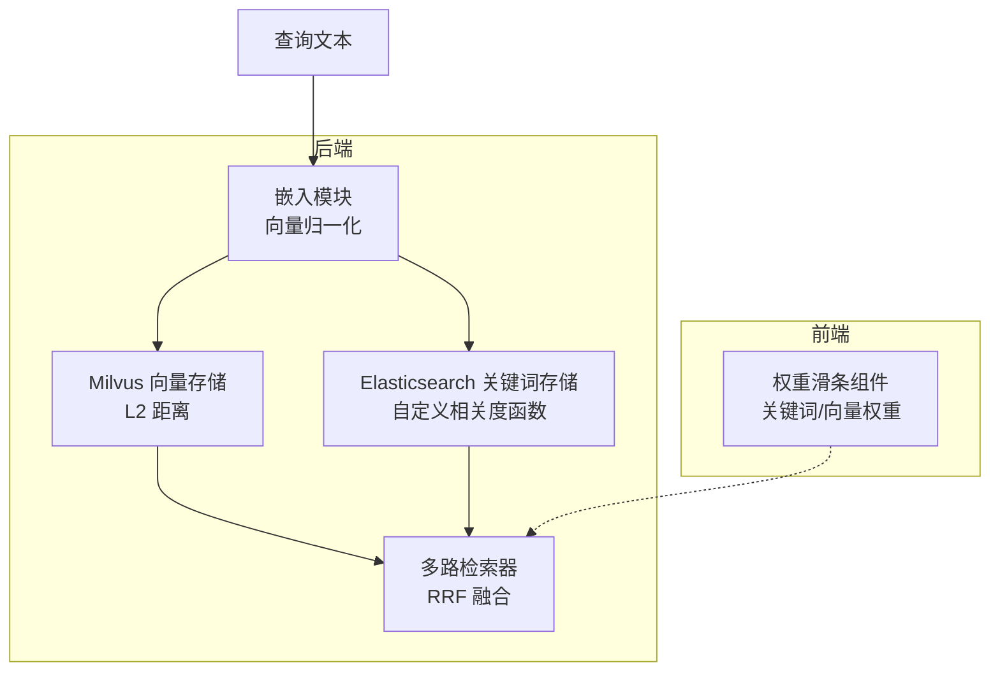
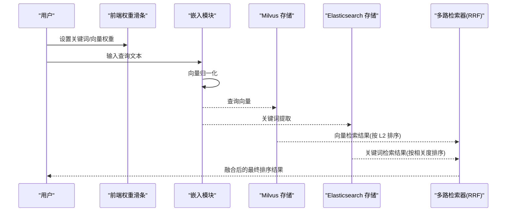
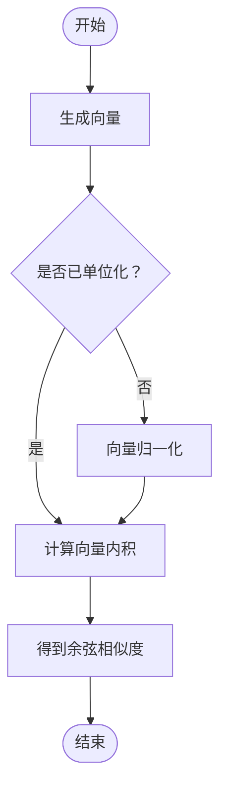
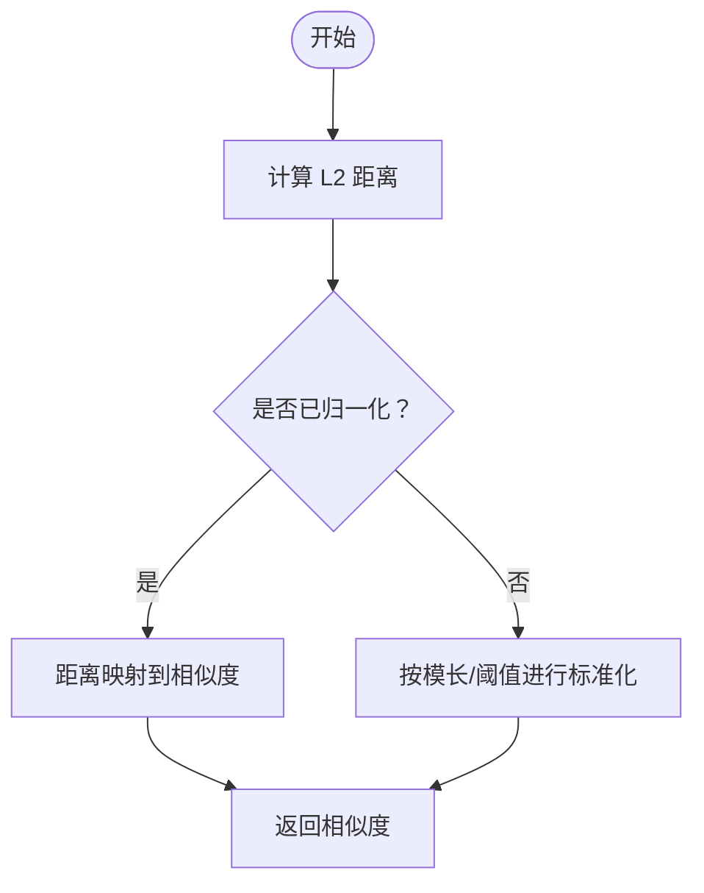
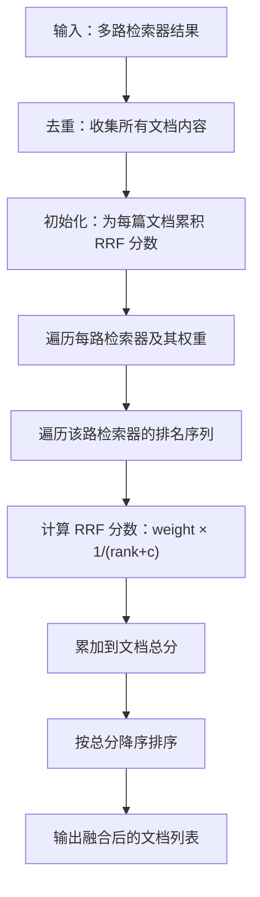
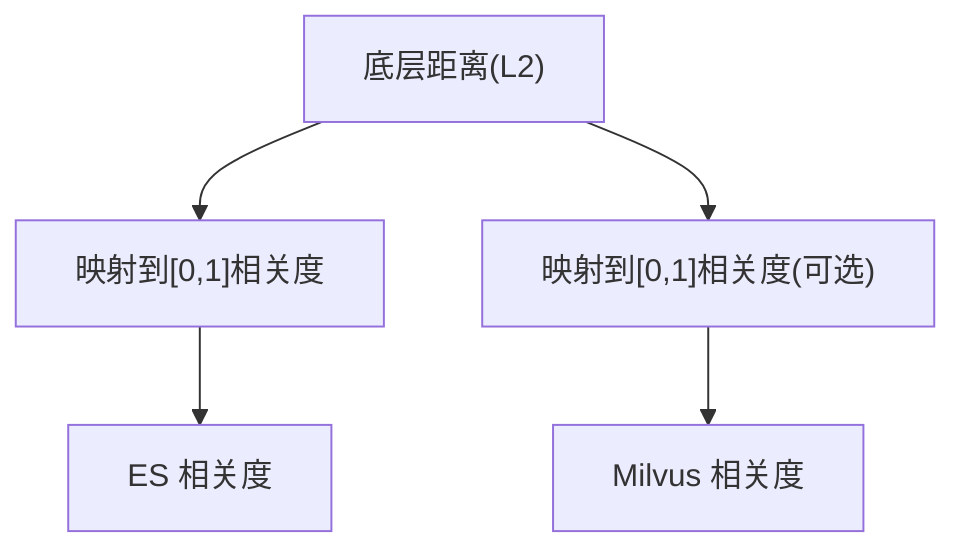
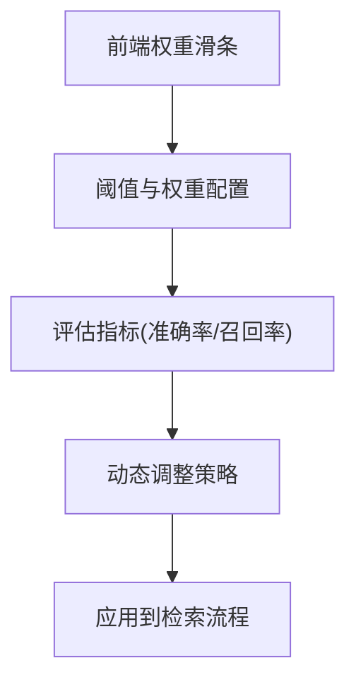
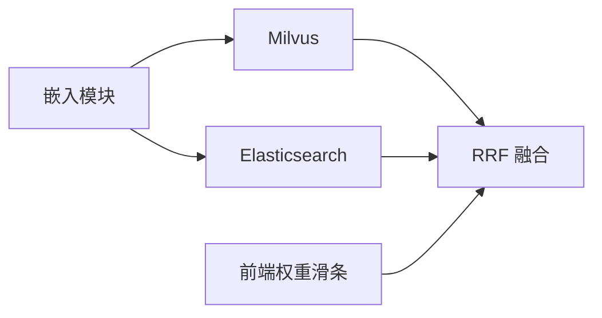

# 相似度计算算法

<cite>
**本文引用的文件**
- [embedding.py](file://src/backend/bisheng/llm/domain/llm/embedding.py)
- [milvus.py](file://src/backend/bisheng_langchain/vectorstores/milvus.py)
- [custom.py](file://src/backend/bisheng/interface/vector_store/custom.py)
- [ensemble.py](file://src/backend/bisheng_langchain/retrievers/ensemble.py)
- [RetrievalWeightSlider.tsx](file://src/frontend/platform/src/pages/BuildPage/flow/FlowNode/component/RetrievalWeightSlider.tsx)
</cite>

## 目录
1. [引言](#引言)
2. [项目结构](#项目结构)
3. [核心组件](#核心组件)
4. [架构总览](#架构总览)
5. [详细组件分析](#详细组件分析)
6. [依赖关系分析](#依赖关系分析)
7. [性能考量](#性能考量)
8. [故障排查指南](#故障排查指南)
9. [结论](#结论)
10. [附录](#附录)

## 引言
本技术文档聚焦于相似度计算与检索融合算法在系统中的实现与应用，围绕以下目标展开：
- 深入解释余弦相似度的数学原理与实现要点（向量归一化、角度计算）。
- 解释欧几里得距离（L2 距离）的计算方式与标准化策略。
- 说明内积相似度的应用场景、缩放因子调整与负值处理机制。
- 对比不同相似度算法的性能特征（时间复杂度、空间复杂度、精度差异）与适用场景。
- 提供相似度阈值设置建议（经验参考、动态调整策略、异常值处理）。
- 文档化评分聚合算法（加权平均、最大值合并、贝叶斯融合思想的近似实践）。

## 项目结构
本项目在后端通过嵌入模型生成向量，并在向量存储层以 L2 距离进行相似度检索；前端提供权重调节界面，支持多路检索器的融合排序。关键位置如下：
- 嵌入与向量归一化：后端嵌入模块负责对向量进行单位化，确保余弦相似度的有效性。
- 向量存储与检索：Milvus/Elasticsearch 等向量存储默认使用 L2 距离，需配合向量归一化或距离转换。
- 多路检索融合：基于加权倒数排名融合（RRF）对多个检索器结果进行重排。
- 前端权重调节：提供关键词与向量检索权重滑条，便于在线调参。

**图表来源**
- [embedding.py](file://src/backend/bisheng/llm/domain/llm/embedding.py#L161-L178)
- [milvus.py](file://src/backend/bisheng_langchain/vectorstores/milvus.py#L123-L184)
- [custom.py](file://src/backend/bisheng/interface/vector_store/custom.py#L52-L113)
- [ensemble.py](file://src/backend/bisheng_langchain/retrievers/ensemble.py#L18-L191)
- [RetrievalWeightSlider.tsx](file://src/frontend/platform/src/pages/BuildPage/flow/FlowNode/component/RetrievalWeightSlider.tsx#L168-L186)

**章节来源**
- [embedding.py](file://src/backend/bisheng/llm/domain/llm/embedding.py#L161-L178)
- [milvus.py](file://src/backend/bisheng_langchain/vectorstores/milvus.py#L123-L184)
- [custom.py](file://src/backend/bisheng/interface/vector_store/custom.py#L52-L113)
- [ensemble.py](file://src/backend/bisheng_langchain/retrievers/ensemble.py#L18-L191)
- [RetrievalWeightSlider.tsx](file://src/frontend/platform/src/pages/BuildPage/flow/FlowNode/component/RetrievalWeightSlider.tsx#L168-L186)

## 核心组件
- 嵌入与向量归一化：统一将嵌入向量归一化为单位向量，保证余弦相似度与角度计算的稳定性与可比性。
- 向量存储与检索：Milvus 默认使用 L2 距离；ES 关键词存储提供自定义相关度函数，用于将距离映射到 [0,1] 的相关度。
- 多路检索融合：采用加权倒数排名融合（RRF），对来自不同检索器的结果进行统一打分与排序。
- 前端权重调节：提供关键词与向量检索权重的在线调节，便于快速评估不同策略的效果。

**章节来源**
- [embedding.py](file://src/backend/bisheng/llm/domain/llm/embedding.py#L161-L178)
- [milvus.py](file://src/backend/bisheng_langchain/vectorstores/milvus.py#L123-L184)
- [custom.py](file://src/backend/bisheng/interface/vector_store/custom.py#L510-L513)
- [ensemble.py](file://src/backend/bisheng_langchain/retrievers/ensemble.py#L152-L191)
- [RetrievalWeightSlider.tsx](file://src/frontend/platform/src/pages/BuildPage/flow/FlowNode/component/RetrievalWeightSlider.tsx#L168-L186)

## 架构总览
下图展示了从查询到最终排序输出的关键流程：嵌入生成、向量归一化、向量存储检索、多路融合与前端权重调节。

**图表来源**
- [embedding.py](file://src/backend/bisheng/llm/domain/llm/embedding.py#L161-L178)
- [milvus.py](file://src/backend/bisheng_langchain/vectorstores/milvus.py#L123-L184)
- [custom.py](file://src/backend/bisheng/interface/vector_store/custom.py#L510-L513)
- [ensemble.py](file://src/backend/bisheng_langchain/retrievers/ensemble.py#L18-L191)
- [RetrievalWeightSlider.tsx](file://src/frontend/platform/src/pages/BuildPage/flow/FlowNode/component/RetrievalWeightSlider.tsx#L168-L186)

## 详细组件分析

### 余弦相似度与向量归一化
- 数学原理
  - 余弦相似度通过两个向量的点积除以它们的 L2 范数乘积得到，取值范围 [-1, 1]，常用于衡量向量夹角。
  - 在单位向量空间中，余弦相似度等价于向量内积，且不受向量模长影响，适合语义相似度比较。
- 实现要点
  - 嵌入模块在生成文档向量与查询向量后，若范数不为 1，则进行归一化处理，确保后续相似度计算稳定。
  - 归一化策略能有效避免高维稀疏向量中“维度诅咒”带来的偏差。
- 角度计算
  - 余弦相似度 cosθ = (A·B)/(|A||B|)，在单位向量下简化为 A·B。
  - 该实现直接依赖向量内积，无需额外三角函数计算，效率高。

**图表来源**
- [embedding.py](file://src/backend/bisheng/llm/domain/llm/embedding.py#L161-L178)

**章节来源**
- [embedding.py](file://src/backend/bisheng/llm/domain/llm/embedding.py#L161-L178)

### 欧几里得距离（L2 距离）与标准化策略
- 计算方法
  - L2 距离定义为向量差的平方和再开方，即 ||A − B||₂。
  - 在 Milvus 中默认使用 L2 距离，且注释明确建议在使用 L2/IP 时对数据进行归一化。
- 标准化策略
  - 若向量已归一化，则 L2 距离与余弦相似度存在单调关系：距离越小，相似度越高。
  - 若未归一化，L2 距离会受向量模长影响，需结合业务场景选择合适的阈值或进行归一化。
- 检索参数
  - Milvus 默认搜索参数包含 metric_type=L2 以及若干索引特定参数（如 nprobe、ef、search_k），这些参数直接影响召回与性能。

**图表来源**
- [milvus.py](file://src/backend/bisheng_langchain/vectorstores/milvus.py#L123-L184)

**章节来源**
- [milvus.py](file://src/backend/bisheng_langchain/vectorstores/milvus.py#L123-L184)

### 内积相似度的应用与负值处理
- 应用场景
  - 在单位向量空间中，内积即余弦相似度，广泛用于语义检索与推荐系统。
  - 当向量未归一化时，内积会受向量模长影响，适合作为“强度”指标而非“方向”指标。
- 缩放因子调整
  - 可通过缩放因子对内积结果进行线性变换，以适配不同尺度的评分分布。
- 负值处理
  - 若出现负内积，通常表示两向量夹角大于 90°，在相似度语境下可视为“负相关”。常见做法包括：
    - 将负值置零或映射到 [0,1] 区间；
    - 使用平移与缩放，使最小内积映射到 0，最大内积映射到 1；
    - 在融合阶段对负值进行抑制或单独建模。

（本节为通用算法指导，不直接对应具体源码）

### 多路检索融合（加权倒数排名融合 RRF）
- 算法思想
  - 对每个检索器返回的列表，按其排名赋予分数 weight × (1/(rank + c))，然后对所有文档的分数求和并排序。
  - 参数 c 控制低秩项的影响，c 越大，低秩项权重越小；权重列表决定各检索器的影响力。
- 实现要点
  - 统一去重：对所有输入列表的文档内容进行集合去重，避免重复计分。
  - 分数聚合：对每个文档累计各检索器贡献的 RRF 分数。
  - 结果排序：按总分降序输出。

**图表来源**
- [ensemble.py](file://src/backend/bisheng_langchain/retrievers/ensemble.py#L152-L191)

**章节来源**
- [ensemble.py](file://src/backend/bisheng_langchain/retrievers/ensemble.py#L18-L191)

### 相关度函数与距离到相关度映射
- Elasticsearch 相关度函数
  - 自定义相关度函数将底层距离映射到 [0,1] 的相关度，便于统一展示与阈值设定。
  - 该函数在相似度搜索时被调用，作为最终相关度输出的一部分。
- Milvus 相关度
  - Milvus 默认使用 L2 距离；当向量归一化后，可直接将距离转换为相似度，或在上层逻辑中进行映射。

**图表来源**
- [custom.py](file://src/backend/bisheng/interface/vector_store/custom.py#L510-L513)
- [milvus.py](file://src/backend/bisheng_langchain/vectorstores/milvus.py#L123-L184)

**章节来源**
- [custom.py](file://src/backend/bisheng/interface/vector_store/custom.py#L510-L513)
- [milvus.py](file://src/backend/bisheng_langchain/vectorstores/milvus.py#L123-L184)

### 前端权重调节与阈值设置
- 权重调节
  - 前端提供关键词与向量检索权重滑条，支持在线调整两者在最终排序中的占比。
- 阈值设置建议
  - 初始阈值可参考领域经验（例如 0.3~0.7），结合业务召回率与准确率进行动态调整。
  - 异常值处理：对极低或极高相似度的样本进行截断或分箱，减少极端值对整体效果的影响。
  - 动态调整策略：根据实时反馈曲线（如精确率-召回率曲线）自动优化阈值与权重组合。

**图表来源**
- [RetrievalWeightSlider.tsx](file://src/frontend/platform/src/pages/BuildPage/flow/FlowNode/component/RetrievalWeightSlider.tsx#L168-L186)

**章节来源**
- [RetrievalWeightSlider.tsx](file://src/frontend/platform/src/pages/BuildPage/flow/FlowNode/component/RetrievalWeightSlider.tsx#L168-L186)

## 依赖关系分析
- 嵌入模块依赖多种外部嵌入服务（OpenAI、Azure、DashScope 等），并在生成向量后执行统一归一化。
- Milvus/Elasticsearch 作为向量与关键词检索后端，默认使用 L2 距离；ES 提供自定义相关度函数。
- EnsembleRetriever 作为多路检索融合组件，接收多个检索器结果并进行 RRF 聚合。
- 前端权重滑条组件与后端检索流程解耦，通过配置参数影响最终排序。

**图表来源**
- [embedding.py](file://src/backend/bisheng/llm/domain/llm/embedding.py#L161-L178)
- [milvus.py](file://src/backend/bisheng_langchain/vectorstores/milvus.py#L123-L184)
- [custom.py](file://src/backend/bisheng/interface/vector_store/custom.py#L510-L513)
- [ensemble.py](file://src/backend/bisheng_langchain/retrievers/ensemble.py#L18-L191)
- [RetrievalWeightSlider.tsx](file://src/frontend/platform/src/pages/BuildPage/flow/FlowNode/component/RetrievalWeightSlider.tsx#L168-L186)

**章节来源**
- [embedding.py](file://src/backend/bisheng/llm/domain/llm/embedding.py#L161-L178)
- [milvus.py](file://src/backend/bisheng_langchain/vectorstores/milvus.py#L123-L184)
- [custom.py](file://src/backend/bisheng/interface/vector_store/custom.py#L510-L513)
- [ensemble.py](file://src/backend/bisheng_langchain/retrievers/ensemble.py#L18-L191)
- [RetrievalWeightSlider.tsx](file://src/frontend/platform/src/pages/BuildPage/flow/FlowNode/component/RetrievalWeightSlider.tsx#L168-L186)

## 性能考量
- 时间复杂度
  - 向量归一化：O(n×d)，n 为向量数量，d 为维度。
  - L2 距离检索：取决于索引类型与参数（如 nprobe、ef、search_k），通常为 O(k×d) 或更高，k 为候选数量。
  - RRF 聚合：O(Σ r_i)，r_i 为第 i 路检索器返回的文档数，随后一次排序 O(N log N)。
- 空间复杂度
  - 向量存储：O(N×d)，N 为向量总数，d 为维度。
  - RRF 聚合：O(N) 用于文档去重与分数累计。
- 精度与稳定性
  - 归一化可提升余弦相似度的稳定性，降低维度与模长差异带来的噪声。
  - L2 距离在未归一化时可能偏向短向量，需结合阈值或归一化策略。

（本节为通用性能讨论，不直接分析具体源码）

## 故障排查指南
- 向量未归一化导致相似度异常
  - 现象：余弦相似度波动大、召回不稳定。
  - 处理：确认嵌入模块的归一化逻辑已启用，必要时在入库前统一归一化。
- Milvus L2 距离与期望不符
  - 现象：距离较小但相似度不高。
  - 处理：检查是否已对向量进行归一化；若未归一化，考虑在上层进行距离到相似度的映射。
- RRF 融合结果不理想
  - 现象：某些检索器主导排序。
  - 处理：调整权重列表与常数 c；确保各检索器返回结果质量一致。
- ES 相关度函数未生效
  - 现象：距离与相关度不一致。
  - 处理：确认相关度函数实现与调用链正确，确保返回值在 [0,1] 区间。

**章节来源**
- [embedding.py](file://src/backend/bisheng/llm/domain/llm/embedding.py#L161-L178)
- [milvus.py](file://src/backend/bisheng_langchain/vectorstores/milvus.py#L123-L184)
- [custom.py](file://src/backend/bisheng/interface/vector_store/custom.py#L510-L513)
- [ensemble.py](file://src/backend/bisheng_langchain/retrievers/ensemble.py#L152-L191)

## 结论
- 余弦相似度在单位向量空间中表现稳定，适合语义相似度任务；嵌入模块内置归一化保障了其有效性。
- L2 距离在 Milvus 中广泛使用，建议配合向量归一化或上层映射，以获得更稳定的相似度。
- 内积相似度在未归一化场景下可作为强度指标，需注意负值与缩放因子的处理。
- 多路检索融合（RRF）提供了统一的评分聚合框架，适合整合不同检索策略。
- 前端权重调节与阈值动态优化可显著提升用户体验与业务指标。

## 附录
- 相似度阈值设置建议
  - 初始阈值：0.3~0.7（依据领域经验）。
  - 动态调整：基于精确率-召回率曲线，寻找最优平衡点。
  - 异常值处理：对极值进行分箱或截断，减少极端样本影响。
- 评分聚合方法
  - 加权平均：对各路检索器的相似度进行加权求和。
  - 最大值合并：取各路检索器的最大相似度作为最终得分。
  - 贝叶斯融合思想：对各路结果进行概率建模并融合（概念性说明，非当前实现）。