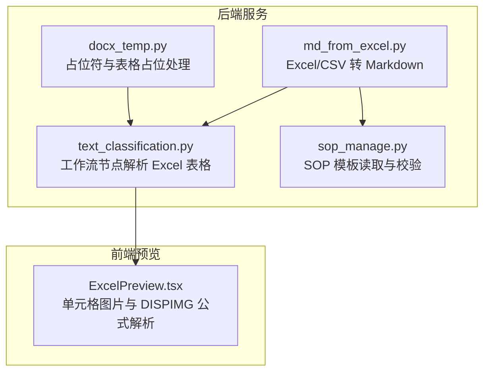
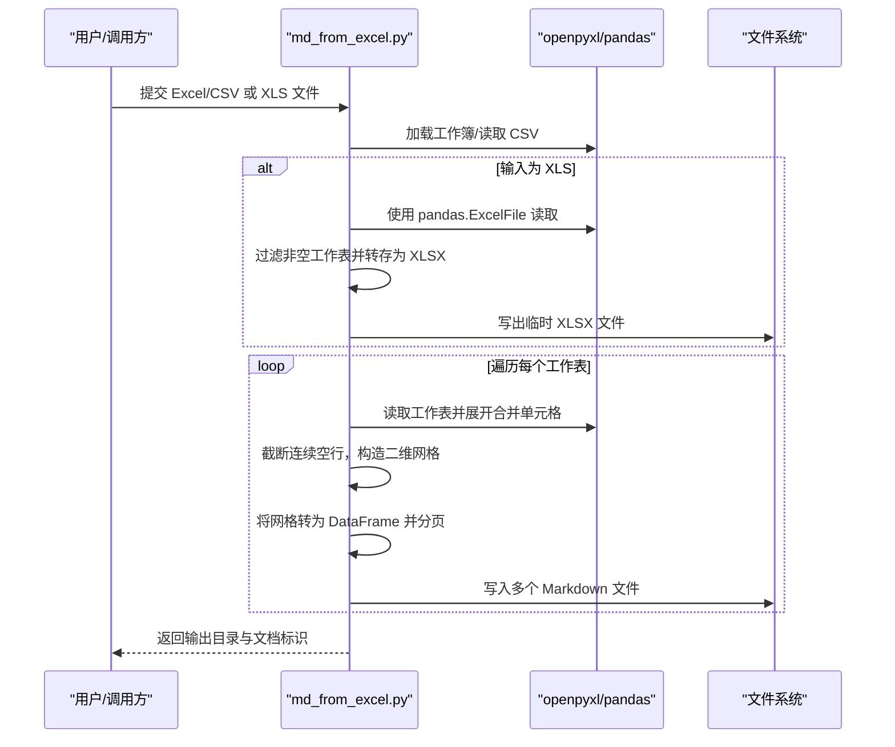
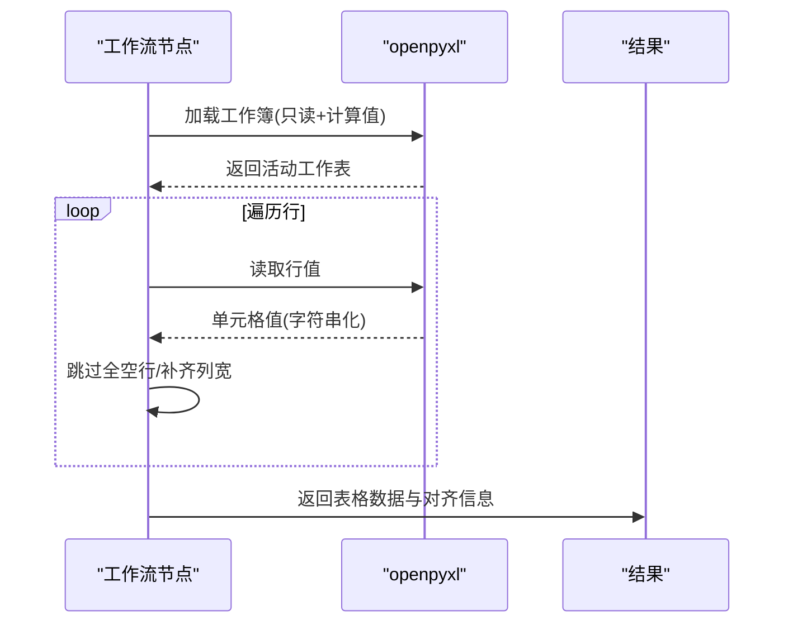
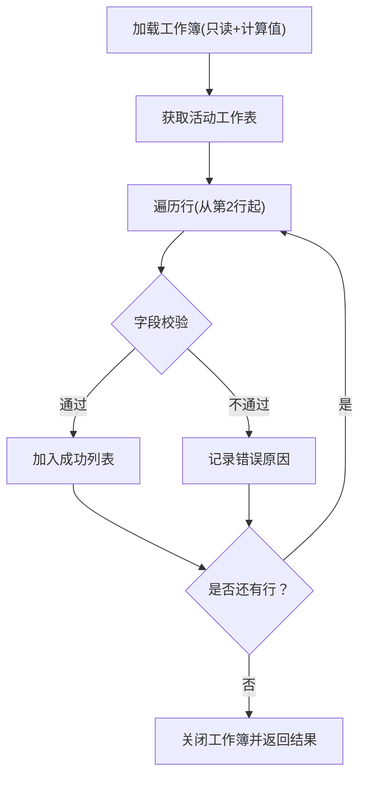
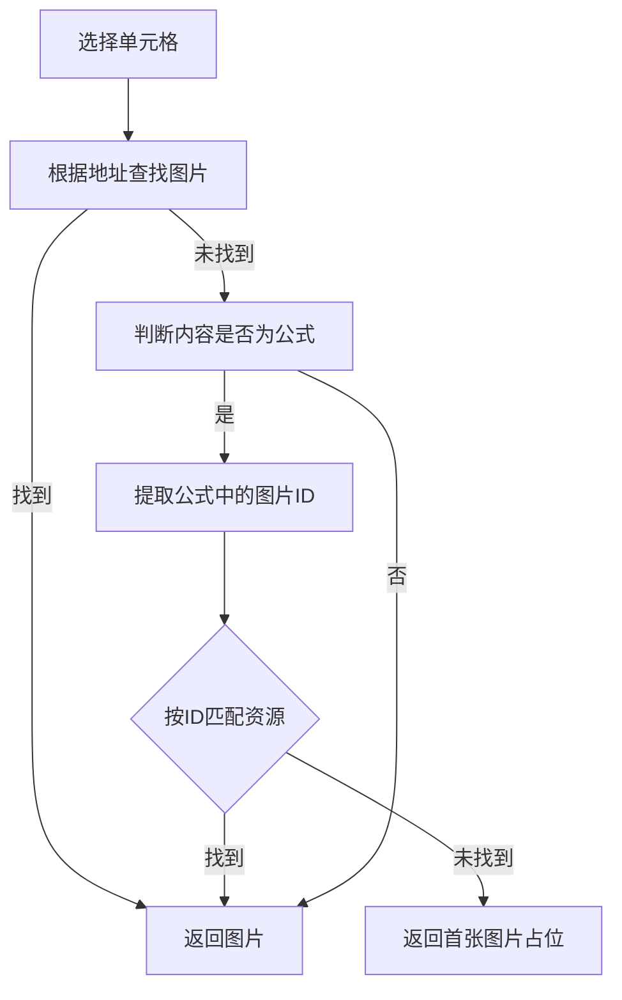
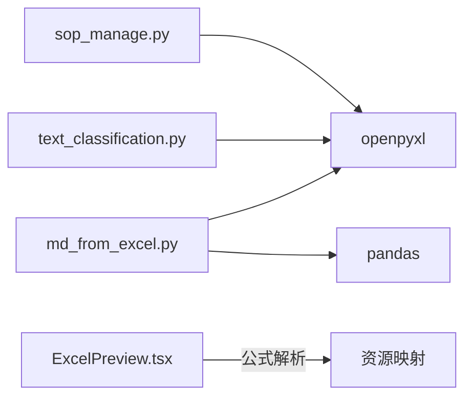

# Excel 文档解析

<cite>
**本文引用的文件**
- [src/backend/bisheng/api/services/md_from_excel.py](file://src/backend/bisheng/api/services/md_from_excel.py)
- [src/backend/bisheng/workflow/nodes/report/text_classification.py](file://src/backend/bisheng/workflow/nodes/report/text_classification.py)
- [src/backend/bisheng/linsight/domain/services/sop_manage.py](file://src/backend/bisheng/linsight/domain/services/sop_manage.py)
- [src/frontend/platform/src/pages/KnowledgePage/components/ExcelPreview.tsx](file://src/frontend/platform/src/pages/KnowledgePage/components/ExcelPreview.tsx)
- [src/backend/bisheng/utils/docx_temp.py](file://src/backend/bisheng/utils/docx_temp.py)
</cite>

## 目录
1. [简介](#简介)
2. [项目结构](#项目结构)
3. [核心组件](#核心组件)
4. [架构总览](#架构总览)
5. [详细组件分析](#详细组件分析)
6. [依赖关系分析](#依赖关系分析)
7. [性能与内存优化](#性能与内存优化)
8. [故障排查指南](#故障排查指南)
9. [结论](#结论)
10. [附录](#附录)

## 简介
本技术文档聚焦于 Bisheng 中的 Excel 文档解析系统，覆盖 XLSX/XLS 文件解析流程、工作表遍历、单元格类型识别、公式处理（含图片引用公式）、合并单元格展开、条件格式与数据验证等特性在当前实现中的处理现状与建议方案，并给出多工作表处理与数据完整性校验策略，以及性能优化与内存管理最佳实践。

## 项目结构
围绕 Excel 解析的关键代码分布在后端服务层与前端预览层：
- 后端服务层：提供从 Excel/CSV 转 Markdown 的转换能力，包含 XLS 到 XLSX 的兼容处理、合并单元格展开、空行截断、分页写入等逻辑。
- 工作流节点：支持将 Excel 表格解析为结构化表格数据，用于后续内容生成或报表输出。
- Linsight 业务服务：对 SOP 模板进行读取与基础校验，体现 openpyxl 的基本读取与校验模式。
- 前端预览：展示 Excel 单元格中的图片引用（如 DISPIMG 公式），辅助理解公式到资源映射的思路。
- 文档模板工具：在富文本中插入“Excel 表格占位符”，体现跨文档类型的表格占位处理。

**图示来源**
- [src/backend/bisheng/api/services/md_from_excel.py](file://src/backend/bisheng/api/services/md_from_excel.py#L1-L459)
- [src/backend/bisheng/workflow/nodes/report/text_classification.py](file://src/backend/bisheng/workflow/nodes/report/text_classification.py#L253-L341)
- [src/backend/bisheng/linsight/domain/services/sop_manage.py](file://src/backend/bisheng/linsight/domain/services/sop_manage.py#L243-L276)
- [src/frontend/platform/src/pages/KnowledgePage/components/ExcelPreview.tsx](file://src/frontend/platform/src/pages/KnowledgePage/components/ExcelPreview.tsx#L171-L216)
- [src/backend/bisheng/utils/docx_temp.py](file://src/backend/bisheng/utils/docx_temp.py#L346-L357)

**章节来源**
- [src/backend/bisheng/api/services/md_from_excel.py](file://src/backend/bisheng/api/services/md_from_excel.py#L1-L459)
- [src/backend/bisheng/workflow/nodes/report/text_classification.py](file://src/backend/bisheng/workflow/nodes/report/text_classification.py#L253-L341)
- [src/backend/bisheng/linsight/domain/services/sop_manage.py](file://src/backend/bisheng/linsight/domain/services/sop_manage.py#L243-L276)
- [src/frontend/platform/src/pages/KnowledgePage/components/ExcelPreview.tsx](file://src/frontend/platform/src/pages/KnowledgePage/components/ExcelPreview.tsx#L171-L216)
- [src/backend/bisheng/utils/docx_temp.py](file://src/backend/bisheng/utils/docx_temp.py#L346-L357)

## 核心组件
- Excel/CSV 转 Markdown 服务：负责 XLS 到 XLSX 转换、工作表遍历、合并单元格展开、空行截断、分页写入 Markdown 文件。
- 工作流节点 Excel 表格解析：将单个工作表解析为二维表格数据与列对齐信息，便于后续内容生成。
- SOP 模板读取与校验：基于 openpyxl 读取模板，按固定列进行字段校验与错误收集。
- 前端 Excel 预览：根据单元格内容与公式（如 DISPIMG）定位图片资源，辅助预览与调试。
- 文档模板占位符处理：在富文本中以占位符形式保留 Excel 表格引用，避免直接嵌入大表格。

**章节来源**
- [src/backend/bisheng/api/services/md_from_excel.py](file://src/backend/bisheng/api/services/md_from_excel.py#L11-L46)
- [src/backend/bisheng/api/services/md_from_excel.py](file://src/backend/bisheng/api/services/md_from_excel.py#L60-L103)
- [src/backend/bisheng/api/services/md_from_excel.py](file://src/backend/bisheng/api/services/md_from_excel.py#L280-L320)
- [src/backend/bisheng/workflow/nodes/report/text_classification.py](file://src/backend/bisheng/workflow/nodes/report/text_classification.py#L302-L333)
- [src/backend/bisheng/linsight/domain/services/sop_manage.py](file://src/backend/bisheng/linsight/domain/services/sop_manage.py#L243-L276)
- [src/frontend/platform/src/pages/KnowledgePage/components/ExcelPreview.tsx](file://src/frontend/platform/src/pages/KnowledgePage/components/ExcelPreview.tsx#L171-L216)
- [src/backend/bisheng/utils/docx_temp.py](file://src/backend/bisheng/utils/docx_temp.py#L346-L357)

## 架构总览
下图展示了从文件输入到解析输出的整体流程，涵盖 XLS 转换、工作表遍历、合并单元格展开、空行处理、分页写入与前端预览联动。

**图示来源**
- [src/backend/bisheng/api/services/md_from_excel.py](file://src/backend/bisheng/api/services/md_from_excel.py#L11-L46)
- [src/backend/bisheng/api/services/md_from_excel.py](file://src/backend/bisheng/api/services/md_from_excel.py#L280-L320)
- [src/backend/bisheng/api/services/md_from_excel.py](file://src/backend/bisheng/api/services/md_from_excel.py#L323-L366)

## 详细组件分析

### 组件一：Excel/CSV 转 Markdown 服务
- XLS 到 XLSX 转换：通过 pandas.ExcelFile 遍历工作表，过滤空表，再以 openpyxl 引擎写出新文件，解决旧版 XLS 的兼容性问题。
- 合并单元格展开：读取合并区域，将左上角值填充至整个合并范围，保证后续表格一致性。
- 空行截断：连续空行超过阈值则停止读取，避免读入无意义尾部空白。
- 分页写入：按指定行数切分数据块，生成带前缀的文件名，确保可读性与可维护性。
- 错误处理：捕获异常并记录日志，避免中断整体流程。

**图示来源**
- [src/backend/bisheng/api/services/md_from_excel.py](file://src/backend/bisheng/api/services/md_from_excel.py#L11-L46)
- [src/backend/bisheng/api/services/md_from_excel.py](file://src/backend/bisheng/api/services/md_from_excel.py#L60-L103)
- [src/backend/bisheng/api/services/md_from_excel.py](file://src/backend/bisheng/api/services/md_from_excel.py#L280-L320)
- [src/backend/bisheng/api/services/md_from_excel.py](file://src/backend/bisheng/api/services/md_from_excel.py#L323-L366)

**章节来源**
- [src/backend/bisheng/api/services/md_from_excel.py](file://src/backend/bisheng/api/services/md_from_excel.py#L11-L46)
- [src/backend/bisheng/api/services/md_from_excel.py](file://src/backend/bisheng/api/services/md_from_excel.py#L60-L103)
- [src/backend/bisheng/api/services/md_from_excel.py](file://src/backend/bisheng/api/services/md_from_excel.py#L280-L320)
- [src/backend/bisheng/api/services/md_from_excel.py](file://src/backend/bisheng/api/services/md_from_excel.py#L323-L366)

### 组件二：工作流节点 Excel 表格解析
- 使用 openpyxl 加载工作簿，仅读取活动工作表。
- 遍历行并按值读取，跳过全空行，统一转为字符串，补齐列宽。
- 输出二维表格数据与默认左对齐信息，便于后续渲染或生成报告。

**图示来源**
- [src/backend/bisheng/workflow/nodes/report/text_classification.py](file://src/backend/bisheng/workflow/nodes/report/text_classification.py#L302-L333)

**章节来源**
- [src/backend/bisheng/workflow/nodes/report/text_classification.py](file://src/backend/bisheng/workflow/nodes/report/text_classification.py#L302-L333)

### 组件三：SOP 模板读取与校验
- 使用 openpyxl 以只读模式加载模板，读取活动工作表。
- 逐行校验关键字段（名称、描述、内容）是否为空、长度是否越界。
- 收集错误行索引与错误原因，成功行返回清洗后的数据。

**图示来源**
- [src/backend/bisheng/linsight/domain/services/sop_manage.py](file://src/backend/bisheng/linsight/domain/services/sop_manage.py#L243-L276)

**章节来源**
- [src/backend/bisheng/linsight/domain/services/sop_manage.py](file://src/backend/bisheng/linsight/domain/services/sop_manage.py#L243-L276)

### 组件四：前端 Excel 预览与公式解析
- 根据单元格地址定位图片；若单元格内容以特定公式开头，则尝试从公式中提取图片 ID 并匹配资源。
- 若未找到对应图片，回退到显示第一张图片作为占位，提升可用性。

**图示来源**
- [src/frontend/platform/src/pages/KnowledgePage/components/ExcelPreview.tsx](file://src/frontend/platform/src/pages/KnowledgePage/components/ExcelPreview.tsx#L171-L216)

**章节来源**
- [src/frontend/platform/src/pages/KnowledgePage/components/ExcelPreview.tsx](file://src/frontend/platform/src/pages/KnowledgePage/components/ExcelPreview.tsx#L171-L216)

### 组件五：文档模板中的 Excel 占位符处理
- 在富文本中遇到 Excel 类型占位符时，替换为统一的占位提示，避免直接嵌入大表格导致渲染复杂度上升。
- 对应资源缺失时，回退显示路径或文件名，保证可读性。

**章节来源**
- [src/backend/bisheng/utils/docx_temp.py](file://src/backend/bisheng/utils/docx_temp.py#L346-L357)
- [src/backend/bisheng/utils/docx_temp.py](file://src/backend/bisheng/utils/docx_temp.py#L1452-L1465)

## 依赖关系分析
- md_from_excel.py 依赖 openpyxl 与 pandas，分别用于工作簿读取与数据结构转换；其内部函数之间存在清晰的调用链：xls_to_xlsx → excel_file_to_markdown → unmerge_and_read_sheet → process_dataframe_to_markdown_files。
- 工作流节点与 SOP 服务均直接使用 openpyxl，体现统一的底层解析方式。
- 前端 ExcelPreview.tsx 与后端解析结果形成“公式→资源”的映射关系，便于预览与调试。

**图示来源**
- [src/backend/bisheng/api/services/md_from_excel.py](file://src/backend/bisheng/api/services/md_from_excel.py#L6-L8)
- [src/backend/bisheng/workflow/nodes/report/text_classification.py](file://src/backend/bisheng/workflow/nodes/report/text_classification.py#L305)
- [src/backend/bisheng/linsight/domain/services/sop_manage.py](file://src/backend/bisheng/linsight/domain/services/sop_manage.py#L244)
- [src/frontend/platform/src/pages/KnowledgePage/components/ExcelPreview.tsx](file://src/frontend/platform/src/pages/KnowledgePage/components/ExcelPreview.tsx#L186-L198)

**章节来源**
- [src/backend/bisheng/api/services/md_from_excel.py](file://src/backend/bisheng/api/services/md_from_excel.py#L6-L8)
- [src/backend/bisheng/workflow/nodes/report/text_classification.py](file://src/backend/bisheng/workflow/nodes/report/text_classification.py#L302-L333)
- [src/backend/bisheng/linsight/domain/services/sop_manage.py](file://src/backend/bisheng/linsight/domain/services/sop_manage.py#L243-L276)
- [src/frontend/platform/src/pages/KnowledgePage/components/ExcelPreview.tsx](file://src/frontend/platform/src/pages/KnowledgePage/components/ExcelPreview.tsx#L171-L216)

## 性能与内存优化
- 只读与计算值模式：在需要读取已计算值时启用 data_only，减少公式重算开销；对只读场景使用 read_only=True，降低内存占用。
- 合并单元格展开：在读取阶段一次性展开，避免后续多次查询合并区域带来的重复遍历成本。
- 空行截断：设置最大连续空行阈值，提前终止读取，缩短处理时间。
- 分页写入：将大数据集按固定行数切分，降低单文件体积与内存峰值。
- XLS 兼容：先用 pandas 过滤非空工作表再写出 XLSX，避免读取空表造成的无效开销。
- 关闭资源：解析完成后及时关闭工作簿，释放内存与句柄。

**章节来源**
- [src/backend/bisheng/api/services/md_from_excel.py](file://src/backend/bisheng/api/services/md_from_excel.py#L11-L46)
- [src/backend/bisheng/api/services/md_from_excel.py](file://src/backend/bisheng/api/services/md_from_excel.py#L60-L103)
- [src/backend/bisheng/api/services/md_from_excel.py](file://src/backend/bisheng/api/services/md_from_excel.py#L280-L320)
- [src/backend/bisheng/linsight/domain/services/sop_manage.py](file://src/backend/bisheng/linsight/domain/services/sop_manage.py#L243-L276)

## 故障排查指南
- XLS 无法打开或解析为空：确认扩展名与文件存在性；使用 xls_to_xlsx 将 XLS 转为 XLSX 后再处理。
- 合并单元格读取异常：检查合并区域边界与左上角值是否存在；展开逻辑会将左上角值复制到整块区域。
- 空行过多导致截断：适当调整连续空行阈值；必要时手动清理尾部空白。
- CSV 编码问题：自动检测编码失败时，明确指定编码参数；确保分隔符与空值策略一致。
- SOP 模板校验失败：关注错误行索引与错误原因集合，逐项修正字段长度与必填项。
- 前端图片显示异常：检查单元格地址与公式中的图片 ID 是否匹配；若未找到资源，回退显示首张图片占位。

**章节来源**
- [src/backend/bisheng/api/services/md_from_excel.py](file://src/backend/bisheng/api/services/md_from_excel.py#L11-L46)
- [src/backend/bisheng/api/services/md_from_excel.py](file://src/backend/bisheng/api/services/md_from_excel.py#L60-L103)
- [src/backend/bisheng/api/services/md_from_excel.py](file://src/backend/bisheng/api/services/md_from_excel.py#L323-L366)
- [src/backend/bisheng/linsight/domain/services/sop_manage.py](file://src/backend/bisheng/linsight/domain/services/sop_manage.py#L243-L276)
- [src/frontend/platform/src/pages/KnowledgePage/components/ExcelPreview.tsx](file://src/frontend/platform/src/pages/KnowledgePage/components/ExcelPreview.tsx#L171-L216)

## 结论
Bisheng 的 Excel 解析体系以 openpyxl 与 pandas 为核心，结合工作流节点与前端预览，实现了从文件读取、合并单元格展开、空行截断、分页写入到前端公式的资源映射的完整链路。当前实现重点在于稳定性与易用性：XLS 兼容、只读与计算值模式、空行阈值控制、分页输出与资源回退策略。对于条件格式、数据验证、超链接与图表等高级特性，建议在现有框架基础上扩展解析与映射逻辑，以满足更复杂的业务需求。

## 附录
- Excel 特性扩展建议
  - 条件格式：读取条件格式规则，将其映射为样式标记或颜色提示，便于下游渲染。
  - 数据验证：解析验证规则并生成校验提示，与现有校验流程对接。
  - 超链接：解析单元格超链接目标，生成可点击链接或提示信息。
  - 图表：抽取图表元数据（标题、系列、坐标轴），生成可视化摘要或占位提示。
- 多工作表处理与完整性校验
  - 保持工作表顺序与命名一致性；对空表进行显式跳过并记录日志。
  - 完成后进行汇总统计（总行数、总列数、空行比例、错误行数），作为质量报告的一部分。