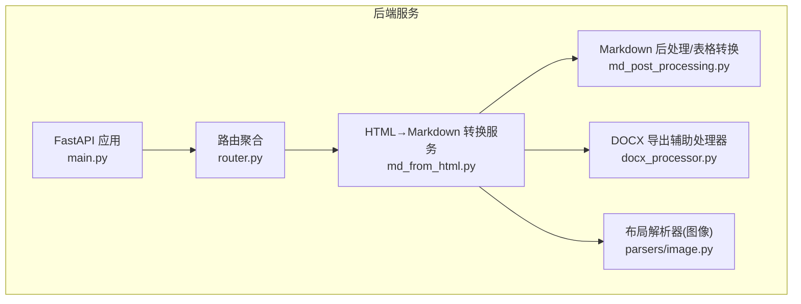
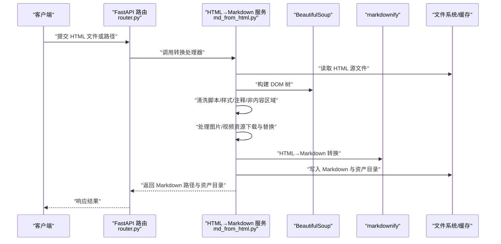
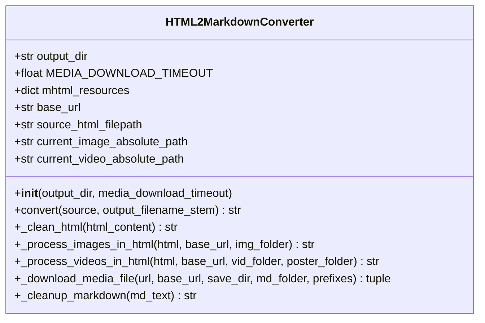
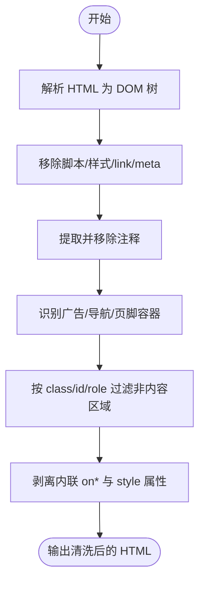
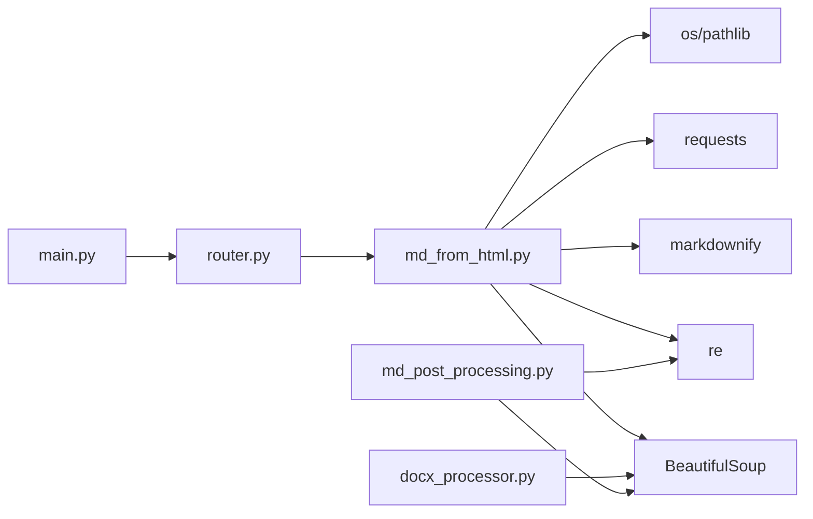

# HTML 文档解析

<cite>
**本文引用的文件**
- [md_from_html.py](file://src/backend/bisheng/api/services/md_from_html.py)
- [docx_processor.py](file://src/backend/bisheng/common/utils/markdown_cmpnt/md_to_docx/provider/docx_processor.py)
- [md_post_processing.py](file://src/backend/bisheng/api/services/md_post_processing.py)
- [elem_html.py](file://src/backend/bisheng_langchain/document_loaders/elem_html.py)
- [image.py](file://src/backend/bisheng_langchain/document_loaders/parsers/image.py)
- [router.py](file://src/backend/bisheng/api/router.py)
- [main.py](file://src/backend/bisheng/main.py)
</cite>

## 目录
1. [简介](#简介)
2. [项目结构](#项目结构)
3. [核心组件](#核心组件)
4. [架构总览](#架构总览)
5. [详细组件分析](#详细组件分析)
6. [依赖分析](#依赖分析)
7. [性能考虑](#性能考虑)
8. [故障排查指南](#故障排查指南)
9. [结论](#结论)

## 简介
本技术文档聚焦于 Bisheng 的 HTML 文档解析与转换能力，围绕以下目标展开：
- 深入解释 HTML 文件解析的核心算法：DOM 树遍历、内容提取与结构化处理
- 文档化 BeautifulSoup 与 markdownify 的使用方法：标签识别、属性提取、样式剥离与内容标准化
- 详解 HTML 特定元素的处理策略：表格、列表、链接、图片、视频等
- 解释 HTML 清洗与净化技术：脚本过滤、样式剥离、内容标准化
- 提供性能优化与编码处理的最佳实践

## 项目结构
Bisheng 后端采用 FastAPI 架构，HTML 解析与转换主要位于后端服务层，涉及如下关键模块：
- API 层：路由聚合与对外接口
- 业务服务层：HTML 到 Markdown 的转换流程
- 工具与通用组件：Markdown 到 DOCX 的处理器（用于验证结构化输出）
- 文档加载器与解析器：面向 PDF/图像的布局解析器（为后续扩展到 HTML 布局解析提供参考）



**图表来源**
- [main.py](file://src/backend/bisheng/main.py#L64-L102)
- [router.py](file://src/backend/bisheng/api/router.py#L23-L61)
- [md_from_html.py](file://src/backend/bisheng/api/services/md_from_html.py#L18-L743)
- [md_post_processing.py](file://src/backend/bisheng/api/services/md_post_processing.py#L36-L83)
- [docx_processor.py](file://src/backend/bisheng/common/utils/markdown_cmpnt/md_to_docx/provider/docx_processor.py#L438-L487)
- [image.py](file://src/backend/bisheng_langchain/document_loaders/parsers/image.py#L11-L29)

**章节来源**
- [main.py](file://src/backend/bisheng/main.py#L1-L113)
- [router.py](file://src/backend/bisheng/api/router.py#L1-L61)

## 核心组件
- HTML2MarkdownConverter：负责 HTML 清洗、媒体下载与替换、Markdown 转换与清理
- HTML 后处理服务：对内联 HTML 表格进行正则匹配并转为 Markdown 表格
- DOCX 处理器：以 BeautifulSoup 遍历 HTML 并生成 DOCX 内容，验证结构化输出
- 布局解析器：图像布局解析（为 HTML 布局解析提供架构参考）

**章节来源**
- [md_from_html.py](file://src/backend/bisheng/api/services/md_from_html.py#L18-L743)
- [md_post_processing.py](file://src/backend/bisheng/api/services/md_post_processing.py#L36-L83)
- [docx_processor.py](file://src/backend/bisheng/common/utils/markdown_cmpnt/md_to_docx/provider/docx_processor.py#L438-L487)
- [image.py](file://src/backend/bisheng_langchain/document_loaders/parsers/image.py#L11-L29)

## 架构总览
下图展示从请求到 HTML 解析与转换的整体流程，以及与外部库的交互。



**图表来源**
- [router.py](file://src/backend/bisheng/api/router.py#L23-L61)
- [md_from_html.py](file://src/backend/bisheng/api/services/md_from_html.py#L572-L730)

## 详细组件分析

### HTML2MarkdownConverter 组件
该类是 HTML 解析与转换的核心，包含以下关键流程：
- HTML 清洗：移除脚本、样式、链接、元信息、注释；基于标签名与属性（class/id/role）识别广告、导航、页脚等非内容区域
- 媒体处理：对图片与视频进行下载与替换，支持 data URI、本地文件与 HTTP(S) 资源
- Markdown 转换：使用 markdownify 将结构化 HTML 转为 Markdown，并进行二次清理
- 输出管理：按文档 ID 创建资产目录，保存图片与视频资源，最终生成 Markdown 文件



**图表来源**
- [md_from_html.py](file://src/backend/bisheng/api/services/md_from_html.py#L18-L743)

**章节来源**
- [md_from_html.py](file://src/backend/bisheng/api/services/md_from_html.py#L35-L112)
- [md_from_html.py](file://src/backend/bisheng/api/services/md_from_html.py#L114-L333)
- [md_from_html.py](file://src/backend/bisheng/api/services/md_from_html.py#L335-L397)
- [md_from_html.py](file://src/backend/bisheng/api/services/md_from_html.py#L399-L555)
- [md_from_html.py](file://src/backend/bisheng/api/services/md_from_html.py#L557-L570)
- [md_from_html.py](file://src/backend/bisheng/api/services/md_from_html.py#L572-L697)

#### HTML 清洗与净化流程


**图表来源**
- [md_from_html.py](file://src/backend/bisheng/api/services/md_from_html.py#L35-L112)

**章节来源**
- [md_from_html.py](file://src/backend/bisheng/api/services/md_from_html.py#L35-L112)

#### 图片与视频处理流程
```mermaid
flowchart TD
PStart(["开始"]) --> FindImg["定位  标签"]
FindImg --> HasSrc{"存在 src？"}
HasSrc -- 否 --> DelImg["删除标签"] --> NextImg["下一个图片"]
HasSrc -- 是 --> SrcType{"src 类型"}
SrcType --> |cid:| InlineCID["从 MHTML 资源注入"] --> NextImg
SrcType --> |data:| DataURI["解码并保存为文件"] --> NextImg
SrcType --> |http(s)/file| Download["下载到资产目录"] --> NextImg
NextImg --> DoneImg["完成图片处理"]
VStart(["开始"]) --> FindVid["定位 <video> 标签"]
FindVid --> Poster{"存在 poster？"}
Poster --> |是| DLPoster["下载海报到图片目录"] --> SrcLoop["遍历 <source> 或 src"]
Poster --> |否| SrcLoop
SrcLoop --> SrcTypeV{"source 类型"}
SrcTypeV --> |cid:| InlineCIDV["从 MHTML 注入"] --> NextVid["下一个视频"]
SrcTypeV --> |data:| DataURIV["解码并保存为视频"] --> NextVid
SrcTypeV --> |http(s)/file| DownloadV["下载到视频目录"] --> NextVid
NextVid --> DoneVid["完成视频处理"]
```

**图表来源**
- [md_from_html.py](file://src/backend/bisheng/api/services/md_from_html.py#L335-L397)
- [md_from_html.py](file://src/backend/bisheng/api/services/md_from_html.py#L399-L555)

**章节来源**
- [md_from_html.py](file://src/backend/bisheng/api/services/md_from_html.py#L335-L397)
- [md_from_html.py](file://src/backend/bisheng/api/services/md_from_html.py#L399-L555)

#### 表格与列表的 Markdown 化
- 使用正则匹配完整表格块，借助 BeautifulSoup 提取表头与行数据，生成 Markdown 表格
- 对列表（有序/无序）进行规范化，确保符号与缩进一致

**章节来源**
- [md_post_processing.py](file://src/backend/bisheng/api/services/md_post_processing.py#L36-L83)

#### DOCX 导出中的 HTML 结构化处理
- 通过 BeautifulSoup 遍历 body 子节点，逐类处理段落、标题、列表、表格、代码块等
- 支持链接与图片在 DOCX 中的映射

**章节来源**
- [docx_processor.py](file://src/backend/bisheng/common/utils/markdown_cmpnt/md_to_docx/provider/docx_processor.py#L438-L487)
- [docx_processor.py](file://src/backend/bisheng/common/utils/markdown_cmpnt/md_to_docx/provider/docx_processor.py#L415-L458)

### 布局解析器（图像）与 HTML 扩展参考
- 布局解析器以图像输入，返回结构化 JSON 元数据，可作为 HTML 布局解析的参考实现
- 该组件展示了如何封装外部 API、序列化结果并返回 Document

**章节来源**
- [image.py](file://src/backend/bisheng_langchain/document_loaders/parsers/image.py#L11-L29)

## 依赖分析
- 外部库依赖
  - BeautifulSoup：DOM 解析与树遍历
  - markdownify：HTML→Markdown 转换
  - requests：HTTP 资源下载
  - re：正则表达式（清洗与表格匹配）
  - os/pathlib：文件系统操作
- 内部模块依赖
  - API 路由聚合至服务层
  - 服务层内部协作：清洗→媒体处理→转换→清理→输出



**图表来源**
- [md_from_html.py](file://src/backend/bisheng/api/services/md_from_html.py#L1-L12)
- [router.py](file://src/backend/bisheng/api/router.py#L1-L61)
- [main.py](file://src/backend/bisheng/main.py#L1-L20)
- [docx_processor.py](file://src/backend/bisheng/common/utils/markdown_cmpnt/md_to_docx/provider/docx_processor.py#L438-L441)
- [md_post_processing.py](file://src/backend/bisheng/api/services/md_post_processing.py#L36-L40)

**章节来源**
- [md_from_html.py](file://src/backend/bisheng/api/services/md_from_html.py#L1-L12)
- [router.py](file://src/backend/bisheng/api/router.py#L1-L61)
- [main.py](file://src/backend/bisheng/main.py#L1-L20)

## 性能考虑
- DOM 解析与遍历
  - 使用单次 BeautifulSoup 构建 DOM，避免重复解析
  - 在清洗阶段优先移除大体积脚本与样式，降低后续处理负担
- 正则与循环
  - 表格转换采用一次性正则匹配，减少多次 DOM 查询
  - 列表与段落处理按需遍历，避免深层递归
- I/O 与网络
  - 媒体下载设置超时参数，避免阻塞
  - 分块写入流式下载，降低内存峰值
- 编码与错误处理
  - HTML 文件读取使用“替换”策略，避免编码异常导致中断
  - 对各类异常进行分类记录，便于定位问题

**章节来源**
- [md_from_html.py](file://src/backend/bisheng/api/services/md_from_html.py#L592-L607)
- [md_from_html.py](file://src/backend/bisheng/api/services/md_from_html.py#L251-L306)
- [md_from_html.py](file://src/backend/bisheng/api/services/md_from_html.py#L621-L626)

## 故障排查指南
- HTML 无法读取或为空
  - 检查文件是否存在与可读权限
  - 关注编码错误处理与空内容判断
- 媒体资源下载失败
  - 检查 URL 是否合法、协议是否受支持
  - 查看超时与 HTTP 错误日志
- Markdown 转换异常
  - 若首次转换失败，回退到仅图片处理后的 HTML 再试
  - 保存调试 HTML 以便人工核验
- DOCX 导出异常
  - 确认 HTML 结构中存在 body 标签
  - 检查链接与图片的外链有效性

**章节来源**
- [md_from_html.py](file://src/backend/bisheng/api/services/md_from_html.py#L599-L607)
- [md_from_html.py](file://src/backend/bisheng/api/services/md_from_html.py#L313-L332)
- [md_from_html.py](file://src/backend/bisheng/api/services/md_from_html.py#L650-L669)
- [docx_processor.py](file://src/backend/bisheng/common/utils/markdown_cmpnt/md_to_docx/provider/docx_processor.py#L441-L447)

## 结论
Bisheng 的 HTML 文档解析体系以 BeautifulSoup 为核心，结合正则与结构化规则，实现了对 HTML 的清洗、媒体处理与 Markdown 转换。通过清晰的模块划分与完善的错误处理，系统在保证正确性的同时兼顾了性能与可维护性。未来可在以下方面进一步演进：
- 引入更精细的 HTML 布局解析器，复用图像布局解析器的架构模式
- 增强对复杂表格与嵌套结构的识别与还原
- 提供可配置的清洗规则与白名单机制，提升适配性