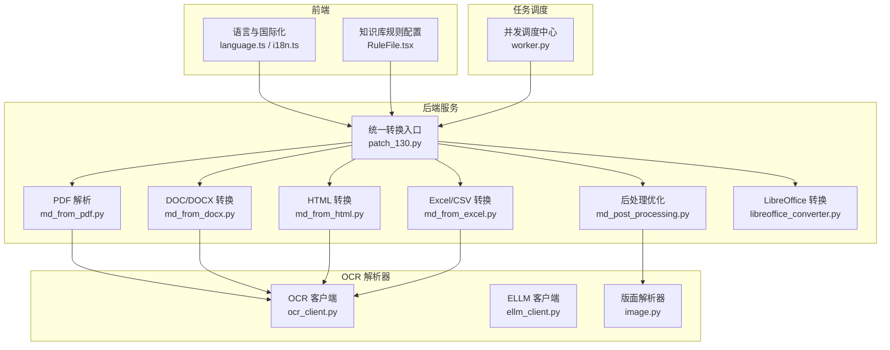
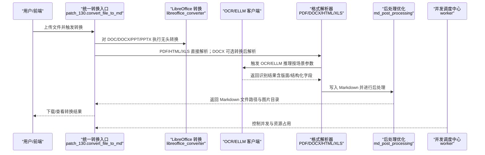
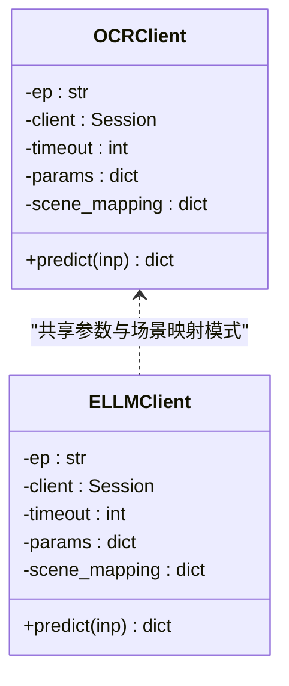
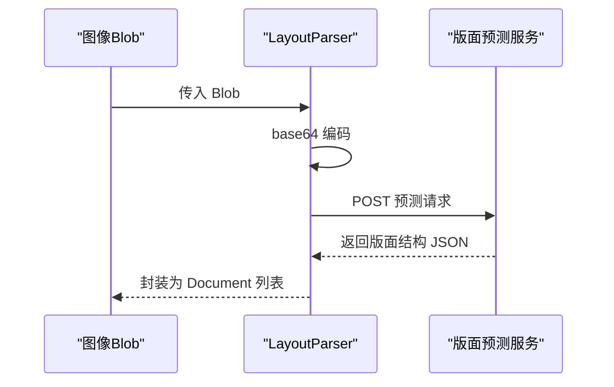
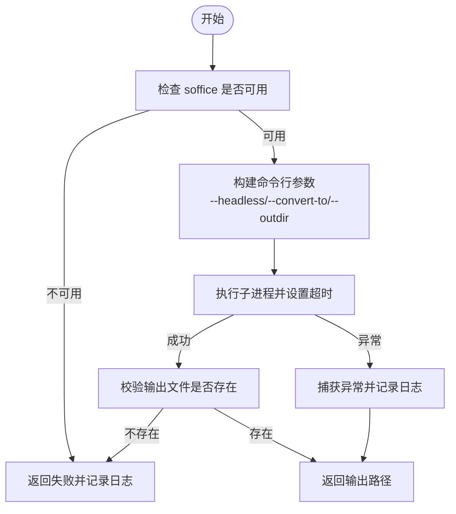
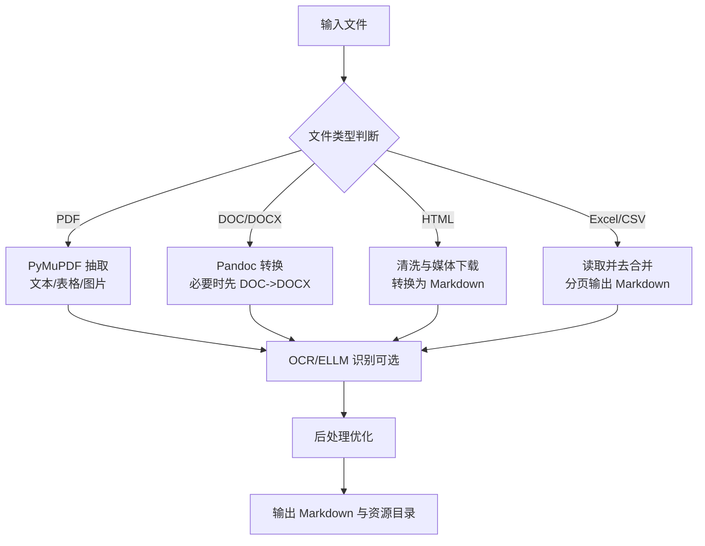
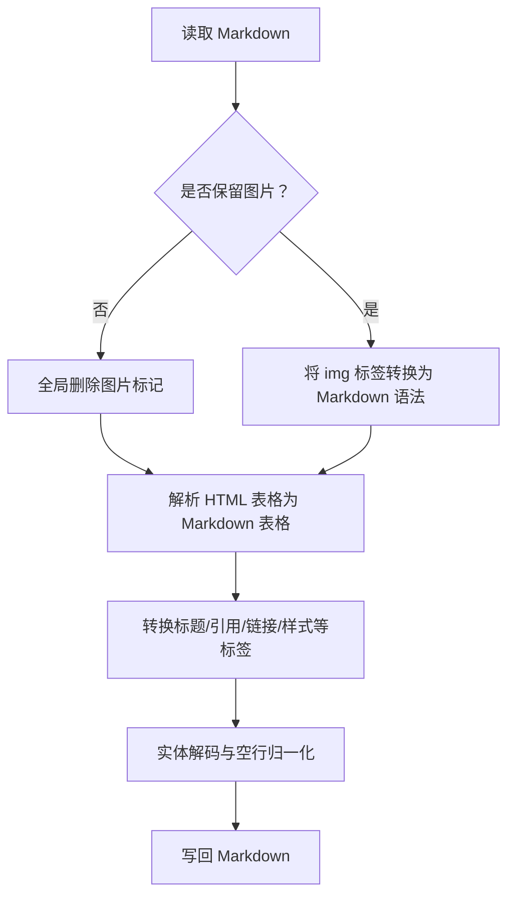
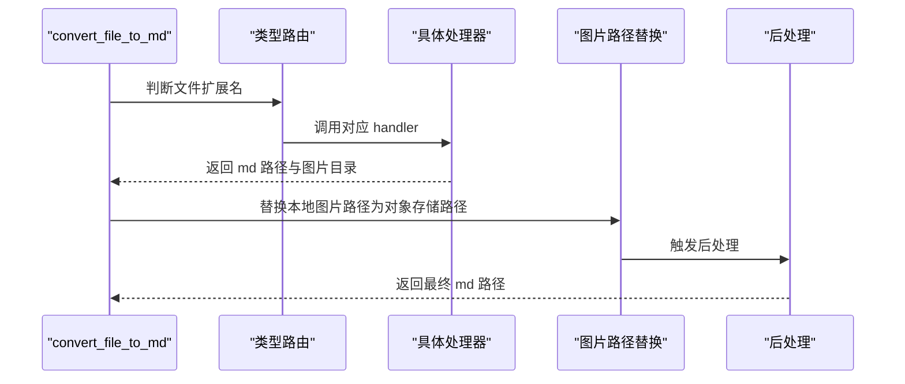
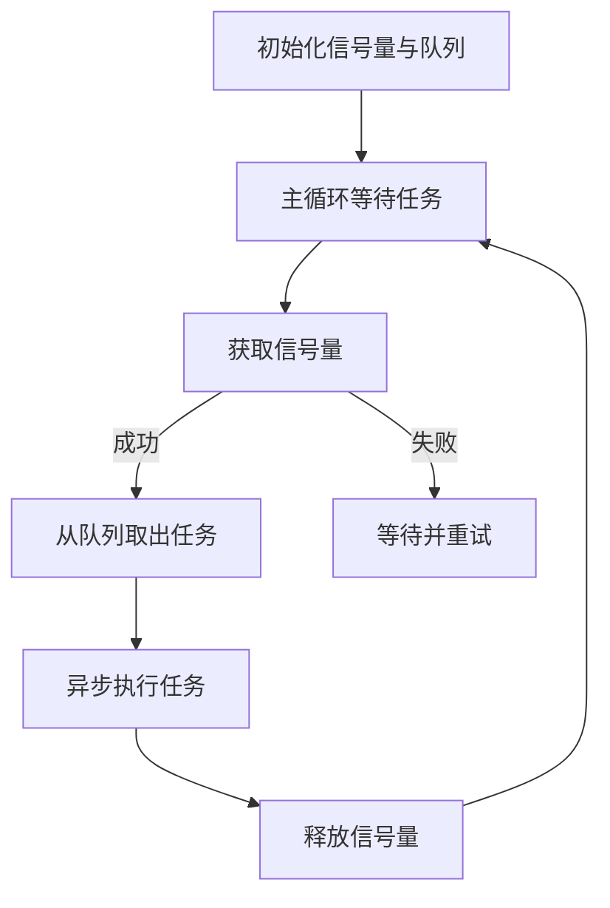
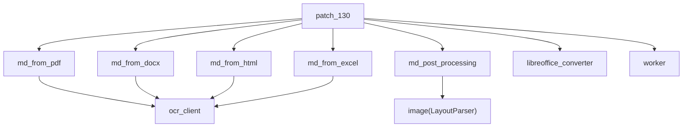

# OCR 集成系统

<cite>
**本文引用的文件**
- [ocr_client.py](file://src/backend/bisheng_langchain/document_loaders/parsers/ocr_client.py)
- [ellm_client.py](file://src/backend/bisheng_langchain/document_loaders/parsers/ellm_client.py)
- [image.py](file://src/backend/bisheng_langchain/document_loaders/parsers/image.py)
- [libreoffice_converter.py](file://src/backend/bisheng/api/services/libreoffice_converter.py)
- [md_from_docx.py](file://src/backend/bisheng/api/services/md_from_docx.py)
- [md_from_pdf.py](file://src/backend/bisheng/api/services/md_from_pdf.py)
- [md_from_html.py](file://src/backend/bisheng/api/services/md_from_html.py)
- [md_from_excel.py](file://src/backend/bisheng/api/services/md_from_excel.py)
- [md_post_processing.py](file://src/backend/bisheng/api/services/md_post_processing.py)
- [patch_130.py](file://src/backend/bisheng/api/services/patch_130.py)
- [elem_pdf.py](file://src/backend/bisheng_langchain/document_loaders/elem_pdf.py)
- [worker.py](file://src/backend/bisheng/linsight/worker.py)
- [language.ts](file://src/frontend/client/src/store/language.ts)
- [i18n.ts](file://src/frontend/client/src/locales/i18n.ts)
- [RuleFile.tsx](file://src/frontend/platform/src/pages/KnowledgePage/components/RuleFile.tsx)
</cite>

## 目录
1. [简介](#简介)
2. [项目结构](#项目结构)
3. [核心组件](#核心组件)
4. [架构总览](#架构总览)
5. [详细组件分析](#详细组件分析)
6. [依赖关系分析](#依赖关系分析)
7. [性能考虑](#性能考虑)
8. [故障排查指南](#故障排查指南)
9. [结论](#结论)
10. [附录](#附录)

## 简介
本技术文档面向 Bisheng OCR 集成系统，系统通过“LibreOffice 文档转换 + OCR 识别 + 多格式解析 + 后处理优化”的端到端流水线，实现对 PDF、Word、Excel、PPT、HTML 等多种文档类型的高保真文本抽取与结构化输出。文档重点覆盖以下方面：
- 光学字符识别（OCR）流程：图像预处理、文字识别、后处理优化
- LibreOffice UNO API 使用：文档格式转换与 OCR 集成
- 多语言支持与识别精度优化策略
- OCR 错误检测与自动修复机制（上下文校验与自动修复）
- OCR 性能优化与批量处理最佳实践（并发控制与资源管理）

## 项目结构
系统采用前后端分离与模块化设计，后端以服务化模块为核心，前端提供多语言与配置界面。OCR 相关能力主要分布在后端服务层与解析器层。

图表来源
- [md_from_pdf.py](file://src/backend/bisheng/api/services/md_from_pdf.py#L11-L154)
- [md_from_docx.py](file://src/backend/bisheng/api/services/md_from_docx.py#L25-L111)
- [md_from_html.py](file://src/backend/bisheng/api/services/md_from_html.py#L572-L730)
- [md_from_excel.py](file://src/backend/bisheng/api/services/md_from_excel.py#L369-L438)
- [md_post_processing.py](file://src/backend/bisheng/api/services/md_post_processing.py#L8-L159)
- [patch_130.py](file://src/backend/bisheng/api/services/patch_130.py#L42-L142)
- [libreoffice_converter.py](file://src/backend/bisheng/api/services/libreoffice_converter.py#L36-L123)
- [ocr_client.py](file://src/backend/bisheng_langchain/document_loaders/parsers/ocr_client.py#L8-L52)
- [ellm_client.py](file://src/backend/bisheng_langchain/document_loaders/parsers/ellm_client.py#L8-L55)
- [image.py](file://src/backend/bisheng_langchain/document_loaders/parsers/image.py#L11-L29)
- [worker.py](file://src/backend/bisheng/linsight/worker.py#L117-L240)

章节来源
- [md_from_pdf.py](file://src/backend/bisheng/api/services/md_from_pdf.py#L11-L154)
- [md_from_docx.py](file://src/backend/bisheng/api/services/md_from_docx.py#L25-L111)
- [md_from_html.py](file://src/backend/bisheng/api/services/md_from_html.py#L572-L730)
- [md_from_excel.py](file://src/backend/bisheng/api/services/md_from_excel.py#L369-L438)
- [md_post_processing.py](file://src/backend/bisheng/api/services/md_post_processing.py#L8-L159)
- [patch_130.py](file://src/backend/bisheng/api/services/patch_130.py#L42-L142)
- [libreoffice_converter.py](file://src/backend/bisheng/api/services/libreoffice_converter.py#L36-L123)
- [ocr_client.py](file://src/backend/bisheng_langchain/document_loaders/parsers/ocr_client.py#L8-L52)
- [ellm_client.py](file://src/backend/bisheng_langchain/document_loaders/parsers/ellm_client.py#L8-L55)
- [image.py](file://src/backend/bisheng_langchain/document_loaders/parsers/image.py#L11-L29)
- [worker.py](file://src/backend/bisheng/linsight/worker.py#L117-L240)

## 核心组件
- OCR 客户端（OCRClient）：封装通用 OCR 推理接口，支持场景映射与参数定制，负责将图像编码为请求体并调用推理服务。
- ELLM 客户端（ELLMClient）：面向表单/文档结构化提取，提供字段级识别与布局信息，便于后续版面解析与语义分组。
- 版面解析器（LayoutParser）：对图像进行版面结构解析，输出页面元素的 JSON 结构，供后处理与结构化输出使用。
- LibreOffice 转换服务：通过 soffice 命令行进行无头转换，支持 DOC/DOCX/PPT/PPTX 等格式转换，为 OCR 提供统一输入。
- 多格式解析服务：PDF、DOCX、HTML、Excel/CSV 的专用解析器，分别处理文本、表格、图片与元数据抽取。
- 后处理优化（md_post_processing）：对 Markdown 进行 HTML 标签清洗、表格重建、图片替换与格式规范化。
- 统一转换入口（patch_130）：根据文件类型路由到对应解析器，完成图片路径替换与后处理。
- 并发调度中心（worker）：基于信号量的并发控制，限制每进程最大并发度，保障资源稳定与吞吐平衡。

章节来源
- [ocr_client.py](file://src/backend/bisheng_langchain/document_loaders/parsers/ocr_client.py#L8-L52)
- [ellm_client.py](file://src/backend/bisheng_langchain/document_loaders/parsers/ellm_client.py#L8-L55)
- [image.py](file://src/backend/bisheng_langchain/document_loaders/parsers/image.py#L11-L29)
- [libreoffice_converter.py](file://src/backend/bisheng/api/services/libreoffice_converter.py#L36-L123)
- [md_from_pdf.py](file://src/backend/bisheng/api/services/md_from_pdf.py#L11-L154)
- [md_from_docx.py](file://src/backend/bisheng/api/services/md_from_docx.py#L25-L111)
- [md_from_html.py](file://src/backend/bisheng/api/services/md_from_html.py#L572-L730)
- [md_from_excel.py](file://src/backend/bisheng/api/services/md_from_excel.py#L369-L438)
- [md_post_processing.py](file://src/backend/bisheng/api/services/md_post_processing.py#L8-L159)
- [patch_130.py](file://src/backend/bisheng/api/services/patch_130.py#L42-L142)
- [worker.py](file://src/backend/bisheng/linsight/worker.py#L117-L240)

## 架构总览
系统整体流程从“文件类型识别”开始，经由“LibreOffice 转换或直接解析”，进入“OCR/ELLM 识别”，随后进行“后处理优化”，最终生成结构化的 Markdown 输出。并发调度中心统一协调任务执行，确保资源可控与吞吐稳定。

图表来源
- [patch_130.py](file://src/backend/bisheng/api/services/patch_130.py#L42-L142)
- [libreoffice_converter.py](file://src/backend/bisheng/api/services/libreoffice_converter.py#L36-L123)
- [md_from_pdf.py](file://src/backend/bisheng/api/services/md_from_pdf.py#L11-L154)
- [md_from_docx.py](file://src/backend/bisheng/api/services/md_from_docx.py#L25-L111)
- [md_from_html.py](file://src/backend/bisheng/api/services/md_from_html.py#L572-L730)
- [md_from_excel.py](file://src/backend/bisheng/api/services/md_from_excel.py#L369-L438)
- [md_post_processing.py](file://src/backend/bisheng/api/services/md_post_processing.py#L8-L159)
- [worker.py](file://src/backend/bisheng/linsight/worker.py#L117-L240)

## 详细组件分析

### OCR 客户端与 ELLM 客户端
- 功能职责
  - OCRClient：封装通用 OCR 推理接口，支持场景映射（文档/表格/手写），内置排序过滤、长图分段、旋转校正等参数。
  - ELLMClient：在 OCR 基础上扩展结构化字段识别（如勾选框、标准复选框），用于表单/文档结构化抽取。
- 关键参数与行为
  - 参数合并：深拷贝基础参数，按场景覆盖检测/识别模型与开关项。
  - 请求体构造：将图像 base64 编码与参数打包为 JSON 请求。
  - 异常处理：网络异常返回状态码与错误信息，保证调用方可感知失败原因。
- 适用场景
  - 文档类（doc/form）：优先使用通用检测/识别模型组合。
  - 表单类（form）：强调布局与字段定位，结合 ELLM 字段识别提升结构化质量。
  - 手写类（hand）：针对手写文本优化识别模型。

图表来源
- [ocr_client.py](file://src/backend/bisheng_langchain/document_loaders/parsers/ocr_client.py#L8-L52)
- [ellm_client.py](file://src/backend/bisheng_langchain/document_loaders/parsers/ellm_client.py#L8-L55)

章节来源
- [ocr_client.py](file://src/backend/bisheng_langchain/document_loaders/parsers/ocr_client.py#L8-L52)
- [ellm_client.py](file://src/backend/bisheng_langchain/document_loaders/parsers/ellm_client.py#L8-L55)

### 版面解析器（LayoutParser）
- 功能职责：对图像进行版面结构解析，输出包含类别（印章/图片/标题/段落/表格/页眉/页码/页脚）的 JSON 结构，为后续结构化输出与语义分组提供基础。
- 数据流：将 Blob 图像转为 base64，发送至预测接口，接收 JSON 结构并封装为 Document 返回。

图表来源
- [image.py](file://src/backend/bisheng_langchain/document_loaders/parsers/image.py#L22-L28)

章节来源
- [image.py](file://src/backend/bisheng_langchain/document_loaders/parsers/image.py#L11-L29)

### LibreOffice UNO API 使用（无头转换）
- 功能职责：通过 soffice 命令行进行无头转换，支持 DOC/DOCX/PPT/PPTX 等格式转换，为 OCR 提供统一输入。
- 关键点
  - 临时安装目录：使用 -env:UserInstallation 指定临时目录，避免环境污染。
  - 超时与错误处理：捕获 FileNotFoundError、CalledProcessError、TimeoutExpired 等异常，记录详细日志。
  - 输出校验：确认目标文件存在后再返回成功路径。
- 与 OCR 集成：DOC/DOCX/PPT/PPTX 在进入 OCR 前先转换为中间格式，提高 OCR 输入一致性。

图表来源
- [libreoffice_converter.py](file://src/backend/bisheng/api/services/libreoffice_converter.py#L36-L123)

章节来源
- [libreoffice_converter.py](file://src/backend/bisheng/api/services/libreoffice_converter.py#L36-L123)

### 多格式解析与 OCR 集成
- PDF 解析：使用 PyMuPDF 抽取文本块、表格与图片，按垂直位置排序并合并为 Markdown；表格导出为 Markdown 表格，图片保存为独立文件。
- DOCX 解析：优先尝试 Pandoc 高质量转换；若失败则先转换为 DOCX 再转换，确保兼容性。
- HTML 解析：清洗 HTML、下载媒体资源（图片/视频）、转换为 Markdown，并进行二次清理。
- Excel/CSV 解析：读取工作簿/CSV，去合并单元格、分页输出为多个 Markdown 文件，保留表头或伪表头。

图表来源
- [md_from_pdf.py](file://src/backend/bisheng/api/services/md_from_pdf.py#L11-L154)
- [md_from_docx.py](file://src/backend/bisheng/api/services/md_from_docx.py#L25-L111)
- [md_from_html.py](file://src/backend/bisheng/api/services/md_from_html.py#L572-L730)
- [md_from_excel.py](file://src/backend/bisheng/api/services/md_from_excel.py#L369-L438)

章节来源
- [md_from_pdf.py](file://src/backend/bisheng/api/services/md_from_pdf.py#L11-L154)
- [md_from_docx.py](file://src/backend/bisheng/api/services/md_from_docx.py#L25-L111)
- [md_from_html.py](file://src/backend/bisheng/api/services/md_from_html.py#L572-L730)
- [md_from_excel.py](file://src/backend/bisheng/api/services/md_from_excel.py#L369-L438)

### 后处理优化（md_post_processing）
- 功能职责：对 Markdown 进行 HTML 标签清洗、表格重建、图片替换与格式规范化，提升输出质量与一致性。
- 关键步骤
  - 图片处理：按保留策略删除或转换为 Markdown 图片语法。
  - 表格重建：解析 HTML 表格为 Markdown 表格，补齐列数与分隔符。
  - 标签转换：标题、引用、链接、粗斜体、删除线、上下标、内联代码、水平线、换行等。
  - 最终清理：实体解码、多余空行归一化。

图表来源
- [md_post_processing.py](file://src/backend/bisheng/api/services/md_post_processing.py#L8-L159)

章节来源
- [md_post_processing.py](file://src/backend/bisheng/api/services/md_post_processing.py#L8-L159)

### 统一转换入口（patch_130）
- 功能职责：根据文件扩展名路由到对应解析器，处理图片路径替换与后处理，统一对外输出 Markdown 与资源目录。
- 关键流程
  - 类型判断：doc/docx → DOCX 解析；ppt/pptx → PPTX 解析；xlsx/xls/csv → Excel 解析；html/htm/mhtml → HTML 解析；pdf → PDF 解析。
  - 图片路径替换：将本地图片路径替换为对象存储路径，便于前端访问。
  - 后处理：调用后处理模块进行 Markdown 规范化。

图表来源
- [patch_130.py](file://src/backend/bisheng/api/services/patch_130.py#L42-L142)

章节来源
- [patch_130.py](file://src/backend/bisheng/api/services/patch_130.py#L42-L142)

### 并发调度中心（worker）
- 功能职责：通过 asyncio.Semaphore 控制最大并发度，避免资源争用导致的性能抖动；维护节点心跳与队列消费。
- 关键点
  - 默认并发：未指定时使用 32。
  - 信号量释放：任务完成后释放，异常情况下也确保释放，防止死锁。
  - 队列与节点管理：基于 Redis 的队列与节点管理器，保障分布式调度稳定性。

图表来源
- [worker.py](file://src/backend/bisheng/linsight/worker.py#L117-L240)

章节来源
- [worker.py](file://src/backend/bisheng/linsight/worker.py#L117-L240)

## 依赖关系分析
- 组件耦合
  - patch_130 是统一入口，向上依赖各格式解析器与后处理模块，向下依赖 LibreOffice 转换与 OCR/ELLM 客户端。
  - OCR/ELLM 客户端与版面解析器相互独立，但共同服务于 PDF/DOCX/HTML/XLS 的结构化输出。
  - worker 作为外部调度器，与 patch_130 通过任务队列交互，不直接依赖具体解析逻辑。
- 外部依赖
  - LibreOffice（soffice）：无头转换依赖系统命令。
  - PyMuPDF：PDF 抽取与表格解析。
  - Pandoc：DOC/DOCX 高质量转换。
  - Requests：OCR/ELLM 推理服务调用。
  - BeautifulSoup/正则：HTML 清洗与 Markdown 转换。

图表来源
- [patch_130.py](file://src/backend/bisheng/api/services/patch_130.py#L42-L142)
- [md_from_pdf.py](file://src/backend/bisheng/api/services/md_from_pdf.py#L11-L154)
- [md_from_docx.py](file://src/backend/bisheng/api/services/md_from_docx.py#L25-L111)
- [md_from_html.py](file://src/backend/bisheng/api/services/md_from_html.py#L572-L730)
- [md_from_excel.py](file://src/backend/bisheng/api/services/md_from_excel.py#L369-L438)
- [md_post_processing.py](file://src/backend/bisheng/api/services/md_post_processing.py#L8-L159)
- [libreoffice_converter.py](file://src/backend/bisheng/api/services/libreoffice_converter.py#L36-L123)
- [ocr_client.py](file://src/backend/bisheng_langchain/document_loaders/parsers/ocr_client.py#L8-L52)
- [image.py](file://src/backend/bisheng_langchain/document_loaders/parsers/image.py#L11-L29)
- [worker.py](file://src/backend/bisheng/linsight/worker.py#L117-L240)

章节来源
- [patch_130.py](file://src/backend/bisheng/api/services/patch_130.py#L42-L142)
- [md_from_pdf.py](file://src/backend/bisheng/api/services/md_from_pdf.py#L11-L154)
- [md_from_docx.py](file://src/backend/bisheng/api/services/md_from_docx.py#L25-L111)
- [md_from_html.py](file://src/backend/bisheng/api/services/md_from_html.py#L572-L730)
- [md_from_excel.py](file://src/backend/bisheng/api/services/md_from_excel.py#L369-L438)
- [md_post_processing.py](file://src/backend/bisheng/api/services/md_post_processing.py#L8-L159)
- [libreoffice_converter.py](file://src/backend/bisheng/api/services/libreoffice_converter.py#L36-L123)
- [ocr_client.py](file://src/backend/bisheng_langchain/document_loaders/parsers/ocr_client.py#L8-L52)
- [image.py](file://src/backend/bisheng_langchain/document_loaders/parsers/image.py#L11-L29)
- [worker.py](file://src/backend/bisheng/linsight/worker.py#L117-L240)

## 性能考虑
- 并发控制
  - 使用 asyncio.Semaphore 控制最大并发度，默认 32，避免 CPU/内存/IO 抖动。
  - 任务完成后及时释放信号量，异常路径也确保释放，防止资源泄漏。
- 资源管理
  - LibreOffice 使用临时安装目录，避免全局环境干扰；设置超时与异常捕获，防止僵尸进程。
  - PDF 解析使用锁保护共享资源，避免多线程竞争。
- 批量处理
  - 建议按文件大小与复杂度分批提交，结合队列与节点心跳实现弹性扩容。
  - 对大文档优先进行预处理（如缩放、裁剪、去噪）以降低 OCR 成本。
- I/O 优化
  - 图片与中间文件尽量使用本地缓存目录，减少网络传输；后处理阶段再集中上传对象存储。

[本节为通用指导，无需列出章节来源]

## 故障排查指南
- LibreOffice 转换失败
  - 现象：找不到 soffice 或转换超时。
  - 排查：确认命令在 PATH 中，检查临时目录权限与磁盘空间；查看详细日志中的返回码与 STDERR。
- OCR/ELLM 推理失败
  - 现象：返回状态码 400 或异常字符串。
  - 排查：检查网络连通性、推理服务地址、请求体参数与 base64 编码正确性。
- PDF 解析异常
  - 现象：损坏 PDF 导致解析失败。
  - 排查：使用 is_pdf_damaged 快速检测；对损坏文件提示修复或更换来源。
- HTML 转换失败
  - 现象：媒体下载超时或无法解析。
  - 排查：检查网络代理、User-Agent 设置、Content-Type 与扩展名匹配。
- 并发阻塞
  - 现象：任务堆积、CPU 占用高。
  - 排查：调整并发度、检查信号量释放逻辑、监控队列长度与节点心跳。

章节来源
- [libreoffice_converter.py](file://src/backend/bisheng/api/services/libreoffice_converter.py#L101-L123)
- [ocr_client.py](file://src/backend/bisheng_langchain/document_loaders/parsers/ocr_client.py#L46-L52)
- [ellm_client.py](file://src/backend/bisheng_langchain/document_loaders/parsers/ellm_client.py#L50-L55)
- [md_from_pdf.py](file://src/backend/bisheng/api/services/md_from_pdf.py#L131-L147)
- [md_from_html.py](file://src/backend/bisheng/api/services/md_from_html.py#L313-L333)
- [worker.py](file://src/backend/bisheng/linsight/worker.py#L132-L179)

## 结论
Bisheng OCR 集成系统通过“LibreOffice 转换 + OCR/ELLM 识别 + 多格式解析 + 后处理优化”的流水线，实现了对多格式文档的高保真文本抽取与结构化输出。系统在并发控制、资源管理与错误处理方面具备良好工程实践，适合在生产环境中进行大规模文档处理与知识构建。

[本节为总结性内容，无需列出章节来源]

## 附录

### 多语言支持与识别精度优化
- 多语言支持
  - 前端语言选择与本地化：支持多种语言代码与区域变体，自动推断浏览器语言并规范化。
  - 国际化资源：i18n 配置加载多语言翻译包，支持品牌名称等变量注入。
- 识别精度优化策略
  - 场景化模型：根据文档/表格/手写场景选择最优检测与识别模型。
  - 参数调优：启用排序过滤、长图分段、旋转校正等参数，提升布局与识别稳定性。
  - 上下文校验：结合版面解析与表格重建，利用相邻元素与行列关系进行一致性校验。

章节来源
- [language.ts](file://src/frontend/client/src/store/language.ts#L1-L51)
- [i18n.ts](file://src/frontend/client/src/locales/i18n.ts#L30-L88)
- [ocr_client.py](file://src/backend/bisheng_langchain/document_loaders/parsers/ocr_client.py#L15-L20)
- [ellm_client.py](file://src/backend/bisheng_langchain/document_loaders/parsers/ellm_client.py#L14-L20)
- [image.py](file://src/backend/bisheng_langchain/document_loaders/parsers/image.py#L20-L20)

### OCR 错误检测与自动修复机制
- 错误检测
  - OCR/ELLM 返回状态码与错误信息，便于快速定位问题。
  - PDF 损坏检测：在解析前进行文件完整性校验。
  - HTML 转换降级：当首选转换失败时，尝试替代方案（如 DOC 先转 DOCX 再转换）。
- 自动修复
  - 表格重建：从 HTML 表格中提取表头与单元格，补齐缺失列并生成规范 Markdown。
  - 版面融合：结合 overlap_matrix 与语义标签，对相邻文本块进行合并与重排。
  - 图片路径替换：统一替换为对象存储路径，保证前端可访问。

章节来源
- [md_post_processing.py](file://src/backend/bisheng/api/services/md_post_processing.py#L39-L81)
- [elem_pdf.py](file://src/backend/bisheng_langchain/document_loaders/elem_pdf.py#L396-L420)
- [md_from_docx.py](file://src/backend/bisheng/api/services/md_from_docx.py#L81-L92)
- [md_from_pdf.py](file://src/backend/bisheng/api/services/md_from_pdf.py#L131-L147)

### 知识库 OCR 规则与前端配置
- 前端规则配置：支持强制 OCR、公式识别等开关，便于用户按需启用 OCR。
- 后端集成：规则影响 PDF 分析流程，结合 OCR/ELLM 客户端参数动态调整。

章节来源
- [RuleFile.tsx](file://src/frontend/platform/src/pages/KnowledgePage/components/RuleFile.tsx#L289-L321)