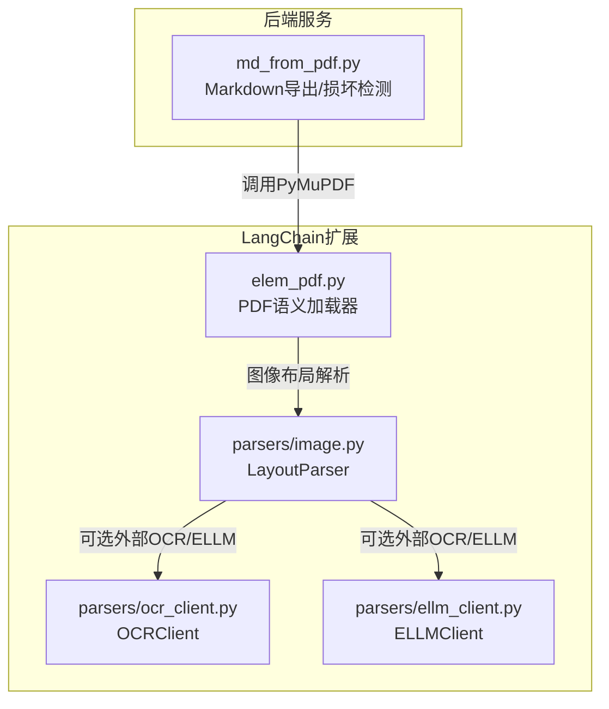
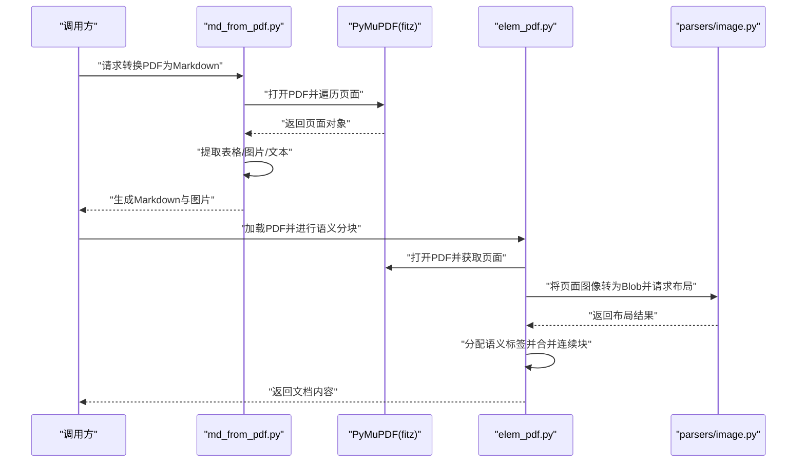
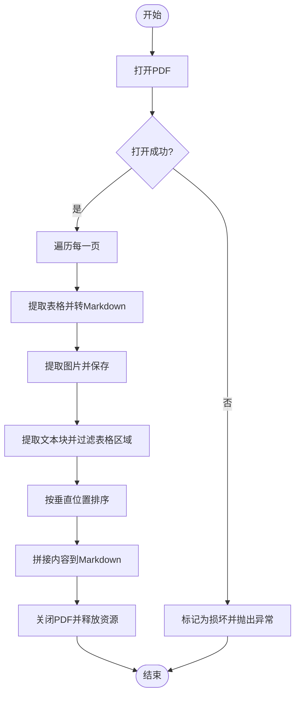
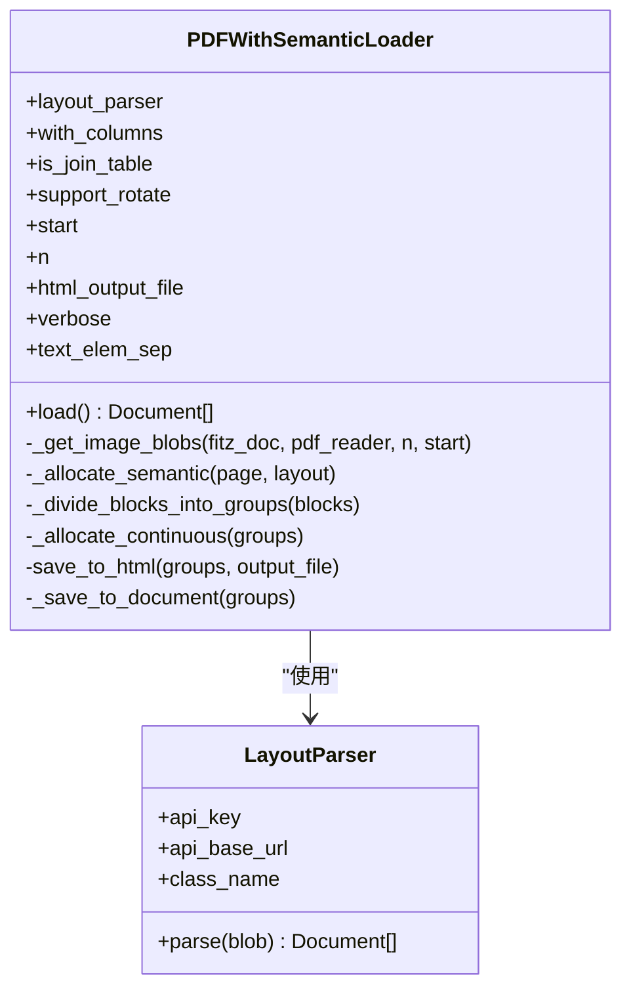
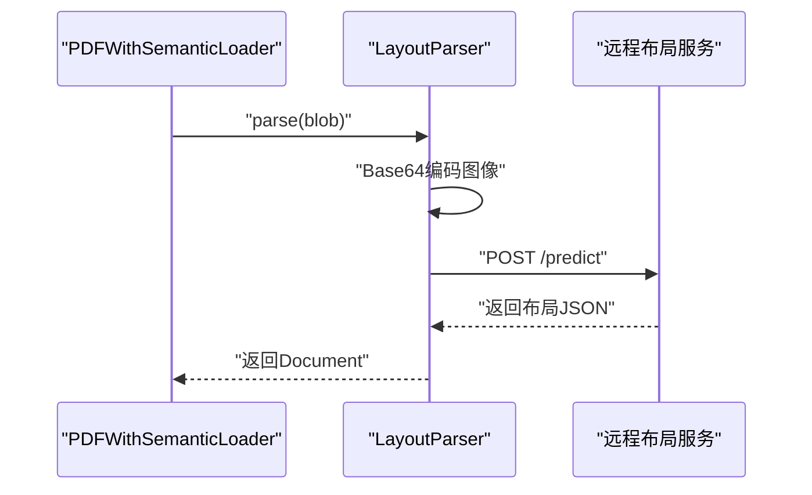
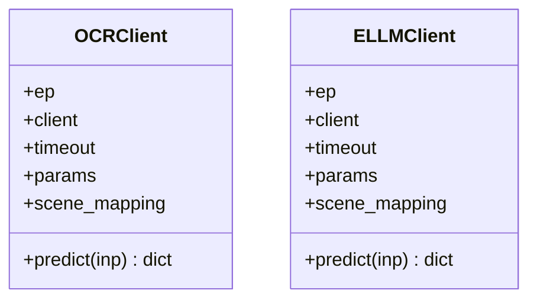
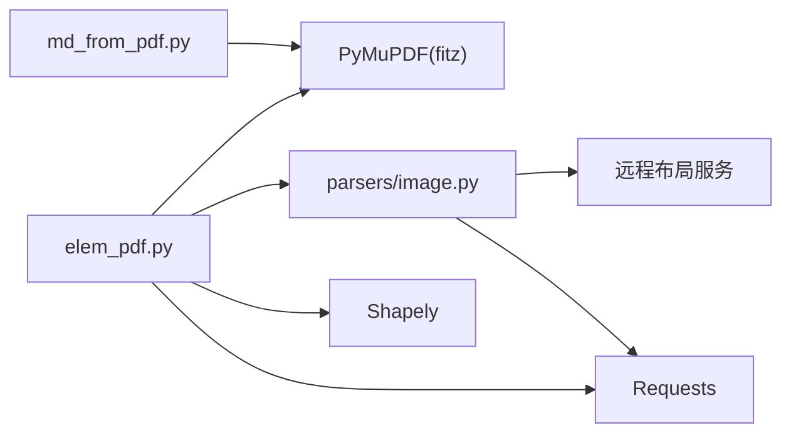

# PDF 文档解析

<cite>
**本文引用的文件**
- [src/backend/bisheng/api/services/md_from_pdf.py](file://src/backend/bisheng/api/services/md_from_pdf.py)
- [src/backend/bisheng_langchain/document_loaders/elem_pdf.py](file://src/backend/bisheng_langchain/document_loaders/elem_pdf.py)
- [src/backend/bisheng_langchain/document_loaders/parsers/image.py](file://src/backend/bisheng_langchain/document_loaders/parsers/image.py)
- [src/backend/bisheng_langchain/document_loaders/parsers/ocr_client.py](file://src/backend/bisheng_langchain/document_loaders/parsers/ocr_client.py)
- [src/backend/bisheng_langchain/document_loaders/parsers/ellm_client.py](file://src/backend/bisheng_langchain/document_loaders/parsers/ellm_client.py)
- [src/backend/bisheng_langchain/document_loaders/parsers/test_image.py](file://src/backend/bisheng_langchain/document_loaders/parsers/test_image.py)
</cite>

## 目录
1. [简介](#简介)
2. [项目结构](#项目结构)
3. [核心组件](#核心组件)
4. [架构总览](#架构总览)
5. [详细组件分析](#详细组件分析)
6. [依赖关系分析](#依赖关系分析)
7. [性能考量](#性能考量)
8. [故障排查指南](#故障排查指南)
9. [结论](#结论)
10. [附录](#附录)

## 简介
本技术文档面向 Bisheng 的 PDF 文档解析系统，聚焦以下目标：
- 深入解释 PDF 文件解析的核心算法：文本提取、表格识别、图片处理与布局分析。
- 文档化 PyMuPDF（fitz）库的使用方法：页面加载、元素提取与坐标系统。
- 详解 PDF 损坏检测机制与错误恢复策略。
- 解释多线程安全处理：锁机制与并发控制。
- 提供 PDF 特殊格式处理最佳实践：扫描版 PDF、加密 PDF、复合文档等。

## 项目结构
围绕 PDF 解析的关键代码分布在后端服务与 LangChain 扩展模块中：
- 后端服务层：提供基于 PyMuPDF 的 Markdown 导出能力与损坏检测。
- LangChain 扩展层：提供带语义分块的 PDF 加载器，结合图像布局解析与文本块分配策略。

图表来源
- [src/backend/bisheng/api/services/md_from_pdf.py](file://src/backend/bisheng/api/services/md_from_pdf.py#L11-L129)
- [src/backend/bisheng_langchain/document_loaders/elem_pdf.py](file://src/backend/bisheng_langchain/document_loaders/elem_pdf.py#L182-L635)
- [src/backend/bisheng_langchain/document_loaders/parsers/image.py](file://src/backend/bisheng_langchain/document_loaders/parsers/image.py#L11-L29)
- [src/backend/bisheng_langchain/document_loaders/parsers/ocr_client.py](file://src/backend/bisheng_langchain/document_loaders/parsers/ocr_client.py#L8-L54)
- [src/backend/bisheng_langchain/document_loaders/parsers/ellm_client.py](file://src/backend/bisheng_langchain/document_loaders/parsers/ellm_client.py#L8-L55)

章节来源
- [src/backend/bisheng/api/services/md_from_pdf.py](file://src/backend/bisheng/api/services/md_from_pdf.py#L1-L183)
- [src/backend/bisheng_langchain/document_loaders/elem_pdf.py](file://src/backend/bisheng_langchain/document_loaders/elem_pdf.py#L1-L636)
- [src/backend/bisheng_langchain/document_loaders/parsers/image.py](file://src/backend/bisheng_langchain/document_loaders/parsers/image.py#L1-L29)
- [src/backend/bisheng_langchain/document_loaders/parsers/ocr_client.py](file://src/backend/bisheng_langchain/document_loaders/parsers/ocr_client.py#L1-L54)
- [src/backend/bisheng_langchain/document_loaders/parsers/ellm_client.py](file://src/backend/bisheng_langchain/document_loaders/parsers/ellm_client.py#L1-L55)

## 核心组件
- 基于 PyMuPDF 的 Markdown 导出与损坏检测：在服务层直接使用 PyMuPDF 进行页面遍历、表格与图片抽取，并通过异常捕获判断文件是否损坏。
- 带语义分块的 PDF 加载器：结合图像布局解析结果，对文本块进行语义分配与连续性合并，支持列布局与旋转页面处理。
- 图像布局解析器：将页面渲染为图像并调用远程布局预测接口，输出包含边界框与类别标签的结果。
- OCR/ELLM 客户端：封装远程推理接口，支持不同场景（文档、表单、手写）的检测与识别模型配置。

章节来源
- [src/backend/bisheng/api/services/md_from_pdf.py](file://src/backend/bisheng/api/services/md_from_pdf.py#L11-L148)
- [src/backend/bisheng_langchain/document_loaders/elem_pdf.py](file://src/backend/bisheng_langchain/document_loaders/elem_pdf.py#L182-L635)
- [src/backend/bisheng_langchain/document_loaders/parsers/image.py](file://src/backend/bisheng_langchain/document_loaders/parsers/image.py#L11-L29)
- [src/backend/bisheng_langchain/document_loaders/parsers/ocr_client.py](file://src/backend/bisheng_langchain/document_loaders/parsers/ocr_client.py#L8-L54)
- [src/backend/bisheng_langchain/document_loaders/parsers/ellm_client.py](file://src/backend/bisheng_langchain/document_loaders/parsers/ellm_client.py#L8-L55)

## 架构总览
系统采用“服务层 + 加载器 + 解析器”的分层设计：
- 服务层负责文件级操作与并发控制。
- 加载器负责 PDF 内容的结构化提取与语义分块。
- 解析器负责图像布局预测与可选的 OCR/ELLM 推理。

图表来源
- [src/backend/bisheng/api/services/md_from_pdf.py](file://src/backend/bisheng/api/services/md_from_pdf.py#L11-L129)
- [src/backend/bisheng_langchain/document_loaders/elem_pdf.py](file://src/backend/bisheng_langchain/document_loaders/elem_pdf.py#L590-L635)
- [src/backend/bisheng_langchain/document_loaders/parsers/image.py](file://src/backend/bisheng_langchain/document_loaders/parsers/image.py#L22-L28)

## 详细组件分析

### 组件一：基于 PyMuPDF 的 PDF 处理与损坏检测
- 页面加载与遍历：通过 PyMuPDF 打开 PDF 并逐页访问，支持表格、图片与文本块提取。
- 表格识别与导出：使用内置表格检测接口，将非空表格转换为 Markdown 表格。
- 图片处理：从页面中提取图片资源，保存为独立文件并在 Markdown 中引用。
- 文本提取与去重：按块提取文本，排除位于表格中的文本块，按垂直位置排序后拼接。
- 损坏检测：尝试打开 PDF，若抛出异常则判定为损坏；另提供独立检测函数。
- 错误恢复：捕获异常并记录日志，确保资源关闭；对外抛出明确的错误信息。
- 多线程安全：使用全局锁保护 PyMuPDF 的文档对象访问，避免并发问题。

图表来源
- [src/backend/bisheng/api/services/md_from_pdf.py](file://src/backend/bisheng/api/services/md_from_pdf.py#L34-L129)

章节来源
- [src/backend/bisheng/api/services/md_from_pdf.py](file://src/backend/bisheng/api/services/md_from_pdf.py#L11-L183)

### 组件二：PDF 语义加载器（elem_pdf）
- 初始化参数：支持布局 API 配置、列布局、旋转支持、起始页与页数限制、HTML 输出、分隔符等。
- 图像提取：优先使用 PyMuPDF 渲染 PNG，失败时回退到 pypdfium2 的 PIL 渲染。
- 语义分配：将布局解析结果映射到文本块，计算包含与重叠度，按阈值分配语义标签。
- 连续性合并：对连续文本与表格进行合并，提升可读性。
- 列布局支持：通过区间覆盖与中心间隙判断两列布局，将块分配到对应列组。
- HTML 导出：可选将分块结果输出为带样式的 HTML 文件。
- 文档输出：将最终分块内容拼接为文档字符串并返回。

图表来源
- [src/backend/bisheng_langchain/document_loaders/elem_pdf.py](file://src/backend/bisheng_langchain/document_loaders/elem_pdf.py#L182-L635)
- [src/backend/bisheng_langchain/document_loaders/parsers/image.py](file://src/backend/bisheng_langchain/document_loaders/parsers/image.py#L11-L29)

章节来源
- [src/backend/bisheng_langchain/document_loaders/elem_pdf.py](file://src/backend/bisheng_langchain/document_loaders/elem_pdf.py#L182-L635)

### 组件三：图像布局解析器（LayoutParser）
- 输入：接收页面渲染后的图像 Blob。
- 处理：将图像编码为 Base64，发送至远程预测接口，返回布局信息（边界框与类别）。
- 输出：将 JSON 结果封装为 Document，供上层加载器使用。

图表来源
- [src/backend/bisheng_langchain/document_loaders/parsers/image.py](file://src/backend/bisheng_langchain/document_loaders/parsers/image.py#L22-L28)
- [src/backend/bisheng_langchain/document_loaders/elem_pdf.py](file://src/backend/bisheng_langchain/document_loaders/elem_pdf.py#L608-L610)

章节来源
- [src/backend/bisheng_langchain/document_loaders/parsers/image.py](file://src/backend/bisheng_langchain/document_loaders/parsers/image.py#L11-L29)

### 组件四：OCR/ELLM 客户端
- OCRClient：封装通用 OCR 推理接口，支持文档、表单、手写三种场景的检测与识别模型选择。
- ELLMClient：封装结构化抽取推理接口，支持键值模式（schema）传入以完成特定字段抽取。
- 共同点：统一超时设置与请求参数，异常时返回标准化错误响应。

图表来源
- [src/backend/bisheng_langchain/document_loaders/parsers/ocr_client.py](file://src/backend/bisheng_langchain/document_loaders/parsers/ocr_client.py#L8-L54)
- [src/backend/bisheng_langchain/document_loaders/parsers/ellm_client.py](file://src/backend/bisheng_langchain/document_loaders/parsers/ellm_client.py#L8-L55)

章节来源
- [src/backend/bisheng_langchain/document_loaders/parsers/ocr_client.py](file://src/backend/bisheng_langchain/document_loaders/parsers/ocr_client.py#L1-L54)
- [src/backend/bisheng_langchain/document_loaders/parsers/ellm_client.py](file://src/backend/bisheng_langchain/document_loaders/parsers/ellm_client.py#L1-L55)

### 组件五：测试与可视化（test_image）
- 测试流程：打开 PDF，渲染页面为 PNG 或 PIL 图像，提取图像块并调用布局解析器，可视化标注边界框与类别。
- 可视化辅助：将标注结果写入本地文件，便于验证布局解析效果。

章节来源
- [src/backend/bisheng_langchain/document_loaders/parsers/test_image.py](file://src/backend/bisheng_langchain/document_loaders/parsers/test_image.py#L1-L133)

## 依赖关系分析
- 组件耦合
  - 服务层与 PyMuPDF 强耦合，负责底层文件操作与并发控制。
  - 加载器与解析器弱耦合，通过 Blob 与 Document 传递数据，便于替换布局服务。
  - 解析器与外部服务弱耦合，仅通过 HTTP 接口交互。
- 外部依赖
  - PyMuPDF（fitz）、pypdfium2：用于 PDF 打开、页面访问与图像渲染。
  - Shapely：用于几何多边形与矩形运算，支撑布局分配与重叠计算。
  - Requests：用于远程布局与 OCR/ELLM 推理接口通信。
- 潜在循环依赖
  - 当前模块间无循环导入，结构清晰。

图表来源
- [src/backend/bisheng/api/services/md_from_pdf.py](file://src/backend/bisheng/api/services/md_from_pdf.py#L5-L6)
- [src/backend/bisheng_langchain/document_loaders/elem_pdf.py](file://src/backend/bisheng_langchain/document_loaders/elem_pdf.py#L12-L19)
- [src/backend/bisheng_langchain/document_loaders/parsers/image.py](file://src/backend/bisheng_langchain/document_loaders/parsers/image.py#L6-L7)

章节来源
- [src/backend/bisheng/api/services/md_from_pdf.py](file://src/backend/bisheng/api/services/md_from_pdf.py#L1-L183)
- [src/backend/bisheng_langchain/document_loaders/elem_pdf.py](file://src/backend/bisheng_langchain/document_loaders/elem_pdf.py#L1-L636)
- [src/backend/bisheng_langchain/document_loaders/parsers/image.py](file://src/backend/bisheng_langchain/document_loaders/parsers/image.py#L1-L29)

## 性能考量
- 渲染策略
  - 优先使用 PyMuPDF 的高分辨率渲染；当渲染失败时回退到 pypdfium2 的 PIL 渲染，保证稳定性。
- 几何计算
  - 使用 NumPy 与 Shapely 进行批量多边形交并计算，减少 Python 层循环开销。
- 分块与合并
  - 对连续文本与表格进行合并，降低后续处理复杂度。
- 并发与锁
  - 使用全局锁保护共享的 PDF 文档对象，避免多线程下重复打开/关闭导致的崩溃。
- I/O 优化
  - 图片以流式方式写入磁盘，避免大对象驻留内存。
- 超时与重试
  - 远程推理接口设置超时，异常时快速失败并返回标准化错误，便于上层重试或降级。

## 故障排查指南
- PDF 损坏
  - 现象：打开 PDF 抛出异常。
  - 处理：使用损坏检测函数先行判断；若损坏，提示用户修正或更换文件。
- 渲染失败
  - 现象：页面渲染为 PNG 失败。
  - 处理：自动切换到 pypdfium2 的 PIL 渲染路径；若仍失败，跳过该页或记录日志。
- 并发崩溃
  - 现象：多线程同时访问 PDF 文档导致异常。
  - 处理：确保所有文档对象访问均受全局锁保护；在 finally 中关闭文档。
- 远程接口异常
  - 现象：布局/OCR/ELLM 推理接口不可用或超时。
  - 处理：捕获异常并返回标准化错误；上层根据状态码决定重试或降级。
- 表格/图片缺失
  - 现象：表格为空或图片 xref 为 0。
  - 处理：跳过空表格与无效图片；记录日志以便审计。

章节来源
- [src/backend/bisheng/api/services/md_from_pdf.py](file://src/backend/bisheng/api/services/md_from_pdf.py#L38-L40)
- [src/backend/bisheng/api/services/md_from_pdf.py](file://src/backend/bisheng/api/services/md_from_pdf.py#L23-L33)
- [src/backend/bisheng/api/services/md_from_pdf.py](file://src/backend/bisheng/api/services/md_from_pdf.py#L45-L46)
- [src/backend/bisheng/api/services/md_from_pdf.py](file://src/backend/bisheng/api/services/md_from_pdf.py#L122-L124)
- [src/backend/bisheng_langchain/document_loaders/elem_pdf.py](file://src/backend/bisheng_langchain/document_loaders/elem_pdf.py#L223-L234)

## 结论
Bisheng 的 PDF 文档解析系统通过“服务层 + 加载器 + 解析器”的分层设计，实现了稳定高效的文本、表格、图片与布局解析。系统在健壮性方面具备完善的损坏检测与错误恢复策略，在并发方面通过锁机制保障安全；在可扩展性方面，图像布局解析与 OCR/ELLM 推理通过远程接口解耦，便于替换与升级。建议在生产环境中结合超时与重试策略，针对扫描版 PDF 与复杂布局进一步优化图像渲染与布局阈值。

## 附录
- 坐标系统说明
  - PyMuPDF 使用左上角为原点的坐标系，x 向右增大，y 向下增大。页面边界由矩形表示，文本块与表格边界同样采用矩形描述，便于几何运算与重叠判断。
- 特殊格式处理最佳实践
  - 扫描版 PDF：先进行图像渲染，再调用布局解析器；必要时结合 OCR/ELLM 客户端进行文字识别与结构化抽取。
  - 加密 PDF：当前加载器未显式处理密码参数，建议在上游增加密码传递与异常处理逻辑。
  - 复合文档：通过分页与起始页/页数限制控制处理范围，避免一次性加载过多页面造成内存压力。