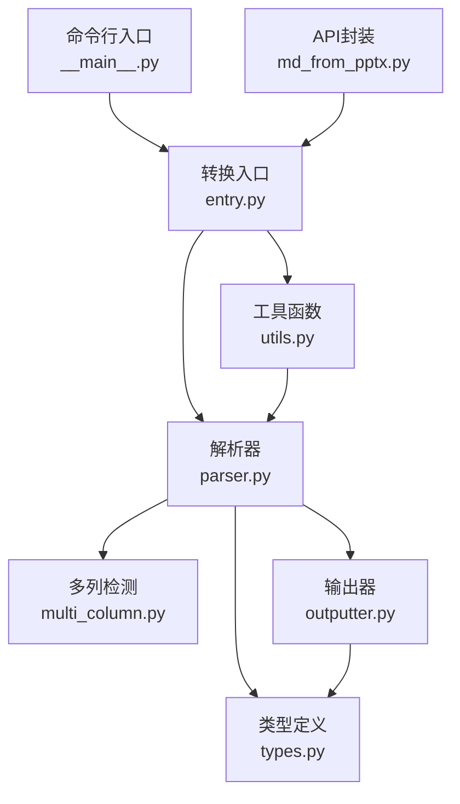
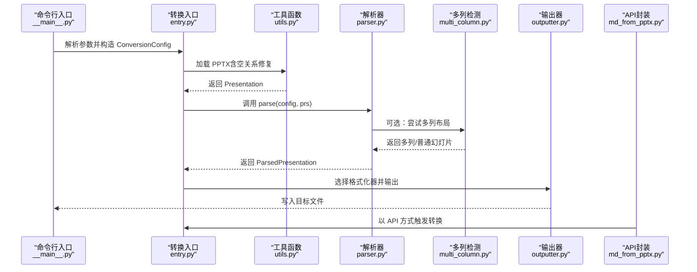
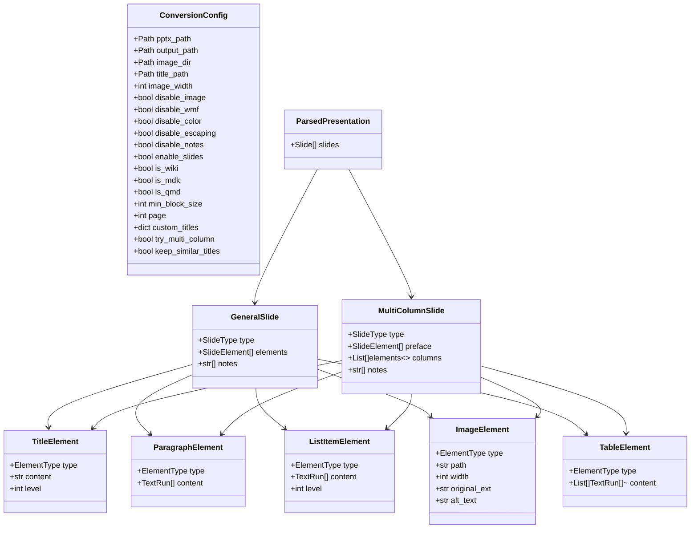
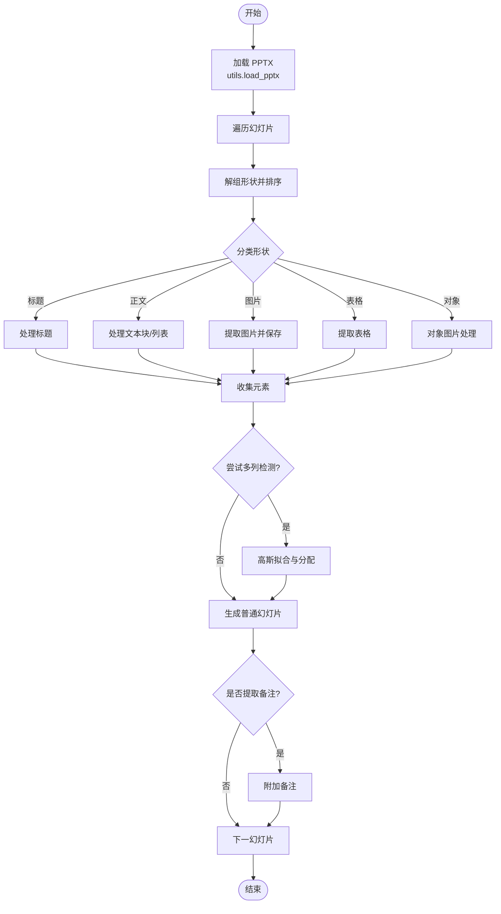
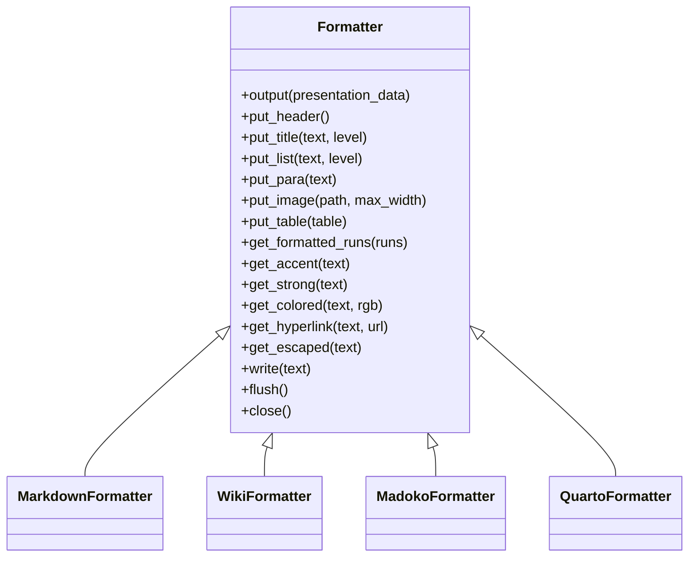
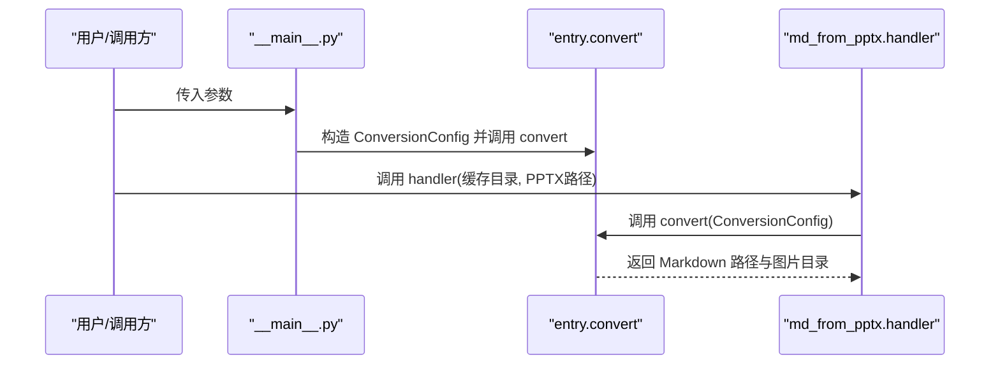
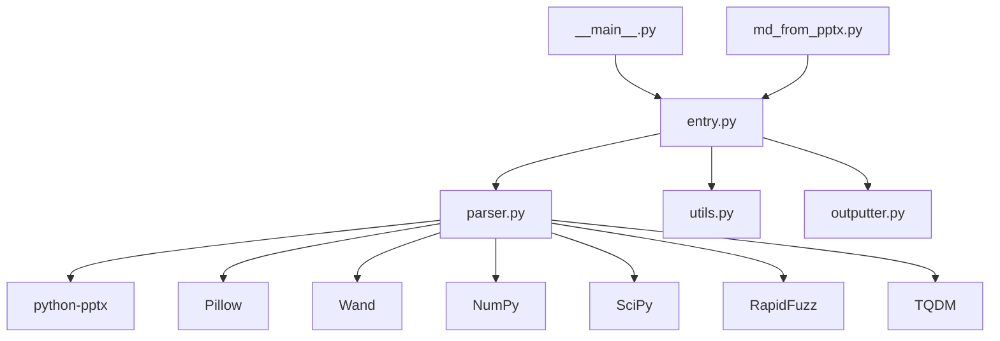

# PowerPoint 文档解析

<cite>
**本文引用的文件列表**
- [src/backend/bisheng/api/services/md_from_pptx.py](file://src/backend/bisheng/api/services/md_from_pptx.py)
- [src/backend/bisheng/pptx2md/__main__.py](file://src/backend/bisheng/pptx2md/__main__.py)
- [src/backend/bisheng/pptx2md/entry.py](file://src/backend/bisheng/pptx2md/entry.py)
- [src/backend/bisheng/pptx2md/parser.py](file://src/backend/bisheng/pptx2md/parser.py)
- [src/backend/bisheng/pptx2md/types.py](file://src/backend/bisheng/pptx2md/types.py)
- [src/backend/bisheng/pptx2md/multi_column.py](file://src/backend/bisheng/pptx2md/multi_column.py)
- [src/backend/bisheng/pptx2md/outputter.py](file://src/backend/bisheng/pptx2md/outputter.py)
- [src/backend/bisheng/pptx2md/utils.py](file://src/backend/bisheng/pptx2md/utils.py)
- [src/backend/bisheng/pptx2md/image.py](file://src/backend/bisheng/pptx2md/image.py)
- [src/backend/bisheng/pptx2md/log.py](file://src/backend/bisheng/pptx2md/log.py)
- [src/backend/pyproject.toml](file://src/backend/pyproject.toml)
</cite>

## 目录
1. [简介](#简介)
2. [项目结构](#项目结构)
3. [核心组件](#核心组件)
4. [架构总览](#架构总览)
5. [组件详解](#组件详解)
6. [依赖关系分析](#依赖关系分析)
7. [性能与兼容性](#性能与兼容性)
8. [故障排查指南](#故障排查指南)
9. [结论](#结论)
10. [附录](#附录)

## 简介
本技术文档面向 Bisheng 的 PowerPoint（PPTX）解析子系统，系统基于 python-pptx 对 PPTX 文件进行解析，提取幻灯片、文本、图片、表格等元素，并支持多列布局识别、颜色与超链接样式保留、多媒体资源导出以及多种目标格式输出（Markdown、Wiki、Madoko、Quarto）。本文从系统架构、数据流、处理逻辑、错误处理与性能优化等方面进行深入说明，帮助开发者与使用者高效理解并扩展该能力。

## 项目结构
该子系统位于后端服务中，核心模块围绕“配置-加载-Parse-格式化-输出”链路组织，主要文件如下：
- 配置与类型定义：types.py
- 入口与命令行：__main__.py、entry.py
- 解析器：parser.py
- 多列布局检测：multi_column.py
- 输出器：outputter.py
- 工具函数：utils.py、image.py、log.py
- API 封装：md_from_pptx.py
- 依赖声明：pyproject.toml

图表来源
- [src/backend/bisheng/pptx2md/__main__.py](file://src/backend/bisheng/pptx2md/__main__.py#L1-L94)
- [src/backend/bisheng/pptx2md/entry.py](file://src/backend/bisheng/pptx2md/entry.py#L1-L52)
- [src/backend/bisheng/pptx2md/parser.py](file://src/backend/bisheng/pptx2md/parser.py#L1-L311)
- [src/backend/bisheng/pptx2md/types.py](file://src/backend/bisheng/pptx2md/types.py#L1-L174)
- [src/backend/bisheng/pptx2md/multi_column.py](file://src/backend/bisheng/pptx2md/multi_column.py#L1-L246)
- [src/backend/bisheng/pptx2md/outputter.py](file://src/backend/bisheng/pptx2md/outputter.py#L1-L424)
- [src/backend/bisheng/pptx2md/utils.py](file://src/backend/bisheng/pptx2md/utils.py#L1-L102)
- [src/backend/bisheng/api/services/md_from_pptx.py](file://src/backend/bisheng/api/services/md_from_pptx.py#L1-L54)

章节来源
- [src/backend/bisheng/pptx2md/__main__.py](file://src/backend/bisheng/pptx2md/__main__.py#L1-L94)
- [src/backend/bisheng/pptx2md/entry.py](file://src/backend/bisheng/pptx2md/entry.py#L1-L52)
- [src/backend/bisheng/pptx2md/parser.py](file://src/backend/bisheng/pptx2md/parser.py#L1-L311)
- [src/backend/bisheng/pptx2md/types.py](file://src/backend/bisheng/pptx2md/types.py#L1-L174)
- [src/backend/bisheng/pptx2md/multi_column.py](file://src/backend/bisheng/pptx2md/multi_column.py#L1-L246)
- [src/backend/bisheng/pptx2md/outputter.py](file://src/backend/bisheng/pptx2md/outputter.py#L1-L424)
- [src/backend/bisheng/pptx2md/utils.py](file://src/backend/bisheng/pptx2md/utils.py#L1-L102)
- [src/backend/bisheng/api/services/md_from_pptx.py](file://src/backend/bisheng/api/services/md_from_pptx.py#L1-L54)

## 核心组件
- 配置模型 ConversionConfig：统一承载输入路径、输出路径、图像目录、最小文本块大小、是否禁用图片/颜色/转义/备注、是否分页、是否尝试多列、是否区分 wiki/madoko/quarto 等选项。
- 类型体系：包含元素类型（标题、段落、列表项、图片、表格）、样式（强调、加粗、颜色、超链接）、幻灯片类型（普通/多列）及整体结构 ParsedPresentation。
- 解析器 parser：负责遍历幻灯片、解组形状、识别标题/正文/列表/图片/表格，处理占位符与对象，提取图片并保存，必要时调用多列检测。
- 多列检测 multi_column：通过高斯拟合与重叠面积评估，自动识别两列或三列布局，并将元素分配到左右/中间列。
- 输出器 outputter：按 Markdown/Wiki/Madoko/Quarto 等格式生成最终文档，处理标题层级、列表缩进、表格渲染、图片宽度、颜色与超链接样式、备注与分页符。
- 工具函数 utils：加载 PPTX、修复空关系、准备自定义标题映射、RGB 转十六进制。
- 命令行入口 __main__：解析参数、构造 ConversionConfig 并触发转换。
- API 封装 md_from_pptx：对外提供解析接口，便于在服务中调用。

章节来源
- [src/backend/bisheng/pptx2md/types.py](file://src/backend/bisheng/pptx2md/types.py#L24-L83)
- [src/backend/bisheng/pptx2md/parser.py](file://src/backend/bisheng/pptx2md/parser.py#L274-L311)
- [src/backend/bisheng/pptx2md/multi_column.py](file://src/backend/bisheng/pptx2md/multi_column.py#L210-L246)
- [src/backend/bisheng/pptx2md/outputter.py](file://src/backend/bisheng/pptx2md/outputter.py#L26-L83)
- [src/backend/bisheng/pptx2md/utils.py](file://src/backend/bisheng/pptx2md/utils.py#L56-L77)
- [src/backend/bisheng/pptx2md/__main__.py](file://src/backend/bisheng/pptx2md/__main__.py#L27-L84)
- [src/backend/bisheng/api/services/md_from_pptx.py](file://src/backend/bisheng/api/services/md_from_pptx.py#L6-L26)

## 架构总览
下图展示从命令行到最终输出的端到端流程，以及关键模块之间的依赖关系。

图表来源
- [src/backend/bisheng/pptx2md/__main__.py](file://src/backend/bisheng/pptx2md/__main__.py#L27-L84)
- [src/backend/bisheng/pptx2md/entry.py](file://src/backend/bisheng/pptx2md/entry.py#L25-L51)
- [src/backend/bisheng/pptx2md/utils.py](file://src/backend/bisheng/pptx2md/utils.py#L56-L77)
- [src/backend/bisheng/pptx2md/parser.py](file://src/backend/bisheng/pptx2md/parser.py#L274-L311)
- [src/backend/bisheng/pptx2md/multi_column.py](file://src/backend/bisheng/pptx2md/multi_column.py#L210-L246)
- [src/backend/bisheng/pptx2md/outputter.py](file://src/backend/bisheng/pptx2md/outputter.py#L33-L82)
- [src/backend/bisheng/api/services/md_from_pptx.py](file://src/backend/bisheng/api/services/md_from_pptx.py#L19-L26)

## 组件详解

### 配置与类型体系
- ConversionConfig：集中管理所有转换参数，包括输入/输出路径、图片目录、最小文本块长度、是否启用多列、是否输出备注、是否分页、是否禁用图片/颜色/转义等。
- 类型定义：ElementType、TextStyle、TextRun、BaseElement、各元素类型、SlideType、GeneralSlide、MultiColumnSlide、ParsedPresentation，形成清晰的数据模型。

图表来源
- [src/backend/bisheng/pptx2md/types.py](file://src/backend/bisheng/pptx2md/types.py#L24-L174)

章节来源
- [src/backend/bisheng/pptx2md/types.py](file://src/backend/bisheng/pptx2md/types.py#L24-L174)

### 解析流程与数据流
- 幻灯片遍历：逐页读取，可按页号过滤；对每页形状进行解组（展开组合形状），按 top/left 排序，确保输出顺序稳定。
- 形状分类与处理：
  - 标题：识别标题/副标题/竖排标题/居中标题占位符。
  - 正文：按段落级别判断列表或段落；支持最小文本块阈值过滤。
  - 图片：提取 blob，保存至指定目录，生成相对路径；对 WMF 图像尝试转换为 PNG。
  - 表格：将每个单元格的富文本段落转为 TextRun 列表。
  - 其他：对象占位符中的图片也作为图片处理。
- 多列检测：若开启，统计形状中心与宽度分布，拟合高斯模型，计算重叠面积，确定列数并将元素分配到对应列。
- 备注：可选提取备注文本并附加到幻灯片末尾。

图表来源
- [src/backend/bisheng/pptx2md/parser.py](file://src/backend/bisheng/pptx2md/parser.py#L274-L311)
- [src/backend/bisheng/pptx2md/multi_column.py](file://src/backend/bisheng/pptx2md/multi_column.py#L210-L246)
- [src/backend/bisheng/pptx2md/utils.py](file://src/backend/bisheng/pptx2md/utils.py#L56-L77)

章节来源
- [src/backend/bisheng/pptx2md/parser.py](file://src/backend/bisheng/pptx2md/parser.py#L274-L311)
- [src/backend/bisheng/pptx2md/multi_column.py](file://src/backend/bisheng/pptx2md/multi_column.py#L210-L246)
- [src/backend/bisheng/pptx2md/utils.py](file://src/backend/bisheng/pptx2md/utils.py#L56-L77)

### 输出器与格式化
- MarkdownFormatter：标准 Markdown 输出，支持标题、列表、段落、表格、图片、强调/加粗、颜色、超链接、转义。
- WikiFormatter：TiddlyWiki 格式，标题使用感叹号、列表缩进不同、颜色与超链接语法不同。
- MadokoFormatter：支持 TOC、图片宽度控制、大图特殊处理。
- QuartoFormatter：生成 Quarto RevealJS 演示文稿头，支持多列容器与备注块，分页符控制。

图表来源
- [src/backend/bisheng/pptx2md/outputter.py](file://src/backend/bisheng/pptx2md/outputter.py#L26-L424)

章节来源
- [src/backend/bisheng/pptx2md/outputter.py](file://src/backend/bisheng/pptx2md/outputter.py#L26-L424)

### 命令行与 API 入口
- 命令行入口：解析参数，推断输出路径与格式，构造 ConversionConfig 并调用 convert。
- API 封装：提供 parser_pptx2md 与 handler，便于在服务中异步处理并返回 Markdown 文件与图片目录。

图表来源
- [src/backend/bisheng/pptx2md/__main__.py](file://src/backend/bisheng/pptx2md/__main__.py#L27-L84)
- [src/backend/bisheng/pptx2md/entry.py](file://src/backend/bisheng/pptx2md/entry.py#L25-L51)
- [src/backend/bisheng/api/services/md_from_pptx.py](file://src/backend/bisheng/api/services/md_from_pptx.py#L29-L43)

章节来源
- [src/backend/bisheng/pptx2md/__main__.py](file://src/backend/bisheng/pptx2md/__main__.py#L27-L84)
- [src/backend/bisheng/api/services/md_from_pptx.py](file://src/backend/bisheng/api/services/md_from_pptx.py#L6-L43)

## 依赖关系分析
- python-pptx：用于加载 PPTX、访问幻灯片、形状、图片、占位符、备注等。
- Pillow：用于图片格式转换与保存。
- Wand：用于 WMF 转 PNG（当 Pillow 无法直接打开时）。
- NumPy/SciPy：用于多列检测的高斯拟合与重叠面积计算。
- RapidFuzz：用于标题相似度匹配与自定义标题映射。
- TQDM：进度条显示。
- Pydantic：类型校验与序列化。

图表来源
- [src/backend/bisheng/pptx2md/parser.py](file://src/backend/bisheng/pptx2md/parser.py#L23-L31)
- [src/backend/bisheng/pptx2md/__main__.py](file://src/backend/bisheng/pptx2md/__main__.py#L15-L21)
- [src/backend/bisheng/pptx2md/entry.py](file://src/backend/bisheng/pptx2md/entry.py#L17-L20)
- [src/backend/bisheng/pptx2md/outputter.py](file://src/backend/bisheng/pptx2md/outputter.py#L15-L23)
- [src/backend/bisheng/pptx2md/utils.py](file://src/backend/bisheng/pptx2md/utils.py#L15-L23)
- [src/backend/pyproject.toml](file://src/backend/pyproject.toml#L65-L70)

章节来源
- [src/backend/bisheng/pptx2md/parser.py](file://src/backend/bisheng/pptx2md/parser.py#L23-L31)
- [src/backend/bisheng/pptx2md/__main__.py](file://src/backend/bisheng/pptx2md/__main__.py#L15-L21)
- [src/backend/bisheng/pptx2md/entry.py](file://src/backend/bisheng/pptx2md/entry.py#L17-L20)
- [src/backend/bisheng/pptx2md/outputter.py](file://src/backend/bisheng/pptx2md/outputter.py#L15-L23)
- [src/backend/bisheng/pptx2md/utils.py](file://src/backend/bisheng/pptx2md/utils.py#L15-L23)
- [src/backend/pyproject.toml](file://src/backend/pyproject.toml#L65-L70)

## 性能与兼容性
- 性能优化建议
  - 合理设置 min_block_size，避免处理微小文本块导致的开销。
  - 在 Linux 环境下，若存在大量 WMF 图片，建议开启禁用 WMF 或预处理为 PNG，减少 Wand 转换失败与重试成本。
  - 使用 page 参数仅处理特定页面，缩短调试时间。
  - 多列检测会引入额外的数值拟合与分配开销，仅在需要时启用 try_multi_column。
  - 图片导出时尽量限制最大宽度，减少 Markdown 中冗余内联样式。
- 兼容性最佳实践
  - 对于损坏的 PPTX（空关系），系统内置修复流程；若仍失败，建议在外部先用 Office 或在线工具修复后再导入。
  - 不同版本的 PPTX 可能存在占位符布局差异，建议结合自定义标题映射文件提升标题层级一致性。
  - 超链接解析可能因 PPTX 版本或加密而异常，系统会记录错误标记，必要时回退为纯文本。
  - 多列检测依赖形状几何分布，若布局复杂或混合布局，建议关闭多列检测或手动调整。

[本节为通用指导，不直接分析具体文件，故无章节来源]

## 故障排查指南
- PPTX 打不开或报错“不存在的项”
  - 系统会捕获 KeyErrors 并尝试修复空关系，若修复失败，请检查源文件完整性。
  - 参考：[src/backend/bisheng/pptx2md/utils.py](file://src/backend/bisheng/pptx2md/utils.py#L56-L77)
- WMF 图片无法转换
  - 若 Pillow 无法打开，系统尝试 Wand；若仍失败，将跳过该图片并记录警告。
  - 参考：[src/backend/bisheng/pptx2md/parser.py](file://src/backend/bisheng/pptx2md/parser.py#L203-L217)
- 形状异常或组合形状导致解析失败
  - 解组过程中会跳过不可读形状并记录警告，建议清理幻灯片中的异常对象。
  - 参考：[src/backend/bisheng/pptx2md/parser.py](file://src/backend/bisheng/pptx2md/parser.py#L230-L240)
- 多列检测结果不准确
  - 检查幻灯片布局是否接近两列/三列分布；必要时关闭 try_multi_column。
  - 参考：[src/backend/bisheng/pptx2md/multi_column.py](file://src/backend/bisheng/pptx2md/multi_column.py#L210-L246)
- 输出格式不符合预期
  - 确认 is_wiki/is_mdk/is_qmd 选项；Quarto 需要 RevealJS 支持。
  - 参考：[src/backend/bisheng/pptx2md/outputter.py](file://src/backend/bisheng/pptx2md/outputter.py#L41-L48)

章节来源
- [src/backend/bisheng/pptx2md/utils.py](file://src/backend/bisheng/pptx2md/utils.py#L56-L77)
- [src/backend/bisheng/pptx2md/parser.py](file://src/backend/bisheng/pptx2md/parser.py#L203-L217)
- [src/backend/bisheng/pptx2md/parser.py](file://src/backend/bisheng/pptx2md/parser.py#L230-L240)
- [src/backend/bisheng/pptx2md/multi_column.py](file://src/backend/bisheng/pptx2md/multi_column.py#L210-L246)
- [src/backend/bisheng/pptx2md/outputter.py](file://src/backend/bisheng/pptx2md/outputter.py#L41-L48)

## 结论
该子系统以清晰的模块划分与稳健的错误处理实现了对 PPTX 的全面解析与多格式输出。通过配置驱动与类型安全的设计，既满足了多样化的业务需求，又保证了可维护性与可扩展性。建议在生产环境中结合性能与兼容性最佳实践，针对不同场景灵活启用特性，并配合外部工具进行文件预处理与质量保障。

[本节为总结性内容，不直接分析具体文件，故无章节来源]

## 附录
- 常用参数速览
  - 输入/输出：pptx_path、output_path、image_dir
  - 图片：image_width、disable_image、disable_wmf
  - 文本：min_block_size、disable_color、disable_escaping、disable_notes
  - 分页与标题：enable_slides、keep_similar_titles、title_path
  - 格式：is_wiki、is_mdk、is_qmd
  - 调试：page
- 参考实现位置
  - 配置与类型：[src/backend/bisheng/pptx2md/types.py](file://src/backend/bisheng/pptx2md/types.py#L24-L83)
  - 命令行入口：[src/backend/bisheng/pptx2md/__main__.py](file://src/backend/bisheng/pptx2md/__main__.py#L27-L84)
  - 转换入口：[src/backend/bisheng/pptx2md/entry.py](file://src/backend/bisheng/pptx2md/entry.py#L25-L51)
  - 解析器：[src/backend/bisheng/pptx2md/parser.py](file://src/backend/bisheng/pptx2md/parser.py#L274-L311)
  - 多列检测：[src/backend/bisheng/pptx2md/multi_column.py](file://src/backend/bisheng/pptx2md/multi_column.py#L210-L246)
  - 输出器：[src/backend/bisheng/pptx2md/outputter.py](file://src/backend/bisheng/pptx2md/outputter.py#L26-L424)
  - 工具函数：[src/backend/bisheng/pptx2md/utils.py](file://src/backend/bisheng/pptx2md/utils.py#L56-L77)
  - API 封装：[src/backend/bisheng/api/services/md_from_pptx.py](file://src/backend/bisheng/api/services/md_from_pptx.py#L6-L43)
  - 依赖声明：[src/backend/pyproject.toml](file://src/backend/pyproject.toml#L65-L70)

[本节为参考索引，不直接分析具体文件，故无章节来源]