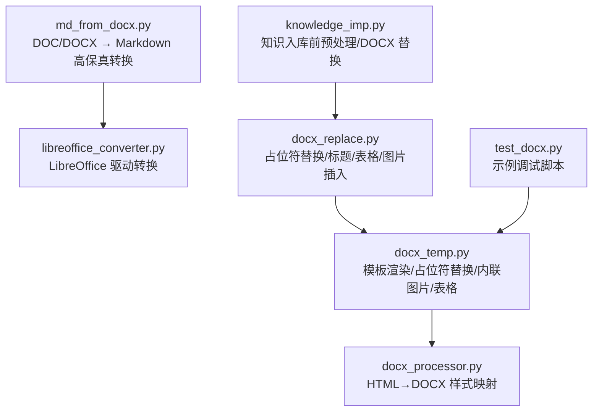
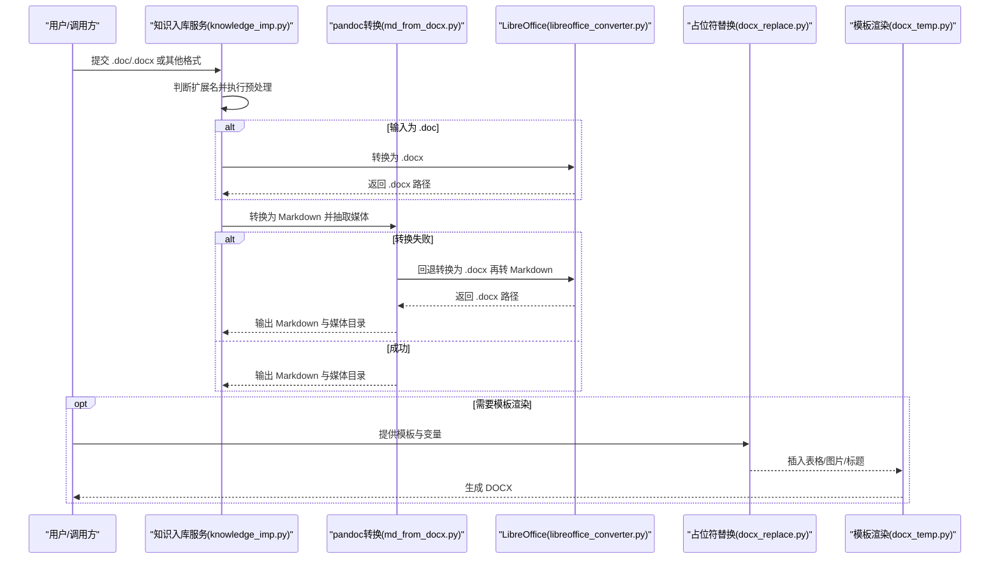
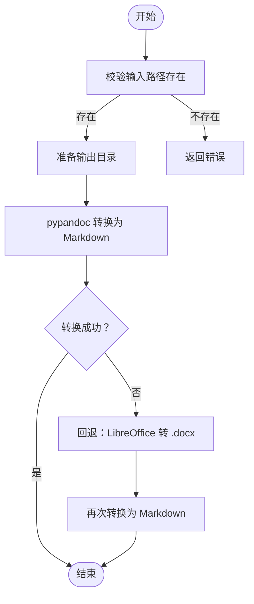
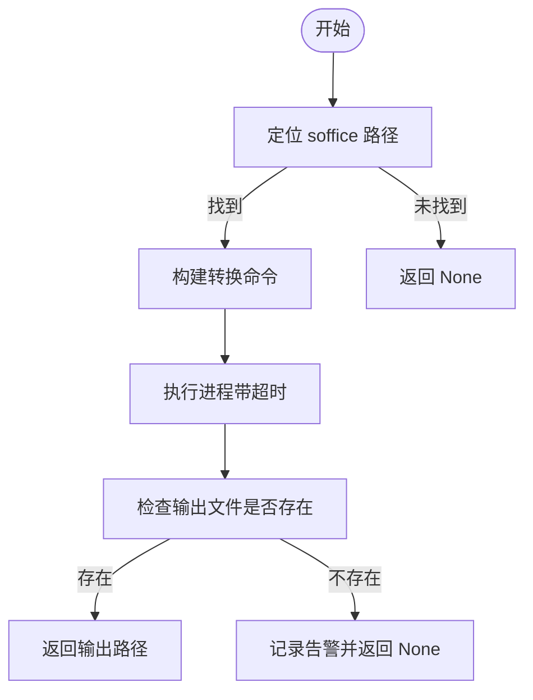
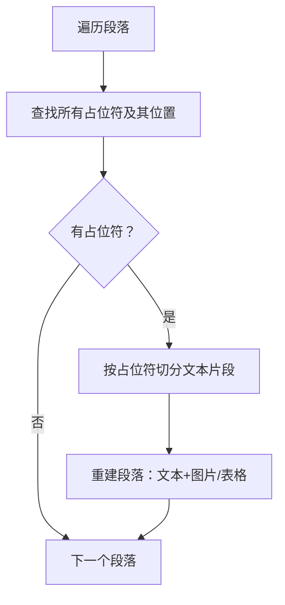
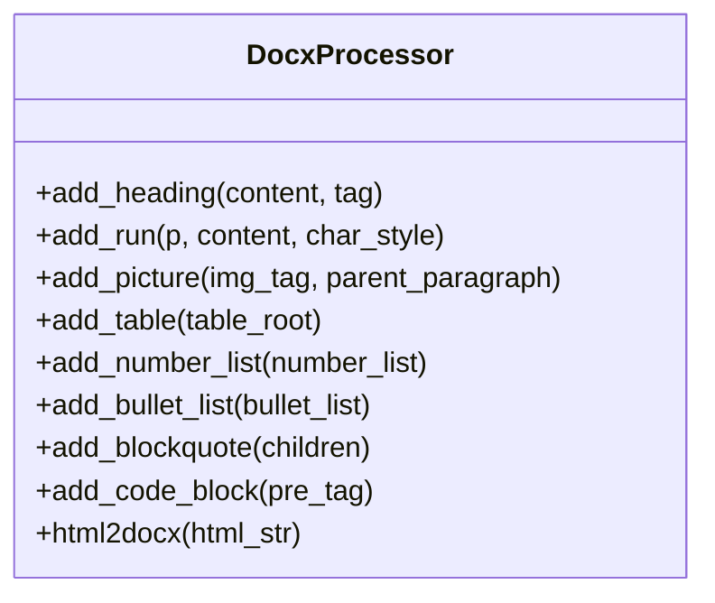
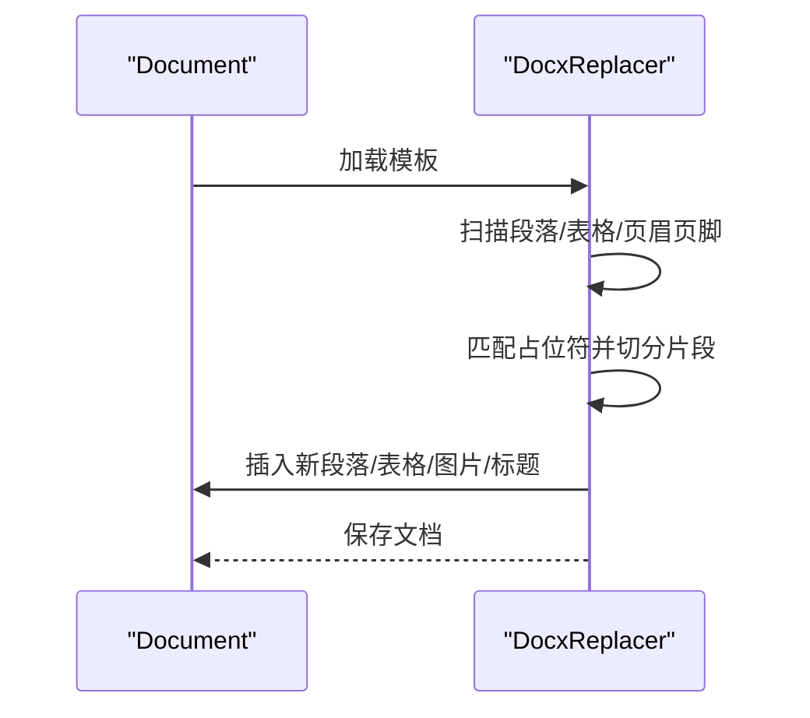
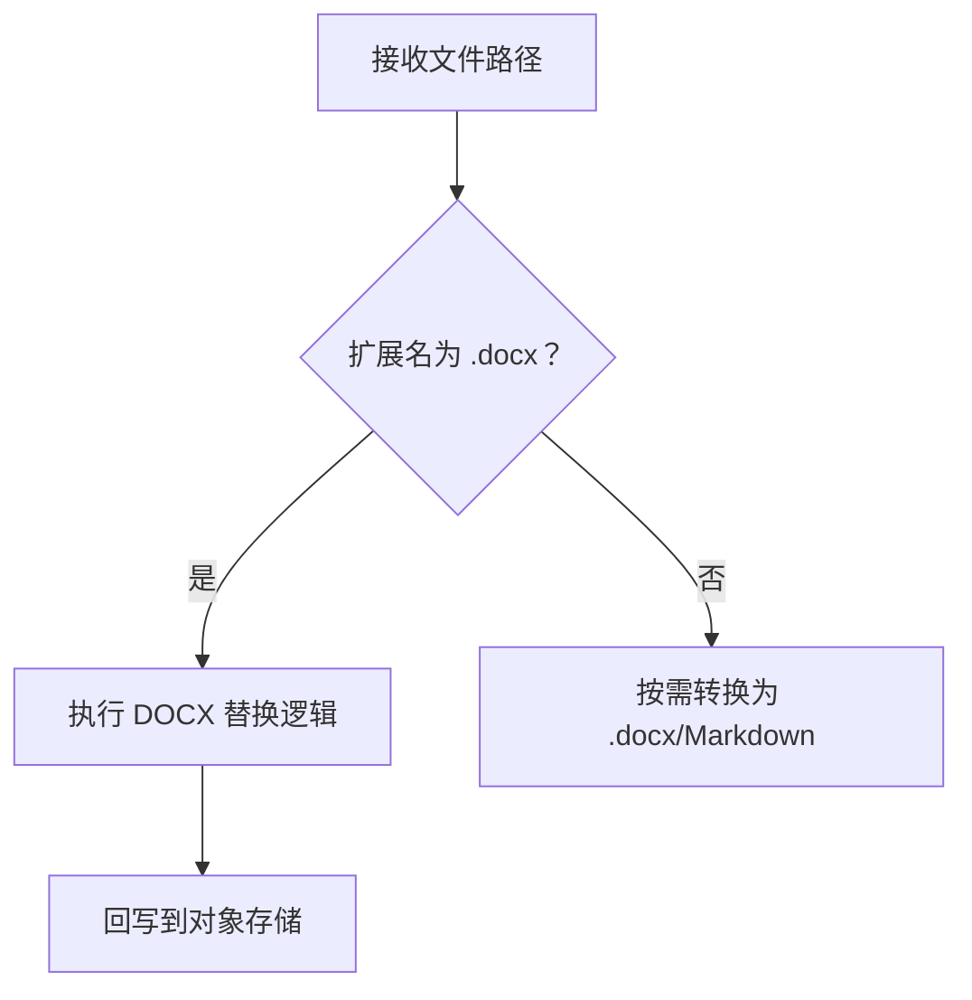
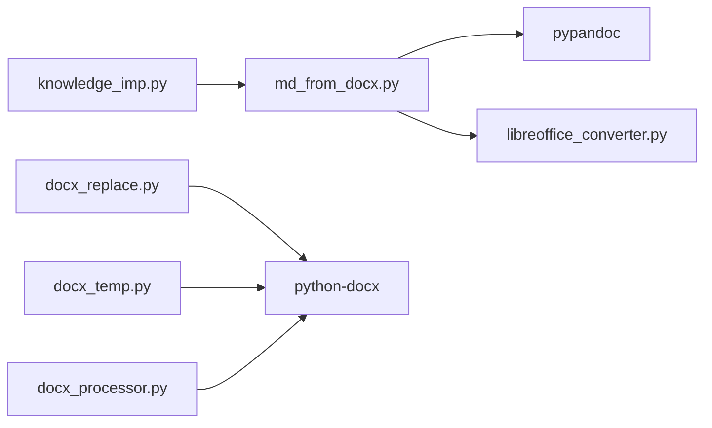

# Word 文档解析

<cite>
**本文引用的文件**
- [md_from_docx.py](file://src/backend/bisheng/api/services/md_from_docx.py)
- [libreoffice_converter.py](file://src/backend/bisheng/api/services/libreoffice_converter.py)
- [docx_temp.py](file://src/backend/bisheng/utils/docx_temp.py)
- [docx_processor.py](file://src/backend/bisheng/common/utils/markdown_cmpnt/md_to_docx/provider/docx_processor.py)
- [docx_replace.py](file://src/backend/bisheng/workflow/nodes/report/docx_replace.py)
- [knowledge_imp.py](file://src/backend/bisheng/api/services/knowledge_imp.py)
- [test_docx.py](file://src/backend/test/test_docx.py)
</cite>

## 目录
1. [简介](#简介)
2. [项目结构](#项目结构)
3. [核心组件](#核心组件)
4. [架构总览](#架构总览)
5. [详细组件分析](#详细组件分析)
6. [依赖关系分析](#依赖关系分析)
7. [性能考量](#性能考量)
8. [故障排查指南](#故障排查指南)
9. [结论](#结论)
10. [附录](#附录)

## 简介
本技术文档面向 Bisheng 的 Word 文档解析系统，聚焦 DOCX 文件的解析流程与质量控制，涵盖以下主题：
- DOCX 结构分析、样式提取与内容重组
- python-docx 的使用方法：段落处理、表格解析、图片提取
- Word 特定格式处理：样式标记、交叉引用、脚注尾注、批注
- 文档版本兼容性与格式转换策略
- 错误处理与质量控制最佳实践

## 项目结构
围绕 Word 文档解析的关键模块分布如下：
- 文档到 Markdown 的高保真转换：md_from_docx.py
- LibreOffice 驱动的格式转换：libreoffice_converter.py
- DOCX 模板渲染与混合内容插入：utils/docx_temp.py
- HTML 到 DOCX 的样式映射与元素处理：common/utils/markdown_cmpnt/md_to_docx/provider/docx_processor.py
- DOCX 占位符替换与复杂格式插入：workflow/nodes/report/docx_replace.py
- 知识库入库前的预处理与替换逻辑：api/services/knowledge_imp.py
- 示例调试脚本：test/test_docx.py

图表来源
- [md_from_docx.py](file://src/backend/bisheng/api/services/md_from_docx.py#L25-L93)
- [libreoffice_converter.py](file://src/backend/bisheng/api/services/libreoffice_converter.py#L126-L144)
- [docx_temp.py](file://src/backend/bisheng/utils/docx_temp.py#L34-L120)
- [docx_processor.py](file://src/backend/bisheng/common/utils/markdown_cmpnt/md_to_docx/provider/docx_processor.py#L24-L50)
- [docx_replace.py](file://src/backend/bisheng/workflow/nodes/report/docx_replace.py#L13-L64)
- [knowledge_imp.py](file://src/backend/bisheng/api/services/knowledge_imp.py#L685-L696)
- [test_docx.py](file://src/backend/test/test_docx.py#L39-L64)

章节来源
- [md_from_docx.py](file://src/backend/bisheng/api/services/md_from_docx.py#L1-L130)
- [libreoffice_converter.py](file://src/backend/bisheng/api/services/libreoffice_converter.py#L1-L182)
- [docx_temp.py](file://src/backend/bisheng/utils/docx_temp.py#L1-L800)
- [docx_processor.py](file://src/backend/bisheng/common/utils/markdown_cmpnt/md_to_docx/provider/docx_processor.py#L1-L487)
- [docx_replace.py](file://src/backend/bisheng/workflow/nodes/report/docx_replace.py#L1-L442)
- [knowledge_imp.py](file://src/backend/bisheng/api/services/knowledge_imp.py#L680-L879)
- [test_docx.py](file://src/backend/test/test_docx.py#L1-L64)

## 核心组件
- DOCX 高保真转换器：基于 pypandoc 将 .doc/.docx 转为 Markdown，并抽取媒体资源；若失败则回退至 LibreOffice 转换为 .docx 再转 Markdown。
- LibreOffice 转换器：通过 soffice 命令行进行无头转换，支持 .doc → .docx、.ppt → .pptx、.pptx → .pdf 等。
- DOCX 模板渲染器：支持在段落中内联插入图片、表格，按混合内容片段重建文档结构，保留段落样式与运行样式。
- HTML→DOCX 处理器：将 HTML 元素映射为 DOCX 段落、表格、列表、块引用等，并应用样式管理器。
- DOCX 占位符替换器：递归扫描段落、表格、页眉页脚，按占位符类型插入文本、表格、图片、标题，保持原格式。
- 知识入库预处理器：对 .docx 进行特殊替换逻辑，必要时将修复后的 .docx 回写到对象存储。

章节来源
- [md_from_docx.py](file://src/backend/bisheng/api/services/md_from_docx.py#L25-L111)
- [libreoffice_converter.py](file://src/backend/bisheng/api/services/libreoffice_converter.py#L126-L144)
- [docx_temp.py](file://src/backend/bisheng/utils/docx_temp.py#L34-L120)
- [docx_processor.py](file://src/backend/bisheng/common/utils/markdown_cmpnt/md_to_docx/provider/docx_processor.py#L24-L50)
- [docx_replace.py](file://src/backend/bisheng/workflow/nodes/report/docx_replace.py#L13-L64)
- [knowledge_imp.py](file://src/backend/bisheng/api/services/knowledge_imp.py#L685-L696)

## 架构总览
下图展示从输入 Word 文档到最终输出 Markdown 或 DOCX 的整体流程与模块交互。

图表来源
- [knowledge_imp.py](file://src/backend/bisheng/api/services/knowledge_imp.py#L858-L879)
- [md_from_docx.py](file://src/backend/bisheng/api/services/md_from_docx.py#L25-L93)
- [libreoffice_converter.py](file://src/backend/bisheng/api/services/libreoffice_converter.py#L126-L144)
- [docx_replace.py](file://src/backend/bisheng/workflow/nodes/report/docx_replace.py#L44-L63)
- [docx_temp.py](file://src/backend/bisheng/utils/docx_temp.py#L34-L120)

## 详细组件分析

### 组件一：DOCX 高保真转换（pypandoc）
- 功能要点
  - 使用 pypandoc 将 .doc/.docx 转为 Markdown，支持抽取媒体资源到指定子目录
  - 若转换失败，自动尝试先用 LibreOffice 转为 .docx 再转 Markdown
  - 支持可选参数控制换行与标题风格
- 关键流程
  - 参数校验与输出目录准备
  - 执行转换命令并捕获异常
  - 失败时触发 .doc → .docx 回退流程
- 质量控制
  - 记录 Pandoc 版本信息与路径
  - 对未知选项错误进行降级提示
  - 异常时终止并抛出错误

图表来源
- [md_from_docx.py](file://src/backend/bisheng/api/services/md_from_docx.py#L25-L93)

章节来源
- [md_from_docx.py](file://src/backend/bisheng/api/services/md_from_docx.py#L1-L130)

### 组件二：LibreOffice 转换器
- 功能要点
  - 自动探测 soffice 可执行文件路径
  - 通过命令行执行无头转换，支持 .doc → .docx、.ppt → .pptx、.pptx → .pdf
  - 使用临时用户安装目录避免冲突
- 错误处理
  - 文件未找到、命令执行失败、超时、意外异常均记录日志并返回 None

图表来源
- [libreoffice_converter.py](file://src/backend/bisheng/api/services/libreoffice_converter.py#L36-L144)

章节来源
- [libreoffice_converter.py](file://src/backend/bisheng/api/services/libreoffice_converter.py#L1-L182)

### 组件三：DOCX 模板渲染与混合内容插入
- 功能要点
  - 支持段落内混合文本、图片、表格的连续插入
  - 精确清理跨运行（run）占位符，避免破坏段落结构
  - 表格解析支持 CSV/Excel/Markdown 表格，限制最大行列数以保证性能
  - 图片插入支持内联与单元格内嵌两种模式
- 关键算法
  - 段落混合内容切分与重建：按占位符位置拆分为文本片段与资源片段，逐段恢复到新段落
  - 表格插入：在当前段落后方插入表格元素，并在需要时创建后续段落承接剩余文本

图表来源
- [docx_temp.py](file://src/backend/bisheng/utils/docx_temp.py#L368-L461)

章节来源
- [docx_temp.py](file://src/backend/bisheng/utils/docx_temp.py#L1-L800)

### 组件四：HTML→DOCX 样式映射与元素处理
- 功能要点
  - 将 HTML 标签映射为 DOCX 段落、标题、表格、列表、块引用、代码块等
  - 字体、加粗、斜体、下划线、删除线、上下标、高亮等字符样式映射
  - 图片支持本地路径、网络 URL 与内嵌流数据，可设置缩放比例
  - 表格解析支持 thead/tbody 结构，自动识别列数并填充单元格
- 设计模式
  - 使用样式管理器初始化文档样式，确保标题、列表、表格等样式一致

图表来源
- [docx_processor.py](file://src/backend/bisheng/common/utils/markdown_cmpnt/md_to_docx/provider/docx_processor.py#L24-L487)

章节来源
- [docx_processor.py](file://src/backend/bisheng/common/utils/markdown_cmpnt/md_to_docx/provider/docx_processor.py#L1-L487)

### 组件五：DOCX 占位符替换器
- 功能要点
  - 递归扫描文档段落、表格、页眉页脚中的占位符
  - 支持文本、表格、图片、标题等类型的变量替换
  - 保持原始段落与运行样式，插入新段落或表格元素
- 关键流程
  - 提取段落索引与格式信息
  - 将匹配到的占位符拆分为文本片段与变量片段
  - 按片段类型插入对应元素，并应用样式

图表来源
- [docx_replace.py](file://src/backend/bisheng/workflow/nodes/report/docx_replace.py#L44-L181)

章节来源
- [docx_replace.py](file://src/backend/bisheng/workflow/nodes/report/docx_replace.py#L1-L442)

### 组件六：知识入库预处理与 DOCX 替换
- 功能要点
  - 对 .docx 文件执行特殊替换逻辑，必要时将修复后的 .docx 回写到对象存储
  - 在入库流程中根据扩展名选择转换路径（.doc → .docx → Markdown）

图表来源
- [knowledge_imp.py](file://src/backend/bisheng/api/services/knowledge_imp.py#L685-L696)
- [knowledge_imp.py](file://src/backend/bisheng/api/services/knowledge_imp.py#L858-L879)

章节来源
- [knowledge_imp.py](file://src/backend/bisheng/api/services/knowledge_imp.py#L680-L879)

## 依赖关系分析
- 模块耦合
  - md_from_docx.py 依赖 pypandoc 与 libreoffice_converter.py
  - knowledge_imp.py 在入库前统一调度转换与替换
  - docx_replace.py 与 docx_temp.py 分别负责占位符替换与模板渲染，前者更偏向结构化插入，后者偏向混合内容重建
- 外部依赖
  - pypandoc：用于高保真转换
  - LibreOffice：用于 .doc/.ppt 等格式的无头转换
  - python-docx：用于段落、表格、运行样式的读写

图表来源
- [md_from_docx.py](file://src/backend/bisheng/api/services/md_from_docx.py#L5-L8)
- [libreoffice_converter.py](file://src/backend/bisheng/api/services/libreoffice_converter.py#L1-L182)
- [knowledge_imp.py](file://src/backend/bisheng/api/services/knowledge_imp.py#L858-L879)
- [docx_replace.py](file://src/backend/bisheng/workflow/nodes/report/docx_replace.py#L1-L11)
- [docx_temp.py](file://src/backend/bisheng/utils/docx_temp.py#L1-L15)
- [docx_processor.py](file://src/backend/bisheng/common/utils/markdown_cmpnt/md_to_docx/provider/docx_processor.py#L1-L22)

章节来源
- [md_from_docx.py](file://src/backend/bisheng/api/services/md_from_docx.py#L1-L130)
- [libreoffice_converter.py](file://src/backend/bisheng/api/services/libreoffice_converter.py#L1-L182)
- [knowledge_imp.py](file://src/backend/bisheng/api/services/knowledge_imp.py#L858-L879)
- [docx_replace.py](file://src/backend/bisheng/workflow/nodes/report/docx_replace.py#L1-L442)
- [docx_temp.py](file://src/backend/bisheng/utils/docx_temp.py#L1-L800)
- [docx_processor.py](file://src/backend/bisheng/common/utils/markdown_cmpnt/md_to_docx/provider/docx_processor.py#L1-L487)

## 性能考量
- 表格大小限制
  - Excel/CSV 解析默认限制最大行数与列数，避免生成过大表格影响布局与性能
- 图片尺寸控制
  - 默认内联图片宽度适中，单元格内图片采用较小尺寸
- 流程优化
  - 段落混合内容插入时尽量复用原段落样式，减少重复格式化开销
  - 表格插入采用在当前段落后插入的方式，避免频繁移动 DOM

章节来源
- [docx_temp.py](file://src/backend/bisheng/utils/docx_temp.py#L656-L725)

## 故障排查指南
- Pandoc 未找到或版本不兼容
  - 现象：转换失败或报“未知选项”
  - 处理：自动下载 Pandoc 或降低选项（如注释掉特定参数），并记录日志
- LibreOffice 未安装或不可执行
  - 现象：找不到 soffice 命令或转换超时
  - 处理：检查 PATH 或手动指定路径，确认无头模式可用
- DOCX 占位符未生效
  - 现象：占位符未被替换或样式丢失
  - 处理：确认占位符格式与变量结构一致，检查段落索引与格式提取逻辑
- 图片插入失败
  - 现象：占位符显示为路径而非图片
  - 处理：检查图片路径是否存在、权限与格式支持，回退到原路径显示

章节来源
- [md_from_docx.py](file://src/backend/bisheng/api/services/md_from_docx.py#L10-L22)
- [libreoffice_converter.py](file://src/backend/bisheng/api/services/libreoffice_converter.py#L101-L123)
- [docx_replace.py](file://src/backend/bisheng/workflow/nodes/report/docx_replace.py#L138-L181)
- [docx_temp.py](file://src/backend/bisheng/utils/docx_temp.py#L523-L536)

## 结论
Bisheng 的 Word 文档解析体系通过“高保真转换 + 模板渲染 + 占位符替换”的组合，实现了对 DOCX 的结构化解析与高质量内容重组。系统在兼容性方面采用 pypandoc 与 LibreOffice 双通道策略，在性能与稳定性之间取得平衡。建议在实际部署中：
- 明确 Pandoc/LibreOffice 的安装与版本要求
- 对大表格与图片进行容量限制与缓存策略
- 在占位符替换前后进行格式一致性校验
- 对异常场景建立完善的日志与回退机制

## 附录
- 示例调试脚本可用于查看页面、段落、运行级别的属性，便于定位样式与格式问题。

章节来源
- [test_docx.py](file://src/backend/test/test_docx.py#L1-L64)