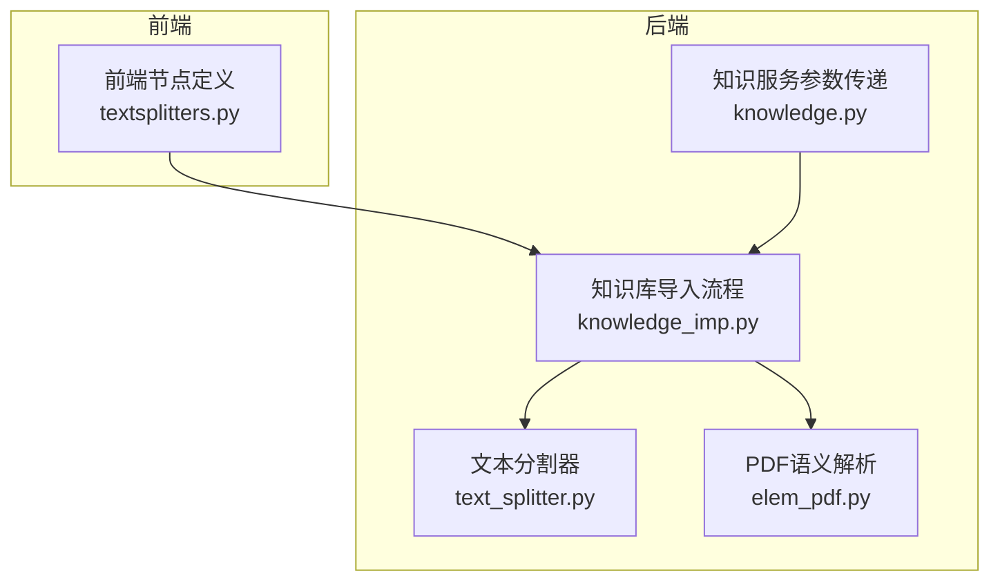
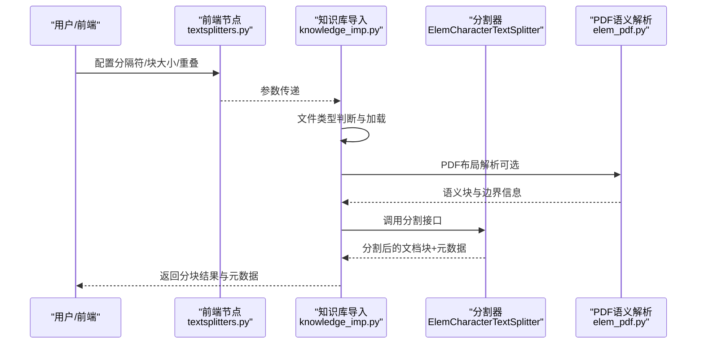
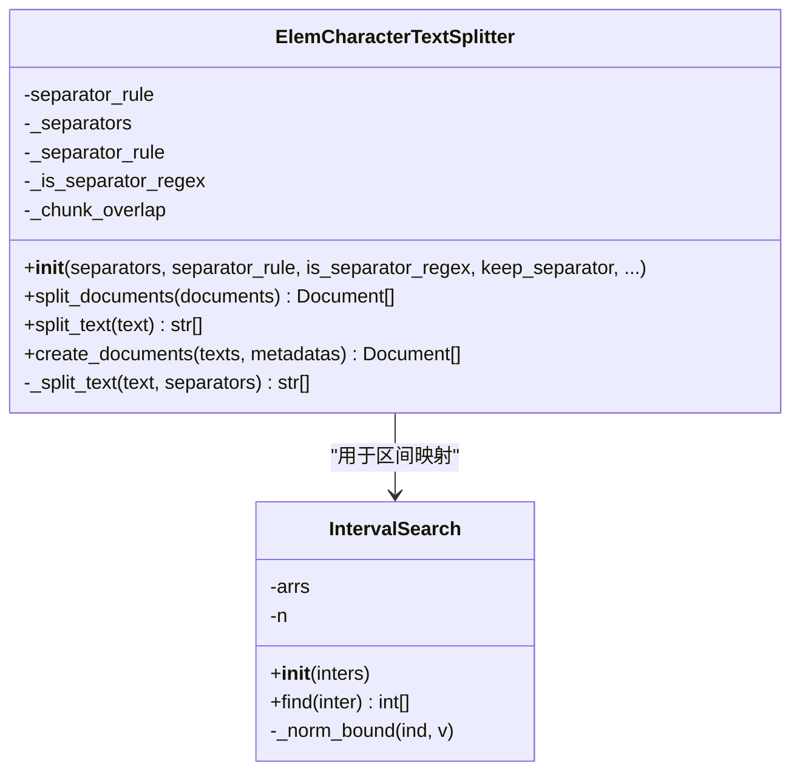
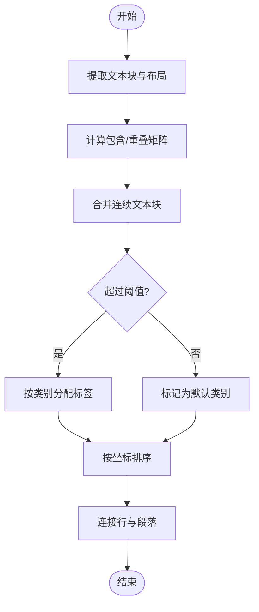
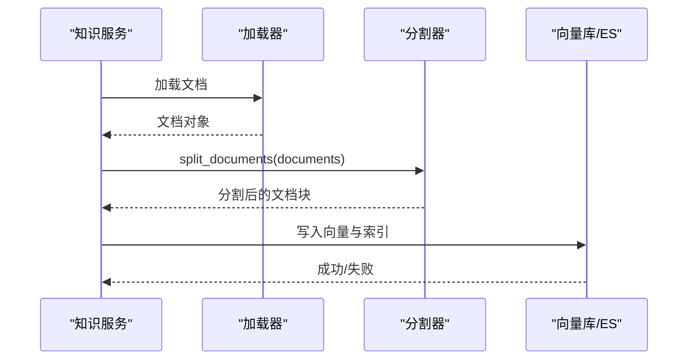
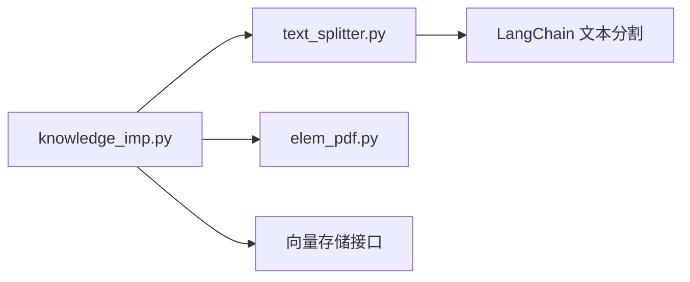

# 文本分割算法

<cite>
**本文引用的文件**
- [src/backend/bisheng_langchain/text_splitter.py](file://src/backend/bisheng_langchain/text_splitter.py)
- [src/backend/bisheng/template/frontend_node/textsplitters.py](file://src/backend/bisheng/template/frontend_node/textsplitters.py)
- [src/backend/bisheng/api/services/knowledge_imp.py](file://src/backend/bisheng/api/services/knowledge_imp.py)
- [src/backend/bisheng/api/services/knowledge.py](file://src/backend/bisheng/api/services/knowledge.py)
- [src/backend/bisheng_langchain/document_loaders/elem_pdf.py](file://src/backend/bisheng_langchain/document_loaders/elem_pdf.py)
- [src/backend/bisheng/api/v1/schemas.py](file://src/backend/bisheng/api/v1/schemas.py)
- [src/backend/bisheng/common/errcode/knowledge.py](file://src/backend/bisheng/common/errcode/knowledge.py)
</cite>

## 目录
1. [引言](#引言)
2. [项目结构](#项目结构)
3. [核心组件](#核心组件)
4. [架构总览](#架构总览)
5. [详细组件分析](#详细组件分析)
6. [依赖关系分析](#依赖关系分析)
7. [性能考量](#性能考量)
8. [故障排查指南](#故障排查指南)
9. [结论](#结论)
10. [附录](#附录)

## 引言
本技术文档面向 Bisheng 文本分割算法系统，系统性阐述多策略文本分割的实现与应用，包括语义分割、句法分割与段落边界识别；梳理分割算法的核心参数配置（如分割阈值、上下文窗口、相似度计算）；给出不同文档类型（技术文档、学术论文、商业报告）的分割优化策略；并提供分割质量评估指标与后处理优化建议，以及性能调优与准确率提升的最佳实践。

## 项目结构
围绕文本分割的关键代码主要分布在如下模块：
- 文本分割器实现：bisheng_langchain/text_splitter.py
- 前端节点参数定义：template/frontend_node/textsplitters.py
- 知识库导入流程与分割调用：api/services/knowledge_imp.py
- 分割规则与参数在知识服务中的传递：api/services/knowledge.py
- PDF 语义解析与布局分配：bisheng_langchain/document_loaders/elem_pdf.py
- 分割规则枚举与字段定义：api/v1/schemas.py
- 错误码与提示：common/errcode/knowledge.py

**图示来源**
- [src/backend/bisheng/template/frontend_node/textsplitters.py](file://src/backend/bisheng/template/frontend_node/textsplitters.py#L1-L73)
- [src/backend/bisheng/api/services/knowledge_imp.py](file://src/backend/bisheng/api/services/knowledge_imp.py#L820-L997)
- [src/backend/bisheng/api/services/knowledge.py](file://src/backend/bisheng/api/services/knowledge.py#L428-L428)
- [src/backend/bisheng_langchain/text_splitter.py](file://src/backend/bisheng_langchain/text_splitter.py#L86-L222)
- [src/backend/bisheng_langchain/document_loaders/elem_pdf.py](file://src/backend/bisheng_langchain/document_loaders/elem_pdf.py#L182-L400)

**章节来源**
- [src/backend/bisheng/template/frontend_node/textsplitters.py](file://src/backend/bisheng/template/frontend_node/textsplitters.py#L1-L73)
- [src/backend/bisheng/api/services/knowledge_imp.py](file://src/backend/bisheng/api/services/knowledge_imp.py#L800-L1000)
- [src/backend/bisheng/api/services/knowledge.py](file://src/backend/bisheng/api/services/knowledge.py#L428-L428)
- [src/backend/bisheng_langchain/text_splitter.py](file://src/backend/bisheng_langchain/text_splitter.py#L86-L222)
- [src/backend/bisheng_langchain/document_loaders/elem_pdf.py](file://src/backend/bisheng_langchain/document_loaders/elem_pdf.py#L182-L400)

## 核心组件
- 自定义字符级分割器：ElemCharacterTextSplitter
  - 支持多级分隔符与“分割前/后”规则控制，结合重叠合并策略，实现对复杂文本的稳健切分。
  - 提供 create_documents 接口，支持保留原始布局元信息（页码、bbox、类型等），用于后续检索增强与可视化。
- 前端节点参数模板：TextSplittersFrontendNode
  - 定义分隔符、分隔符类型、块大小、重叠大小等参数，便于可视化配置与调试。
- 知识库导入流程：knowledge_imp.py
  - 统一调度文档加载、标题抽取、分割与元数据处理，按文件类型选择最优策略。
- PDF 语义解析：elem_pdf.py
  - 基于布局分析与几何包含关系，将文本块按语义类别（段落、表格、页眉页脚等）进行连续合并与排序，为分割提供更精细的边界线索。

**章节来源**
- [src/backend/bisheng_langchain/text_splitter.py](file://src/backend/bisheng_langchain/text_splitter.py#L86-L222)
- [src/backend/bisheng/template/frontend_node/textsplitters.py](file://src/backend/bisheng/template/frontend_node/textsplitters.py#L6-L73)
- [src/backend/bisheng/api/services/knowledge_imp.py](file://src/backend/bisheng/api/services/knowledge_imp.py#L820-L997)
- [src/backend/bisheng_langchain/document_loaders/elem_pdf.py](file://src/backend/bisheng_langchain/document_loaders/elem_pdf.py#L182-L400)

## 架构总览
下图展示从用户配置到分割执行再到元数据处理的整体流程。

**图示来源**
- [src/backend/bisheng/template/frontend_node/textsplitters.py](file://src/backend/bisheng/template/frontend_node/textsplitters.py#L11-L73)
- [src/backend/bisheng/api/services/knowledge_imp.py](file://src/backend/bisheng/api/services/knowledge_imp.py#L820-L997)
- [src/backend/bisheng_langchain/text_splitter.py](file://src/backend/bisheng_langchain/text_splitter.py#L111-L222)
- [src/backend/bisheng_langchain/document_loaders/elem_pdf.py](file://src/backend/bisheng_langchain/document_loaders/elem_pdf.py#L182-L400)

## 详细组件分析

### 组件A：ElemCharacterTextSplitter（自定义字符级分割器）
- 设计要点
  - 多级分隔符优先匹配：按优先级选择最合适的分隔符，确保在复杂文本中尽可能保留语义边界。
  - 分割前后规则：通过“before/after”规则控制分隔符与子串的拼接位置，避免截断关键符号。
  - 重叠合并：对过长片段递归拆分后，按重叠策略合并，保证上下文连贯性。
  - 元数据映射：在 create_documents 中，基于索引区间映射原始页码、bbox 与类型，生成更丰富的 chunk 元信息。
- 关键流程（简化）
  - 选择分隔符 → 正则拆分 → 递归拆分过长片段 → 合并重叠 → 生成 Document 列表

**图示来源**
- [src/backend/bisheng_langchain/text_splitter.py](file://src/backend/bisheng_langchain/text_splitter.py#L86-L222)

**章节来源**
- [src/backend/bisheng_langchain/text_splitter.py](file://src/backend/bisheng_langchain/text_splitter.py#L86-L222)

### 组件B：PDF 语义分割与布局分配
- 设计要点
  - 基于 LayoutParser 的布局信息，计算文本块与语义区域的包含/重叠比例，确定文本归属类别。
  - 对连续文本块进行合并，减少碎片化；对表格等特殊区域采用有序拼接。
  - 支持旋转页面的坐标变换，提高布局识别鲁棒性。
- 关键流程（简化）
  - 页面文本块提取 → 语义区域解析 → 包含矩阵计算 → 连续块合并 → 重叠率阈值分配 → 排序输出

**图示来源**
- [src/backend/bisheng_langchain/document_loaders/elem_pdf.py](file://src/backend/bisheng_langchain/document_loaders/elem_pdf.py#L237-L400)

**章节来源**
- [src/backend/bisheng_langchain/document_loaders/elem_pdf.py](file://src/backend/bisheng_langchain/document_loaders/elem_pdf.py#L182-L400)

### 组件C：知识库导入流程中的分割调用
- 设计要点
  - 按文件类型选择加载器与预处理策略（PDF 可走 ETL4LM 或本地 md 流程）。
  - 对非电子表格类型统一调用分割器，生成 chunk 并写入向量库与 ES。
  - 支持异步与同步两种加载方式，保障吞吐。
- 关键流程（简化）
  - 选择加载器 → 加载文档 → 可选标题抽取 → 分割 → 元数据封装 → 写入向量库

**图示来源**
- [src/backend/bisheng/api/services/knowledge_imp.py](file://src/backend/bisheng/api/services/knowledge_imp.py#L820-L997)

**章节来源**
- [src/backend/bisheng/api/services/knowledge_imp.py](file://src/backend/bisheng/api/services/knowledge_imp.py#L800-L1000)
- [src/backend/bisheng/api/services/knowledge_imp.py](file://src/backend/bisheng/api/services/knowledge_imp.py#L1150-L1200)

### 组件D：前端节点参数与分割规则
- 设计要点
  - 定义分隔符、分隔符类型（如 Language 枚举）、块大小、重叠大小等参数，便于可视化配置。
  - 分割规则枚举（before/after）在知识服务层进行传递与应用。
- 关键字段
  - 分隔符/分隔符类型、块大小、重叠大小、分割规则列表

**章节来源**
- [src/backend/bisheng/template/frontend_node/textsplitters.py](file://src/backend/bisheng/template/frontend_node/textsplitters.py#L11-L73)
- [src/backend/bisheng/api/v1/schemas.py](file://src/backend/bisheng/api/v1/schemas.py#L428-L428)
- [src/backend/bisheng/api/services/knowledge.py](file://src/backend/bisheng/api/services/knowledge.py#L428-L428)

## 依赖关系分析
- 组件耦合
  - 知识库导入流程依赖分割器与加载器；分割器依赖 LangChain 的递归字符分割基类。
  - PDF 语义解析与分割器之间存在间接协作：PDF 输出的布局信息可用于指导分割边界（在元数据层面体现）。
- 外部依赖
  - LangChain 文本分割与文档模型
  - LayoutParser（布局解析）
  - 向量存储（Milvus/Elasticsearch）

**图示来源**
- [src/backend/bisheng/api/services/knowledge_imp.py](file://src/backend/bisheng/api/services/knowledge_imp.py#L820-L997)
- [src/backend/bisheng_langchain/text_splitter.py](file://src/backend/bisheng_langchain/text_splitter.py#L18-L18)
- [src/backend/bisheng_langchain/document_loaders/elem_pdf.py](file://src/backend/bisheng_langchain/document_loaders/elem_pdf.py#L182-L211)

**章节来源**
- [src/backend/bisheng/api/services/knowledge_imp.py](file://src/backend/bisheng/api/services/knowledge_imp.py#L820-L997)
- [src/backend/bisheng_langchain/text_splitter.py](file://src/backend/bisheng_langchain/text_splitter.py#L18-L18)
- [src/backend/bisheng_langchain/document_loaders/elem_pdf.py](file://src/backend/bisheng_langchain/document_loaders/elem_pdf.py#L182-L211)

## 性能考量
- 分割参数调优
  - 块大小与重叠：较大的块有利于上下文完整，但会增加嵌入维度与检索开销；重叠有助于跨块信息连贯，但会增加分块数量。
  - 分隔符优先级：合理设置分隔符优先级，可减少无效拆分与跨句切分。
  - 分割规则（before/after）：在标点或特定符号处采用“后置”可避免截断，提升可读性。
- PDF 语义优化
  - 合理设置包含/重叠阈值，平衡“连续性”与“类别区分”。
  - 表格区域按列序拼接，减少跨列信息断裂。
- 批处理与并发
  - 对大文档采用分页/分段处理，结合异步加载与分割，提升吞吐。
- 向量存储
  - 控制 chunk 数量与大小，避免单条记录过大；合理选择索引策略与分片。

[本节为通用性能建议，不直接分析具体文件]

## 故障排查指南
- 常见问题
  - 分割边界不合理：检查分隔符优先级与“before/after”规则是否匹配目标文档类型。
  - 重叠过多导致 chunk 数量异常：适当增大 chunk_size 或减小 chunk_overlap。
  - PDF 布局错乱：确认布局 API 可用性与旋转处理逻辑。
  - 知识库版本限制：当前版本不支持修改已有分段，需新建知识库后重新导入。
- 定位路径
  - 分割器实现与参数传递：text_splitter.py、knowledge_imp.py
  - 规则枚举与字段：schemas.py、knowledge.py
  - 错误提示与限制：knowledge.py 错误码

**章节来源**
- [src/backend/bisheng/common/errcode/knowledge.py](file://src/backend/bisheng/common/errcode/knowledge.py#L21-L21)
- [src/backend/bisheng/api/services/knowledge_imp.py](file://src/backend/bisheng/api/services/knowledge_imp.py#L820-L997)
- [src/backend/bisheng/api/v1/schemas.py](file://src/backend/bisheng/api/v1/schemas.py#L428-L428)
- [src/backend/bisheng/api/services/knowledge.py](file://src/backend/bisheng/api/services/knowledge.py#L428-L428)

## 结论
Bisheng 的文本分割体系通过“自定义字符级分割器 + PDF 语义解析 + 知识库导入流程”的组合，实现了对多文档类型的稳健分割。通过合理配置分隔符、块大小、重叠与分割规则，并结合 PDF 布局信息与元数据映射，可在保证上下文连贯的同时提升检索质量。建议在实际部署中依据文档类型与业务目标持续迭代参数，并配合向量存储与索引策略进行性能优化。

[本节为总结性内容，不直接分析具体文件]

## 附录
- 不同文档类型的分割优化策略（建议）
  - 技术文档：优先按“段落/章节”分隔符拆分，保持代码块与公式完整性；重叠可略大以保留上下文。
  - 学术论文：优先按“标题层级/摘要/正文”分隔符拆分；注意公式与参考文献区段的独立性。
  - 商业报告：优先按“章节/小节”分隔符拆分；对表格与图表区域单独处理，保留其上下文。
- 质量评估与后处理
  - 评估指标：召回率（跨句信息保留）、一致性（相邻 chunk 语义连贯）、可读性（人工抽样评分）。
  - 后处理：去除空白与重复、规范化标点、对长尾片段二次合并、基于相似度的去重。

[本节为通用建议，不直接分析具体文件]