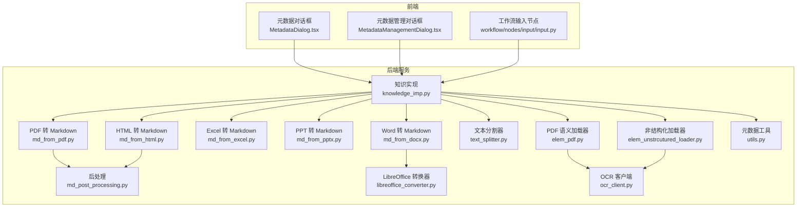
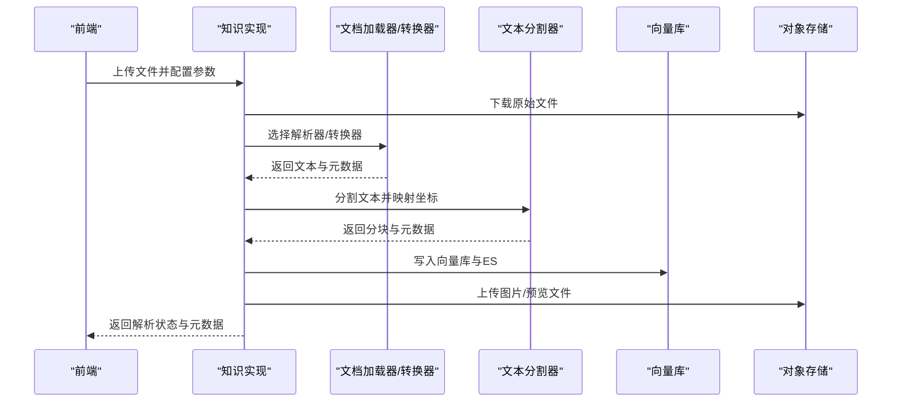
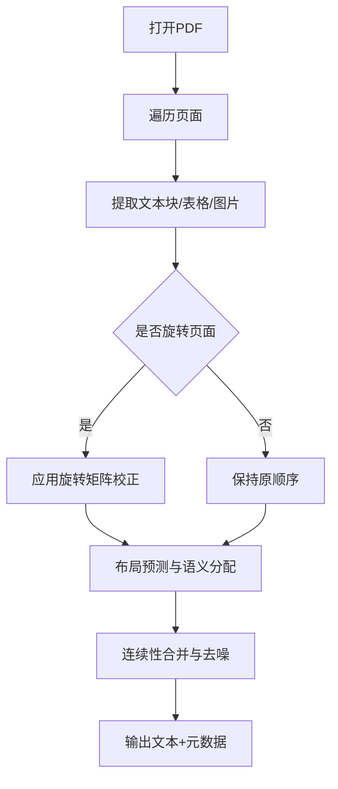
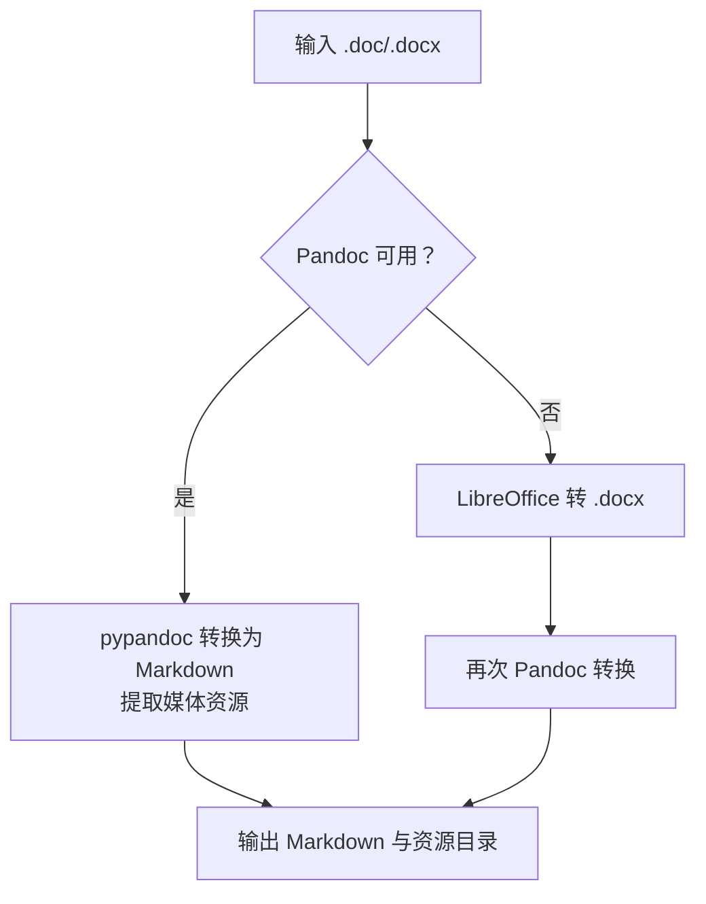
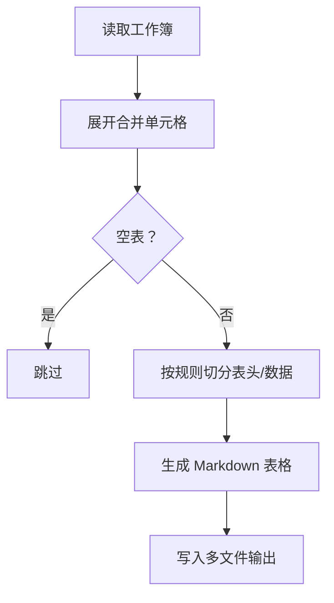
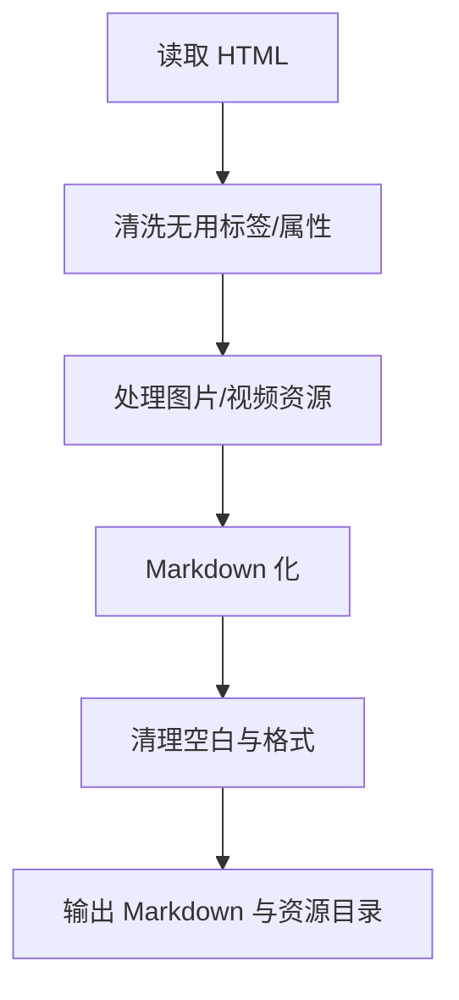
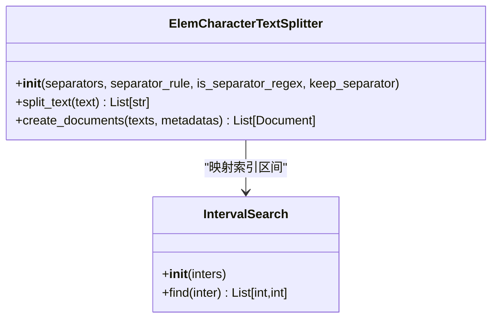
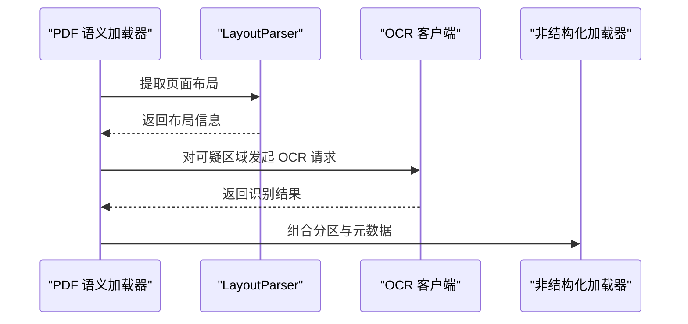
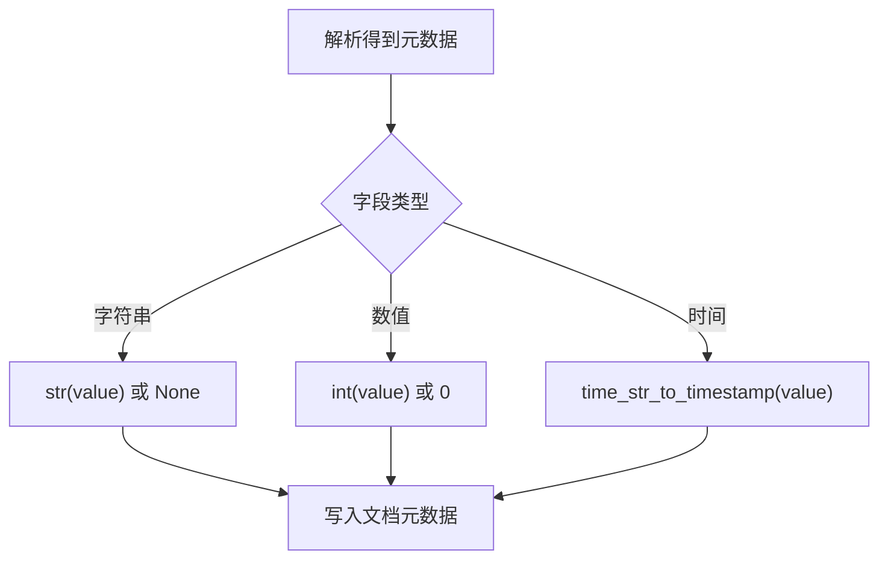
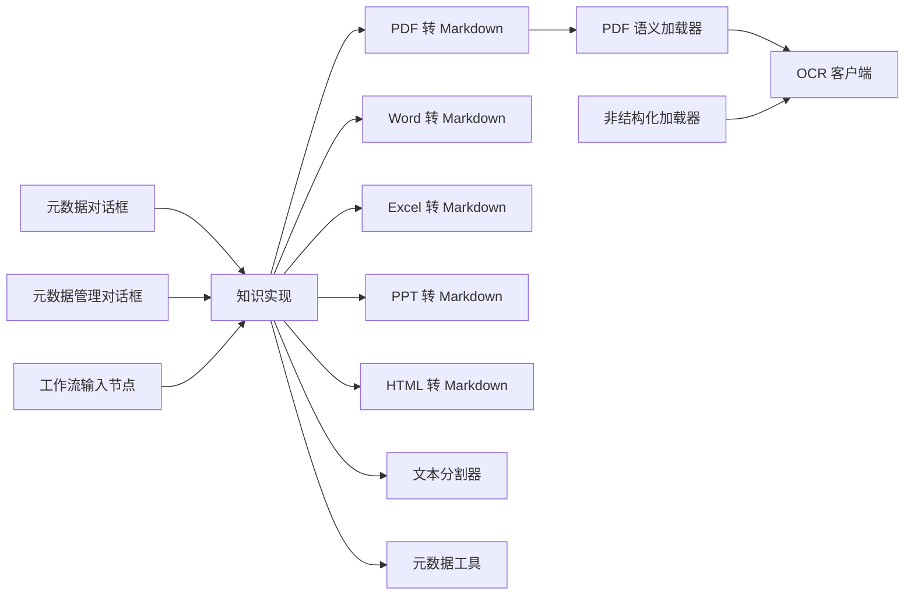

# 文档处理系统

<cite>
**本文引用的文件**
- [知识实现](file://src/backend/bisheng/api/services/knowledge_imp.py)
- [PDF 转 Markdown](file://src/backend/bisheng/api/services/md_from_pdf.py)
- [Word 转 Markdown](file://src/backend/bisheng/api/services/md_from_docx.py)
- [Excel 转 Markdown](file://src/backend/bisheng/api/services/md_from_excel.py)
- [PPT 转 Markdown](file://src/backend/bisheng/api/services/md_from_pptx.py)
- [HTML 转 Markdown](file://src/backend/bisheng/api/services/md_from_html.py)
- [后处理](file://src/backend/bisheng/api/services/md_post_processing.py)
- [LibreOffice 转换器](file://src/backend/bisheng/api/services/libreoffice_converter.py)
- [文本分割器](file://src/backend/bisheng_langchain/text_splitter.py)
- [PDF 语义加载器](file://src/backend/bisheng_langchain/document_loaders/elem_pdf.py)
- [非结构化加载器](file://src/backend/bisheng_langchain/document_loaders/elem_unstrcutured_loader.py)
- [OCR 客户端](file://src/backend/bisheng_langchain/document_loaders/parsers/ocr_client.py)
- [元数据工具](file://src/backend/bisheng/knowledge/domain/utils.py)
- [前端元数据对话框](file://src/frontend/platform/src/pages/KnowledgePage/components/MetadataDialog.tsx)
- [前端元数据管理对话框](file://src/frontend/platform/src/pages/KnowledgePage/components/MetadataManagementDialog.tsx)
- [工作流输入节点](file://src/backend/bisheng/workflow/nodes/input/input.py)
</cite>

## 目录
1. [简介](#简介)
2. [项目结构](#项目结构)
3. [核心组件](#核心组件)
4. [架构总览](#架构总览)
5. [详细组件分析](#详细组件分析)
6. [依赖关系分析](#依赖关系分析)
7. [性能考虑](#性能考虑)
8. [故障排查指南](#故障排查指南)
9. [结论](#结论)

## 简介
本技术文档面向 Bisheng 文档处理系统，系统支持多格式文档解析（PDF、Word、Excel、PPT、HTML），并提供文本分割、OCR 集成、元数据提取与质量控制等能力。本文从代码级视角梳理各模块职责、数据流与处理算法，并给出最佳实践与排障建议。

## 项目结构
系统采用前后端分离架构，后端以 Python 为主，使用 LangChain 扩展与第三方库完成文档解析；前端提供知识库与元数据管理界面。

图表来源
- [知识实现](file://src/backend/bisheng/api/services/knowledge_imp.py#L75-L82)
- [PDF 转 Markdown](file://src/backend/bisheng/api/services/md_from_pdf.py#L11-L28)
- [Word 转 Markdown](file://src/backend/bisheng/api/services/md_from_docx.py#L25-L47)
- [Excel 转 Markdown](file://src/backend/bisheng/api/services/md_from_excel.py#L369-L416)
- [PPT 转 Markdown](file://src/backend/bisheng/api/services/md_from_pptx.py#L6-L26)
- [HTML 转 Markdown](file://src/backend/bisheng/api/services/md_from_html.py#L572-L677)
- [后处理](file://src/backend/bisheng/api/services/md_post_processing.py#L8-L154)
- [LibreOffice 转换器](file://src/backend/bisheng/api/services/libreoffice_converter.py#L36-L100)
- [文本分割器](file://src/backend/bisheng_langchain/text_splitter.py#L86-L222)
- [PDF 语义加载器](file://src/backend/bisheng_langchain/document_loaders/elem_pdf.py#L182-L636)
- [非结构化加载器](file://src/backend/bisheng_langchain/document_loaders/elem_unstrcutured_loader.py#L90-L140)
- [OCR 客户端](file://src/backend/bisheng_langchain/document_loaders/parsers/ocr_client.py#L8-L52)
- [元数据工具](file://src/backend/bisheng/knowledge/domain/utils.py#L57-L76)

章节来源
- [知识实现](file://src/backend/bisheng/api/services/knowledge_imp.py#L75-L82)

## 核心组件
- 多格式解析服务：按文件类型选择专用转换器或加载器，生成 Markdown 及资源目录。
- 文本分割器：基于自定义规则与正则的递归分割，保留语义块与坐标映射。
- OCR 集成：通过 OCR 客户端调用外部推理服务，支持多种场景模型。
- 元数据系统：统一的类型转换与内置字段管理，支持用户自定义元数据。
- 质量控制：后处理清洗、图片保留策略、损坏检测与错误恢复。

章节来源
- [知识实现](file://src/backend/bisheng/api/services/knowledge_imp.py#L438-L541)
- [文本分割器](file://src/backend/bisheng_langchain/text_splitter.py#L86-L222)
- [OCR 客户端](file://src/backend/bisheng_langchain/document_loaders/parsers/ocr_client.py#L8-L52)
- [元数据工具](file://src/backend/bisheng/knowledge/domain/utils.py#L57-L76)

## 架构总览
系统处理流程分为“文件下载—格式解析—文本分割—向量化入库—预览与缓存”的闭环。前端负责元数据编辑与展示，后端负责解析与存储。

图表来源
- [知识实现](file://src/backend/bisheng/api/services/knowledge_imp.py#L543-L661)
- [PDF 转 Markdown](file://src/backend/bisheng/api/services/md_from_pdf.py#L11-L28)
- [Word 转 Markdown](file://src/backend/bisheng/api/services/md_from_docx.py#L25-L47)
- [Excel 转 Markdown](file://src/backend/bisheng/api/services/md_from_excel.py#L369-L416)
- [PPT 转 Markdown](file://src/backend/bisheng/api/services/md_from_pptx.py#L6-L26)
- [HTML 转 Markdown](file://src/backend/bisheng/api/services/md_from_html.py#L572-L677)
- [后处理](file://src/backend/bisheng/api/services/md_post_processing.py#L8-L154)
- [LibreOffice 转换器](file://src/backend/bisheng/api/services/libreoffice_converter.py#L36-L100)
- [文本分割器](file://src/backend/bisheng_langchain/text_splitter.py#L86-L222)

## 详细组件分析

### PDF 文档解析与语义分割
- 使用 PyMuPDF 读取页面元素（文本块、表格、图片），结合布局模型进行语义分配与连续性合并。
- 支持旋转页面的坐标变换、列式布局识别与表格/文本的连续拼接。
- 输出统一文本内容与坐标索引，便于后续分割与可视化。

图表来源
- [PDF 语义加载器](file://src/backend/bisheng_langchain/document_loaders/elem_pdf.py#L590-L636)
- [PDF 语义加载器](file://src/backend/bisheng_langchain/document_loaders/elem_pdf.py#L237-L425)

章节来源
- [PDF 语义加载器](file://src/backend/bisheng_langchain/document_loaders/elem_pdf.py#L182-L636)

### Word 文档解析（.doc/.docx）
- 优先使用 Pandoc 高质量转换为 Markdown，并提取媒体资源到子目录。
- 若 Pandoc 不可用或转换失败，回退至 LibreOffice 将 .doc 转 .docx 后再转换。

图表来源
- [Word 转 Markdown](file://src/backend/bisheng/api/services/md_from_docx.py#L25-L93)
- [LibreOffice 转换器](file://src/backend/bisheng/api/services/libreoffice_converter.py#L126-L144)

章节来源
- [Word 转 Markdown](file://src/backend/bisheng/api/services/md_from_docx.py#L25-L111)
- [LibreOffice 转换器](file://src/backend/bisheng/api/services/libreoffice_converter.py#L36-L100)

### Excel/CSV 表格解析
- 读取工作簿，展开合并单元格，按行/列规则生成 Markdown 表格。
- 支持分页与表头策略，可将纯数据块首行作为伪表头生成分隔符。
- 输出多个 .md 文件，便于后续独立处理与检索。

图表来源
- [Excel 转 Markdown](file://src/backend/bisheng/api/services/md_from_excel.py#L280-L320)
- [Excel 转 Markdown](file://src/backend/bisheng/api/services/md_from_excel.py#L159-L266)

章节来源
- [Excel 转 Markdown](file://src/backend/bisheng/api/services/md_from_excel.py#L369-L438)

### PPT 文档解析
- 基于内部转换库将 PPT/PPTX 转为 Markdown，并保存图片资源目录。
- 图片路径可异步处理，便于后续预览与检索。

章节来源
- [PPT 转 Markdown](file://src/backend/bisheng/api/services/md_from_pptx.py#L6-L43)

### HTML 文档解析
- 清洗脚本/样式/注释与广告容器，下载内联与外链媒体资源。
- 使用 Markdown 化工具转换为结构化 Markdown，并进行最终清理。

图表来源
- [HTML 转 Markdown](file://src/backend/bisheng/api/services/md_from_html.py#L572-L677)
- [HTML 转 Markdown](file://src/backend/bisheng/api/services/md_from_html.py#L335-L397)
- [HTML 转 Markdown](file://src/backend/bisheng/api/services/md_from_html.py#L399-L555)

章节来源
- [HTML 转 Markdown](file://src/backend/bisheng/api/services/md_from_html.py#L18-L697)

### 文本分割算法（语义/句法/段落边界）
- 自定义分割器基于递归字符分割，支持多级分隔符与规则控制。
- 通过索引区间映射，将分块与原文坐标、页面、类型关联，形成细粒度元数据。

图表来源
- [文本分割器](file://src/backend/bisheng_langchain/text_splitter.py#L86-L222)

章节来源
- [文本分割器](file://src/backend/bisheng_langchain/text_splitter.py#L86-L222)

### OCR 集成机制
- OCR 客户端封装推理请求，支持不同场景模型（文档/表格/手写）。
- 通过布局解析与语义分配，将 OCR 结果与页面元素对齐，提升表格与版面理解精度。

图表来源
- [PDF 语义加载器](file://src/backend/bisheng_langchain/document_loaders/elem_pdf.py#L237-L245)
- [OCR 客户端](file://src/backend/bisheng_langchain/document_loaders/parsers/ocr_client.py#L37-L52)
- [非结构化加载器](file://src/backend/bisheng_langchain/document_loaders/elem_unstrcutured_loader.py#L90-L140)

章节来源
- [OCR 客户端](file://src/backend/bisheng_langchain/document_loaders/parsers/ocr_client.py#L8-L52)
- [PDF 语义加载器](file://src/backend/bisheng_langchain/document_loaders/elem_pdf.py#L237-L245)
- [非结构化加载器](file://src/backend/bisheng_langchain/document_loaders/elem_unstrcutured_loader.py#L90-L140)

### 元数据提取与管理
- 内置字段覆盖文档 ID、名称、上传/更新时间、上传者、摘要、块索引、bbox、页码、知识库 ID、用户自定义元数据等。
- 类型转换函数支持字符串、数值、时间戳的统一处理，保证检索一致性。

图表来源
- [元数据工具](file://src/backend/bisheng/knowledge/domain/utils.py#L57-L76)

章节来源
- [元数据工具](file://src/backend/bisheng/knowledge/domain/utils.py#L1-L76)
- [前端元数据对话框](file://src/frontend/platform/src/pages/KnowledgePage/components/MetadataDialog.tsx#L14-L36)
- [前端元数据管理对话框](file://src/frontend/platform/src/pages/KnowledgePage/components/MetadataManagementDialog.tsx#L25-L44)

### 质量控制与后处理
- 后处理阶段统一 HTML 到 Markdown 的转换，清理多余空白与标签，支持图片保留策略。
- PDF 损坏检测与错误恢复，避免解析中断；Pandoc/LibreOffice 回退策略保障兼容性。

章节来源
- [后处理](file://src/backend/bisheng/api/services/md_post_processing.py#L8-L154)
- [PDF 转 Markdown](file://src/backend/bisheng/api/services/md_from_pdf.py#L131-L147)
- [Word 转 Markdown](file://src/backend/bisheng/api/services/md_from_docx.py#L73-L93)

## 依赖关系分析
- 知识实现模块根据文件扩展名选择解析器，统一输出文本与元数据，再交由分割器与向量库。
- PDF 语义加载器与非结构化加载器共享 OCR 客户端，增强复杂版面的识别效果。
- 前端元数据对话框与管理对话框提供内置字段与用户自定义字段的双向映射。

图表来源
- [知识实现](file://src/backend/bisheng/api/services/knowledge_imp.py#L75-L82)
- [PDF 语义加载器](file://src/backend/bisheng_langchain/document_loaders/elem_pdf.py#L182-L211)
- [非结构化加载器](file://src/backend/bisheng_langchain/document_loaders/elem_unstrcutured_loader.py#L56-L88)
- [OCR 客户端](file://src/backend/bisheng_langchain/document_loaders/parsers/ocr_client.py#L8-L52)
- [元数据工具](file://src/backend/bisheng/knowledge/domain/utils.py#L57-L76)
- [前端元数据对话框](file://src/frontend/platform/src/pages/KnowledgePage/components/MetadataDialog.tsx#L14-L36)
- [前端元数据管理对话框](file://src/frontend/platform/src/pages/KnowledgePage/components/MetadataManagementDialog.tsx#L25-L44)
- [工作流输入节点](file://src/backend/bisheng/workflow/nodes/input/input.py#L338-L346)

章节来源
- [知识实现](file://src/backend/bisheng/api/services/knowledge_imp.py#L75-L82)

## 性能考虑
- 并发与锁：PDF 处理使用线程锁保护底层库访问，避免并发冲突。
- 异步与缓存：预览缓存键值设计支持增量更新与批量写入，减少重复计算。
- 资源管理：图片与媒体资源按需下载与清理，避免磁盘膨胀。
- 回退策略：Pandoc/LibreOffice 双通道与 OCR 场景化模型，提高成功率与鲁棒性。

## 故障排查指南
- PDF 损坏：使用损坏检测函数提前判断，避免无效解析。
- Pandoc 缺失：自动尝试下载并记录日志，必要时手动安装。
- LibreOffice 未找到：检查命令路径与权限，确保可执行文件存在。
- OCR 推理失败：检查 API 地址与超时设置，确认场景模型参数正确。
- 元数据类型异常：使用类型转换函数统一格式，捕获异常并记录原因。

章节来源
- [PDF 转 Markdown](file://src/backend/bisheng/api/services/md_from_pdf.py#L131-L147)
- [Word 转 Markdown](file://src/backend/bisheng/api/services/md_from_docx.py#L10-L23)
- [LibreOffice 转换器](file://src/backend/bisheng/api/services/libreoffice_converter.py#L9-L33)
- [OCR 客户端](file://src/backend/bisheng_langchain/document_loaders/parsers/ocr_client.py#L46-L52)
- [元数据工具](file://src/backend/bisheng/knowledge/domain/utils.py#L57-L76)

## 结论
Bisheng 文档处理系统通过模块化的多格式解析、语义驱动的 PDF 分割、可插拔的 OCR 集成以及完善的元数据与质量控制体系，实现了高可靠、可扩展的文档入库与检索能力。建议在生产环境中结合并发策略、缓存与监控，持续优化解析性能与稳定性。