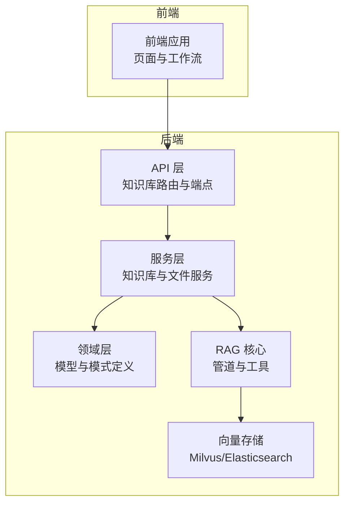
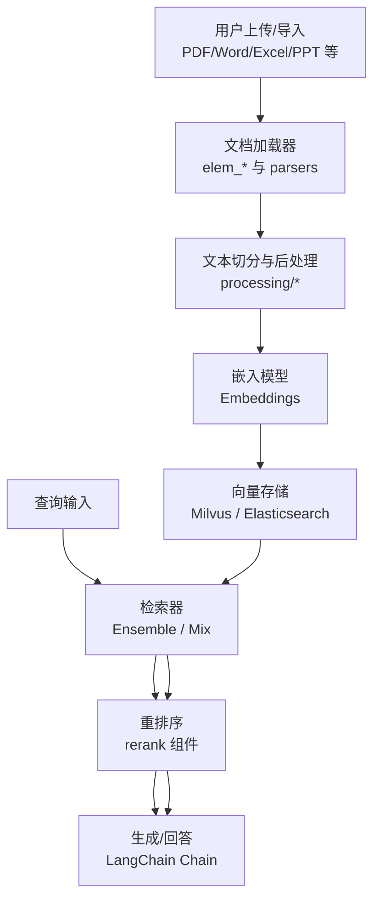
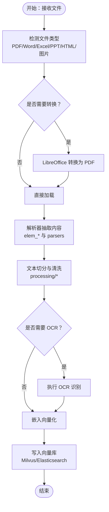
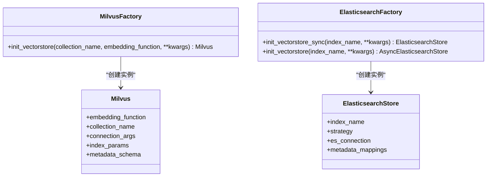
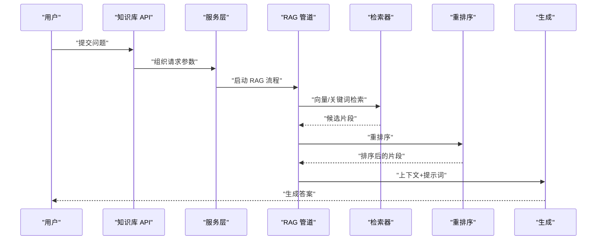
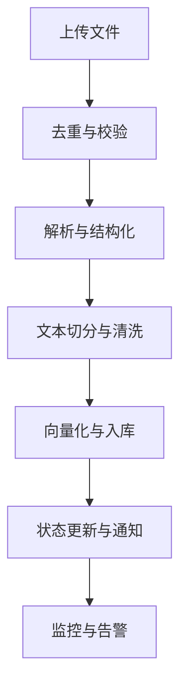
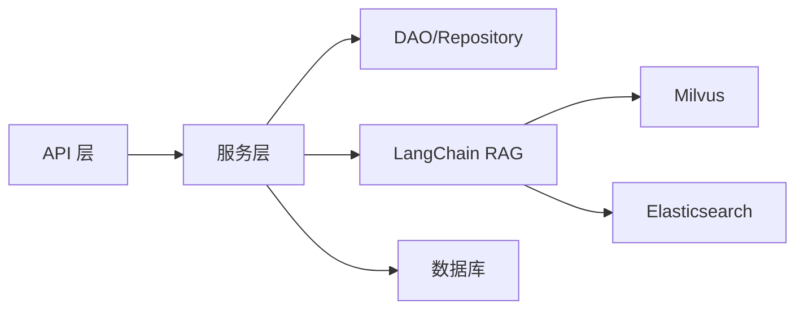

# 知识库管理

<cite>
**本文引用的文件**
- [README.md](file://README.md)
- [知识库模块 README.md](file://src/backend/bisheng/knowledge/README.md)
- [知识库领域模型 knowledge.py](file://src/backend/bisheng/knowledge/domain/models/knowledge.py)
- [知识库文件领域模型 knowledge_file.py](file://src/backend/bisheng/knowledge/domain/models/knowledge_file.py)
- [知识库领域模式 knowledge_schema.py](file://src/backend/bisheng/knowledge/domain/schemas/knowledge_schema.py)
- [知识库文件领域模式 knowledge_file_schema.py](file://src/backend/bisheng/knowledge/domain/schemas/knowledge_file_schema.py)
- [知识库 RAG 元数据模式 knowledge_rag_schema.py](file://src/backend/bisheng/knowledge/domain/schemas/knowledge_rag_schema.py)
- [Milvus 向量存储工厂 milvus_factory.py](file://src/backend/bisheng/knowledge/rag/milvus_factory.py)
- [Elasticsearch 向量存储工厂 elasticsearch_factory.py](file://src/backend/bisheng/knowledge/rag/elasticsearch_factory.py)
- [知识库 API 端点 knowledge.py](file://src/backend/bisheng/knowledge/api/endpoints/knowledge.py)
- [知识库 API 路由 router.py](file://src/backend/bisheng/knowledge/api/router.py)
- [知识库服务 knowledge_service.py](file://src/backend/bisheng/knowledge/domain/services/knowledge_service.py)
- [知识库文件服务 knowledge_file_service.py](file://src/backend/bisheng/knowledge/domain/services/knowledge_file_service.py)
- [知识库领域核心 knowledge_rag.py](file://src/backend/bisheng/knowledge/domain/knowledge_rag.py)
- [LangChain RAG 管道 bisheng_rag_pipeline.py](file://src/backend/bisheng_langchain/rag/bisheng_rag_pipeline.py)
- [LangChain RAG 管道 v2 bisheng_rag_pipeline_v2.py](file://src/backend/bisheng_langchain/rag/bisheng_rag_pipeline_v2.py)
- [LangChain RAG 工具 bisheng_rag_tool.py](file://src/backend/bisheng_langchain/rag/bisheng_rag_tool.py)
- [LangChain RAG 评分 ragas_score.py](file://src/backend/bisheng_langchain/rag/scoring/ragas_score.py)
- [LangChain 向量存储 Milvus 实现 milvus.py](file://src/backend/bisheng_langchain/vectorstores/milvus.py)
- [LangChain 向量存储 Elasticsearch 实现 elastic_keywords_search.py](file://src/backend/bisheng_langchain/vectorstores/elastic_keywords_search.py)
- [LangChain 检索器 ensemble.py](file://src/backend/bisheng_langchain/retrievers/ensemble.py)
- [LangChain 检索器 mix_es_vector.py](file://src/backend/bisheng_langchain/retrievers/mix_es_vector.py)
- [LangChain 文档加载器 elem_pdf.py](file://src/backend/bisheng_langchain/document_loaders/elem_pdf.py)
- [LangChain 文档加载器 elem_unstructured_loader.py](file://src/backend/bisheng_langchain/document_loaders/elem_unstrcutured_loader.py)
- [LangChain 文档加载器 universal_kv.py](file://src/backend/bisheng_langchain/document_loaders/universal_kv.py)
- [LangChain 文档加载器 elem_html.py](file://src/backend/bisheng_langchain/document_loaders/elem_html.py)
- [LangChain 文档加载器 elem_image.py](file://src/backend/bisheng_langchain/document_loaders/elem_image.py)
- [LangChain 文档解析器 parsers](file://src/backend/bisheng_langchain/document_loaders/parsers/)
- [PPTX 转 Markdown 解析器 entry.py](file://src/backend/bisheng/pptx2md/entry.py)
- [PPTX 转 Markdown 解析器 parser.py](file://src/backend/bisheng/pptx2md/parser.py)
- [PPTX 转 Markdown 解析器 types.py](file://src/backend/bisheng/pptx2md/types.py)
- [PPTX 转 Markdown 输出器 outputter.py](file://src/backend/bisheng/pptx2md/outputter.py)
- [PPTX 转 Markdown 图片处理 image.py](file://src/backend/bisheng/pptx2md/image.py)
- [PPTX 转 Markdown 多列布局 multi_column.py](file://src/backend/bisheng/pptx2md/multi_column.py)
- [PPTX 转 Markdown 工具 utils.py](file://src/backend/bisheng/pptx2md/utils.py)
- [PPTX 转 Markdown 主程序 __main__.py](file://src/backend/bisheng/pptx2md/__main__.py)
- [通用文档处理流程 processing/process.py](file://src/backend/bisheng/processing/process.py)
- [通用文档处理基类 processing/base.py](file://src/backend/bisheng/processing/base.py)
- [LibreOffice 转换器 libreoffice_converter.py](file://src/backend/bisheng/api/services/libreoffice_converter.py)
- [ETL4LM 加载器 etl4lm_loader.py](file://src/backend/bisheng/api/services/etl4lm_loader.py)
- [知识库构建脚本 knowledge.sh](file://src/backend/bisheng/script/knowledge.sh)
- [知识库数据转换脚本 knowledge_data_convert.py](file://src/backend/bisheng/script/knowledge_data_convert.py)
- [知识库修复脚本 knowledge_data_fix.py](file://src/backend/bisheng/script/knowledge_data_fix.py)
- [同步增量表脚本 sync_increment_table.py](file://src/backend/bisheng/script/sync_increment_table.py)
- [Docker Compose 配置 docker-compose.yml](file://docker/docker-compose.yml)
- [Bisheng 后端配置 config.yaml](file://docker/bisheng/config/config.yaml)
</cite>

## 目录
1. [简介](#简介)
2. [项目结构](#项目结构)
3. [核心组件](#核心组件)
4. [架构总览](#架构总览)
5. [详细组件分析](#详细组件分析)
6. [依赖关系分析](#依赖关系分析)
7. [性能考量](#性能考量)
8. [故障排查指南](#故障排查指南)
9. [结论](#结论)
10. [附录](#附录)

## 简介
本技术文档面向 Bisheng 知识库管理系统，系统性阐述知识库的整体架构设计与实现要点，覆盖以下方面：
- 文档处理流程：从多格式文档解析到向量化入库的完整链路
- 向量存储集成：Milvus 与 Elasticsearch 的集成方式、检索策略与元数据管理
- RAG 检索机制：检索器配置、重排序与性能调优
- 多格式文档解析：PDF、Word、Excel、PPT 等文件类型处理算法与 OCR 集成
- 最佳实践：知识库构建与维护的数据预处理、质量控制与性能监控策略

## 项目结构
Bisheng 后端采用分层架构，知识库模块位于后端子系统中，包含领域模型、API 层、服务层与向量存储适配层。前端通过 API 与后端交互，后端通过 LangChain 组件完成文档解析、向量化与检索。

**图表来源**
- [知识库 API 路由 router.py](file://src/backend/bisheng/knowledge/api/router.py#L1-L200)
- [知识库服务 knowledge_service.py](file://src/backend/bisheng/knowledge/domain/services/knowledge_service.py#L1-L200)
- [LangChain RAG 管道 bisheng_rag_pipeline.py](file://src/backend/bisheng_langchain/rag/bisheng_rag_pipeline.py#L1-L200)
- [Milvus 向量存储工厂 milvus_factory.py](file://src/backend/bisheng/knowledge/rag/milvus_factory.py#L1-L60)
- [Elasticsearch 向量存储工厂 elasticsearch_factory.py](file://src/backend/bisheng/knowledge/rag/elasticsearch_factory.py#L1-L80)

**章节来源**
- [README.md](file://README.md#L31-L57)
- [知识库模块 README.md](file://src/backend/bisheng/knowledge/README.md#L1-L4)

## 核心组件
- 领域模型与模式
  - 知识库模型：定义知识库基础属性、状态枚举与 DAO 查询方法
  - 知识库文件模型：定义文件解析状态、解析类型与元数据字段
  - RAG 元数据模式：定义检索结果的文档级元信息
- API 层
  - 提供知识库 CRUD、文件上传与状态管理、QA 管理等接口
- 服务层
  - 封装知识库与文件的业务逻辑，协调向量存储与外部服务
- 向量存储工厂
  - 提供 Milvus 与 Elasticsearch 的初始化与映射配置
- RAG 核心
  - LangChain 管道、工具与检索器，支持混合检索与重排序

**章节来源**
- [知识库领域模型 knowledge.py](file://src/backend/bisheng/knowledge/domain/models/knowledge.py#L48-L532)
- [知识库文件领域模型 knowledge_file.py](file://src/backend/bisheng/knowledge/domain/models/knowledge_file.py#L16-L590)
- [知识库 RAG 元数据模式 knowledge_rag_schema.py](file://src/backend/bisheng/knowledge/domain/schemas/knowledge_rag_schema.py#L6-L20)
- [知识库 API 端点 knowledge.py](file://src/backend/bisheng/knowledge/api/endpoints/knowledge.py#L1-L200)
- [Milvus 向量存储工厂 milvus_factory.py](file://src/backend/bisheng/knowledge/rag/milvus_factory.py#L13-L60)
- [Elasticsearch 向量存储工厂 elasticsearch_factory.py](file://src/backend/bisheng/knowledge/rag/elasticsearch_factory.py#L44-L80)

## 架构总览
知识库系统以“文档解析 → 向量化 → 持久化 → 检索 → 生成”的闭环为核心，结合 Milvus 与 Elasticsearch 实现高维向量检索与关键词检索的混合策略，并通过 LangChain 组件实现可插拔的 RAG 流水线。

**图表来源**
- [LangChain 文档加载器 elem_pdf.py](file://src/backend/bisheng_langchain/document_loaders/elem_pdf.py#L1-L200)
- [LangChain 文档解析器 parsers](file://src/backend/bisheng_langchain/document_loaders/parsers/#L1-L200)
- [通用文档处理流程 processing/process.py](file://src/backend/bisheng/processing/process.py#L1-L200)
- [LangChain 向量存储 Milvus 实现 milvus.py](file://src/backend/bisheng_langchain/vectorstores/milvus.py#L1-L200)
- [LangChain 向量存储 Elasticsearch 实现 elastic_keywords_search.py](file://src/backend/bisheng_langchain/vectorstores/elastic_keywords_search.py#L1-L200)
- [LangChain 检索器 ensemble.py](file://src/backend/bisheng_langchain/retrievers/ensemble.py#L1-L200)
- [LangChain 检索器 mix_es_vector.py](file://src/backend/bisheng_langchain/retrievers/mix_es_vector.py#L1-L200)

## 详细组件分析

### 文档处理与多格式解析
- 文档加载器族
  - PDF：elem_pdf.py 基于底层解析器实现结构化抽取
  - HTML：elem_html.py 处理网页与富文本内容
  - 图像：elem_image.py 支持图片中的文本识别
  - 通用：elem_unstructured_loader.py 与 universal_kv.py 提供统一的非结构化解析与键值对提取
- 文档解析器
  - parsers 目录下包含针对不同场景的解析策略，支持表格、图像、布局等复杂元素
- PPTX 转 Markdown
  - entry.py、parser.py、types.py、outputter.py、image.py、multi_column.py、utils.py、__main__.py 提供完整的 PPTX 结构解析与内容抽取
- LibreOffice 转换
  - libreoffice_converter.py 将 Office 文档转换为 PDF，便于后续统一解析
- ETL4LM 加载器
  - etl4lm_loader.py 提供布局分析与结构化输出能力
- 文本切分与后处理
  - processing/process.py 与 processing/base.py 定义通用的切分与清洗流程

**图表来源**
- [LangChain 文档加载器 elem_pdf.py](file://src/backend/bisheng_langchain/document_loaders/elem_pdf.py#L1-L200)
- [LangChain 文档加载器 elem_unstructured_loader.py](file://src/backend/bisheng_langchain/document_loaders/elem_unstrcutured_loader.py#L1-L200)
- [LangChain 文档加载器 elem_html.py](file://src/backend/bisheng_langchain/document_loaders/elem_html.py#L1-L200)
- [LangChain 文档加载器 elem_image.py](file://src/backend/bisheng_langchain/document_loaders/elem_image.py#L1-L200)
- [LibreOffice 转换器 libreoffice_converter.py](file://src/backend/bisheng/api/services/libreoffice_converter.py#L1-L200)
- [ETL4LM 加载器 etl4lm_loader.py](file://src/backend/bisheng/api/services/etl4lm_loader.py#L1-L200)
- [通用文档处理流程 processing/process.py](file://src/backend/bisheng/processing/process.py#L1-L200)

**章节来源**
- [PPTX 转 Markdown 解析器 entry.py](file://src/backend/bisheng/pptx2md/entry.py#L1-L200)
- [PPTX 转 Markdown 解析器 parser.py](file://src/backend/bisheng/pptx2md/parser.py#L1-L200)
- [PPTX 转 Markdown 解析器 types.py](file://src/backend/bisheng/pptx2md/types.py#L1-L200)
- [PPTX 转 Markdown 输出器 outputter.py](file://src/backend/bisheng/pptx2md/outputter.py#L1-L200)
- [PPTX 转 Markdown 图片处理 image.py](file://src/backend/bisheng/pptx2md/image.py#L1-L200)
- [PPTX 转 Markdown 多列布局 multi_column.py](file://src/backend/bisheng/pptx2md/multi_column.py#L1-L200)
- [PPTX 转 Markdown 工具 utils.py](file://src/backend/bisheng/pptx2md/utils.py#L1-L200)
- [PPTX 转 Markdown 主程序 __main__.py](file://src/backend/bisheng/pptx2md/__main__.py#L1-L200)

### 向量存储管理与检索策略
- Milvus 集成
  - milvus_factory.py 基于配置动态构建 Milvus 连接参数，支持元数据字段类型映射（VARCHAR/INT/JSON/BOOL 等），默认索引参数可调
  - LangChain Milvus 实现提供向量插入、查询与过滤能力
- Elasticsearch 集成
  - elasticsearch_factory.py 生成元数据映射（text/keyword/short/integer/long/float/double/flattened），并选择 BM25Strategy 或异步策略
  - 支持关键词检索与布尔/范围过滤
- 检索策略
  - ensemble.py 提供多检索器融合策略
  - mix_es_vector.py 实现关键词与向量的混合打分与重排

**图表来源**
- [Milvus 向量存储工厂 milvus_factory.py](file://src/backend/bisheng/knowledge/rag/milvus_factory.py#L13-L60)
- [Elasticsearch 向量存储工厂 elasticsearch_factory.py](file://src/backend/bisheng/knowledge/rag/elasticsearch_factory.py#L44-L80)
- [LangChain 向量存储 Milvus 实现 milvus.py](file://src/backend/bisheng_langchain/vectorstores/milvus.py#L1-L200)
- [LangChain 向量存储 Elasticsearch 实现 elastic_keywords_search.py](file://src/backend/bisheng_langchain/vectorstores/elastic_keywords_search.py#L1-L200)

**章节来源**
- [Milvus 向量存储工厂 milvus_factory.py](file://src/backend/bisheng/knowledge/rag/milvus_factory.py#L1-L60)
- [Elasticsearch 向量存储工厂 elasticsearch_factory.py](file://src/backend/bisheng/knowledge/rag/elasticsearch_factory.py#L1-L80)

### RAG 检索增强生成
- 管道与工具
  - bisheng_rag_pipeline.py 与 bisheng_rag_pipeline_v2.py 定义 RAG 执行流水线，串联检索、重排序与生成步骤
  - bisheng_rag_tool.py 提供可复用的 RAG 工具封装
- 评分与评估
  - ragas_score.py 提供基于 RAGAS 的指标评估能力
- 检索器与重排序
  - ensemble.py 与 mix_es_vector.py 支持混合检索与重排序策略，提升召回质量与相关性

**图表来源**
- [LangChain RAG 管道 bisheng_rag_pipeline.py](file://src/backend/bisheng_langchain/rag/bisheng_rag_pipeline.py#L1-L200)
- [LangChain RAG 管道 v2 bisheng_rag_pipeline_v2.py](file://src/backend/bisheng_langchain/rag/bisheng_rag_pipeline_v2.py#L1-L200)
- [LangChain RAG 工具 bisheng_rag_tool.py](file://src/backend/bisheng_langchain/rag/bisheng_rag_tool.py#L1-L200)
- [LangChain 检索器 ensemble.py](file://src/backend/bisheng_langchain/retrievers/ensemble.py#L1-L200)
- [LangChain 检索器 mix_es_vector.py](file://src/backend/bisheng_langchain/retrievers/mix_es_vector.py#L1-L200)

**章节来源**
- [LangChain RAG 管道 bisheng_rag_pipeline.py](file://src/backend/bisheng_langchain/rag/bisheng_rag_pipeline.py#L1-L200)
- [LangChain RAG 管道 v2 bisheng_rag_pipeline_v2.py](file://src/backend/bisheng_langchain/rag/bisheng_rag_pipeline_v2.py#L1-L200)
- [LangChain RAG 工具 bisheng_rag_tool.py](file://src/backend/bisheng_langchain/rag/bisheng_rag_tool.py#L1-L200)
- [LangChain RAG 评分 ragas_score.py](file://src/backend/bisheng_langchain/rag/scoring/ragas_score.py#L1-L200)

### 知识库构建与维护
- 数据预处理
  - processing/process.py 与 processing/base.py 提供统一的切分与清洗流程
  - PPTX 转 Markdown 工具链确保演示文稿结构化输出
- 质量控制
  - 知识库文件模型包含解析状态枚举与重复文件检测，避免冗余入库
  - 元数据字段校验与命名规范保障检索一致性
- 性能监控
  - 通过 Docker Compose 默认部署 ES、Milvus、OnlyOffice 等组件，便于监控与扩展
  - 脚本化运维：knowledge.sh、knowledge_data_convert.py、knowledge_data_fix.py、sync_increment_table.py 支持批量处理与增量同步

**图表来源**
- [通用文档处理流程 processing/process.py](file://src/backend/bisheng/processing/process.py#L1-L200)
- [知识库文件领域模型 knowledge_file.py](file://src/backend/bisheng/knowledge/domain/models/knowledge_file.py#L16-L590)
- [知识库领域模式 knowledge_schema.py](file://src/backend/bisheng/knowledge/domain/schemas/knowledge_schema.py#L18-L83)
- [Docker Compose 配置 docker-compose.yml](file://docker/docker-compose.yml#L1-L200)
- [知识库构建脚本 knowledge.sh](file://src/backend/bisheng/script/knowledge.sh#L1-L200)

**章节来源**
- [知识库文件领域模型 knowledge_file.py](file://src/backend/bisheng/knowledge/domain/models/knowledge_file.py#L16-L590)
- [知识库领域模式 knowledge_schema.py](file://src/backend/bisheng/knowledge/domain/schemas/knowledge_schema.py#L18-L83)
- [Docker Compose 配置 docker-compose.yml](file://docker/docker-compose.yml#L1-L200)
- [知识库构建脚本 knowledge.sh](file://src/backend/bisheng/script/knowledge.sh#L1-L200)
- [知识库数据转换脚本 knowledge_data_convert.py](file://src/backend/bisheng/script/knowledge_data_convert.py#L1-L200)
- [知识库修复脚本 knowledge_data_fix.py](file://src/backend/bisheng/script/knowledge_data_fix.py#L1-L200)
- [同步增量表脚本 sync_increment_table.py](file://src/backend/bisheng/script/sync_increment_table.py#L1-L200)

## 依赖关系分析
- 组件耦合
  - API 层仅依赖服务层接口，降低对领域模型的直接耦合
  - 服务层通过 DAO 访问数据库，同时协调向量存储与外部解析服务
  - RAG 核心通过 LangChain 抽象屏蔽具体向量库差异
- 外部依赖
  - Milvus：高维向量检索与过滤
  - Elasticsearch：关键词检索与 BM25 排序
  - LangChain：文档加载、切分、检索与生成
  - Docker Compose：ES、Milvus、OnlyOffice 统一编排

**图表来源**
- [知识库 API 路由 router.py](file://src/backend/bisheng/knowledge/api/router.py#L1-L200)
- [知识库服务 knowledge_service.py](file://src/backend/bisheng/knowledge/domain/services/knowledge_service.py#L1-L200)
- [LangChain RAG 管道 bisheng_rag_pipeline.py](file://src/backend/bisheng_langchain/rag/bisheng_rag_pipeline.py#L1-L200)

**章节来源**
- [知识库 API 路由 router.py](file://src/backend/bisheng/knowledge/api/router.py#L1-L200)
- [知识库服务 knowledge_service.py](file://src/backend/bisheng/knowledge/domain/services/knowledge_service.py#L1-L200)

## 性能考量
- 向量检索
  - Milvus 默认索引参数可按数据规模与延迟目标调整
  - 元数据字段映射需与查询模式匹配，避免不必要的字段扫描
- 关键词检索
  - Elasticsearch 使用 BM25Strategy，合理设置字段映射与分词策略
- 混合检索
  - ensemble 与 mix_es_vector 通过融合打分与重排序提升整体相关性
- 数据预处理
  - 切分粒度与清洗策略直接影响向量质量与检索效率
- 运维脚本
  - 使用批量转换与增量同步脚本减少人工干预与错误

## 故障排查指南
- 文件解析失败
  - 检查 ParseType 与解析状态枚举，定位本地/UNS/ETL4LM 解析路径
  - 核对 LibreOffice 转换与 PDF 解析日志
- 向量入库异常
  - 校验 Milvus 连接参数与集合元数据映射
  - 确认嵌入维度与索引参数一致
- 检索效果差
  - 调整检索器权重与重排序策略
  - 优化切分策略与关键词映射
- 数据不一致
  - 使用知识库修复脚本与增量同步脚本进行修复与对齐

**章节来源**
- [知识库文件领域模型 knowledge_file.py](file://src/backend/bisheng/knowledge/domain/models/knowledge_file.py#L16-L590)
- [Milvus 向量存储工厂 milvus_factory.py](file://src/backend/bisheng/knowledge/rag/milvus_factory.py#L1-L60)
- [Elasticsearch 向量存储工厂 elasticsearch_factory.py](file://src/backend/bisheng/knowledge/rag/elasticsearch_factory.py#L1-L80)
- [知识库修复脚本 knowledge_data_fix.py](file://src/backend/bisheng/script/knowledge_data_fix.py#L1-L200)
- [同步增量表脚本 sync_increment_table.py](file://src/backend/bisheng/script/sync_increment_table.py#L1-L200)

## 结论
Bisheng 知识库管理系统通过清晰的分层架构与 LangChain 生态，实现了从多格式文档解析到向量化检索再到 RAG 生成的完整闭环。Milvus 与 Elasticsearch 的双轨检索策略兼顾了语义与关键词场景，配合可插拔的管道与工具，满足企业级知识库的高可用与高性能需求。建议在实际部署中结合业务场景持续优化解析策略、检索参数与评估指标，确保系统的稳定性与准确性。

## 附录
- 配置参考
  - Docker Compose 默认编排 ES、Milvus、OnlyOffice
  - 后端配置文件集中管理向量库连接参数
- 快速开始
  - 参考 README 的安装与启动步骤，访问前端页面完成注册与使用

**章节来源**
- [README.md](file://README.md#L58-L86)
- [Bisheng 后端配置 config.yaml](file://docker/bisheng/config/config.yaml#L1-L200)
- [Docker Compose 配置 docker-compose.yml](file://docker/docker-compose.yml#L1-L200)