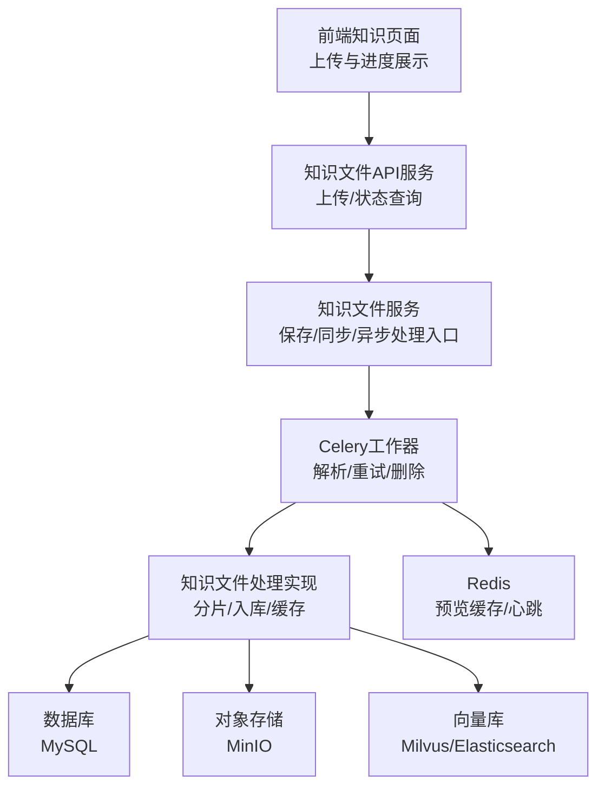
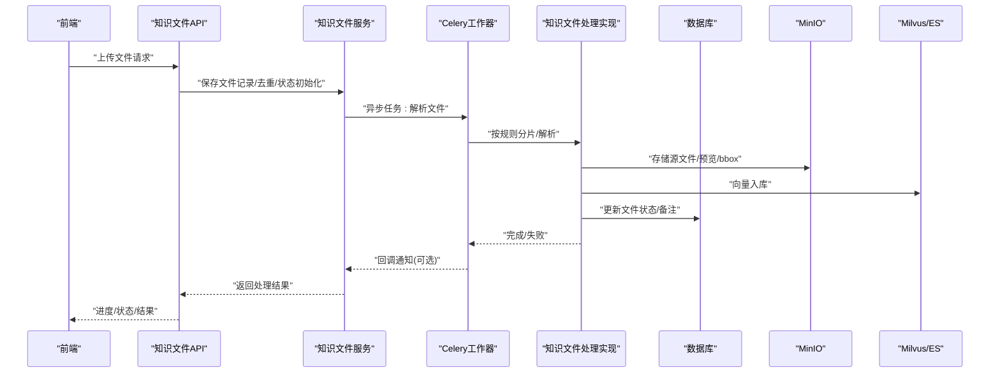
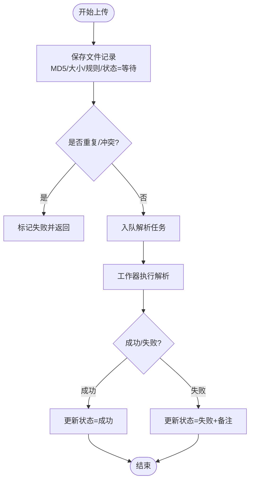
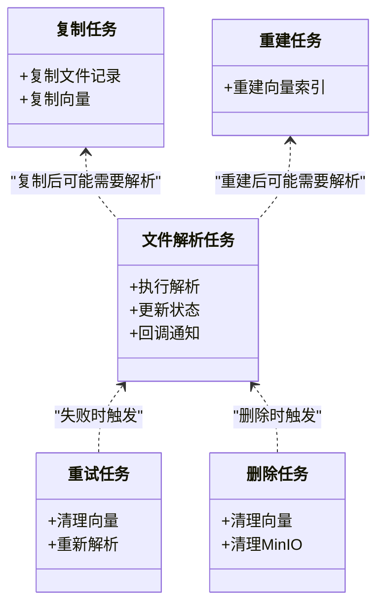
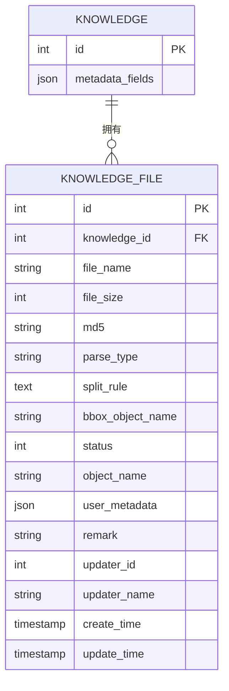
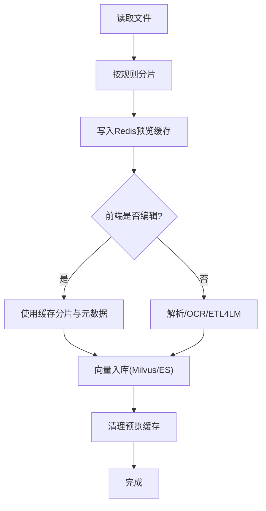
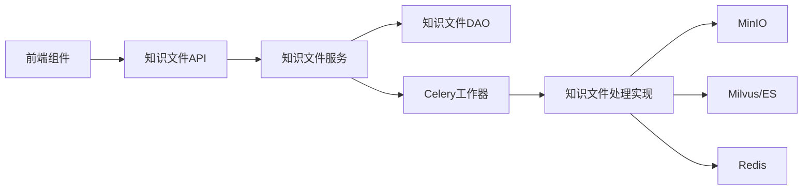

# 知识文件服务

<cite>
**本文引用的文件**
- [src/backend/bisheng/api/services/knowledge.py](file://src/backend/bisheng/api/services/knowledge.py)
- [src/backend/bisheng/api/services/knowledge_imp.py](file://src/backend/bisheng/api/services/knowledge_imp.py)
- [src/backend/bisheng/knowledge/domain/models/knowledge_file.py](file://src/backend/bisheng/knowledge/domain/models/knowledge_file.py)
- [src/backend/bisheng/knowledge/domain/models/knowledge.py](file://src/backend/bisheng/knowledge/domain/models/knowledge.py)
- [src/backend/bisheng/knowledge/domain/services/knowledge_file_service.py](file://src/backend/bisheng/knowledge/domain/services/knowledge_file_service.py)
- [src/backend/bisheng/knowledge/domain/repositories/implementations/knowledge_file_repository_impl.py](file://src/backend/bisheng/knowledge/domain/repositories/implementations/knowledge_file_repository_impl.py)
- [src/backend/bisheng/worker/knowledge/file_worker.py](file://src/backend/bisheng/worker/knowledge/file_worker.py)
- [src/backend/bisheng/worker/knowledge/rebuild_knowledge_worker.py](file://src/backend/bisheng/worker/knowledge/rebuild_knowledge_worker.py)
- [src/backend/bisheng/worker/main.py](file://src/backend/bisheng/worker/main.py)
- [src/backend/bisheng/run_celery.py](file://src/backend/bisheng/run_celery.py)
- [src/backend/bisheng/api/v1/schemas.py](file://src/backend/bisheng/api/v1/schemas.py)
- [src/backend/bisheng/core/database/alembic/versions/v2_3_0_beta1_9ba42685e830.py](file://src/backend/bisheng/core/database/alembic/versions/v2_3_0_beta1_9ba42685e830.py)
- [src/frontend/platform/src/pages/KnowledgePage/AdjustFilesUpload.tsx](file://src/frontend/platform/src/pages/KnowledgePage/AdjustFilesUpload.tsx)
- [src/frontend/platform/src/pages/KnowledgePage/components/Paragraphs.tsx](file://src/frontend/platform/src/pages/KnowledgePage/components/Paragraphs.tsx)
- [src/frontend/platform/src/pages/KnowledgePage/components/FileUploadParagraphs.tsx](file://src/frontend/platform/src/pages/KnowledgePage/components/FileUploadParagraphs.tsx)
- [src/frontend/platform/src/pages/KnowledgePage/components/FileUploadStep4.tsx](file://src/frontend/platform/src/pages/KnowledgePage/components/FileUploadStep4.tsx)
- [src/frontend/platform/src/pages/KnowledgePage/KnowledgeFile.tsx](file://src/frontend/platform/src/pages/KnowledgePage/KnowledgeFile.tsx)
- [src/frontend/platform/src/components/bs-comp/knowledgeUploadComponent/ProgressItem.tsx](file://src/frontend/platform/src/components/bs-comp/knowledgeUploadComponent/ProgressItem.tsx)
</cite>

## 目录
1. [简介](#简介)
2. [项目结构](#项目结构)
3. [核心组件](#核心组件)
4. [架构总览](#架构总览)
5. [详细组件分析](#详细组件分析)
6. [依赖关系分析](#依赖关系分析)
7. [性能考虑](#性能考虑)
8. [故障排查指南](#故障排查指南)
9. [结论](#结论)
10. [附录](#附录)

## 简介
本技术文档围绕 Bisheng 的“知识文件服务”展开，系统性阐述知识文件的全生命周期管理与处理机制，包括文件上传、状态跟踪、处理进度监控、结果存储；文件处理队列机制（异步任务调度、并发控制、错误重试）；文件元数据管理（用户自定义字段、系统生成属性、版本控制）；以及分片与合并策略（大文件处理、断点续传、完整性校验）。同时提供性能优化建议（并发处理、存储空间、网络传输效率）。

## 项目结构
知识文件服务由后端 API 层、领域模型层、服务层、工作器（Celery）层与前端交互层协同组成。后端采用分层架构：API 路由负责请求接入与鉴权，服务层封装业务逻辑，领域模型负责数据持久化与状态管理，工作器负责异步解析与入库，前端通过上传组件与进度组件进行交互。

图示来源
- [src/backend/bisheng/api/services/knowledge.py](file://src/backend/bisheng/api/services/knowledge.py#L510-L565)
- [src/backend/bisheng/api/services/knowledge_imp.py](file://src/backend/bisheng/api/services/knowledge_imp.py#L252-L541)
- [src/backend/bisheng/worker/knowledge/file_worker.py](file://src/backend/bisheng/worker/knowledge/file_worker.py#L274-L332)
- [src/backend/bisheng/worker/main.py](file://src/backend/bisheng/worker/main.py#L14-L31)

章节来源
- [src/backend/bisheng/api/services/knowledge.py](file://src/backend/bisheng/api/services/knowledge.py#L510-L565)
- [src/backend/bisheng/api/services/knowledge_imp.py](file://src/backend/bisheng/api/services/knowledge_imp.py#L252-L541)
- [src/backend/bisheng/worker/knowledge/file_worker.py](file://src/backend/bisheng/worker/knowledge/file_worker.py#L274-L332)
- [src/backend/bisheng/worker/main.py](file://src/backend/bisheng/worker/main.py#L14-L31)

## 核心组件
- API 服务层：负责接收上传请求、鉴权、调用服务层并返回结果；支持同步与异步两种处理模式。
- 服务层：封装知识文件的保存、去重、状态更新、回调通知等流程；触发 Celery 异步任务。
- 工作器层：基于 Celery 的异步任务，执行文件解析、向量入库、预览缓存清理、失败重试与删除清理。
- 领域模型层：定义知识库、知识文件的状态枚举、元数据字段类型与 DAO 持久化接口。
- 处理实现层：负责文本分片、OCR/ETL4LM 解析、向量入库（Milvus/ES）、预览文件与 bbox 存储。
- 前端组件：上传组件、进度组件、规则配置组件、元数据编辑组件。

章节来源
- [src/backend/bisheng/api/services/knowledge.py](file://src/backend/bisheng/api/services/knowledge.py#L510-L565)
- [src/backend/bisheng/knowledge/domain/models/knowledge_file.py](file://src/backend/bisheng/knowledge/domain/models/knowledge_file.py#L16-L66)
- [src/backend/bisheng/knowledge/domain/models/knowledge.py](file://src/backend/bisheng/knowledge/domain/models/knowledge.py#L18-L65)
- [src/backend/bisheng/api/services/knowledge_imp.py](file://src/backend/bisheng/api/services/knowledge_imp.py#L252-L541)
- [src/backend/bisheng/worker/knowledge/file_worker.py](file://src/backend/bisheng/worker/knowledge/file_worker.py#L274-L332)

## 架构总览
知识文件服务采用“请求-服务-工作器-实现-存储”的分层架构。上传完成后，API 服务层将文件记录入库并触发 Celery 任务；工作器根据拆分规则读取文件内容，生成分片与元数据，写入 MinIO 与向量库，并通过 Redis 缓存预览片段；最终更新文件状态并可选回调通知。

图示来源
- [src/backend/bisheng/api/services/knowledge.py](file://src/backend/bisheng/api/services/knowledge.py#L510-L565)
- [src/backend/bisheng/worker/knowledge/file_worker.py](file://src/backend/bisheng/worker/knowledge/file_worker.py#L274-L332)
- [src/backend/bisheng/api/services/knowledge_imp.py](file://src/backend/bisheng/api/services/knowledge_imp.py#L438-L541)

## 详细组件分析

### 组件A：知识文件上传与状态跟踪
- 入口：API 服务层接收上传请求，鉴权后调用服务层保存文件记录。
- 去重与预处理：计算 MD5、记录原始大小、设置初始状态为等待解析。
- 异步触发：对成功入库的文件，通过 Celery 发送解析任务。
- 状态更新：解析成功或失败均更新数据库状态与备注；支持回调通知。

图示来源
- [src/backend/bisheng/api/services/knowledge.py](file://src/backend/bisheng/api/services/knowledge.py#L510-L565)
- [src/backend/bisheng/worker/knowledge/file_worker.py](file://src/backend/bisheng/worker/knowledge/file_worker.py#L274-L332)

章节来源
- [src/backend/bisheng/api/services/knowledge.py](file://src/backend/bisheng/api/services/knowledge.py#L510-L565)
- [src/backend/bisheng/api/services/knowledge.py](file://src/backend/bisheng/api/services/knowledge.py#L718-L731)

### 组件B：文件处理队列机制（异步任务、并发、重试）
- 任务类型：解析任务、重试任务、删除任务、复制任务、重建任务。
- 并发控制：通过 Celery worker 数量与队列配置控制并发度。
- 错误重试：失败时可触发重试任务清理向量数据后重新解析。
- 心跳检测：工作器启动后定期上报存活心跳，便于运维监控。

图示来源
- [src/backend/bisheng/worker/knowledge/file_worker.py](file://src/backend/bisheng/worker/knowledge/file_worker.py#L274-L373)
- [src/backend/bisheng/worker/knowledge/rebuild_knowledge_worker.py](file://src/backend/bisheng/worker/knowledge/rebuild_knowledge_worker.py#L22-L50)
- [src/backend/bisheng/worker/main.py](file://src/backend/bisheng/worker/main.py#L33-L47)

章节来源
- [src/backend/bisheng/worker/knowledge/file_worker.py](file://src/backend/bisheng/worker/knowledge/file_worker.py#L274-L373)
- [src/backend/bisheng/worker/main.py](file://src/backend/bisheng/worker/main.py#L33-L47)
- [src/backend/bisheng/run_celery.py](file://src/backend/bisheng/run_celery.py#L1-L12)

### 组件C：文件元数据管理（用户自定义字段、系统属性、版本控制）
- 用户自定义字段：每个知识文件可维护 user_metadata 字典，支持字符串/数字/时间类型。
- 系统生成属性：包含上传者、更新者、创建/更新时间戳、解析类型、分片规则等。
- 版本控制：通过 updater_id/updater_name 与更新时间实现版本追踪；支持批量修改并同步到 Milvus/ES 元数据。

图示来源
- [src/backend/bisheng/knowledge/domain/models/knowledge_file.py](file://src/backend/bisheng/knowledge/domain/models/knowledge_file.py#L41-L66)
- [src/backend/bisheng/knowledge/domain/models/knowledge.py](file://src/backend/bisheng/knowledge/domain/models/knowledge.py#L48-L65)
- [src/backend/bisheng/core/database/alembic/versions/v2_3_0_beta1_9ba42685e830.py](file://src/backend/bisheng/core/database/alembic/versions/v2_3_0_beta1_9ba42685e830.py#L20-L31)

章节来源
- [src/backend/bisheng/knowledge/domain/models/knowledge_file.py](file://src/backend/bisheng/knowledge/domain/models/knowledge_file.py#L41-L66)
- [src/backend/bisheng/knowledge/domain/services/knowledge_file_service.py](file://src/backend/bisheng/knowledge/domain/services/knowledge_file_service.py#L125-L153)
- [src/backend/bisheng/knowledge/domain/services/knowledge_file_service.py](file://src/backend/bisheng/knowledge/domain/services/knowledge_file_service.py#L191-L242)
- [src/backend/bisheng/knowledge/domain/services/knowledge_file_service.py](file://src/backend/bisheng/knowledge/domain/services/knowledge_file_service.py#L244-L274)
- [src/backend/bisheng/core/database/alembic/versions/v2_3_0_beta1_9ba42685e830.py](file://src/backend/bisheng/core/database/alembic/versions/v2_3_0_beta1_9ba42685e830.py#L20-L31)

### 组件D：文件分片与合并策略（大文件、断点续传、完整性校验）
- 分片策略：按字符/自定义分隔符、分隔符规则、块大小与重叠参数进行切分；Excel 支持单元格规则。
- 预览缓存：解析过程中的分片与元数据先写入 Redis 哈希，前端可预览并编辑；入库时优先使用缓存数据。
- 完整性校验：对单段内容长度限制，超过阈值抛出异常；OCR/ETL4LM 解析失败时记录解析类型与错误备注。
- 合并策略：入库时将文件名、摘要等元信息聚合到每段文本中，便于检索与溯源。

图示来源
- [src/backend/bisheng/api/services/knowledge_imp.py](file://src/backend/bisheng/api/services/knowledge_imp.py#L789-L800)
- [src/backend/bisheng/api/services/knowledge_imp.py](file://src/backend/bisheng/api/services/knowledge_imp.py#L543-L665)
- [src/backend/bisheng/api/services/knowledge_imp.py](file://src/backend/bisheng/api/services/knowledge_imp.py#L123-L174)

章节来源
- [src/backend/bisheng/api/services/knowledge_imp.py](file://src/backend/bisheng/api/services/knowledge_imp.py#L789-L800)
- [src/backend/bisheng/api/services/knowledge_imp.py](file://src/backend/bisheng/api/services/knowledge_imp.py#L543-L665)
- [src/backend/bisheng/api/services/knowledge_imp.py](file://src/backend/bisheng/api/services/knowledge_imp.py#L123-L174)

### 组件E：前端交互与进度监控
- 上传组件：支持多文件选择、进度回调、并发上传控制。
- 进度组件：显示解析状态、重试按钮、删除按钮；轮询后端状态更新。
- 规则配置：支持分隔符、块大小、重叠、Excel 规则、OCR/公式/页眉页脚等选项。
- 元数据编辑：支持添加/修改用户自定义字段，按更新时间排序。

章节来源
- [src/frontend/platform/src/pages/KnowledgePage/AdjustFilesUpload.tsx](file://src/frontend/platform/src/pages/KnowledgePage/AdjustFilesUpload.tsx#L209-L241)
- [src/frontend/platform/src/pages/KnowledgePage/components/FileUploadParagraphs.tsx](file://src/frontend/platform/src/pages/KnowledgePage/components/FileUploadParagraphs.tsx#L1-L36)
- [src/frontend/platform/src/pages/KnowledgePage/components/Paragraphs.tsx](file://src/frontend/platform/src/pages/KnowledgePage/components/Paragraphs.tsx#L485-L521)
- [src/frontend/platform/src/components/bs-comp/knowledgeUploadComponent/ProgressItem.tsx](file://src/frontend/platform/src/components/bs-comp/knowledgeUploadComponent/ProgressItem.tsx#L10-L19)
- [src/frontend/platform/src/pages/KnowledgePage/components/FileUploadStep4.tsx](file://src/frontend/platform/src/pages/KnowledgePage/components/FileUploadStep4.tsx#L66-L82)
- [src/frontend/platform/src/pages/KnowledgePage/KnowledgeFile.tsx](file://src/frontend/platform/src/pages/KnowledgePage/KnowledgeFile.tsx#L313-L337)

## 依赖关系分析
- API 服务依赖知识文件服务与审计日志；知识文件服务依赖 DAO 与工作器；工作器依赖处理实现与存储；前端依赖 API 与组件库。
- 数据一致性：通过数据库事务与状态枚举保证；向量库与 MinIO 通过统一的删除/重试流程保持一致。

图示来源
- [src/backend/bisheng/api/services/knowledge.py](file://src/backend/bisheng/api/services/knowledge.py#L510-L565)
- [src/backend/bisheng/worker/knowledge/file_worker.py](file://src/backend/bisheng/worker/knowledge/file_worker.py#L274-L332)
- [src/backend/bisheng/api/services/knowledge_imp.py](file://src/backend/bisheng/api/services/knowledge_imp.py#L252-L541)

章节来源
- [src/backend/bisheng/api/services/knowledge.py](file://src/backend/bisheng/api/services/knowledge.py#L510-L565)
- [src/backend/bisheng/worker/knowledge/file_worker.py](file://src/backend/bisheng/worker/knowledge/file_worker.py#L274-L332)
- [src/backend/bisheng/api/services/knowledge_imp.py](file://src/backend/bisheng/api/services/knowledge_imp.py#L252-L541)

## 性能考虑
- 并发处理优化
  - Celery worker 并发度：通过命令行参数控制线程数与队列，合理分配 CPU 与 IO 资源。
  - 批量入库：Milvus/ES 使用批处理插入，降低网络往返开销。
- 存储空间管理
  - MinIO 对象命名规范：原文件、预览、bbox、图片等路径清晰隔离，便于清理与迁移。
  - 预览缓存：Redis 哈希缓存分片，及时清理避免内存膨胀。
- 网络传输效率
  - 分片与缓存：前端可边解析边预览，减少一次性传输压力。
  - 回调通知：异步回调减少阻塞，提高吞吐。

章节来源
- [src/backend/bisheng/run_celery.py](file://src/backend/bisheng/run_celery.py#L1-L12)
- [src/backend/bisheng/api/services/knowledge_imp.py](file://src/backend/bisheng/api/services/knowledge_imp.py#L220-L250)
- [src/backend/bisheng/api/services/knowledge_imp.py](file://src/backend/bisheng/api/services/knowledge_imp.py#L250-L274)
- [src/backend/bisheng/api/services/knowledge_imp.py](file://src/backend/bisheng/api/services/knowledge_imp.py#L123-L174)

## 故障排查指南
- 常见错误与定位
  - 解析失败：检查文件格式、OCR/ETL4LM 配置、分片规则；查看数据库备注字段。
  - 向量入库失败：确认 Milvus/ES 可用性与索引状态；核对元数据 schema。
  - 重试无效：确认重试任务是否正确清理向量数据后再解析。
- 日志与监控
  - 工作器心跳：通过 Redis 哈希键监控 worker 存活队列。
  - Telemetry 事件：记录解析状态与类型，辅助问题复盘。

章节来源
- [src/backend/bisheng/worker/knowledge/file_worker.py](file://src/backend/bisheng/worker/knowledge/file_worker.py#L335-L359)
- [src/backend/bisheng/worker/main.py](file://src/backend/bisheng/worker/main.py#L33-L47)
- [src/backend/bisheng/api/services/knowledge_imp.py](file://src/backend/bisheng/api/services/knowledge_imp.py#L524-L532)

## 结论
知识文件服务通过清晰的分层设计与异步队列机制，实现了从上传、解析、入库到检索的完整闭环。结合用户自定义元数据与系统属性，满足多样化的知识管理需求。通过合理的并发与缓存策略，可在保证稳定性的同时提升整体吞吐与用户体验。

## 附录
- 关键状态枚举与含义
  - 等待/解析中/成功/失败/重建中/超时
- 关键解析类型
  - 本地解析、UNS 服务解析、ETL4LM 解析、非 ETL4LM 解析

章节来源
- [src/backend/bisheng/knowledge/domain/models/knowledge_file.py](file://src/backend/bisheng/knowledge/domain/models/knowledge_file.py#L16-L23)
- [src/backend/bisheng/api/services/knowledge_imp.py](file://src/backend/bisheng/api/services/knowledge_imp.py#L32-L40)