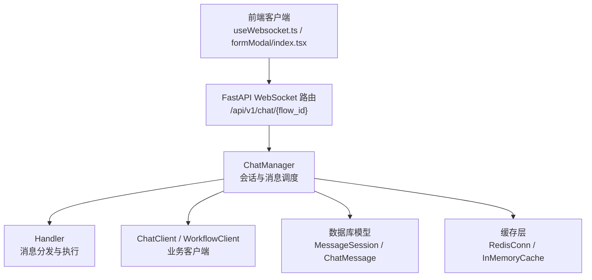
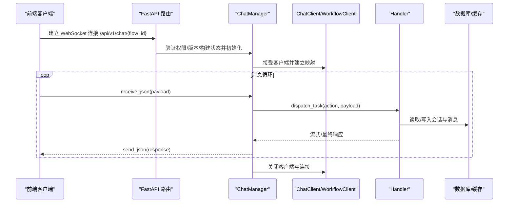
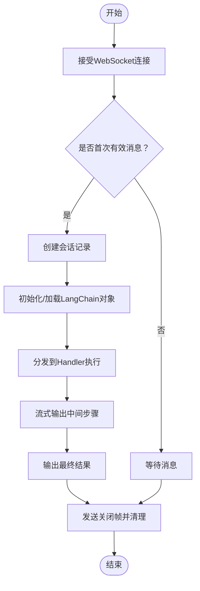
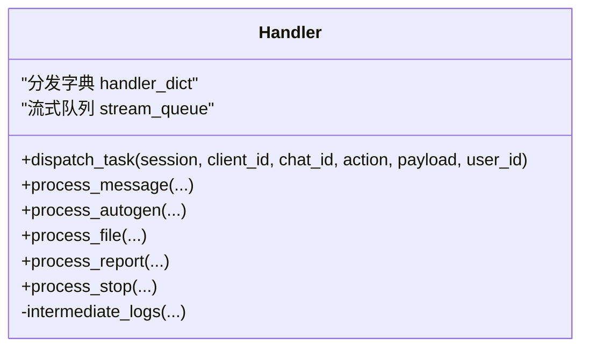
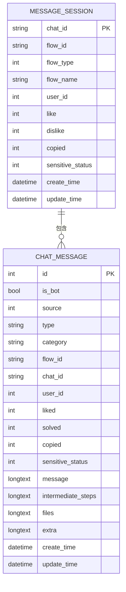
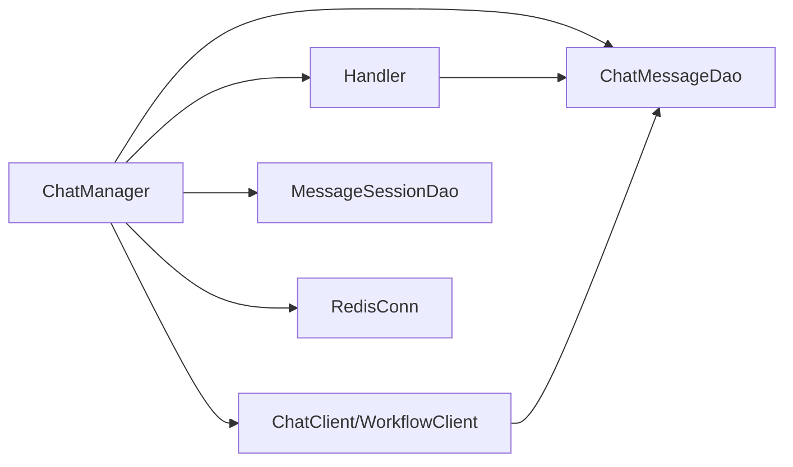

# 聊天会话管理

<cite>
**本文引用的文件**
- [src/backend/bisheng/chat/manager.py](file://src/backend/bisheng/chat/manager.py)
- [src/backend/bisheng/chat/handlers.py](file://src/backend/bisheng/chat/handlers.py)
- [src/backend/bisheng/chat/client.py](file://src/backend/bisheng/chat/client.py)
- [src/backend/bisheng/chat/types.py](file://src/backend/bisheng/chat/types.py)
- [src/backend/bisheng/chat/utils.py](file://src/backend/bisheng/chat/utils.py)
- [src/backend/bisheng/api/v1/chat.py](file://src/backend/bisheng/api/v1/chat.py)
- [src/backend/bisheng/chat_session/domain/chat.py](file://src/backend/bisheng/chat_session/domain/chat.py)
- [src/backend/bisheng/database/models/session.py](file://src/backend/bisheng/database/models/session.py)
- [src/backend/bisheng/database/models/message.py](file://src/backend/bisheng/database/models/message.py)
- [src/backend/bisheng/core/cache/redis_conn.py](file://src/backend/bisheng/core/cache/redis_conn.py)
- [src/backend/bisheng/services/cache/service.py](file://src/backend/bisheng/services/cache/service.py)
- [src/frontend/client/src/pages/appChat/useWebsocket.ts](file://src/frontend/client/src/pages/appChat/useWebsocket.ts)
- [src/frontend/platform/src/modals/formModal/index.tsx](file://src/frontend/platform/src/modals/formModal/index.tsx)
</cite>

## 目录
1. [引言](#引言)
2. [项目结构](#项目结构)
3. [核心组件](#核心组件)
4. [架构总览](#架构总览)
5. [详细组件分析](#详细组件分析)
6. [依赖分析](#依赖分析)
7. [性能考虑](#性能考虑)
8. [故障排查指南](#故障排查指南)
9. [结论](#结论)
10. [附录：扩展与最佳实践](#附录扩展与最佳实践)

## 引言
本技术文档围绕 Bisheng 的聊天与会话管理系统，系统性阐述其设计理念、架构与实现细节，重点覆盖以下方面：
- 会话生命周期管理：从会话创建、消息流转到结束清理的全链路
- 实时通信机制：WebSocket 连接、消息序列化与传输协议
- 消息路由与处理：消息分发、回调机制与错误恢复策略
- 会话状态持久化：Redis 缓存策略与数据库存储方案
- 扩展与集成：自定义消息类型、会话模板与第三方聊天服务接入
- 性能优化与并发处理：线程池、异步任务与缓存命中策略

## 项目结构
后端采用 FastAPI + WebSocket 提供聊天接口，前端通过 WebSocket 与后端进行实时通信。核心模块分布如下：
- API 层：WebSocket 入口与构建流程（流式构建）
- 会话与消息：会话表与消息表的 DAO 封装
- 聊天内核：ChatManager、Handler、ChatClient 等
- 工具与类型：消息处理工具、工作类型枚举、异常类型
- 缓存层：Redis 连接与本地内存缓存

图表来源
- [src/backend/bisheng/api/v1/chat.py](file://src/backend/bisheng/api/v1/chat.py#L510-L565)
- [src/backend/bisheng/chat/manager.py](file://src/backend/bisheng/chat/manager.py#L86-L120)
- [src/backend/bisheng/chat/handlers.py](file://src/backend/bisheng/chat/handlers.py#L33-L77)
- [src/backend/bisheng/database/models/session.py](file://src/backend/bisheng/database/models/session.py#L41-L42)
- [src/backend/bisheng/database/models/message.py](file://src/backend/bisheng/database/models/message.py#L49-L51)
- [src/backend/bisheng/core/cache/redis_conn.py](file://src/backend/bisheng/core/cache/redis_conn.py#L42-L56)

章节来源
- [src/backend/bisheng/api/v1/chat.py](file://src/backend/bisheng/api/v1/chat.py#L510-L565)
- [src/backend/bisheng/chat/manager.py](file://src/backend/bisheng/chat/manager.py#L86-L120)
- [src/backend/bisheng/database/models/session.py](file://src/backend/bisheng/database/models/session.py#L41-L42)
- [src/backend/bisheng/database/models/message.py](file://src/backend/bisheng/database/models/message.py#L49-L51)

## 核心组件
- ChatManager：WebSocket 会话管理、消息路由、任务调度、缓存与持久化协调
- Handler：根据 action 分发到不同处理逻辑（默认、自动机、文件批处理、报告、停止）
- ChatClient：GPTS 助手对话客户端，负责历史加载、回调注入、消息持久化
- ChatSessionService：会话历史查询服务
- 数据模型：MessageSession（会话）、ChatMessage（消息）及其 DAO
- 缓存：RedisConn（异步/同步）、InMemoryCache（会话对象缓存）

章节来源
- [src/backend/bisheng/chat/manager.py](file://src/backend/bisheng/chat/manager.py#L86-L120)
- [src/backend/bisheng/chat/handlers.py](file://src/backend/bisheng/chat/handlers.py#L33-L77)
- [src/backend/bisheng/chat/client.py](file://src/backend/bisheng/chat/client.py#L33-L60)
- [src/backend/bisheng/chat_session/domain/chat.py](file://src/backend/bisheng/chat_session/domain/chat.py#L10-L29)
- [src/backend/bisheng/database/models/session.py](file://src/backend/bisheng/database/models/session.py#L41-L42)
- [src/backend/bisheng/database/models/message.py](file://src/backend/bisheng/database/models/message.py#L49-L51)
- [src/backend/bisheng/core/cache/redis_conn.py](file://src/backend/bisheng/core/cache/redis_conn.py#L42-L56)

## 架构总览
整体交互流程：前端通过 WebSocket 连接到后端，后端根据请求参数与会话状态选择合适的客户端类型（技能或助手），随后进入消息循环，按 action 调度到 Handler 执行，并将中间结果与最终结果通过 WebSocket 返回。

图表来源
- [src/backend/bisheng/api/v1/chat.py](file://src/backend/bisheng/api/v1/chat.py#L510-L565)
- [src/backend/bisheng/chat/manager.py](file://src/backend/bisheng/chat/manager.py#L204-L287)
- [src/backend/bisheng/chat/handlers.py](file://src/backend/bisheng/chat/handlers.py#L46-L77)
- [src/backend/bisheng/chat/client.py](file://src/backend/bisheng/chat/client.py#L68-L107)

## 详细组件分析

### 会话生命周期管理
- 连接建立：ChatManager 接受 WebSocket，记录 active_connections 映射
- 多会话复用：支持同一 flow_id+chat_id 的多连接复用，维护上下文字典
- 会话创建：首次收到有效输入时，若会话不存在则创建 MessageSession 并记录审计日志
- 任务调度：使用线程池提交任务，完成后统一清理
- 结束与关闭：捕获断开/异常，发送关闭帧并清理资源

图表来源
- [src/backend/bisheng/chat/manager.py](file://src/backend/bisheng/chat/manager.py#L289-L446)
- [src/backend/bisheng/chat/manager.py](file://src/backend/bisheng/chat/manager.py#L448-L566)
- [src/backend/bisheng/chat/handlers.py](file://src/backend/bisheng/chat/handlers.py#L46-L77)

章节来源
- [src/backend/bisheng/chat/manager.py](file://src/backend/bisheng/chat/manager.py#L289-L446)
- [src/backend/bisheng/chat/manager.py](file://src/backend/bisheng/chat/manager.py#L448-L566)

### 实时通信机制与消息序列化
- 协议：基于 WebSocket，消息以 JSON 序列化传输
- 前端连接：根据协议自动选择 ws/wss，拼接 token 参数
- 心跳与断线重连：前端检测关闭事件并尝试重连
- 后端超时与异常：接收消息设置超时，捕获断开与未知异常并优雅关闭

章节来源
- [src/frontend/client/src/pages/appChat/useWebsocket.ts](file://src/frontend/client/src/pages/appChat/useWebsocket.ts#L33-L50)
- [src/frontend/platform/src/modals/formModal/index.tsx](file://src/frontend/platform/src/modals/formModal/index.tsx#L182-L212)
- [src/backend/bisheng/chat/manager.py](file://src/backend/bisheng/chat/manager.py#L233-L260)

### 消息路由与处理（Handler）
- 分发字典：default、autogen、auto_file、report、stop
- 中间步骤与最终结果：根据返回内容决定是否发送“开始/中间/结束/关闭”等类型消息
- 自动机（AutoGen）：支持继续对话与停止中断
- 文件批处理：对批量问题逐条执行并汇总结果
- 报告生成：结合模板与结果生成可分享文件链接

图表来源
- [src/backend/bisheng/chat/handlers.py](file://src/backend/bisheng/chat/handlers.py#L33-L77)
- [src/backend/bisheng/chat/handlers.py](file://src/backend/bisheng/chat/handlers.py#L221-L331)
- [src/backend/bisheng/chat/handlers.py](file://src/backend/bisheng/chat/handlers.py#L333-L391)
- [src/backend/bisheng/chat/handlers.py](file://src/backend/bisheng/chat/handlers.py#L136-L196)

章节来源
- [src/backend/bisheng/chat/handlers.py](file://src/backend/bisheng/chat/handlers.py#L33-L77)
- [src/backend/bisheng/chat/handlers.py](file://src/backend/bisheng/chat/handlers.py#L221-L331)
- [src/backend/bisheng/chat/handlers.py](file://src/backend/bisheng/chat/handlers.py#L333-L391)
- [src/backend/bisheng/chat/handlers.py](file://src/backend/bisheng/chat/handlers.py#L136-L196)

### 会话状态持久化（Redis 与数据库）
- Redis 缓存策略：
  - 存储构建图数据与状态，键名包含 flow_id 与可选版本号
  - 支持异步/同步操作，设置过期时间，用于调试与构建阶段
- 数据库存储：
  - MessageSession：会话元信息（应用类型、用户、计数等）
  - ChatMessage：消息明细（问答、工具调用、中间步骤、文件等）
  - DAO 提供同步/异步 CRUD 与聚合查询

图表来源
- [src/backend/bisheng/database/models/session.py](file://src/backend/bisheng/database/models/session.py#L18-L39)
- [src/backend/bisheng/database/models/message.py](file://src/backend/bisheng/database/models/message.py#L20-L47)

章节来源
- [src/backend/bisheng/api/v1/chat.py](file://src/backend/bisheng/api/v1/chat.py#L567-L621)
- [src/backend/bisheng/api/v1/chat.py](file://src/backend/bisheng/api/v1/chat.py#L623-L718)
- [src/backend/bisheng/database/models/session.py](file://src/backend/bisheng/database/models/session.py#L41-L42)
- [src/backend/bisheng/database/models/message.py](file://src/backend/bisheng/database/models/message.py#L49-L51)

### 聊天处理器实现细节
- 会话对象缓存：ChatManager.in_memory_cache 保存已构建的 LangChain 对象，避免重复构建
- 输入节点处理：根据节点类型（文件、变量等）刷新图数据并触发重建
- 中间步骤与溯源：支持将召回片段写入 RecallChunk，便于溯源展示
- 停止与中断：支持中断当前任务并将流式输出落库

章节来源
- [src/backend/bisheng/chat/manager.py](file://src/backend/bisheng/chat/manager.py#L580-L656)
- [src/backend/bisheng/chat/utils.py](file://src/backend/bisheng/chat/utils.py#L34-L68)
- [src/backend/bisheng/chat/utils.py](file://src/backend/bisheng/chat/utils.py#L208-L236)
- [src/backend/bisheng/chat/handlers.py](file://src/backend/bisheng/chat/handlers.py#L79-L135)

### 会话历史查询服务
- ChatSessionService：按 chat_id/flow_id 获取历史消息列表，并封装用户与会话信息
- 权限校验：支持分享链接校验，确保访问安全

章节来源
- [src/backend/bisheng/chat_session/domain/chat.py](file://src/backend/bisheng/chat_session/domain/chat.py#L10-L29)
- [src/backend/bisheng/api/v1/chat.py](file://src/backend/bisheng/api/v1/chat.py#L156-L170)

## 依赖分析
- 组件耦合：
  - ChatManager 依赖 Handler、ChatClient/WorkflowClient、数据库 DAO、缓存
  - Handler 依赖 ChatManager 的发送能力与数据库 DAO
  - ChatClient 依赖 AssistantAgent 与回调注入
- 外部依赖：
  - Redis：构建状态与临时数据缓存
  - 数据库：会话与消息持久化
  - 前端 WebSocket 客户端

图表来源
- [src/backend/bisheng/chat/manager.py](file://src/backend/bisheng/chat/manager.py#L86-L120)
- [src/backend/bisheng/chat/handlers.py](file://src/backend/bisheng/chat/handlers.py#L33-L77)
- [src/backend/bisheng/chat/client.py](file://src/backend/bisheng/chat/client.py#L33-L60)
- [src/backend/bisheng/database/models/session.py](file://src/backend/bisheng/database/models/session.py#L45-L71)
- [src/backend/bisheng/database/models/message.py](file://src/backend/bisheng/database/models/message.py#L143-L170)
- [src/backend/bisheng/core/cache/redis_conn.py](file://src/backend/bisheng/core/cache/redis_conn.py#L42-L56)

章节来源
- [src/backend/bisheng/chat/manager.py](file://src/backend/bisheng/chat/manager.py#L86-L120)
- [src/backend/bisheng/chat/handlers.py](file://src/backend/bisheng/chat/handlers.py#L33-L77)
- [src/backend/bisheng/chat/client.py](file://src/backend/bisheng/chat/client.py#L33-L60)
- [src/backend/bisheng/database/models/session.py](file://src/backend/bisheng/database/models/session.py#L45-L71)
- [src/backend/bisheng/database/models/message.py](file://src/backend/bisheng/database/models/message.py#L143-L170)
- [src/backend/bisheng/core/cache/redis_conn.py](file://src/backend/bisheng/core/cache/redis_conn.py#L42-L56)

## 性能考虑
- 缓存策略
  - Redis：短期构建状态与图数据缓存，设置合理过期时间，减少重复构建
  - 内存缓存：会话对象缓存，避免重复构建 LangChain 图
- 并发与异步
  - 线程池：将耗时任务提交至线程池，避免阻塞 WebSocket 循环
  - 异步 Redis：异步连接与批量操作，降低 IO 阻塞
- 数据库优化
  - 使用索引字段（flow_id、chat_id、user_id）加速查询
  - 分页与限制返回数量，避免一次性拉取大量历史消息
- 流式输出
  - 使用队列收集中间步骤，边生成边发送，提升用户体验

## 故障排查指南
- WebSocket 断开与异常
  - 后端捕获断开与未知异常，发送关闭帧并清理资源
  - 前端监听关闭事件并尝试重连
- 业务异常
  - Handler 在执行过程中抛出业务异常时，转换为标准错误消息并关闭连接
- 构建状态
  - 构建中/失败状态需在前端提示，避免重复构建

章节来源
- [src/backend/bisheng/chat/manager.py](file://src/backend/bisheng/chat/manager.py#L251-L261)
- [src/backend/bisheng/chat/manager.py](file://src/backend/bisheng/chat/manager.py#L406-L423)
- [src/backend/bisheng/chat/handlers.py](file://src/backend/bisheng/chat/handlers.py#L79-L135)
- [src/frontend/platform/src/modals/formModal/index.tsx](file://src/frontend/platform/src/modals/formModal/index.tsx#L182-L190)

## 结论
Bisheng 的聊天与会话管理系统以 WebSocket 为核心，结合 Redis 缓存与数据库持久化，实现了高并发下的稳定会话管理与消息分发。通过清晰的职责划分与可扩展的 Handler 机制，系统既满足通用技能对话，也支持助手类复杂交互与文件批处理等场景。建议在生产环境中进一步完善缓存淘汰策略、监控埋点与异常恢复，以提升稳定性与可观测性。

## 附录：扩展与最佳实践
- 自定义消息类型
  - 在 Handler 中新增 action 分支，并在前端对应渲染
  - 保持消息结构一致（type/category/user_id 等字段）
- 会话模板
  - 可通过预置输入节点与变量节点，形成可复用的模板
  - 利用 Redis 缓存模板图数据，缩短首次构建时间
- 第三方聊天服务集成
  - 通过 ChatClient 或 WorkflowClient 注入外部回调与历史
  - 使用中间步骤与溯源能力，保留第三方服务的执行轨迹
- 性能优化建议
  - 合理设置 Redis 过期时间与内存上限
  - 对长历史会话启用分页与增量加载
  - 使用线程池与异步 IO，避免阻塞主循环