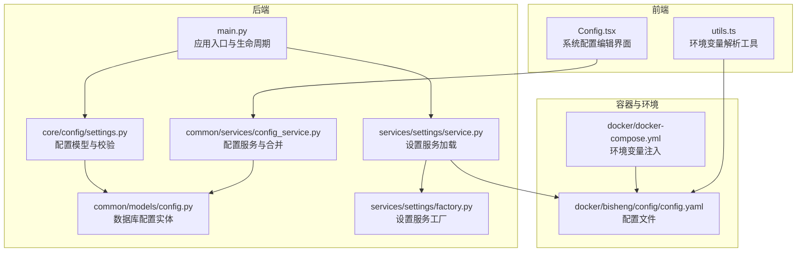
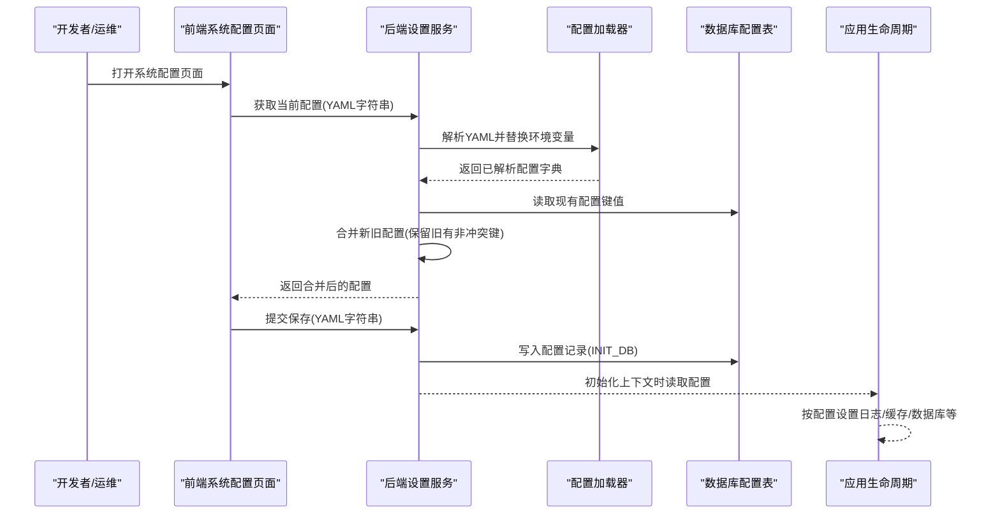
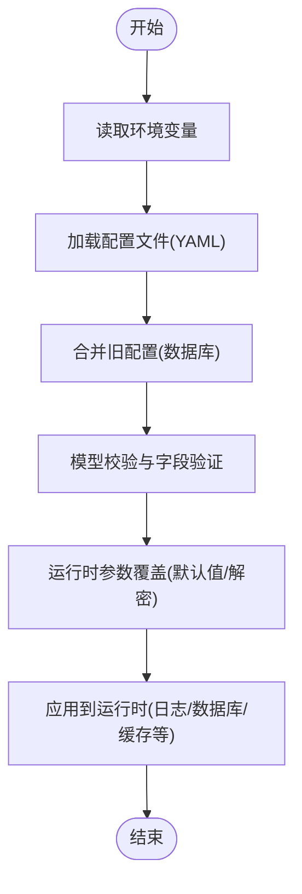
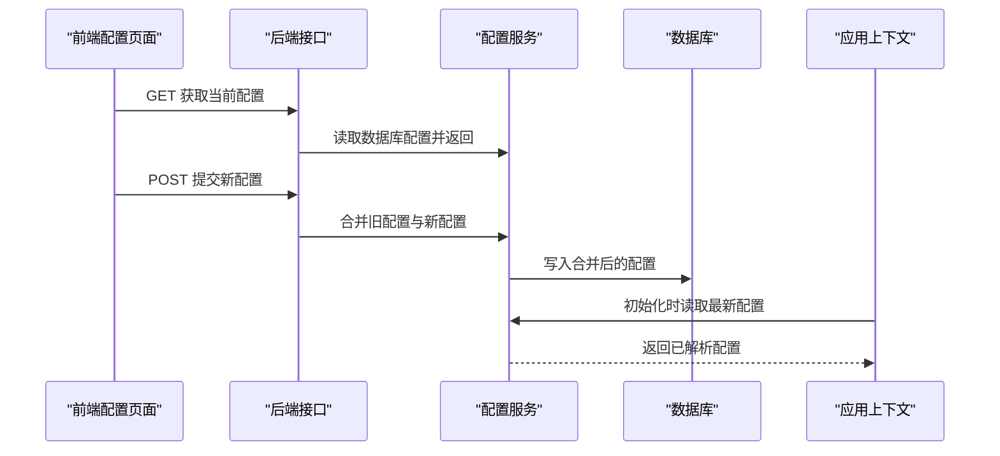
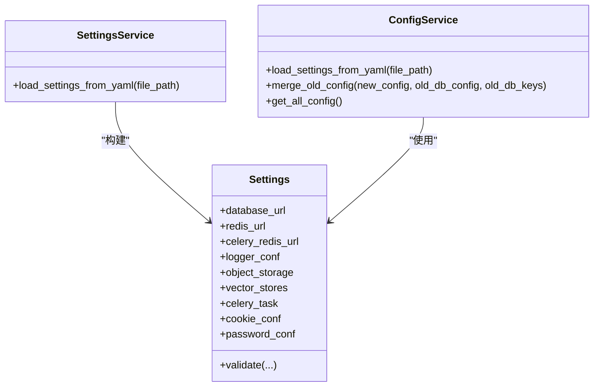

# 配置管理

<cite>
**本文引用的文件**
- [docker/bisheng/config/config.yaml](file://docker/bisheng/config/config.yaml)
- [src/backend/bisheng/core/config/settings.py](file://src/backend/bisheng/core/config/settings.py)
- [src/backend/bisheng/common/models/config.py](file://src/backend/bisheng/common/models/config.py)
- [src/backend/bisheng/common/services/config_service.py](file://src/backend/bisheng/common/services/config_service.py)
- [src/backend/bisheng/services/settings/service.py](file://src/backend/bisheng/services/settings/service.py)
- [src/backend/bisheng/services/settings/factory.py](file://src/backend/bisheng/services/settings/factory.py)
- [src/backend/bisheng/main.py](file://src/backend/bisheng/main.py)
- [docker/docker-compose.yml](file://docker/docker-compose.yml)
- [src/frontend/platform/src/pages/SystemPage/components/Config.tsx](file://src/frontend/platform/src/pages/SystemPage/components/Config.tsx)
- [src/frontend/client/src/data-provider/data-provider/src/utils.ts](file://src/frontend/client/src/data-provider/data-provider/src/utils.ts)
- [src/backend/bisheng/services/settings/utils.py](file://src/backend/bisheng/services/settings/utils.py)
</cite>

## 目录
1. [简介](#简介)
2. [项目结构](#项目结构)
3. [核心组件](#核心组件)
4. [架构总览](#架构总览)
5. [组件详解](#组件详解)
6. [依赖关系分析](#依赖关系分析)
7. [性能考量](#性能考量)
8. [故障排除指南](#故障排除指南)
9. [结论](#结论)
10. [附录](#附录)

## 简介
本文件面向运维与开发人员，系统化阐述 Bisheng 配置管理系统的层次结构、优先级与覆盖机制、配置项分类与作用域、热更新与安全策略，并提供多环境部署的最佳实践与排障建议。重点覆盖以下方面：
- 配置来源：环境变量、配置文件、运行时参数的优先级与覆盖
- 配置分类：数据库、缓存、日志、对象存储、向量检索、Celery、Cookie/JWT、密码策略等
- 热更新：配置变更检测与生效策略
- 安全：密钥管理、敏感信息保护、访问控制
- 多环境：开发、测试、生产差异化配置
- 运维：配置管理与故障排除实操

## 项目结构
围绕配置管理的关键目录与文件如下：
- 后端配置模型与加载：core/config/settings.py、common/models/config.py、common/services/config_service.py
- 设置服务层：services/settings/service.py、services/settings/factory.py
- 应用入口与生命周期：main.py
- 容器编排与环境变量：docker/docker-compose.yml
- 前端系统配置页面：src/frontend/platform/src/pages/SystemPage/components/Config.tsx
- 环境变量解析工具：src/frontend/client/src/data-provider/data-provider/src/utils.ts
- 安全权限工具：services/settings/utils.py

图表来源
- [src/backend/bisheng/main.py](file://src/backend/bisheng/main.py#L52-L61)
- [src/backend/bisheng/core/config/settings.py](file://src/backend/bisheng/core/config/settings.py#L210-L346)
- [src/backend/bisheng/common/models/config.py](file://src/backend/bisheng/common/models/config.py#L12-L89)
- [src/backend/bisheng/common/services/config_service.py](file://src/backend/bisheng/common/services/config_service.py#L61-L156)
- [src/backend/bisheng/services/settings/service.py](file://src/backend/bisheng/services/settings/service.py#L10-L44)
- [src/backend/bisheng/services/settings/factory.py](file://src/backend/bisheng/services/settings/factory.py#L7-L15)
- [docker/docker-compose.yml](file://docker/docker-compose.yml#L46-L62)
- [docker/bisheng/config/config.yaml](file://docker/bisheng/config/config.yaml#L1-L88)
- [src/frontend/platform/src/pages/SystemPage/components/Config.tsx](file://src/frontend/platform/src/pages/SystemPage/components/Config.tsx#L10-L40)
- [src/frontend/client/src/data-provider/data-provider/src/utils.ts](file://src/frontend/client/src/data-provider/data-provider/src/utils.ts#L1-L44)

章节来源
- [src/backend/bisheng/main.py](file://src/backend/bisheng/main.py#L52-L61)
- [docker/docker-compose.yml](file://docker/docker-compose.yml#L46-L62)

## 核心组件
- 配置模型与校验：定义了数据库、Redis、Celery、日志、对象存储、向量检索、Cookie/JWT、密码策略等配置项的数据结构与默认值，并在加载时进行类型与格式校验。
- 数据库配置实体：以 SQLModel 表形式存储系统配置键值，支持读取与异步读取。
- 配置服务：负责从 YAML 加载配置、解析环境变量占位符、合并旧配置并写入数据库，同时提供缓存与回退机制。
- 设置服务与工厂：封装配置加载流程，确保键名大小写转换与字段存在性校验，生成设置服务实例。
- 应用入口：在应用生命周期中初始化上下文、服务与默认数据，按配置设置日志。

章节来源
- [src/backend/bisheng/core/config/settings.py](file://src/backend/bisheng/core/config/settings.py#L210-L346)
- [src/backend/bisheng/common/models/config.py](file://src/backend/bisheng/common/models/config.py#L12-L89)
- [src/backend/bisheng/common/services/config_service.py](file://src/backend/bisheng/common/services/config_service.py#L61-L156)
- [src/backend/bisheng/services/settings/service.py](file://src/backend/bisheng/services/settings/service.py#L10-L44)
- [src/backend/bisheng/services/settings/factory.py](file://src/backend/bisheng/services/settings/factory.py#L7-L15)
- [src/backend/bisheng/main.py](file://src/backend/bisheng/main.py#L52-L61)

## 架构总览
下图展示配置从文件到内存、再到数据库与运行时生效的整体流程，以及环境变量注入与前端编辑的交互。

图表来源
- [src/frontend/platform/src/pages/SystemPage/components/Config.tsx](file://src/frontend/platform/src/pages/SystemPage/components/Config.tsx#L18-L40)
- [src/backend/bisheng/common/services/config_service.py](file://src/backend/bisheng/common/services/config_service.py#L125-L156)
- [src/backend/bisheng/services/settings/service.py](file://src/backend/bisheng/services/settings/service.py#L18-L44)
- [src/backend/bisheng/main.py](file://src/backend/bisheng/main.py#L52-L61)

## 组件详解

### 配置层次与优先级
- 层次来源
  - 环境变量：容器编排注入的环境变量，用于替换配置文件中的占位符；前端也支持对字符串进行环境变量替换。
  - 配置文件：YAML 文件，包含数据库、缓存、日志、对象存储、向量检索、Celery 等配置。
  - 运行时参数：应用启动时由设置服务加载并校验，部分字段支持默认值与自动解密。
- 优先级与覆盖
  - 环境变量优先级：在 YAML 中使用自定义构造器或前端解析工具时，环境变量会直接替换占位符。
  - 文件优先级：设置服务加载 YAML 后，键名统一转大写并与模型字段对比，缺失键会被忽略或使用默认值。
  - 运行时参数：模型校验器与验证器会在加载阶段对关键字段进行处理（如数据库 URL 解密、Redis/Celery URL 解密、日志处理器环境变量替换等），最终覆盖文件中的对应值。
  - 合并策略：当通过前端提交新的配置时，配置服务会与数据库中已存在的配置进行合并，保留旧配置中未在新文件中出现的键值，避免丢失。

图表来源
- [docker/docker-compose.yml](file://docker/docker-compose.yml#L46-L62)
- [docker/bisheng/config/config.yaml](file://docker/bisheng/config/config.yaml#L34-L88)
- [src/backend/bisheng/core/config/settings.py](file://src/backend/bisheng/core/config/settings.py#L262-L323)
- [src/backend/bisheng/common/services/config_service.py](file://src/backend/bisheng/common/services/config_service.py#L125-L156)

章节来源
- [docker/docker-compose.yml](file://docker/docker-compose.yml#L46-L62)
- [docker/bisheng/config/config.yaml](file://docker/bisheng/config/config.yaml#L34-L88)
- [src/backend/bisheng/core/config/settings.py](file://src/backend/bisheng/core/config/settings.py#L262-L323)
- [src/frontend/client/src/data-provider/data-provider/src/utils.ts](file://src/frontend/client/src/data-provider/data-provider/src/utils.ts#L1-L44)
- [src/backend/bisheng/common/services/config_service.py](file://src/backend/bisheng/common/services/config_service.py#L125-L156)

### 配置项分类与作用域
- 数据库连接
  - 关键字段：database_url
  - 行为：若未提供，则尝试读取环境变量；否则使用 SQLite 作为后备；支持对 URL 中的密码进行解密替换。
- 缓存与队列
  - Redis：redis_url、celery_redis_url；支持普通、集群、哨兵模式；密码可加密存储并在加载时解密。
  - Celery：task_routers、beat_schedule；提供默认路由与定时任务配置。
- 日志
  - logger_conf：日志级别、格式、多个 handler；支持环境变量替换与过滤器函数解析。
- 对象存储
  - object_storage.type=minio；包含 schema、cert_check、endpoint、sharepoint、access_key、secret_key、公共桶与临时桶等。
- 向量检索
  - vector_stores.milvus：connection_args、is_partition、partition_suffix；支持 JSON 字符串转换。
  - vector_stores.elasticsearch：url、ssl_verify；支持字符串到字面量的转换。
- 安全与认证
  - cookie_conf：jwt_token_expire_time、jwt_iss、sameSite、secure、httpOnly 等。
  - 密码策略：password_conf：密码有效期、登录错误时间窗、最大错误次数。
- 其他
  - workflow_conf：最大步骤数与节点超时。
  - telemetry_elasticsearch：遥测使用的 ES 地址与 SSL 验证。

章节来源
- [src/backend/bisheng/core/config/settings.py](file://src/backend/bisheng/core/config/settings.py#L23-L346)

### 配置热更新机制
- 配置变更检测
  - 前端系统配置页面支持获取与保存 YAML 字符串；保存时进行格式校验。
- 生效策略
  - 合并策略：新增键值直接采用新配置，旧有键值保留数据库中的值，避免覆盖。
  - 缓存：读取配置时优先命中缓存，降低数据库压力。
  - 应用生效：应用在初始化上下文时读取配置并设置日志、数据库、缓存等；对于运行时可热更新的配置（如日志级别、部分缓存参数），需结合具体实现进行动态刷新。

图表来源
- [src/frontend/platform/src/pages/SystemPage/components/Config.tsx](file://src/frontend/platform/src/pages/SystemPage/components/Config.tsx#L18-L40)
- [src/backend/bisheng/common/services/config_service.py](file://src/backend/bisheng/common/services/config_service.py#L125-L156)

章节来源
- [src/frontend/platform/src/pages/SystemPage/components/Config.tsx](file://src/frontend/platform/src/pages/SystemPage/components/Config.tsx#L18-L40)
- [src/backend/bisheng/common/services/config_service.py](file://src/backend/bisheng/common/services/config_service.py#L125-L156)

### 安全配置与敏感信息保护
- 密钥管理
  - 后端使用对称加密算法对敏感令牌进行加解密；配置模型中包含密钥与加解密函数。
- 敏感信息保护
  - 数据库与 Redis 密码支持以加密形式存储在配置文件中，在加载时自动解密。
  - 前端环境变量解析工具支持对字符串中的占位符进行替换，避免明文泄露。
  - 安全权限工具提供跨平台的安全文件权限设置，确保密钥文件仅限所有者访问。
- 访问控制
  - Cookie/JWT 配置支持 SameSite、Secure、HttpOnly 等属性，提升会话安全性。

章节来源
- [src/backend/bisheng/core/config/settings.py](file://src/backend/bisheng/core/config/settings.py#L12-L21)
- [src/backend/bisheng/core/config/settings.py](file://src/backend/bisheng/core/config/settings.py#L285-L323)
- [src/frontend/client/src/data-provider/data-provider/src/utils.ts](file://src/frontend/client/src/data-provider/data-provider/src/utils.ts#L1-L44)
- [src/backend/bisheng/services/settings/utils.py](file://src/backend/bisheng/services/settings/utils.py#L8-L39)

### 多环境部署最佳实践
- 开发环境
  - 使用本地 MySQL 与 Redis，日志级别较低，便于调试。
  - 建议开启 debug 模式，便于追踪问题。
- 测试环境
  - 使用独立的 MySQL 与 Redis 实例，配置与开发一致但资源隔离。
  - 日志级别适中，启用必要的过滤器。
- 生产环境
  - 使用强密码与 TLS；对象存储与向量检索服务使用稳定版本。
  - 环境变量集中管理，避免硬编码；敏感配置通过加密存储并在运行时解密。
  - 前端代理与后端 CORS 配置需与域名一致，防止跨域风险。

章节来源
- [docker/docker-compose.yml](file://docker/docker-compose.yml#L46-L62)
- [docker/bisheng/config/config.yaml](file://docker/bisheng/config/config.yaml#L1-L88)

## 依赖关系分析
- 配置模型与服务
  - Settings 模型定义了所有配置项的结构与默认值，并在加载时进行校验与转换。
  - ConfigService 负责从 YAML 加载配置、解析环境变量、合并旧配置并写入数据库。
  - SettingsService 封装加载流程，确保键名规范化与字段存在性校验。
- 应用集成
  - main.py 在应用生命周期中初始化上下文并按配置设置日志等。

图表来源
- [src/backend/bisheng/core/config/settings.py](file://src/backend/bisheng/core/config/settings.py#L210-L346)
- [src/backend/bisheng/common/services/config_service.py](file://src/backend/bisheng/common/services/config_service.py#L61-L156)
- [src/backend/bisheng/services/settings/service.py](file://src/backend/bisheng/services/settings/service.py#L18-L44)

章节来源
- [src/backend/bisheng/core/config/settings.py](file://src/backend/bisheng/core/config/settings.py#L210-L346)
- [src/backend/bisheng/common/services/config_service.py](file://src/backend/bisheng/common/services/config_service.py#L61-L156)
- [src/backend/bisheng/services/settings/service.py](file://src/backend/bisheng/services/settings/service.py#L18-L44)

## 性能考量
- 配置读取优化
  - 通过缓存键读取配置，减少数据库查询频率。
- 日志配置
  - 多 handler 与过滤器可能带来额外开销，建议在生产环境合理配置日志级别与过滤条件。
- 数据库与缓存
  - URL 解密与连接池参数需结合实际负载调整，避免频繁重建连接。

## 故障排除指南
- 环境变量未生效
  - 检查容器编排是否正确注入环境变量；确认 YAML 中使用了正确的占位符语法；前端解析工具仅对字符串进行替换。
- 数据库连接失败
  - 确认 database_url 是否正确，必要时检查密码解密逻辑；若使用加密密码，请确保密钥一致。
- Redis/Celery 连接异常
  - 检查 redis_url/celery_redis_url 的格式与密码解密；集群/哨兵模式需确保配置完整。
- 配置保存后未生效
  - 确认前端提交的 YAML 格式正确；检查合并逻辑是否覆盖了旧配置；应用需重新初始化上下文以加载最新配置。
- 权限与安全
  - 确保密钥文件权限正确；Cookie/JWT 属性符合安全要求；避免在日志中输出敏感信息。

章节来源
- [docker/docker-compose.yml](file://docker/docker-compose.yml#L46-L62)
- [docker/bisheng/config/config.yaml](file://docker/bisheng/config/config.yaml#L34-L88)
- [src/backend/bisheng/core/config/settings.py](file://src/backend/bisheng/core/config/settings.py#L262-L323)
- [src/frontend/platform/src/pages/SystemPage/components/Config.tsx](file://src/frontend/platform/src/pages/SystemPage/components/Config.tsx#L25-L40)
- [src/backend/bisheng/services/settings/utils.py](file://src/backend/bisheng/services/settings/utils.py#L8-L39)

## 结论
Bisheng 的配置管理体系通过“环境变量 + 配置文件 + 运行时参数”的分层设计实现了灵活与可控的配置管理。配合数据库持久化与前端可视化编辑，既满足开发调试需求，又能在生产环境保证安全与稳定性。建议在各环境下严格区分敏感信息与访问控制，并通过缓存与合理的日志策略提升整体性能与可观测性。

## 附录
- 关键配置键与含义
  - database_url：数据库连接字符串
  - redis_url/celery_redis_url：缓存与队列连接字符串
  - logger_conf：日志级别、格式与多个 handler
  - object_storage：对象存储类型与访问凭据
  - vector_stores：向量检索服务配置
  - celery_task：任务路由与定时任务
  - cookie_conf/password_conf：会话与密码策略
- 常见问题速查
  - 环境变量未替换：检查占位符语法与注入位置
  - 密码解密失败：核对密钥一致性与加密格式
  - 配置未生效：确认保存成功与应用重启