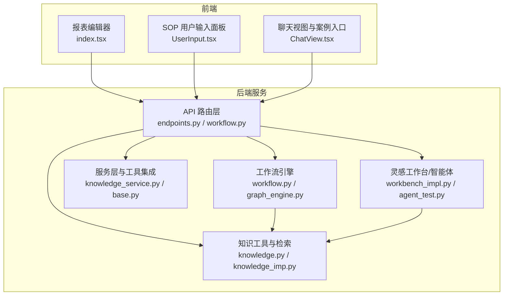
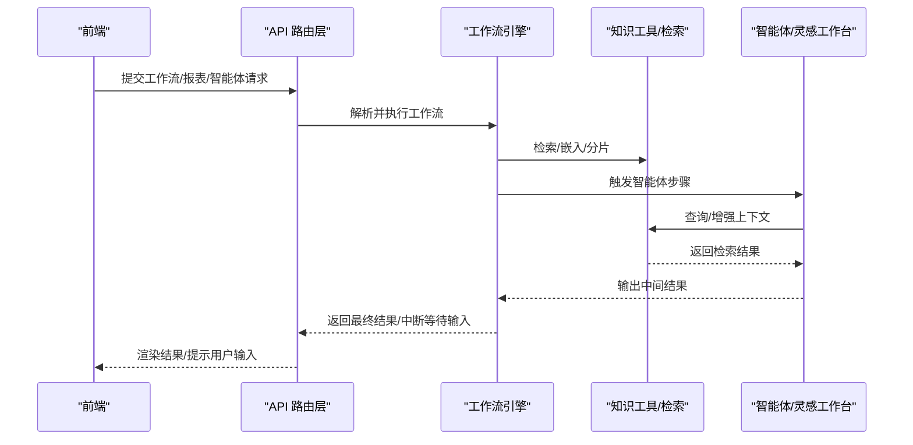
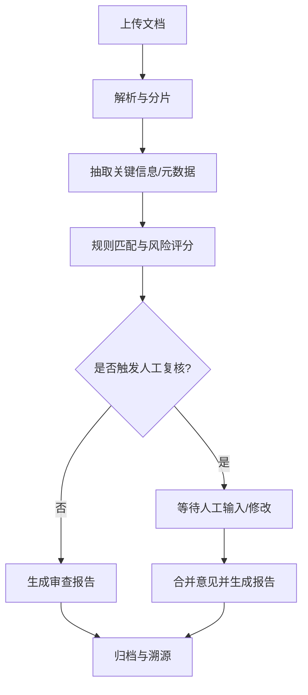
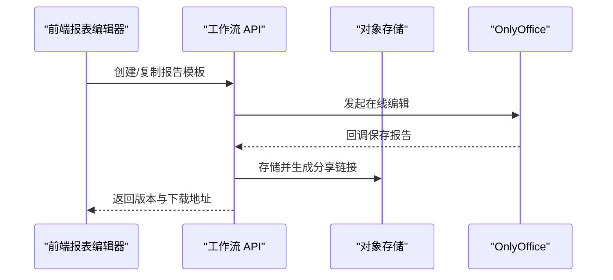
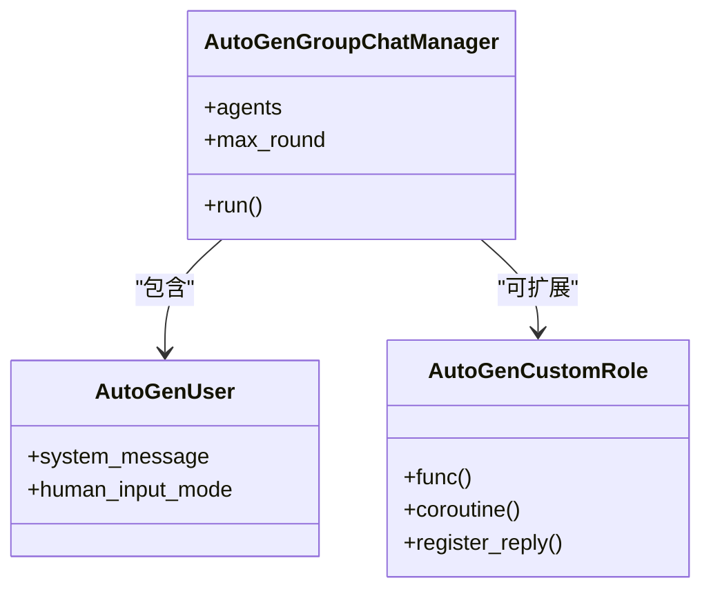
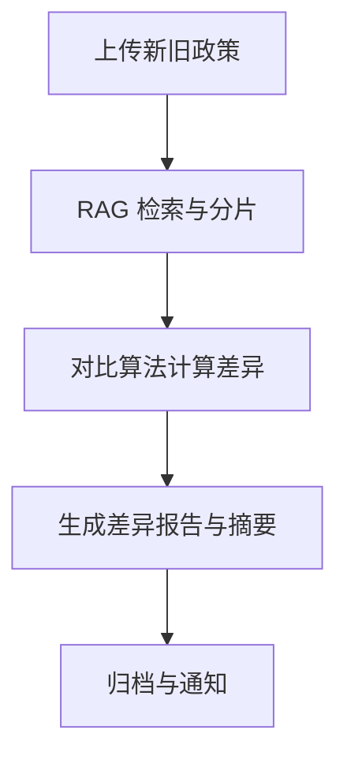
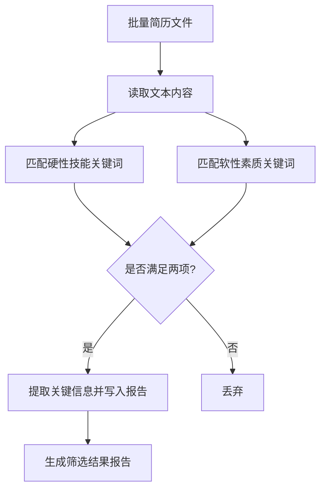
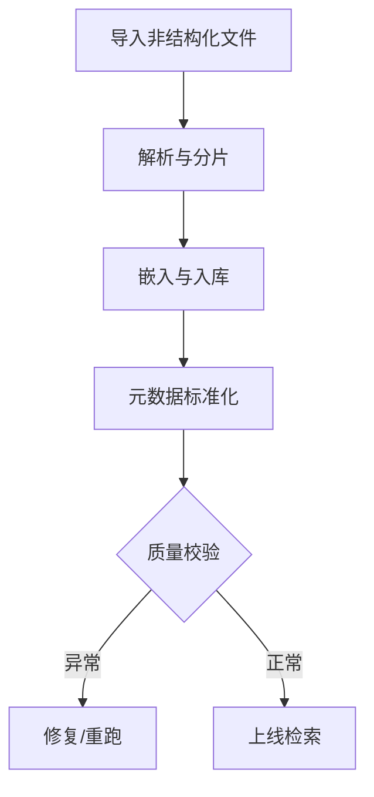
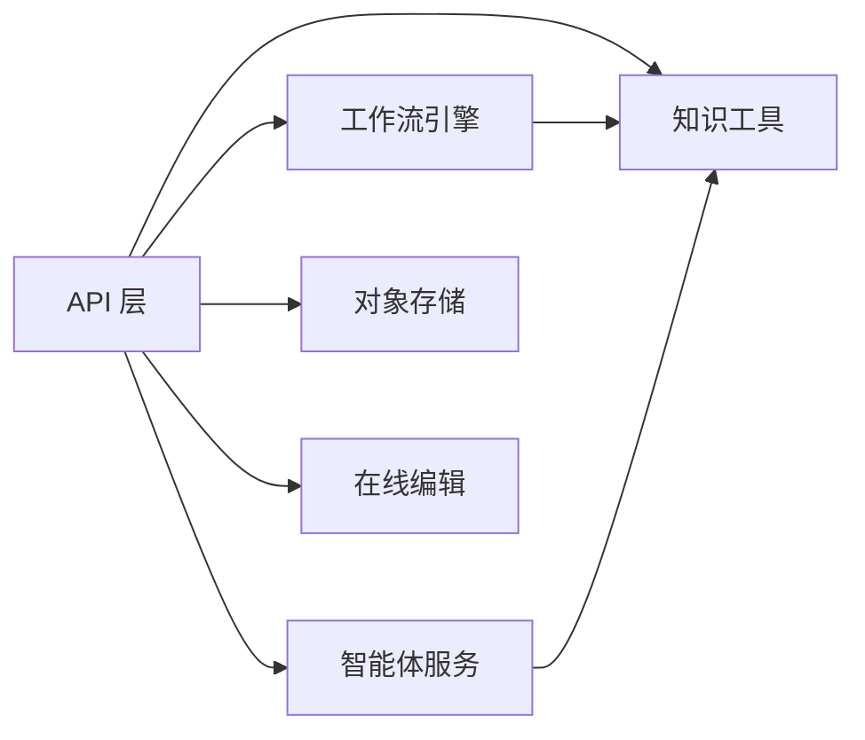

# 应用场景

<cite>
**本文引用的文件**
- [README_CN.md](file://README_CN.md)
- [README.md](file://README.md)
- [main.py](file://src/backend/bisheng/main.py)
- [server.py](file://src/backend/bisheng/server.py)
- [workflow.py](file://src/backend/bisheng/workflow/graph/workflow.py)
- [graph_engine.py](file://src/backend/bisheng/workflow/graph/graph_engine.py)
- [knowledge.py](file://src/backend/bisheng/tool/domain/langchain/knowledge.py)
- [knowledge_imp.py](file://src/backend/bisheng/api/services/knowledge_imp.py)
- [knowledge.py](file://src/backend/bisheng/knowledge/domain/services/knowledge_service.py)
- [knowledge.py](file://src/backend/bisheng/open_endpoints/api/endpoints/knowledge.py)
- [vectorstore_metadata.py](file://src/backend/bisheng/common/constants/vectorstore_metadata.py)
- [milvus_trans.py](file://src/backend/test/milvus_trans.py)
- [groupchat_manager.py](file://src/backend/bisheng_langchain/autogen_role/groupchat_manager.py)
- [user.py](file://src/backend/bisheng_langchain/autogen_role/user.py)
- [custom.py](file://src/backend/bisheng_langchain/autogen_role/custom.py)
- [base.py](file://src/backend/bisheng/interface/autogenRole/base.py)
- [index.tsx](file://src/frontend/platform/src/pages/Report/index.tsx)
- [workbench_impl.py](file://src/backend/bisheng/linsight/domain/services/workbench_impl.py)
- [endpoints.py](file://src/backend/bisheng/api/v1/endpoints.py)
- [workflow.py](file://src/backend/bisheng/api/v1/workflow.py)
- [agent_test.py](file://src/backend/bisheng_langchain/linsight/agent_test.py)
- [UserInput.tsx](file://src/frontend/client/src/components/Sop/components/UserInput.tsx)
- [ChatView.tsx](file://src/frontend/client/src/components/Chat/ChatView.tsx)
</cite>

## 目录
1. [引言](#引言)
2. [项目结构](#项目结构)
3. [核心组件](#核心组件)
4. [架构总览](#架构总览)
5. [详细场景分析](#详细场景分析)
6. [依赖关系分析](#依赖关系分析)
7. [性能考量](#性能考量)
8. [故障排查指南](#故障排查指南)
9. [结论](#结论)
10. [附录](#附录)

## 引言
本文件面向企业级 LLM 应用开发者与业务人员，系统化阐述 Bisheng 平台在文档审查、固定布局报告生成、多智能体协作、政策更新对比、工单辅助、客户服务、会议纪要生成、简历筛选、通话记录分析、非结构化数据治理、知识挖掘、数据分析等典型场景中的应用方法与价值。平台通过“工作流编排 + 智能体技术”的双轮驱动，将复杂业务流程可视化、可交互、可迭代，覆盖从数据接入、知识抽取、多模态解析、到最终报告/决策输出的全链路。

## 项目结构
后端采用 FastAPI + 自研工作流引擎，前端提供可视化工作流与报表编辑器。平台围绕“工作流”“智能体”“知识库”三大支柱展开，辅以向量检索、RAG、文档解析、回调通知等能力，形成端到端的企业级应用底座。

图表来源
- [endpoints.py](file://src/backend/bisheng/api/v1/endpoints.py#L157-L350)
- [workflow.py](file://src/backend/bisheng/api/v1/workflow.py#L135-L144)
- [workflow.py](file://src/backend/bisheng/workflow/graph/workflow.py#L10-L36)
- [graph_engine.py](file://src/backend/bisheng/workflow/graph/graph_engine.py#L27-L71)
- [knowledge.py](file://src/backend/bisheng/tool/domain/langchain/knowledge.py#L100-L115)
- [knowledge_imp.py](file://src/backend/bisheng/api/services/knowledge_imp.py#L252-L291)
- [knowledge.py](file://src/backend/bisheng/knowledge/domain/services/knowledge_service.py#L363-L392)
- [base.py](file://src/backend/bisheng/interface/autogenRole/base.py#L11-L48)
- [workbench_impl.py](file://src/backend/bisheng/linsight/domain/services/workbench_impl.py#L991-L1019)
- [index.tsx](file://src/frontend/platform/src/pages/Report/index.tsx#L12-L64)
- [UserInput.tsx](file://src/frontend/client/src/components/Sop/components/UserInput.tsx#L262-L287)
- [ChatView.tsx](file://src/frontend/client/src/components/Chat/ChatView.tsx#L1-L25)

章节来源
- [README_CN.md](file://README_CN.md#L28-L55)
- [README.md](file://README.md#L31-L57)

## 核心组件
- 工作流编排引擎：支持循环、并行、批处理、条件分支与人类在回路，节点间通过边连接构成状态机，支持中断等待用户输入与回调事件。
- 智能体与多智能体：内置 AutoGen 角色体系，支持群聊管理、用户代理、自定义代理，配合 SOP/提示词实现可解释、可迭代的协作。
- 知识库与 RAG：统一元数据 Schema，支持向量/全文检索、分片排序、过滤与重排，提供工具化检索与嵌入流水线。
- 前端工作流与报表：可视化拖拽工作流、报表模板编辑、SOP 输入面板、聊天入口与案例展示。
- API 与服务：统一的处理入口、版本化工作流、报告模板上传/回调、文件上传与 MinIO 存储、环境配置下发。

章节来源
- [graph_engine.py](file://src/backend/bisheng/workflow/graph/graph_engine.py#L27-L71)
- [workflow.py](file://src/backend/bisheng/workflow/graph/workflow.py#L10-L36)
- [groupchat_manager.py](file://src/backend/bisheng_langchain/autogen_role/groupchat_manager.py#L14-L37)
- [user.py](file://src/backend/bisheng_langchain/autogen_role/user.py#L84-L101)
- [custom.py](file://src/backend/bisheng_langchain/autogen_role/custom.py#L6-L27)
- [base.py](file://src/backend/bisheng/interface/autogenRole/base.py#L11-L48)
- [knowledge.py](file://src/backend/bisheng/tool/domain/langchain/knowledge.py#L100-L115)
- [vectorstore_metadata.py](file://src/backend/bisheng/common/constants/vectorstore_metadata.py#L1-L17)
- [index.tsx](file://src/frontend/platform/src/pages/Report/index.tsx#L12-L64)
- [UserInput.tsx](file://src/frontend/client/src/components/Sop/components/UserInput.tsx#L262-L287)
- [endpoints.py](file://src/backend/bisheng/api/v1/endpoints.py#L157-L350)
- [workflow.py](file://src/backend/bisheng/api/v1/workflow.py#L135-L144)

## 架构总览
平台采用“前端可视化 + 后端工作流引擎 + 智能体 + 知识库”的分层架构。请求经 API 层进入，路由到工作流引擎或智能体服务，再结合知识库检索与外部工具完成业务闭环。前端提供报表编辑、SOP 输入与聊天入口，便于业务人员参与与验证。

图表来源
- [endpoints.py](file://src/backend/bisheng/api/v1/endpoints.py#L157-L350)
- [workflow.py](file://src/backend/bisheng/workflow/graph/workflow.py#L10-L36)
- [graph_engine.py](file://src/backend/bisheng/workflow/graph/graph_engine.py#L367-L384)
- [knowledge.py](file://src/backend/bisheng/tool/domain/langchain/knowledge.py#L100-L115)
- [workbench_impl.py](file://src/backend/bisheng/linsight/domain/services/workbench_impl.py#L991-L1019)

## 详细场景分析

### 场景一：文档审查
- 需求背景：企业合规与质量把关，需要对合同、制度、审计材料等进行一致性检查与风险标注。
- 解决方案：工作流中串联“文档解析 → 元数据清洗 → 关键条款抽取 → 规则匹配 → 风险评分 → 审查报告生成”。支持人类在回路，允许人工复核与修正。
- 实施效果：减少人工审阅时间，提升规则一致性与可追溯性；通过报告模板与历史记录沉淀审查经验。
- 关键实现点：文档解析与元数据 Schema、RAG 检索辅助规则匹配、工作流中断与回调。

图表来源
- [knowledge_imp.py](file://src/backend/bisheng/api/services/knowledge_imp.py#L252-L291)
- [vectorstore_metadata.py](file://src/backend/bisheng/common/constants/vectorstore_metadata.py#L1-L17)
- [graph_engine.py](file://src/backend/bisheng/workflow/graph/graph_engine.py#L367-L384)

章节来源
- [README_CN.md](file://README_CN.md#L45-L55)
- [knowledge_imp.py](file://src/backend/bisheng/api/services/knowledge_imp.py#L252-L291)
- [vectorstore_metadata.py](file://src/backend/bisheng/common/constants/vectorstore_metadata.py#L1-L17)

### 场景二：固定布局报告生成
- 需求背景：财务、法务、审计等需要标准化格式的报告，需保证版式一致、字段准确。
- 解决方案：前端报表编辑器提供模板与占位符，后端工作流填充数据、调用 OnlyOffice 回调保存，支持版本管理与复制。
- 实施效果：模板复用率高，生成效率显著提升，便于合规审计与归档。
- 关键实现点：报表模板上传/回调、版本号管理、MinIO 存储与分享链接。

图表来源
- [workflow.py](file://src/backend/bisheng/api/v1/workflow.py#L59-L133)
- [index.tsx](file://src/frontend/platform/src/pages/Report/index.tsx#L12-L64)

章节来源
- [README_CN.md](file://README_CN.md#L45-L55)
- [workflow.py](file://src/backend/bisheng/api/v1/workflow.py#L59-L133)
- [index.tsx](file://src/frontend/platform/src/pages/Report/index.tsx#L12-L64)

### 场景三：多智能体协作
- 需求背景：跨部门协同、跨系统联动，需要多个角色共同完成复杂任务。
- 解决方案：AutoGen 群聊管理器协调不同角色（如法务、财务、合规），用户代理提供反馈，自定义代理承载特定工具。
- 实施效果：提升跨团队协作效率，降低沟通成本，任务过程可追踪。
- 关键实现点：群聊管理器、用户代理、自定义代理注册与回复。

图表来源
- [groupchat_manager.py](file://src/backend/bisheng_langchain/autogen_role/groupchat_manager.py#L14-L37)
- [user.py](file://src/backend/bisheng_langchain/autogen_role/user.py#L84-L101)
- [custom.py](file://src/backend/bisheng_langchain/autogen_role/custom.py#L6-L27)
- [base.py](file://src/backend/bisheng/interface/autogenRole/base.py#L11-L48)

章节来源
- [README_CN.md](file://README_CN.md#L45-L55)
- [groupchat_manager.py](file://src/backend/bisheng_langchain/autogen_role/groupchat_manager.py#L14-L37)
- [user.py](file://src/backend/bisheng_langchain/autogen_role/user.py#L84-L101)
- [custom.py](file://src/backend/bisheng_langchain/autogen_role/custom.py#L6-L27)
- [base.py](file://src/backend/bisheng/interface/autogenRole/base.py#L11-L48)

### 场景四：政策更新对比
- 需求背景：制度频繁更新，需要快速识别差异并生成对比报告。
- 解决方案：RAG 检索新旧版本文档，对比模块计算差异，输出结构化差异清单与摘要。
- 实施效果：缩短政策解读周期，降低误读风险，便于培训与宣导。
- 关键实现点：检索排序与过滤、差异计算、报告生成。

图表来源
- [knowledge.py](file://src/backend/bisheng/tool/domain/langchain/knowledge.py#L100-L115)
- [vectorstore_metadata.py](file://src/backend/bisheng/common/constants/vectorstore_metadata.py#L1-L17)

章节来源
- [README_CN.md](file://README_CN.md#L45-L55)
- [knowledge.py](file://src/backend/bisheng/tool/domain/langchain/knowledge.py#L100-L115)
- [vectorstore_metadata.py](file://src/backend/bisheng/common/constants/vectorstore_metadata.py#L1-L17)

### 场景五：工单辅助
- 需求背景：IT/运维工单数量大、分类复杂，需要自动分类与推荐处理人。
- 解决方案：工作流中接入 NLU 分类、意图识别与知识检索，结合历史工单相似度，推荐处理人与处理建议。
- 实施效果：缩短响应时间，提高首次解决率，降低重复工单。
- 关键实现点：向量化检索、相似度排序、工作流自动化。

章节来源
- [README_CN.md](file://README_CN.md#L45-L55)
- [knowledge.py](file://src/backend/bisheng/tool/domain/langchain/knowledge.py#L100-L115)

### 场景六：客户服务
- 需求背景：客户咨询量大，需要智能应答与转人工的无缝衔接。
- 解决方案：基于知识库的 RAG 应答 + 人类在回路，支持多轮对话与上下文记忆。
- 实施效果：提升客户满意度与服务效率，降低人工压力。
- 关键实现点：RAG 检索、对话上下文、中断与继续。

章节来源
- [README_CN.md](file://README_CN.md#L45-L55)
- [graph_engine.py](file://src/backend/bisheng/workflow/graph/graph_engine.py#L367-L384)

### 场景七：会议纪要生成
- 需求背景：会议记录分散、要点遗漏，需要结构化输出。
- 解决方案：语音/视频转写 → 摘要/行动项抽取 → 模板化纪要生成 → 多轮修订。
- 实施效果：会议成果可沉淀、可追踪、可归档。
- 关键实现点：转写与摘要、模板渲染、SOP 输入面板。

章节来源
- [README_CN.md](file://README_CN.md#L45-L55)
- [UserInput.tsx](file://src/frontend/client/src/components/Sop/components/UserInput.tsx#L262-L287)

### 场景八：简历筛选
- 需求背景：HR 需要从大量简历中快速筛选符合硬性与软性条件的候选人。
- 解决方案：批量读取简历 → 关键词匹配（硬性技能/软性素质）→ 结构化报告生成。
- 实施效果：极大提升筛选效率，减少漏筛与误判。
- 关键实现点：批量文件处理、关键词检索、报告模板。

图表来源
- [agent_test.py](file://src/backend/bisheng_langchain/linsight/agent_test.py#L115-L200)

章节来源
- [README_CN.md](file://README_CN.md#L45-L55)
- [agent_test.py](file://src/backend/bisheng_langchain/linsight/agent_test.py#L115-L200)

### 场景九：通话记录分析
- 需求背景：销售/客服通话录音需要结构化分析，提炼关键洞察。
- 解决方案：ASR → 摘要/情绪/意图 → 结构化报告 → 知识沉淀。
- 实施效果：提升客户洞察与服务质量评估效率。
- 关键实现点：ASR 与摘要、RAG 检索、报告生成。

章节来源
- [README_CN.md](file://README_CN.md#L45-L55)

### 场景十：非结构化数据治理
- 需求背景：海量 PDF/图片/表格等非结构化数据难以统一管理与检索。
- 解决方案：统一解析与嵌入 → 元数据标准化 → 多维检索 → 质量校验与修复。
- 实施效果：实现“看得见、管得住、用得好”的数据资产。
- 关键实现点：解析与嵌入、元数据 Schema、修复脚本。

图表来源
- [knowledge_imp.py](file://src/backend/bisheng/api/services/knowledge_imp.py#L252-L291)
- [vectorstore_metadata.py](file://src/backend/bisheng/common/constants/vectorstore_metadata.py#L1-L17)
- [milvus_trans.py](file://src/backend/test/milvus_trans.py#L80-L95)

章节来源
- [README_CN.md](file://README_CN.md#L45-L55)
- [knowledge_imp.py](file://src/backend/bisheng/api/services/knowledge_imp.py#L252-L291)
- [vectorstore_metadata.py](file://src/backend/bisheng/common/constants/vectorstore_metadata.py#L1-L17)
- [milvus_trans.py](file://src/backend/test/milvus_trans.py#L80-L95)

### 场景十一：知识挖掘
- 需求背景：知识库规模增长，需要发现隐性关联与热点主题。
- 解决方案：检索增强 + 主题建模/聚类 → 知识图谱/仪表盘 → SOP 优化。
- 实施效果：提升知识利用率与组织学习效率。
- 关键实现点：检索与排序、主题分析、SOP 反馈。

章节来源
- [README_CN.md](file://README_CN.md#L45-L55)
- [workbench_impl.py](file://src/backend/bisheng/linsight/domain/services/workbench_impl.py#L991-L1019)

### 场景十二：数据分析
- 需求背景：业务指标分散，需要统一口径与可视化。
- 解决方案：数据接入 → 统一清洗 → 指标计算 → 报表生成 → 交互式探索。
- 实施效果：提升数据决策效率与准确性。
- 关键实现点：工作流编排、报表模板、SOP 输入。

章节来源
- [README_CN.md](file://README_CN.md#L45-L55)
- [index.tsx](file://src/frontend/platform/src/pages/Report/index.tsx#L12-L64)

## 依赖关系分析
- 组件耦合：API 层与工作流引擎解耦，通过统一数据结构与回调事件交互；智能体与知识库通过工具接口解耦。
- 外部依赖：MinIO 对象存储、OnlyOffice 在线编辑、向量数据库（Milvus）、搜索引擎（ES）。
- 人类在回路：工作流在关键节点暂停，等待前端用户输入或智能体反馈，再继续执行。

图表来源
- [endpoints.py](file://src/backend/bisheng/api/v1/endpoints.py#L157-L350)
- [workflow.py](file://src/backend/bisheng/api/v1/workflow.py#L59-L133)
- [graph_engine.py](file://src/backend/bisheng/workflow/graph/graph_engine.py#L367-L384)

章节来源
- [README_CN.md](file://README_CN.md#L45-L55)
- [endpoints.py](file://src/backend/bisheng/api/v1/endpoints.py#L157-L350)
- [workflow.py](file://src/backend/bisheng/api/v1/workflow.py#L59-L133)

## 性能考量
- 并行与批处理：工作流支持并行节点与批量输入，减少整体时延。
- 缓存与增量：支持清理缓存与增量处理，平衡实时性与性能。
- 检索优化：RAG 支持多检索器融合与排序，减少无关召回。
- 存储与网络：MinIO 与 OnlyOffice 的并发与带宽直接影响生成与渲染速度。

## 故障排查指南
- 工作流卡住：检查是否存在 INPUT/FAKE_OUTPUT 节点等待用户输入，查看前端 SOP 输入面板状态。
- 检索无结果：确认知识库元数据字段、分片大小与排序策略，检查向量/ES 同步状态。
- 报告未生成：检查 OnlyOffice 回调地址与版本号，确认 MinIO 存储权限与对象存在。
- 权限问题：确认用户对工作流/知识库的读写权限，检查共享链接与访问类型。

章节来源
- [UserInput.tsx](file://src/frontend/client/src/components/Sop/components/UserInput.tsx#L262-L287)
- [knowledge.py](file://src/backend/bisheng/knowledge/domain/services/knowledge_service.py#L363-L392)
- [workflow.py](file://src/backend/bisheng/api/v1/workflow.py#L59-L133)

## 结论
Bisheng 通过“工作流编排 + 智能体 + 知识库”的一体化能力，覆盖企业从文档审查到数据分析的全场景需求。平台强调“可编排、可交互、可沉淀”，既满足复杂业务的工程化落地，也兼顾业务人员的日常使用体验。建议在实施中优先选择高价值场景进行试点，逐步扩展到更多业务线，持续沉淀 SOP 与知识资产，实现 ROI 的稳步提升。

## 附录
- 快速开始与部署：参见 README 中的安装与启动说明。
- 社区与最佳实践：平台提供应用案例与经验技巧库，便于借鉴与复用。

章节来源
- [README_CN.md](file://README_CN.md#L58-L86)
- [README.md](file://README.md#L58-L86)