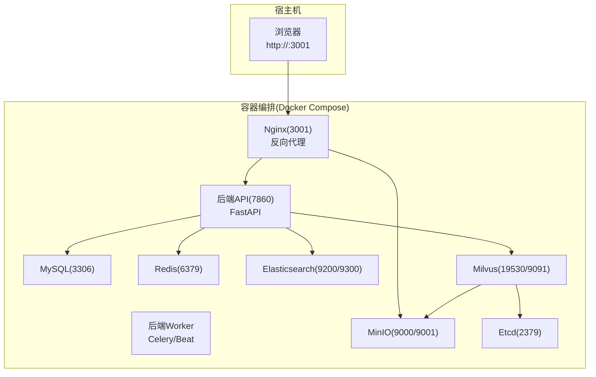
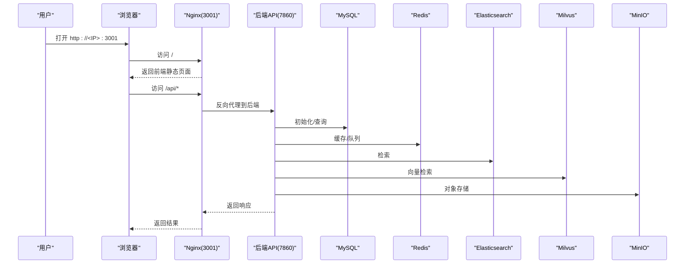
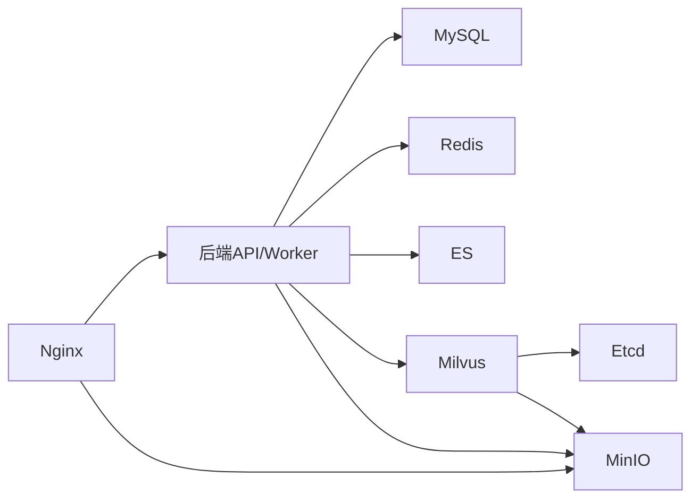

# 快速开始

<cite>
**本文引用的文件列表**
- [README_CN.md](file://README_CN.md)
- [README.md](file://README.md)
- [docker-compose.yml](file://docker/docker-compose.yml)
- [config.yaml](file://docker/bisheng/config/config.yaml)
- [entrypoint.sh](file://docker/bisheng/entrypoint.sh)
- [nginx.conf](file://docker/nginx/nginx.conf)
- [default.conf](file://docker/nginx/conf.d/default.conf)
- [my.cnf](file://docker/mysql/conf/my.cnf)
- [redis.conf](file://docker/redis/redis.conf)
- [main.py](file://src/backend/bisheng/main.py)
- [settings.py](file://src/backend/bisheng/core/config/settings.py)
- [init_data.py](file://src/backend/bisheng/common/init_data.py)
</cite>

## 目录
1. [简介](#简介)
2. [项目结构](#项目结构)
3. [核心组件](#核心组件)
4. [架构总览](#架构总览)
5. [详细组件分析](#详细组件分析)
6. [依赖关系分析](#依赖关系分析)
7. [性能注意事项](#性能注意事项)
8. [故障排查指南](#故障排查指南)
9. [结论](#结论)
10. [附录](#附录)

## 简介
本指南面向首次部署 Bisheng 企业级 LLM 应用开发平台的用户，帮助您在最短时间内完成安装、启动与基础验证。内容涵盖安装前准备、下载与部署步骤、首次启动与基本配置、默认管理员账户创建、常见问题排查以及浏览器访问与功能验证流程。

## 项目结构
Bisheng 采用容器化一键部署，核心由 Docker Compose 编排多个服务组成，包括数据库、缓存、搜索引擎、向量库、对象存储、前端与后端 API/Worker。后端使用 FastAPI 提供 API，并通过 Nginx 作为反向代理对外暴露服务。

图表来源
- [docker-compose.yml](file://docker/docker-compose.yml#L1-L201)
- [nginx.conf](file://docker/nginx/nginx.conf#L1-L32)
- [default.conf](file://docker/nginx/conf.d/default.conf#L1-L65)

章节来源
- [docker-compose.yml](file://docker/docker-compose.yml#L1-L201)
- [nginx.conf](file://docker/nginx/nginx.conf#L1-L32)
- [default.conf](file://docker/nginx/conf.d/default.conf#L1-L65)

## 核心组件
- 容器编排与服务
  - MySQL：关系型数据库，用于用户、权限、模板、组件等元数据存储。
  - Redis：缓存与消息队列，支持 Celery 异步任务。
  - Elasticsearch：全文检索与分析。
  - Milvus：向量数据库，支持嵌入检索。
  - MinIO：对象存储，用于文件上传与持久化。
  - Nginx：反向代理与静态资源服务。
  - 后端 API：提供 REST 接口与健康检查。
  - 后端 Worker：Celery 异步任务与 Beat 定时任务。
- 配置与入口
  - 后端配置：通过 YAML 加载数据库、缓存、向量库、对象存储等配置。
  - 启动脚本：统一入口脚本支持多种启动模式（API、Worker、Beat、Linsight 等）。
  - 健康检查：各服务均配置健康检查，便于编排层感知状态。

章节来源
- [docker-compose.yml](file://docker/docker-compose.yml#L1-L201)
- [config.yaml](file://docker/bisheng/config/config.yaml#L1-L88)
- [entrypoint.sh](file://docker/bisheng/entrypoint.sh#L1-L67)

## 架构总览
后端启动时初始化数据库与默认数据，随后对外提供 /health 健康接口。Nginx 将 /api 请求转发至后端，静态页面与 /workspace 路径由前端资源提供，MinIO 用于对象存储访问。

图表来源
- [main.py](file://src/backend/bisheng/main.py#L77-L79)
- [default.conf](file://docker/nginx/conf.d/default.conf#L46-L59)
- [docker-compose.yml](file://docker/docker-compose.yml#L41-L107)

章节来源
- [main.py](file://src/backend/bisheng/main.py#L77-L79)
- [default.conf](file://docker/nginx/conf.d/default.conf#L46-L59)
- [docker-compose.yml](file://docker/docker-compose.yml#L41-L107)

## 详细组件分析

### 安装前准备
- 硬件与软件要求
  - CPU ≥ 8 核心，内存 ≥ 32 GB（官方建议）
  - Docker 19.03.9+，Docker Compose 1.25.1+
- 默认安装的第三方组件
  - Elasticsearch、Milvus、MinIO（仅在默认编排中启用）

章节来源
- [README_CN.md](file://README_CN.md#L60-L66)
- [README.md](file://README.md#L60-L66)

### 下载与安装步骤
- 方式一：Git 克隆
  - 进入 docker 目录，使用 Docker Compose 启动
- 方式二：下载压缩包
  - 解压后进入 docker 目录，使用 Docker Compose 启动

章节来源
- [README_CN.md](file://README_CN.md#L67-L78)
- [README.md](file://README.md#L67-L77)

### 首次启动与基本配置
- 启动命令
  - 使用 Docker Compose 在后台启动所有服务
- 初次访问
  - 浏览器访问 http://<IP>:3001，出现登录页
- 默认管理员账户
  - 首个注册用户自动成为系统管理员
  - 如需预置管理员，可在后端配置中设置 admin 字段并通过初始化流程创建

章节来源
- [README_CN.md](file://README_CN.md#L82-L84)
- [README.md](file://README.md#L82-L84)
- [init_data.py](file://src/backend/bisheng/common/init_data.py#L69-L81)

### 配置文件与环境变量
- 后端配置
  - 数据库连接、Redis、Celery、向量库（Milvus/ES）、对象存储（MinIO）等
  - 配置项通过环境变量注入，支持加密字段解密
- Nginx 配置
  - 反代 /api 到后端，静态资源映射，WebSocket 升级支持
- MySQL/Redis 配置
  - 字符集与 SQL 模式、保护模式等

章节来源
- [config.yaml](file://docker/bisheng/config/config.yaml#L1-L88)
- [settings.py](file://src/backend/bisheng/core/config/settings.py#L262-L323)
- [nginx.conf](file://docker/nginx/nginx.conf#L1-L32)
- [default.conf](file://docker/nginx/conf.d/default.conf#L1-L65)
- [my.cnf](file://docker/mysql/conf/my.cnf#L1-L13)
- [redis.conf](file://docker/redis/redis.conf#L111-L111)

### 启动脚本与服务职责
- 后端入口脚本
  - 支持 api、worker、knowledge、workflow、beat、default、linsight 等模式
  - API 模式启动 Uvicorn 服务，Worker 模式启动多个队列的 Celery worker 与 Beat
- 健康检查
  - 后端 API、MySQL、Redis、Milvus、ES、MinIO 均配置健康检查，便于编排层感知

章节来源
- [entrypoint.sh](file://docker/bisheng/entrypoint.sh#L1-L67)
- [docker-compose.yml](file://docker/docker-compose.yml#L15-L21)
- [docker-compose.yml](file://docker/docker-compose.yml#L34-L39)
- [docker-compose.yml](file://docker/docker-compose.yml#L67-L72)
- [docker-compose.yml](file://docker/docker-compose.yml#L150-L154)
- [docker-compose.yml](file://docker/docker-compose.yml#L189-L194)
- [docker-compose.yml](file://docker/docker-compose.yml#L170-L174)

## 依赖关系分析
- 组件耦合
  - 后端依赖 MySQL、Redis、ES、Milvus、MinIO
  - Nginx 依赖后端 API 与 MinIO
  - Milvus 依赖 Etcd 与 MinIO
- 外部依赖
  - Docker/Docker Compose
  - 容器镜像版本见 docker-compose 中的服务镜像标签

图表来源
- [docker-compose.yml](file://docker/docker-compose.yml#L41-L107)
- [docker-compose.yml](file://docker/docker-compose.yml#L124-L201)

章节来源
- [docker-compose.yml](file://docker/docker-compose.yml#L41-L107)
- [docker-compose.yml](file://docker/docker-compose.yml#L124-L201)

## 性能注意事项
- 资源建议
  - 官方建议 CPU 18 核、内存 48 GB，以容纳默认安装的 ES、Milvus、OnlyOffice 等组件
- 存储与卷
  - 数据卷挂载到宿主机目录，便于持久化与备份
- 并发与队列
  - Worker 模式下按任务类型拆分队列，合理分配并发与线程数
- 网络与代理
  - Nginx 作为统一入口，建议开启 gzip 与合适的超时配置

章节来源
- [README_CN.md](file://README_CN.md#L60-L66)
- [default.conf](file://docker/nginx/conf.d/default.conf#L10-L17)
- [entrypoint.sh](file://docker/bisheng/entrypoint.sh#L8-L30)

## 故障排查指南
- 无法访问 http://<IP>:3001
  - 检查 Nginx 是否启动且监听 3001 端口
  - 检查防火墙与安全组放通 3001 端口
  - 查看 Nginx 反代配置是否正确指向后端 7860
- 后端 /health 不可用
  - 检查后端容器健康检查是否通过
  - 查看后端日志与数据库连接配置
- 数据库连接失败
  - 检查数据库密码与连接字符串是否匹配
  - 确认 MySQL 容器已就绪（健康检查通过）
- Redis 连接异常
  - 检查 Redis 配置与密码（如启用保护模式）
- Milvus/ES/MinIO 异常
  - 关注对应健康检查状态与日志
- 首次登录无管理员
  - 注册首个用户，系统自动赋予管理员权限
  - 或在后端配置中预设 admin 用户信息

章节来源
- [docker-compose.yml](file://docker/docker-compose.yml#L67-L72)
- [docker-compose.yml](file://docker/docker-compose.yml#L15-L21)
- [docker-compose.yml](file://docker/docker-compose.yml#L34-L39)
- [docker-compose.yml](file://docker/docker-compose.yml#L150-L154)
- [docker-compose.yml](file://docker/docker-compose.yml#L189-L194)
- [docker-compose.yml](file://docker/docker-compose.yml#L170-L174)
- [main.py](file://src/backend/bisheng/main.py#L77-L79)
- [init_data.py](file://src/backend/bisheng/common/init_data.py#L69-L81)

## 结论
通过本快速开始指南，您可以在满足硬件与软件要求的前提下，使用 Docker Compose 一键部署 Bisheng 平台，并在浏览器中完成首次登录与基本配置。如遇问题，请依据“故障排查指南”逐项核验服务状态与配置项。

## 附录

### 浏览器访问与基本功能验证
- 访问地址：http://<IP>:3001
- 登录后验证
  - 创建工作区与工作流
  - 上传文档并进行知识库解析
  - 使用内置模板与技能中心
  - 通过 /api/* 接口进行功能测试（如 /health）

章节来源
- [README_CN.md](file://README_CN.md#L82-L84)
- [README.md](file://README.md#L82-L84)
- [default.conf](file://docker/nginx/conf.d/default.conf#L46-L59)
- [main.py](file://src/backend/bisheng/main.py#L77-L79)