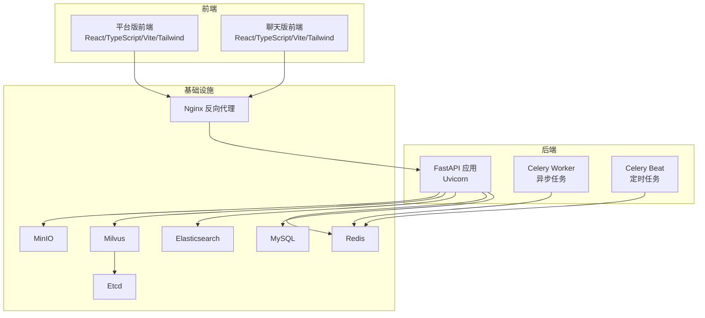
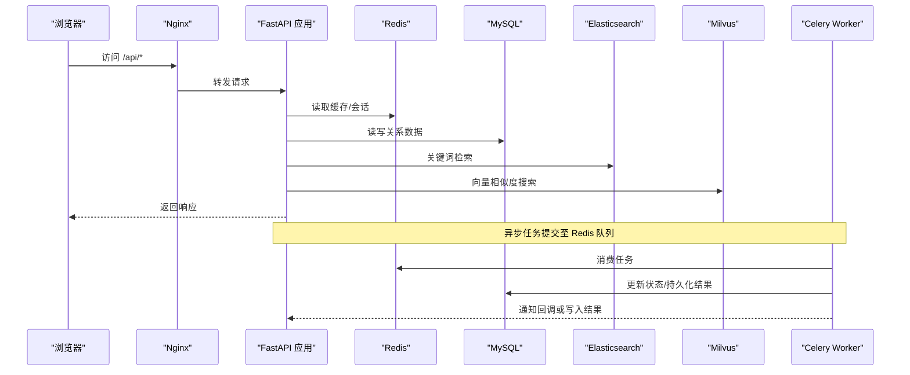
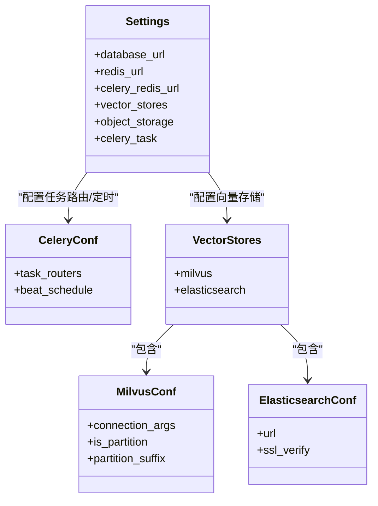
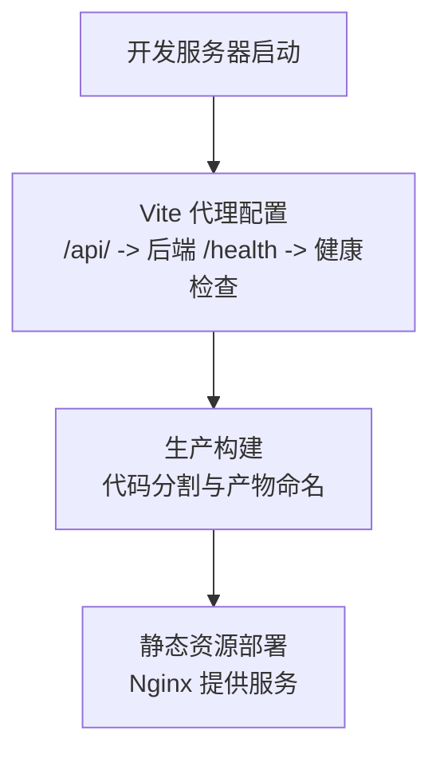
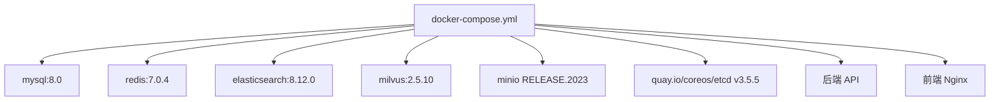
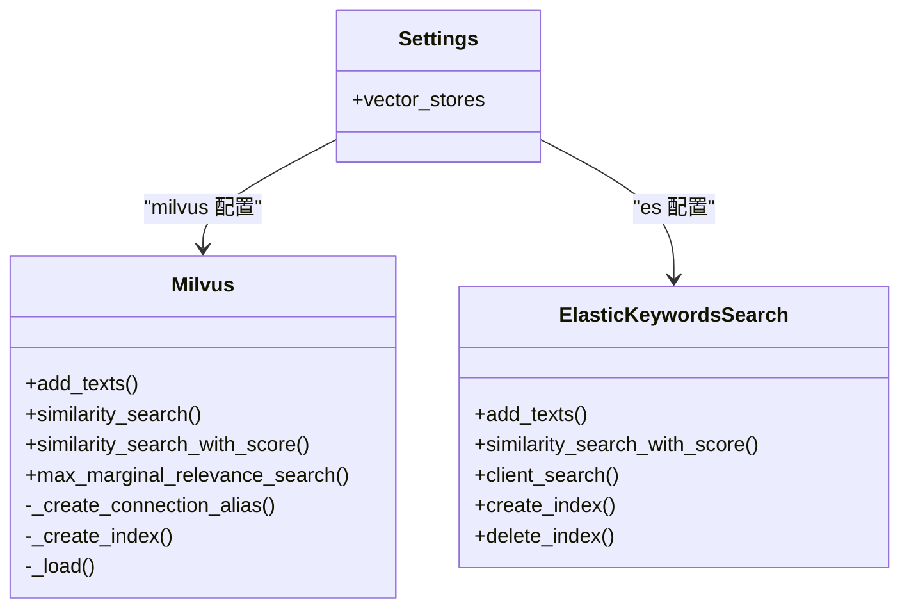
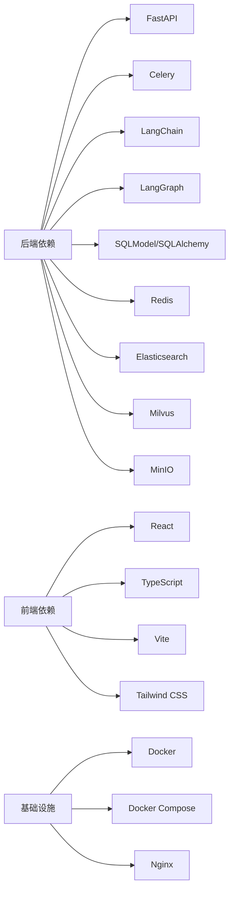

# 技术栈概览

<cite>
**本文档引用的文件**
- [README.md](file://README.md)
- [docker-compose.yml](file://docker/docker-compose.yml)
- [nginx.conf](file://docker/nginx/nginx.conf)
- [pyproject.toml](file://src/backend/pyproject.toml)
- [package.json（平台版）](file://src/frontend/platform/package.json)
- [package.json（聊天版）](file://src/frontend/client/package.json)
- [vite.config.mts（平台版）](file://src/frontend/platform/vite.config.mts)
- [config.yaml](file://docker/bisheng/config/config.yaml)
- [settings.py](file://src/backend/bisheng/core/config/settings.py)
- [main.py](file://src/backend/bisheng/main.py)
- [milvus.py](file://src/backend/bisheng_langchain/vectorstores/milvus.py)
- [elastic_keywords_search.py](file://src/backend/bisheng_langchain/vectorstores/elastic_keywords_search.py)
- [stateful_worker.py](file://src/backend/bisheng/worker/utils/stateful_worker.py)
- [worker/main.py](file://src/backend/bisheng/worker/main.py)
- [worker/config.py](file://src/backend/bisheng/worker/config.py)
- [run_celery_beat.py](file://src/backend/bisheng/run_celery_beat.py)
</cite>

## 目录
1. [引言](#引言)
2. [项目结构](#项目结构)
3. [核心组件](#核心组件)
4. [架构总览](#架构总览)
5. [详细组件分析](#详细组件分析)
6. [依赖关系分析](#依赖关系分析)
7. [性能考量](#性能考量)
8. [故障排查指南](#故障排查指南)
9. [结论](#结论)
10. [附录](#附录)

## 引言
本技术栈概览面向 Bisheng 企业级 LLM 应用开发平台，系统梳理后端（Python/FastAPI、LangChain、LangGraph、Celery）、前端（React/TypeScript、Vite、Tailwind CSS）、基础设施（Docker、Docker Compose、Nginx）与数据库生态（MySQL、Redis、Milvus、Elasticsearch）的选型依据与协同机制。重点阐述技术组合如何支撑高性能与可扩展性，并通过架构图与依赖关系帮助开发者快速理解整体技术生态。

## 项目结构
- 后端采用 Python 与 FastAPI 构建，结合 Celery 实现异步任务分发，集成 LangChain 生态与 LangGraph 流程编排能力，统一通过 Uvicorn 提供服务。
- 前端提供两套应用：平台版与聊天版，均基于 React/TypeScript，使用 Vite 构建与代理，Tailwind CSS 提供样式基础。
- 基础设施以 Docker 与 Docker Compose 编排 MySQL、Redis、Elasticsearch、Milvus、MinIO、Etcd、Nginx 等组件，形成可复用的企业级部署方案。
- 数据库与向量检索由 MySQL（持久化）、Redis（缓存/队列/心跳）、Milvus（向量检索）、Elasticsearch（关键词检索）共同构成。

图表来源
- [docker-compose.yml](file://docker/docker-compose.yml#L1-L201)
- [nginx.conf](file://docker/nginx/nginx.conf#L1-L32)
- [main.py](file://src/backend/bisheng/main.py#L64-L102)
- [worker/main.py](file://src/backend/bisheng/worker/main.py#L30-L68)
- [worker/config.py](file://src/backend/bisheng/worker/config.py#L1-L14)

章节来源
- [docker-compose.yml](file://docker/docker-compose.yml#L1-L201)
- [nginx.conf](file://docker/nginx/nginx.conf#L1-L32)

## 核心组件
- 后端框架与运行时
  - FastAPI + Uvicorn：提供高性能 ASGI 服务，内置 OpenAPI 文档与严格类型校验，便于企业级 API 管理与可观测性。
  - Celery + Redis：实现异步任务解耦与分布式调度，支持多队列路由与定时任务。
  - LangChain/LangGraph：提供链式调用、智能体与流程编排能力，适配复杂企业场景。
- 前端框架与构建
  - React 18 + TypeScript：强类型保障与现代 Hooks 生态，提升大型应用的可维护性。
  - Vite：极速开发与构建，支持按需代码分割与插件生态。
  - Tailwind CSS：原子化样式，降低样式冲突，提升团队协作效率。
- 基础设施
  - Docker/Docker Compose：标准化容器化部署，一键拉起完整栈。
  - Nginx：反向代理与静态资源服务，统一入口与跨域处理。
- 数据库与检索
  - MySQL：关系型数据持久化，配合 SQLModel/SQLAlchemy 进行 ORM 管理。
  - Redis：缓存、会话、任务中间件与工作节点心跳管理。
  - Milvus：高维向量检索，支持多种索引与一致性策略。
  - Elasticsearch：关键词检索与文本分析，支持中文分词与查询优化。

章节来源
- [pyproject.toml](file://src/backend/pyproject.toml#L1-L87)
- [package.json（平台版）](file://src/frontend/platform/package.json#L1-L126)
- [package.json（聊天版）](file://src/frontend/client/package.json#L1-L157)
- [vite.config.mts（平台版）](file://src/frontend/platform/vite.config.mts#L1-L147)
- [settings.py](file://src/backend/bisheng/core/config/settings.py#L210-L346)

## 架构总览
下图展示从浏览器到后端 API、再到数据库与向量存储的全链路交互，以及 Celery 的异步处理位置。

图表来源
- [docker-compose.yml](file://docker/docker-compose.yml#L41-L123)
- [main.py](file://src/backend/bisheng/main.py#L64-L102)
- [settings.py](file://src/backend/bisheng/core/config/settings.py#L253-L346)
- [worker/main.py](file://src/backend/bisheng/worker/main.py#L30-L68)

## 详细组件分析

### 后端技术栈（Python/FastAPI/LangChain/LangGraph/Celery）
- FastAPI 应用初始化与生命周期
  - 通过 lifespan 管理应用上下文初始化与服务清理，确保数据库连接、缓存与中间件在启动阶段正确建立。
  - 统一异常处理与健康检查端点，便于容器健康探测与运维监控。
- Celery 异步任务体系
  - 通过 worker/main.py 维护工作节点心跳，使用 Redis 存储队列状态，实现动态一致性哈希与节点感知。
  - 通过 worker/config.py 加载任务路由与定时计划，run_celery_beat.py 启动定时任务调度器。
- LangChain/LangGraph 集成
  - 通过 pyproject.toml 可见广泛依赖（如 langchain、langgraph、langchain-elasticsearch、langchain-milvus），表明平台具备完整的 LLM 生态集成能力。
  - 向量存储封装（Milvus、Elasticsearch）与检索接口抽象，便于在不同场景间切换与组合。

图表来源
- [settings.py](file://src/backend/bisheng/core/config/settings.py#L210-L346)

章节来源
- [main.py](file://src/backend/bisheng/main.py#L52-L102)
- [worker/main.py](file://src/backend/bisheng/worker/main.py#L13-L68)
- [worker/config.py](file://src/backend/bisheng/worker/config.py#L1-L14)
- [run_celery_beat.py](file://src/backend/bisheng/run_celery_beat.py#L1-L11)
- [settings.py](file://src/backend/bisheng/core/config/settings.py#L253-L346)

### 前端技术栈（React/TypeScript/Vite/Tailwind CSS）
- 平台版前端
  - 使用 Vite + React + TypeScript，通过 vite.config.mts 配置代理、HTML 注入与静态资源复制，满足多路由与本地开发体验。
  - 依赖 Radix UI、Tailwind CSS、Recharts、React Router 等，构建现代化企业界面。
- 聊天版前端
  - 类似的工程化配置，侧重交互与实时通信场景，使用 Axios、i18n、PDF.js 等增强用户体验。

图表来源
- [vite.config.mts（平台版）](file://src/frontend/platform/vite.config.mts#L138-L147)

章节来源
- [package.json（平台版）](file://src/frontend/platform/package.json#L1-L126)
- [package.json（聊天版）](file://src/frontend/client/package.json#L1-L157)
- [vite.config.mts（平台版）](file://src/frontend/platform/vite.config.mts#L1-L147)

### 基础设施（Docker/Docker Compose/Nginx）
- 容器编排
  - docker-compose.yml 定义 MySQL、Redis、Elasticsearch、Milvus、MinIO、Etcd、后端 API、前端 Nginx 等服务，统一端口映射与健康检查。
- Nginx
  - nginx.conf 提供基础反向代理与日志配置，frontend 服务挂载 conf.d 以支持 WebSocket 与静态资源。

图表来源
- [docker-compose.yml](file://docker/docker-compose.yml#L1-L201)
- [nginx.conf](file://docker/nginx/nginx.conf#L1-L32)

章节来源
- [docker-compose.yml](file://docker/docker-compose.yml#L1-L201)
- [nginx.conf](file://docker/nginx/nginx.conf#L1-L32)

### 数据库与检索技术（MySQL/Redis/Milvus/Elasticsearch）
- MySQL
  - 作为关系型主数据源，配合 SQLModel/SQLAlchemy 提供 ORM 能力，支持企业级权限与审计。
- Redis
  - 用于缓存、会话、Celery broker/结果后端、工作节点心跳等，提升系统吞吐与可用性。
- Milvus
  - 通过 bisheng_langchain 封装的 Milvus 类，提供向量索引、批量插入、相似度检索与 MMR 重排序能力，支持分区字段与元数据表达式过滤。
- Elasticsearch
  - 通过 ElasticKeywordsSearch 实现关键词检索，支持中文分词与 LLM 关键词抽取，兼容 ES 8.x 版本映射差异。

图表来源
- [milvus.py](file://src/backend/bisheng_langchain/vectorstores/milvus.py#L26-L800)
- [elastic_keywords_search.py](file://src/backend/bisheng_langchain/vectorstores/elastic_keywords_search.py#L48-L392)
- [settings.py](file://src/backend/bisheng/core/config/settings.py#L96-L121)

章节来源
- [config.yaml](file://docker/bisheng/config/config.yaml#L34-L57)
- [settings.py](file://src/backend/bisheng/core/config/settings.py#L65-L121)
- [milvus.py](file://src/backend/bisheng_langchain/vectorstores/milvus.py#L26-L800)
- [elastic_keywords_search.py](file://src/backend/bisheng_langchain/vectorstores/elastic_keywords_search.py#L48-L392)

## 依赖关系分析
- 后端依赖
  - FastAPI、Uvicorn、Celery、LangChain、LangGraph、Pydantic（配置模型）、SQLModel/SQLAlchemy（ORM）、Redis、Elasticsearch、Milvus、MinIO 等。
- 前端依赖
  - React、Radix UI、Tailwind CSS、Axios、React Router、i18n、PDF.js、Recharts 等。
- 基础设施
  - Docker Compose 编排 MySQL、Redis、Elasticsearch、Milvus、MinIO、Etcd、Nginx，统一通过环境变量与配置文件注入。

图表来源
- [pyproject.toml](file://src/backend/pyproject.toml#L8-L86)
- [package.json（平台版）](file://src/frontend/platform/package.json#L5-L74)
- [docker-compose.yml](file://docker/docker-compose.yml#L1-L201)

章节来源
- [pyproject.toml](file://src/backend/pyproject.toml#L1-L87)
- [package.json（平台版）](file://src/frontend/platform/package.json#L1-L126)
- [docker-compose.yml](file://docker/docker-compose.yml#L1-L201)

## 性能考量
- 异步与并发
  - Celery 多队列与任务路由，结合 Redis 高速缓存与心跳检测，实现高吞吐异步处理与弹性扩缩容。
- 检索性能
  - Milvus 支持多种索引与搜索参数，结合批量插入与分区字段，降低检索延迟。
  - Elasticsearch 关键词检索与中文分词，结合 LLM 关键词抽取，提升召回质量。
- 服务稳定性
  - FastAPI + Uvicorn 提供高性能与自动文档；Nginx 作为统一入口，简化 TLS/WS 配置。
- 数据一致性
  - Redis 作为中间层，避免热点数据竞争；MySQL 保证事务一致性；Milvus/ES 通过索引与刷新策略平衡一致性与性能。

## 故障排查指南
- 健康检查
  - 后端健康端点 /health 与容器健康检查脚本可用于快速定位服务状态。
- 日志与追踪
  - settings 中的 LoggerConf 支持多处理器与按级别过滤，便于问题定位与统计日志分离。
- 队列与任务
  - 通过 worker/config.py 的 task_routers 与 run_celery_beat.py 的定时任务配置，核对队列名称与计划任务是否生效。
- 向量存储
  - Milvus 连接别名与索引创建失败常见于网络或认证配置错误；Elasticsearch 映射版本差异导致搜索异常时，检查 client_search 的参数构造。

章节来源
- [main.py](file://src/backend/bisheng/main.py#L77-L80)
- [settings.py](file://src/backend/bisheng/core/config/settings.py#L23-L86)
- [worker/config.py](file://src/backend/bisheng/worker/config.py#L1-L14)
- [run_celery_beat.py](file://src/backend/bisheng/run_celery_beat.py#L1-L11)
- [milvus.py](file://src/backend/bisheng_langchain/vectorstores/milvus.py#L237-L286)
- [elastic_keywords_search.py](file://src/backend/bisheng_langchain/vectorstores/elastic_keywords_search.py#L324-L344)

## 结论
Bisheng 采用“后端 FastAPI + LangChain/LangGraph + Celery + 数据库/缓存/向量存储”的企业级技术组合，配合 Vite + React + Tailwind 的前端工程化方案与 Docker Compose 的基础设施编排，实现了高性能、可扩展且易于维护的 LLM 应用开发平台。通过清晰的模块边界与统一的配置中心，平台能够灵活适配复杂业务场景并支持持续演进。

## 附录
- 快速启动与访问
  - 通过 docker compose 启动后，访问 http://IP:3001 即可进入前端页面。
- 推荐硬件
  - 建议 CPU≥4 核、内存≥16GB，推荐 18 虚拟核与 48GB 内存以获得更佳性能体验。

章节来源
- [README.md](file://README.md#L58-L87)