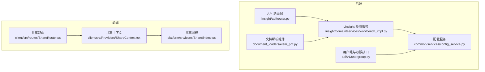
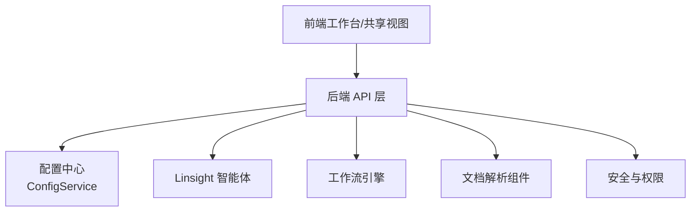
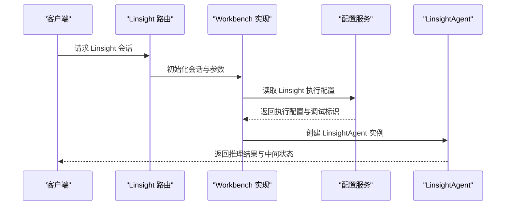
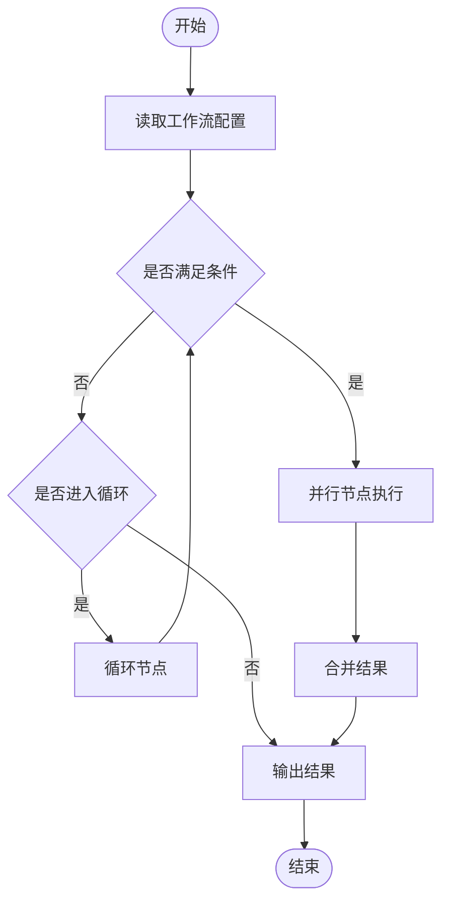
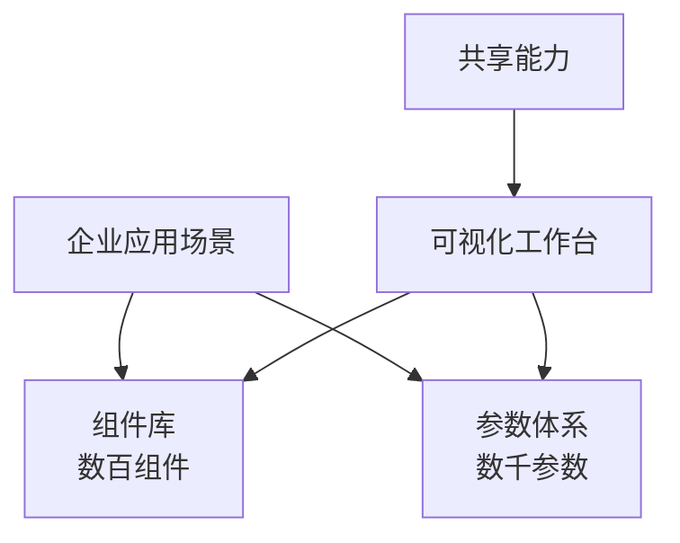
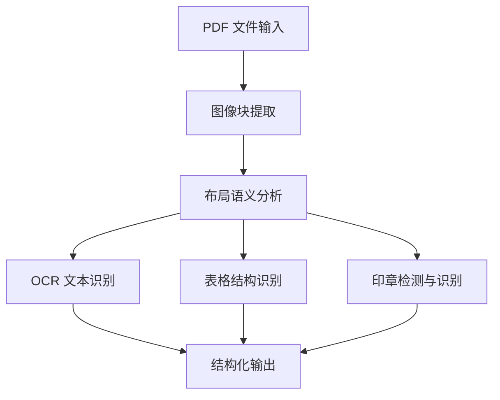
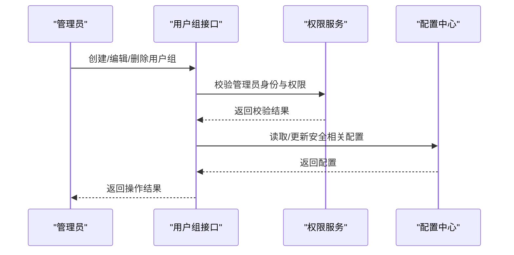
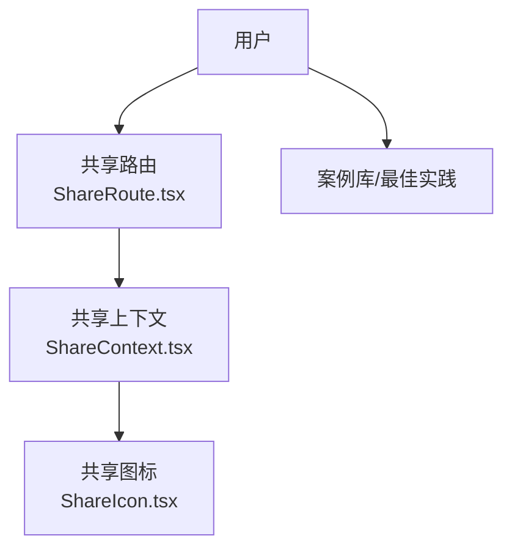
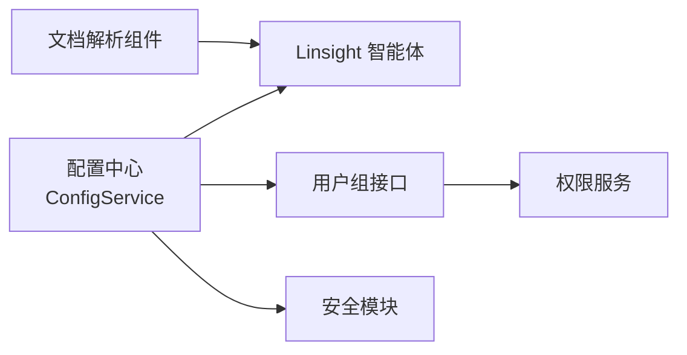

# 核心特性

<cite>
**本文引用的文件**
- [README_CN.md](file://README_CN.md)
- [README.md](file://README.md)
- [README_JPN.md](file://README_JPN.md)
- [router.py](file://src/backend/bisheng/linsight/api/router.py)
- [workbench_impl.py](file://src/backend/bisheng/linsight/domain/services/workbench_impl.py)
- [config_service.py](file://src/backend/bisheng/common/services/config_service.py)
- [usergroup.py](file://src/backend/bisheng/api/v1/usergroup.py)
- [elem_pdf.py](file://src/backend/bisheng_langchain/document_loaders/elem_pdf.py)
- [test_image.py](file://src/backend/bisheng_langchain/document_loaders/parsers/test_image.py)
- [ShareRoute.tsx](file://src/frontend/client/src/routes/ShareRoute.tsx)
- [ShareContext.tsx](file://src/frontend/client/src/Providers/ShareContext.tsx)
- [ShareIcon.tsx](file://src/frontend/platform/src/icons/Share/index.tsx)
</cite>

## 目录
1. [引言](#引言)
2. [项目结构](#项目结构)
3. [核心组件](#核心组件)
4. [架构总览](#架构总览)
5. [详细组件分析](#详细组件分析)
6. [依赖关系分析](#依赖关系分析)
7. [性能考量](#性能考量)
8. [故障排查指南](#故障排查指南)
9. [结论](#结论)
10. [附录](#附录)

## 引言
本文件围绕 Bisheng 企业级 LLM 应用开发平台的六大核心特性进行系统化说明：Lingsight 专家级智能体、独特的 BISHENG 工作流引擎、企业级应用设计、高精度文档解析、企业级安全保障、社区最佳实践分享。文档以仓库现有资料为基础，结合后端 API、配置服务、前端共享能力等实际实现，阐述技术原理、业务价值、典型场景与竞争优势，并提供可落地的使用路径与效果预期。

## 项目结构
- 后端采用 FastAPI + Python，核心模块包含 Linsight 智能体、工作流引擎、知识与文档解析、安全与权限、配置中心等。
- 前端提供可视化工作台、共享视图与图标组件，支撑企业协作与最佳实践传播。
- 平台通过统一配置中心加载系统级配置，支持分布式读取与缓存。

**图表来源**
- [router.py](file://src/backend/bisheng/linsight/api/router.py#L1-L8)
- [workbench_impl.py](file://src/backend/bisheng/linsight/domain/services/workbench_impl.py#L521-L540)
- [config_service.py](file://src/backend/bisheng/common/services/config_service.py#L1-L237)
- [usergroup.py](file://src/backend/bisheng/api/v1/usergroup.py#L37-L185)
- [elem_pdf.py](file://src/backend/bisheng_langchain/document_loaders/elem_pdf.py#L213-L245)
- [ShareRoute.tsx](file://src/frontend/client/src/routes/ShareRoute.tsx#L1-L5)
- [ShareContext.tsx](file://src/frontend/client/src/Providers/ShareContext.tsx#L1-L5)
- [ShareIcon.tsx](file://src/frontend/platform/src/icons/Share/index.tsx#L1-L8)

**章节来源**
- [README_CN.md](file://README_CN.md#L33-L55)
- [README.md](file://README.md#L36-L57)
- [README_JPN.md](file://README_JPN.md#L35-L57)

## 核心组件
- Lingsight 专家级智能体：通过 AGL 框架将领域专家偏好、经验与业务逻辑注入智能体，实现“专家级理解”，支持调试与执行配置。
- BISHENG 工作流引擎：统一编排框架，支持循环、并行、批处理、条件逻辑与多类型输入输出，提供“人在回路”的交互能力。
- 企业级应用设计：覆盖文档审核、固定版式报告生成、多智能体协作、政策对比、工单与客服辅助、会议纪要、简历筛选、通话记录分析、非结构化数据治理、知识挖掘与数据分析等复杂场景。
- 高精度文档解析：基于多年高质量数据训练的 OCR/版式/表格/印章模型，支持私有化部署。
- 企业级安全保障：提供安全审查、RBAC、用户组管理、分组流量控制、SSO/LDAP、漏洞扫描与修复、高可用部署、监控与统计等能力。
- 社区最佳实践分享：开放的应用案例与最佳实践库，便于企业复用与推广。

**章节来源**
- [README_CN.md](file://README_CN.md#L33-L55)
- [README.md](file://README.md#L36-L57)
- [README_JPN.md](file://README_JPN.md#L35-L57)

## 架构总览
平台以“配置驱动 + 组件化 + 可视化编排”为核心，后端通过统一配置中心加载系统参数，前端提供可视化工作台与共享能力，形成“前端体验—后端能力—配置中枢”的闭环。

**图表来源**
- [config_service.py](file://src/backend/bisheng/common/services/config_service.py#L98-L237)
- [router.py](file://src/backend/bisheng/linsight/api/router.py#L1-L8)
- [workbench_impl.py](file://src/backend/bisheng/linsight/domain/services/workbench_impl.py#L521-L540)
- [usergroup.py](file://src/backend/bisheng/api/v1/usergroup.py#L37-L185)
- [elem_pdf.py](file://src/backend/bisheng_langchain/document_loaders/elem_pdf.py#L213-L245)

## 详细组件分析

### Lingsight 专家级智能体
- 技术实现要点
  - 通过 LinsightAgent 创建智能体实例，结合执行配置与工具集，按会话版本执行任务。
  - 执行配置来自系统配置中心，支持调试标识与模式切换。
- 业务价值
  - 将专家经验固化到智能体，显著提升复杂任务的理解与执行质量。
- 典型场景
  - 政策解读、合同审阅、知识问答、跨模态检索增强问答等。
- 竞争优势
  - AGL 框架与可调试执行配置，使智能体具备“专家级理解”。

**图表来源**
- [router.py](file://src/backend/bisheng/linsight/api/router.py#L1-L8)
- [workbench_impl.py](file://src/backend/bisheng/linsight/domain/services/workbench_impl.py#L521-L540)
- [config_service.py](file://src/backend/bisheng/common/services/config_service.py#L211-L224)

**章节来源**
- [workbench_impl.py](file://src/backend/bisheng/linsight/domain/services/workbench_impl.py#L521-L540)
- [config_service.py](file://src/backend/bisheng/common/services/config_service.py#L211-L224)

### 独特的 BISHENG 工作流引擎
- 技术实现要点
  - 统一编排框架，支持循环、并行、批处理、条件逻辑与多类型输入输出。
  - 提供“人在回路”的交互能力，允许在执行过程中进行干预与反馈。
- 业务价值
  - 降低企业复杂业务自动化门槛，提升跨部门协作效率。
- 典型场景
  - 多智能体协作、内容审核、报告生成、工单流转、客服辅助等。
- 竞争优势
  - 可视化“流程图”式编排，无需专用组件即可实现循环/并行/批处理。

**图表来源**
- [README_CN.md](file://README_CN.md#L37-L43)
- [README.md](file://README.md#L40-L45)
- [README_JPN.md](file://README_JPN.md#L39-L46)

**章节来源**
- [README_CN.md](file://README_CN.md#L37-L43)
- [README.md](file://README.md#L40-L45)
- [README_JPN.md](file://README_JPN.md#L39-L46)

### 企业级应用设计
- 技术实现要点
  - 平台支持数百个组件与数千参数的深度调优，覆盖复杂企业场景。
  - 通过可视化工作台与共享能力，支撑文档审核、报告生成、多智能体协作等。
- 业务价值
  - 以低代码方式快速构建高复杂度企业应用，缩短交付周期。
- 典型场景
  - 固定版式报告生成、会议纪要、简历筛选、通话记录分析、知识挖掘与数据分析。
- 竞争优势
  - 深度优化的组件库与参数体系，适配多样化企业需求。

**图表来源**
- [README_CN.md](file://README_CN.md#L45-L46)
- [README.md](file://README.md#L47-L48)
- [README_JPN.md](file://README_JPN.md#L48-L49)

**章节来源**
- [README_CN.md](file://README_CN.md#L45-L46)
- [README.md](file://README.md#L47-L48)
- [README_JPN.md](file://README_JPN.md#L48-L49)

### 高精度文档解析
- 技术实现要点
  - 基于多年高质量数据训练的 OCR/版式/表格/印章模型，支持 PDF 图像提取与布局语义分配。
  - 提供可视化验证与测试样例，便于评估与迭代。
- 业务价值
  - 降低非结构化数据治理成本，提升知识抽取与检索质量。
- 典型场景
  - 合同审阅、财务报表解析、法规文本结构化解析、印章识别与校验。
- 竞争优势
  - 私有化部署、模型覆盖全面、解析精度高。

**图表来源**
- [elem_pdf.py](file://src/backend/bisheng_langchain/document_loaders/elem_pdf.py#L213-L245)
- [test_image.py](file://src/backend/bisheng_langchain/document_loaders/parsers/test_image.py#L95-L259)

**章节来源**
- [README_CN.md](file://README_CN.md#L51-L52)
- [README.md](file://README.md#L54-L55)
- [README_JPN.md](file://README_JPN.md#L54-L55)
- [elem_pdf.py](file://src/backend/bisheng_langchain/document_loaders/elem_pdf.py#L213-L245)
- [test_image.py](file://src/backend/bisheng_langchain/document_loaders/parsers/test_image.py#L95-L259)

### 企业级安全保障
- 技术实现要点
  - 提供安全审查、RBAC、用户组管理、分组流量控制、SSO/LDAP、漏洞扫描与修复、高可用部署、监控与统计等能力。
  - 用户组接口支持管理员创建、编辑、删除用户组与资源管理。
- 业务价值
  - 保障企业数据与应用安全，满足合规要求。
- 典型场景
  - 多租户隔离、权限分级、审计日志、合规检查。
- 竞争优势
  - 一体化安全能力与细粒度权限控制。

**图表来源**
- [usergroup.py](file://src/backend/bisheng/api/v1/usergroup.py#L37-L185)
- [config_service.py](file://src/backend/bisheng/common/services/config_service.py#L1-L237)

**章节来源**
- [README_CN.md](file://README_CN.md#L48-L49)
- [README.md](file://README.md#L51-L52)
- [README_JPN.md](file://README_JPN.md#L51-L52)
- [usergroup.py](file://src/backend/bisheng/api/v1/usergroup.py#L37-L185)
- [config_service.py](file://src/backend/bisheng/common/services/config_service.py#L1-L237)

### 社区最佳实践分享
- 技术实现要点
  - 前端提供共享路由、共享上下文与共享图标，便于用户分享工作成果与最佳实践。
- 业务价值
  - 促进企业内外部知识复用与经验沉淀。
- 典型场景
  - 工作流模板分享、案例库浏览、最佳实践传播。
- 竞争优势
  - 以共享能力降低知识迁移成本，加速规模化落地。

**图表来源**
- [ShareRoute.tsx](file://src/frontend/client/src/routes/ShareRoute.tsx#L1-L5)
- [ShareContext.tsx](file://src/frontend/client/src/Providers/ShareContext.tsx#L1-L5)
- [ShareIcon.tsx](file://src/frontend/platform/src/icons/Share/index.tsx#L1-L8)

**章节来源**
- [README_CN.md](file://README_CN.md#L54-L55)
- [README.md](file://README.md#L57-L58)
- [README_JPN.md](file://README_JPN.md#L56-L57)
- [ShareRoute.tsx](file://src/frontend/client/src/routes/ShareRoute.tsx#L1-L5)
- [ShareContext.tsx](file://src/frontend/client/src/Providers/ShareContext.tsx#L1-L5)
- [ShareIcon.tsx](file://src/frontend/platform/src/icons/Share/index.tsx#L1-L8)

## 依赖关系分析
- 配置中心为 Linsight、工作流与安全模块提供统一配置入口，支持分布式读取与缓存。
- Linsight 智能体依赖配置中心提供的执行配置与调试标识。
- 用户组接口依赖权限服务与配置中心，确保管理员操作的合法性与安全性。
- 文档解析组件为 Linsight 与知识库提供高质量结构化输入。

**图表来源**
- [config_service.py](file://src/backend/bisheng/common/services/config_service.py#L98-L237)
- [workbench_impl.py](file://src/backend/bisheng/linsight/domain/services/workbench_impl.py#L521-L540)
- [usergroup.py](file://src/backend/bisheng/api/v1/usergroup.py#L37-L185)
- [elem_pdf.py](file://src/backend/bisheng_langchain/document_loaders/elem_pdf.py#L213-L245)

**章节来源**
- [config_service.py](file://src/backend/bisheng/common/services/config_service.py#L98-L237)
- [workbench_impl.py](file://src/backend/bisheng/linsight/domain/services/workbench_impl.py#L521-L540)
- [usergroup.py](file://src/backend/bisheng/api/v1/usergroup.py#L37-L185)
- [elem_pdf.py](file://src/backend/bisheng_langchain/document_loaders/elem_pdf.py#L213-L245)

## 性能考量
- 配置缓存：配置中心通过 Redis 缓存关键配置，减少数据库访问压力，提升启动与运行时性能。
- 组件化与参数化：通过数百组件与数千参数的深度调优，可在不同场景下平衡吞吐与精度。
- 文档解析：图像块提取与布局分析采用多阶段处理，建议在高并发场景下启用缓存与异步处理。
- 安全与权限：RBAC 与用户组管理应结合流量控制与审计策略，避免热点资源被过度访问。

[本节为通用指导，不直接分析具体文件]

## 故障排查指南
- 配置读取异常
  - 现象：无法读取系统配置或初始化失败。
  - 排查：确认配置文件路径与键名正确，检查 Redis 缓存状态，查看配置合并逻辑。
- Linsight 执行异常
  - 现象：智能体执行报错或结果异常。
  - 排查：检查执行配置中的调试标识与模式设置，确认工具集与会话版本正确。
- 用户组操作失败
  - 现象：创建/编辑/删除用户组失败或权限不足。
  - 排查：确认管理员身份与权限，检查接口返回的授权错误。
- 文档解析失败
  - 现象：PDF 解析异常或结构化输出为空。
  - 排查：检查图像块提取与布局分析流程，确认测试样例与可视化输出。

**章节来源**
- [config_service.py](file://src/backend/bisheng/common/services/config_service.py#L140-L174)
- [workbench_impl.py](file://src/backend/bisheng/linsight/domain/services/workbench_impl.py#L521-L540)
- [usergroup.py](file://src/backend/bisheng/api/v1/usergroup.py#L152-L172)
- [elem_pdf.py](file://src/backend/bisheng_langchain/document_loaders/elem_pdf.py#L213-L245)

## 结论
Bisheng 以“配置驱动 + 组件化 + 可视化编排”为核心，围绕 Lingsight 专家级智能体、独特工作流引擎、企业级应用设计、高精度文档解析、企业级安全保障与社区最佳实践分享六大特性，为企业提供从认知到执行、从安全到协作的一体化 LLM 应用开发与运营能力。依托可复用的组件库与最佳实践，企业可快速构建高复杂度场景，实现降本增效与规模化落地。

[本节为总结性内容，不直接分析具体文件]

## 附录
- 使用建议
  - 优先从 Lingsight 智能体与工作流引擎入手，结合企业场景选择合适的组件与参数。
  - 利用文档解析能力对非结构化数据进行预处理，提升知识库质量。
  - 通过用户组与权限接口建立安全基线，配合监控与统计持续优化。
  - 借助共享能力沉淀最佳实践，形成可复用的工作流模板与案例库。

[本节为通用建议，不直接分析具体文件]