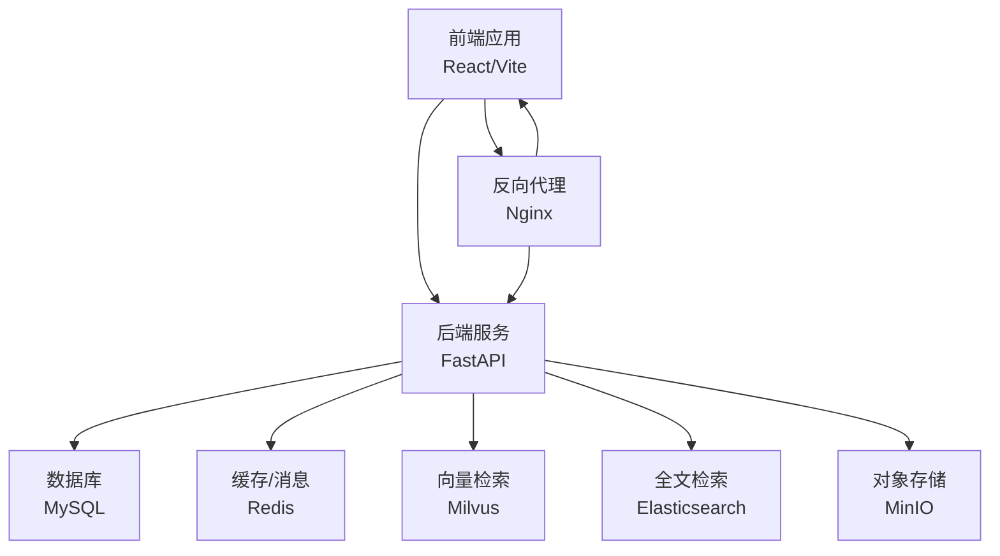
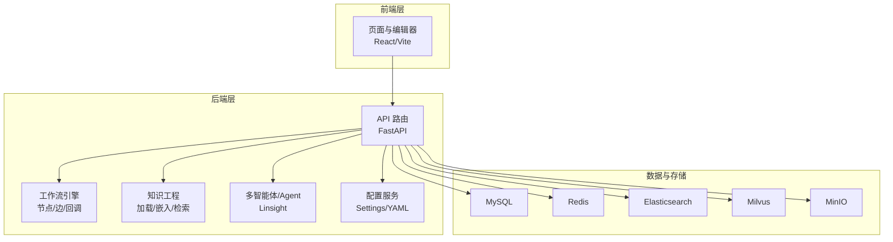
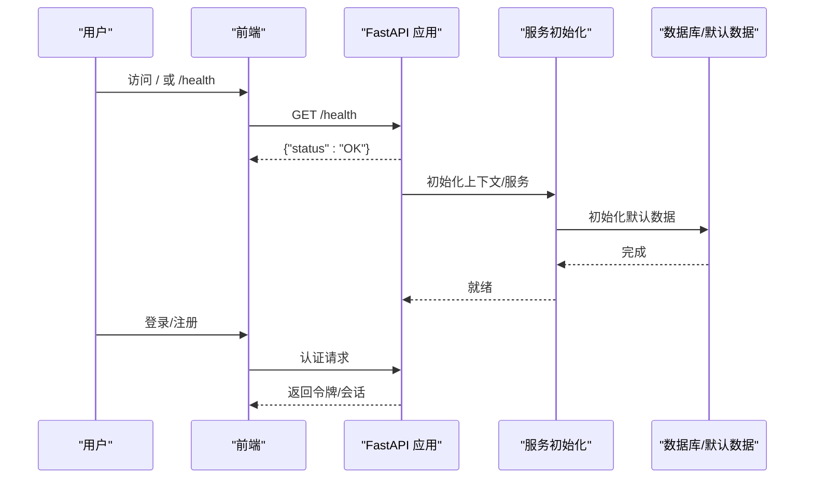
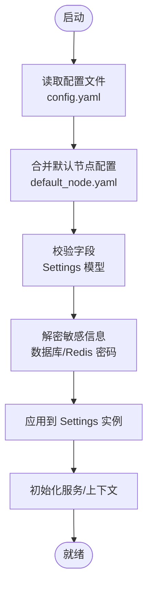
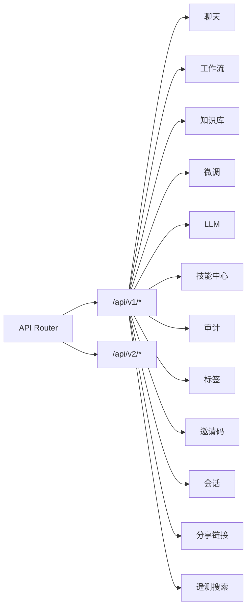
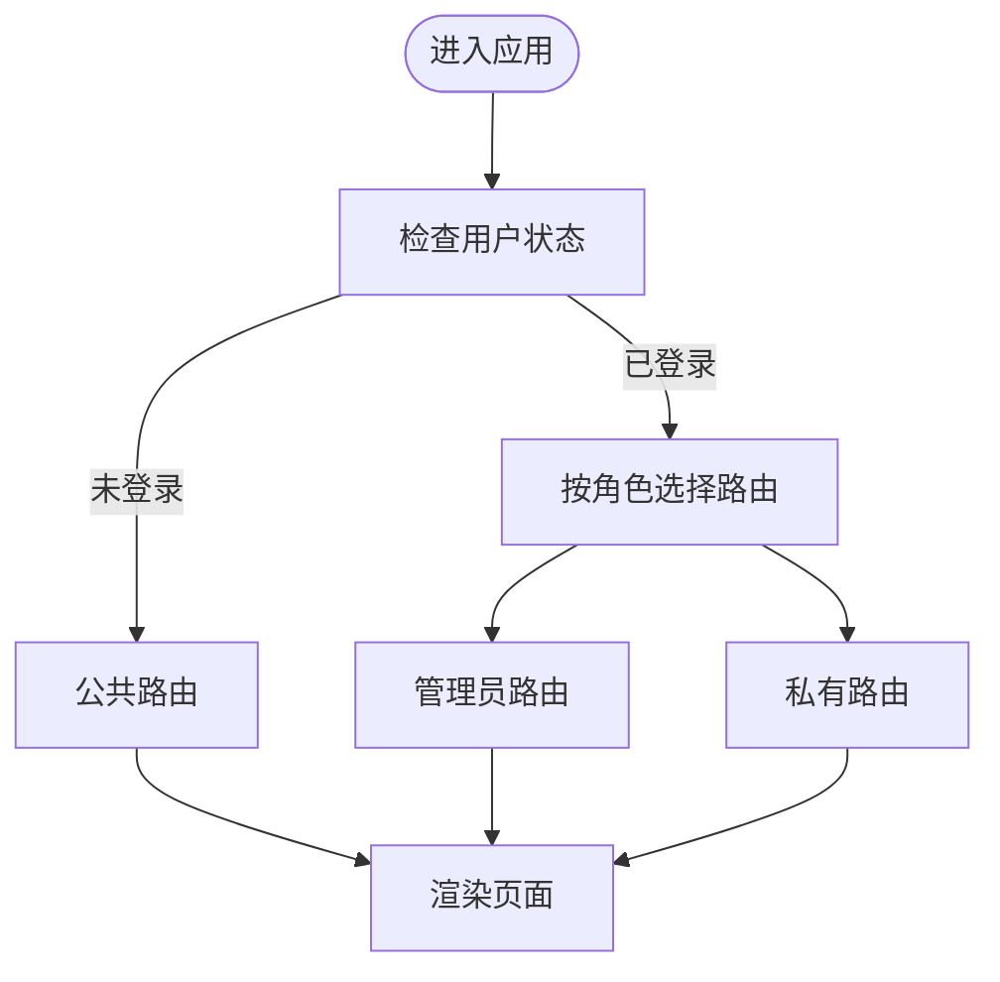
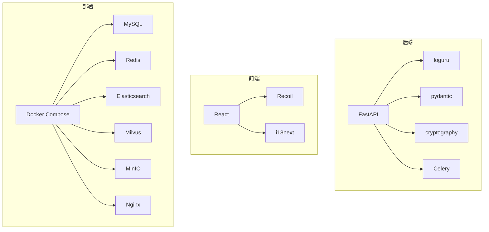

# 项目介绍

<cite>
**本文引用的文件**
- [README.md](file://README.md)
- [README_CN.md](file://README_CN.md)
- [src/backend/bisheng/main.py](file://src/backend/bisheng/main.py)
- [src/backend/bisheng/core/config/settings.py](file://src/backend/bisheng/core/config/settings.py)
- [src/backend/bisheng/api/router.py](file://src/backend/bisheng/api/router.py)
- [src/backend/bisheng/__init__.py](file://src/backend/bisheng/__init__.py)
- [docker/docker-compose.yml](file://docker/docker-compose.yml)
- [src/frontend/platform/src/App.tsx](file://src/frontend/platform/src/App.tsx)
- [CODE_OF_CONDUCT.md](file://CODE_OF_CONDUCT.md)
- [SECURITY.md](file://SECURITY.md)
- [.github/workflows/release.yml](file://.github/workflows/release.yml)
- [src/backend/bisheng/common/services/config_service.py](file://src/backend/bisheng/common/services/config_service.py)
</cite>

## 目录
1. [引言](#引言)
2. [项目结构](#项目结构)
3. [核心组件](#核心组件)
4. [架构总览](#架构总览)
5. [详细组件分析](#详细组件分析)
6. [依赖关系分析](#依赖关系分析)
7. [性能考虑](#性能考虑)
8. [故障排查指南](#故障排查指南)
9. [结论](#结论)
10. [附录](#附录)

## 引言
Bisheng（毕昇）是一个面向企业级场景的开源大语言模型（LLM）应用开发与运维平台。项目以“毕昇”命名，致敬活字印刷术发明家，寓意通过标准化、可复用的基础设施，推动智能应用在企业中的广泛落地与规模化普及。

- 核心定位：企业级 LLM 应用开发与运营平台，覆盖从工作流编排、多智能体协作、知识工程到文档解析与企业级安全合规的全链路能力。
- 设计理念：以“所见即所得”的可视化工作流为核心，强调“人在回路”的交互体验，支持循环、并行、批处理、条件分支等复杂逻辑，同时提供企业级的安全、权限、审计与可观测性能力。
- 历史典故：毕昇发明活字印刷术，极大促进了知识传播与文明演进；Bisheng 希望以同样的方式，为智能应用的规模化落地提供强大的“基础设施”。

**章节来源**
- file://README.md#L31-L33
- file://README_CN.md#L28-L30

## 项目结构
Bisheng 采用前后端分离的双栈架构：
- 后端（Python/FastAPI）：提供 API、工作流执行、知识工程、多智能体、RAG、向量检索、对象存储、日志与配置管理等能力。
- 前端（React/Vite）：提供可视化工作流编辑器、仪表盘、聊天界面、权限与菜单体系等。
- 部署（Docker Compose）：内置 MySQL、Redis、Elasticsearch、Milvus、MinIO 等依赖服务，便于一键部署与扩展。

**图表来源**
- [docker/docker-compose.yml](file://docker/docker-compose.yml#L1-L201)
- [src/backend/bisheng/main.py](file://src/backend/bisheng/main.py#L67-L102)

**章节来源**
- file://docker/docker-compose.yml#L1-L201
- file://src/backend/bisheng/main.py#L67-L102

## 核心组件
- 应用入口与生命周期管理：后端通过 FastAPI 创建应用，注册中间件与异常处理器，并在 lifespan 中初始化上下文、服务与默认数据。
- 配置中心：Settings 统一封装日志、密码策略、向量存储、对象存储、Celery 任务调度、Cookie/JWT、Telemetry 等配置项。
- 路由聚合：API Router 将各模块路由统一挂载到 /api/v1 与 /api/v2，涵盖聊天、工作流、知识库、微调、LLM、技能中心、审计、标签、邀请码、会话、分享链接、遥测搜索等。
- 版本与发布：项目版本在后端包元数据中声明，并通过 CI/CD 流水线构建与发布多架构镜像，实现跨平台兼容。

**章节来源**
- file://src/backend/bisheng/main.py#L52-L102
- file://src/backend/bisheng/core/config/settings.py#L210-L346
- file://src/backend/bisheng/api/router.py#L1-L61
- file://src/backend/bisheng/__init__.py#L8-L16
- file://.github/workflows/release.yml#L38-L101

## 架构总览
Bisheng 的整体架构围绕“可视化工作流 + 多智能体 + 知识工程 + 企业级能力”展开。后端以 FastAPI 作为服务边界，结合 Celery Worker 执行异步任务；前端通过 React 提供图形化编辑与交互；底层依赖 MySQL、Redis、Elasticsearch、Milvus、MinIO 等基础设施。

**图表来源**
- [src/backend/bisheng/api/router.py](file://src/backend/bisheng/api/router.py#L1-L61)
- [src/backend/bisheng/core/config/settings.py](file://src/backend/bisheng/core/config/settings.py#L210-L346)
- [docker/docker-compose.yml](file://docker/docker-compose.yml#L1-L201)

## 详细组件分析

### 后端应用入口与生命周期
- 应用创建：注册 CORS、自定义中间件与 WebSocket 日志中间件，统一异常处理，健康检查端点 /health。
- 生命周期：在 lifespan 中初始化应用上下文、服务、默认数据，退出时释放资源与线程池。

**图表来源**
- [src/backend/bisheng/main.py](file://src/backend/bisheng/main.py#L52-L102)

**章节来源**
- file://src/backend/bisheng/main.py#L52-L102

### 配置中心与环境变量注入
- Settings：集中管理日志、密码策略、向量存储、对象存储、工作流与 Celery 调度、Cookie/JWT、Telemetry 等。
- YAML 加载：ConfigService 支持从 YAML 文件加载配置，并通过自定义构造器解析环境变量占位符，保证部署灵活性。

**图表来源**
- [src/backend/bisheng/common/services/config_service.py](file://src/backend/bisheng/common/services/config_service.py#L74-L108)
- [src/backend/bisheng/core/config/settings.py](file://src/backend/bisheng/core/config/settings.py#L262-L323)

**章节来源**
- file://src/backend/bisheng/common/services/config_service.py#L74-L108
- file://src/backend/bisheng/core/config/settings.py#L210-L346

### API 路由与模块化组织
- v1 路由：包含聊天、工作流、知识库、微调、LLM、技能中心、审计、标签、邀请码、会话、分享链接、遥测搜索等。
- v2 RPC 路由：提供更轻量的远程调用接口，便于外部系统集成。

**图表来源**
- [src/backend/bisheng/api/router.py](file://src/backend/bisheng/api/router.py#L1-L61)

**章节来源**
- file://src/backend/bisheng/api/router.py#L1-L61

### 前端应用与路由体系
- 动态路由：根据用户角色与权限动态选择管理员/普通用户路由。
- 国际化：支持语言切换与本地化提示。
- 加载与错误处理：统一的加载状态与错误提示组件，提升用户体验。

**图表来源**
- [src/frontend/platform/src/App.tsx](file://src/frontend/platform/src/App.tsx#L174-L178)

**章节来源**
- file://src/frontend/platform/src/App.tsx#L174-L178

### 企业级能力与合规
- 安全与合规：提供安全政策与漏洞上报渠道，明确受支持版本范围。
- 社区行为准则：制定包容、健康的社区行为标准，保障协作环境。

**章节来源**
- file://SECURITY.md#L1-L40
- file://CODE_OF_CONDUCT.md#L1-L126

## 依赖关系分析
- 后端依赖：FastAPI、Celery、loguru、pydantic、cryptography 等，用于服务框架、异步任务、日志与配置校验。
- 前端依赖：React、Recoil、i18next、路由与 UI 组件库等，用于页面渲染、状态管理与国际化。
- 部署依赖：Docker Compose 编排 MySQL、Redis、Elasticsearch、Milvus、MinIO、Nginx 等服务。

**图表来源**
- [src/backend/bisheng/main.py](file://src/backend/bisheng/main.py#L1-L113)
- [docker/docker-compose.yml](file://docker/docker-compose.yml#L1-L201)

**章节来源**
- file://src/backend/bisheng/main.py#L1-L113
- file://docker/docker-compose.yml#L1-L201

## 性能考虑
- 部署建议：推荐硬件配置为 18 虚拟核、48GB 内存，以支撑后端、前端、ES、Milvus、OnlyOffice 等组件的稳定运行。
- 异步任务：通过 Celery 与队列隔离知识库与工作流相关任务，降低阻塞风险。
- 缓存与存储：Redis 用于会话与缓存，MinIO 提供对象存储，Milvus/ES 提供高效检索能力。
- 日志与可观测：统一的日志配置与健康检查端点，便于问题定位与容量评估。

**章节来源**
- file://README.md#L60-L66
- file://src/backend/bisheng/core/config/settings.py#L129-L167
- file://docker/docker-compose.yml#L1-L201

## 故障排查指南
- 健康检查：访问 /health 确认后端服务可用；查看 Docker Compose 服务健康状态。
- 日志定位：检查后端日志配置与异常处理器返回的错误详情；关注 422 参数校验错误与通用 HTTP 异常。
- 配置校验：确认 config.yaml 字段与 Settings 模型一致，避免启动失败。
- 安全与合规：遇到安全问题请通过安全通道上报，遵循披露窗口与支持版本策略。

**章节来源**
- file://src/backend/bisheng/main.py#L21-L50
- file://src/backend/bisheng/common/services/config_service.py#L91-L96
- file://SECURITY.md#L13-L25

## 结论
Bisheng 以“毕昇”为名，承载着推动智能应用规模化落地的愿景。通过可视化工作流、多智能体与知识工程、企业级安全与可观测能力，以及完善的部署与发布流水线，Bisheng 为企业用户提供了一条从原型到生产的完整路径。依托开源生态与社区协作，Bisheng 正在加速成为企业级 LLM 应用开发与运营的首选平台。

[无章节来源——本节为总结性内容]

## 附录
- 快速开始：克隆仓库，进入 docker 目录，使用 Docker Compose 启动，默认端口 3001（前端）、7860（后端）。
- 版本与发布：CI/CD 流水线支持多架构镜像构建与同步，确保跨平台一致性。
- 社区与支持：提供文档、Wiki、交流群二维码与贡献者展示，欢迎参与共建。

**章节来源**
- file://README.md#L67-L87
- file://.github/workflows/release.yml#L38-L101
- file://README_CN.md#L88-L125