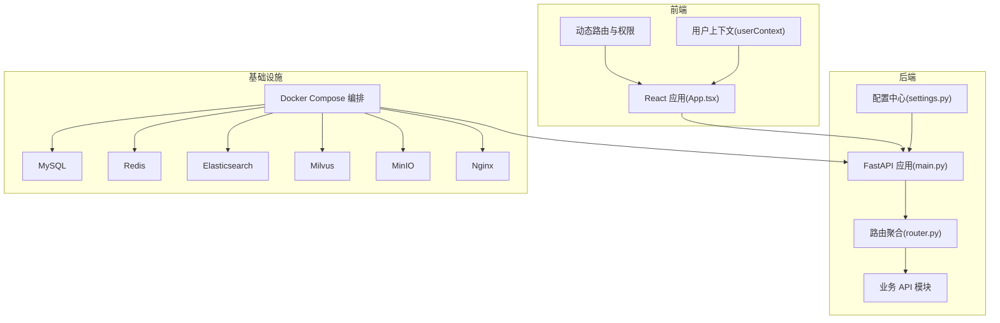
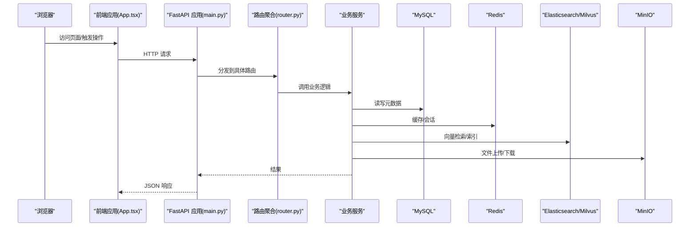
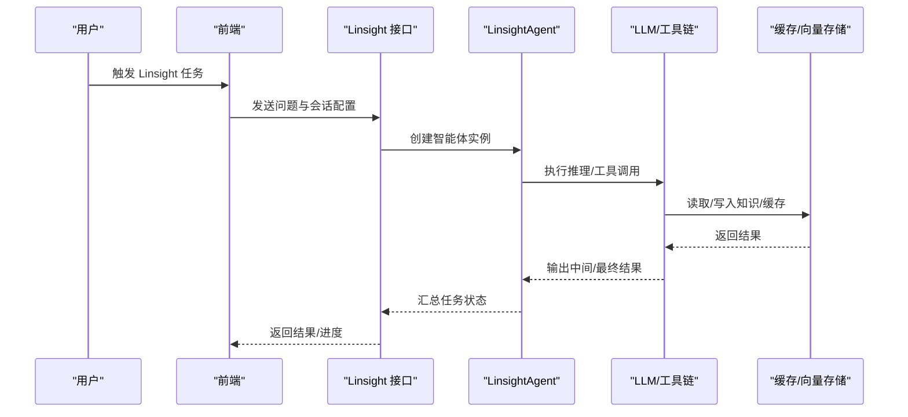
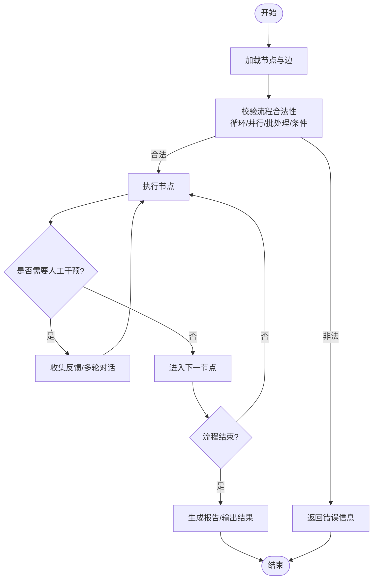
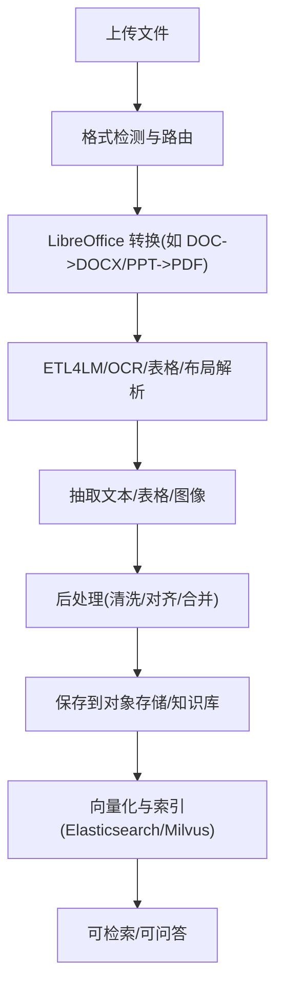
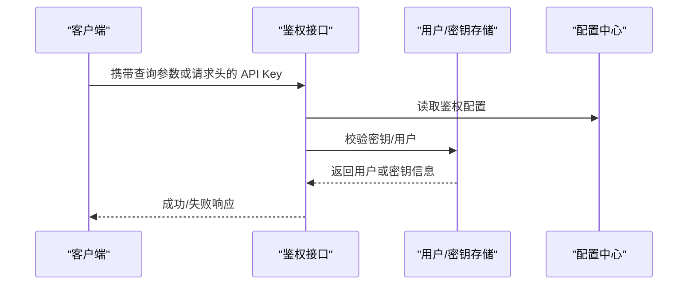
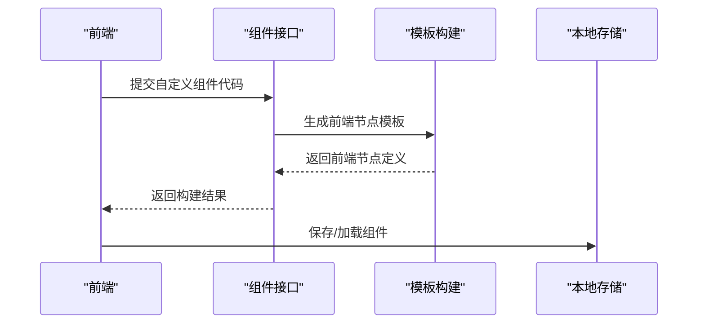
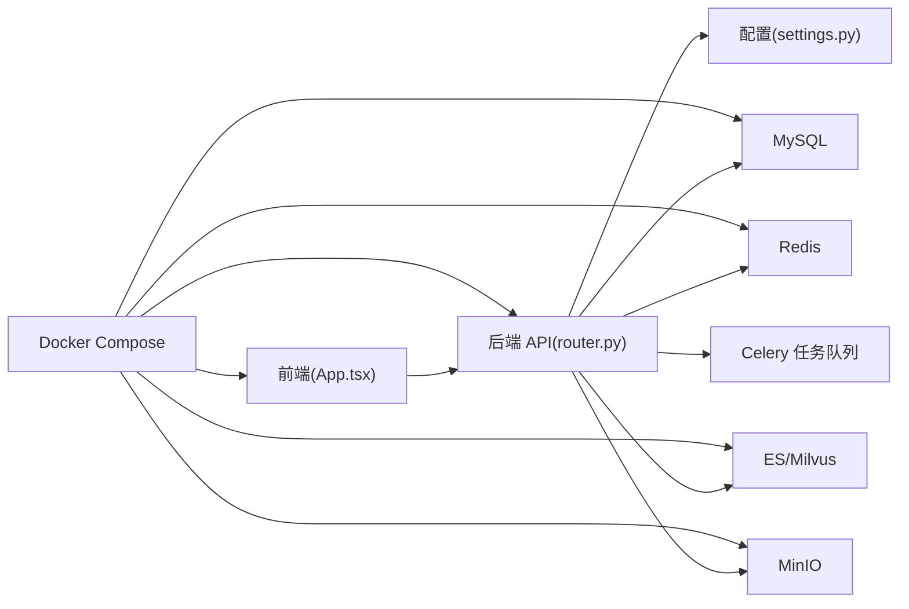

# 项目概述

<cite>
**本文引用的文件**   
- [README.md](file://README.md)
- [src/backend/bisheng/main.py](file://src/backend/bisheng/main.py)
- [src/backend/bisheng/api/router.py](file://src/backend/bisheng/api/router.py)
- [src/backend/bisheng/core/config/settings.py](file://src/backend/bisheng/core/config/settings.py)
- [docker/docker-compose.yml](file://docker/docker-compose.yml)
- [docker/bisheng/config/config.yaml](file://docker/bisheng/config/config.yaml)
- [src/frontend/platform/src/App.tsx](file://src/frontend/platform/src/App.tsx)
- [src/frontend/platform/src/contexts/userContext.tsx](file://src/frontend/platform/src/contexts/userContext.tsx)
- [src/backend/bisheng/api/services/patch_130.py](file://src/backend/bisheng/api/services/patch_130.py)
- [src/backend/bisheng/api/services/libreoffice_converter.py](file://src/backend/bisheng/api/services/libreoffice_converter.py)
- [src/backend/bisheng/workflow/nodes/report/text_classification.py](file://src/backend/bisheng/workflow/nodes/report/text_classification.py)
- [src/backend/bisheng/linsight/domain/services/workbench_impl.py](file://src/backend/bisheng/linsight/domain/services/workbench_impl.py)
- [src/backend/bisheng/api/v1/component.py](file://src/backend/bisheng/api/v1/component.py)
- [src/backend/bisheng/api/v1/usergroup.py](file://src/backend/bisheng/api/v1/usergroup.py)
- [src/backend/bisheng/services/auth/utils.py](file://src/backend/bisheng/services/auth/utils.py)
</cite>

## 目录
1. [引言](#引言)
2. [项目结构](#项目结构)
3. [核心组件](#核心组件)
4. [架构总览](#架构总览)
5. [详细组件分析](#详细组件分析)
6. [依赖关系分析](#依赖关系分析)
7. [性能考量](#性能考量)
8. [故障排查指南](#故障排查指南)
9. [结论](#结论)
10. [附录](#附录)

## 引言
Bisheng 是面向企业场景的开源 LLM 应用开发与运营平台，以“毕昇”命名致敬知识传播与技术革新。项目强调“专家级智能体 + 可视化工作流 + 企业级能力”的三位一体设计，覆盖文档解析、RAG、多智能体协作、报表生成、内容审核、知识治理等复杂企业应用。平台通过容器化一键部署，内置 MySQL、Redis、Elasticsearch、Milvus、MinIO、Nginx 等核心依赖，提供开箱即用的企业级能力。

本概述聚焦以下目标：
- 明确项目定位与核心特性：Lingsight 专家级智能体、BISHENG 工作流引擎、企业级文档解析能力、RBAC 与 SSO/LDAP 等企业特性。
- 解释设计理念与架构特色：前后端分离、模块化 API、可观测与可扩展的后台、可视化工作流编排、向量检索与对象存储集成。
- 说明技术栈概览：Python/FastAPI 后端、React 前端、Docker 容器化部署。
- 提供初学者背景知识与有经验开发者的技术深度分析，并给出实际使用场景示例。

## 项目结构
项目采用前后端分离与容器化部署的组织方式：
- 后端（Python/FastAPI）：统一入口应用负责生命周期管理、异常处理、中间件与路由聚合。
- 前端（React）：动态路由、国际化、用户上下文与权限控制，提供可视化工作流与知识管理界面。
- 容器编排（Docker Compose）：一键拉起 MySQL、Redis、Elasticsearch、Milvus、MinIO、Nginx、后端 API/Worker、前端服务。

图表来源
- [src/backend/bisheng/main.py](file://src/backend/bisheng/main.py#L64-L102)
- [src/backend/bisheng/api/router.py](file://src/backend/bisheng/api/router.py#L23-L61)
- [src/backend/bisheng/core/config/settings.py](file://src/backend/bisheng/core/config/settings.py#L210-L259)
- [docker/docker-compose.yml](file://docker/docker-compose.yml#L1-L201)

章节来源
- [README.md](file://README.md#L31-L57)
- [docker/docker-compose.yml](file://docker/docker-compose.yml#L1-L201)
- [src/backend/bisheng/main.py](file://src/backend/bisheng/main.py#L64-L102)
- [src/backend/bisheng/api/router.py](file://src/backend/bisheng/api/router.py#L1-L61)
- [src/backend/bisheng/core/config/settings.py](file://src/backend/bisheng/core/config/settings.py#L210-L259)
- [src/frontend/platform/src/App.tsx](file://src/frontend/platform/src/App.tsx#L1-L246)
- [src/frontend/platform/src/contexts/userContext.tsx](file://src/frontend/platform/src/contexts/userContext.tsx#L1-L36)

## 核心组件
- Lingsight 专家级智能体：通过 AGL（Agent Guidance Language）框架将领域专家偏好、经验与业务逻辑注入模型，形成具备“专家级理解”的通用智能体，支持任务规划、工具调用与人类在回路的交互。
- BISHENG 工作流引擎：独立且完备的应用编排框架，支持循环、并行、批处理、条件逻辑与多类型输入输出，提供“所画即所得”的可视化流程图体验，适用于复杂企业场景（如报告生成、内容审核、多智能体协作）。
- 企业级文档解析：基于高质量数据训练的高精度解析模型，覆盖印刷/手写文本识别、表格识别、布局分析、印章识别等，支持私有化部署，兼容 PDF/DOC/PPT/XLS/TXT/HTML 等多种格式。
- 企业级能力：安全审查、RBAC 细粒度权限、用户组管理、分组流量控制、SSO/LDAP、漏洞扫描与补丁、高可用部署、监控与统计等，确保企业级落地与合规。

章节来源
- [README.md](file://README.md#L36-L57)

## 架构总览
后端采用 FastAPI + 中间件 + 统一异常处理 + 生命周期钩子，路由按模块聚合，配置中心集中管理数据库、缓存、向量存储、对象存储、日志与定时任务等。前端通过动态路由与用户上下文实现权限控制与页面渲染，Nginx 作为反向代理与静态资源服务。

图表来源
- [src/backend/bisheng/main.py](file://src/backend/bisheng/main.py#L64-L102)
- [src/backend/bisheng/api/router.py](file://src/backend/bisheng/api/router.py#L23-L61)
- [docker/docker-compose.yml](file://docker/docker-compose.yml#L41-L123)

章节来源
- [src/backend/bisheng/main.py](file://src/backend/bisheng/main.py#L21-L49)
- [src/backend/bisheng/api/router.py](file://src/backend/bisheng/api/router.py#L1-L61)
- [docker/docker-compose.yml](file://docker/docker-compose.yml#L41-L123)

## 详细组件分析

### Lingsight 专家级智能体
- 设计理念：将专家经验与业务规则显式注入智能体，使其在复杂任务中具备“专家级理解”，支持工具链组合与人类在回路的反馈。
- 关键实现：会话版本驱动的智能体创建、执行配置与调试标识注入，结合缓存目录与 LLM/工具链执行。
- 使用场景：政策对比、知识问答、内容审核、多轮对话与任务编排。

图表来源
- [src/backend/bisheng/linsight/domain/services/workbench_impl.py](file://src/backend/bisheng/linsight/domain/services/workbench_impl.py#L524-L540)

章节来源
- [src/backend/bisheng/linsight/domain/services/workbench_impl.py](file://src/backend/bisheng/linsight/domain/services/workbench_impl.py#L524-L540)

### BISHENG 工作流引擎
- 特性：循环、并行、批处理、条件逻辑、多类型输入输出、报表生成、内容审核等复杂场景；可视化“所画即所得”。
- 实现要点：节点类型丰富（如报表节点）、流程图式编排、人类在回路的干预与反馈、Celery 异步任务队列支持。
- 使用场景：文档审核、固定版式报告生成、多智能体协作、工单问答、客服辅助、会议纪要生成、简历筛选、通话记录分析、知识挖掘与数据分析。

图表来源
- [README.md](file://README.md#L39-L48)

章节来源
- [README.md](file://README.md#L39-L48)

### 企业级文档解析与转换
- 能力：高精度 OCR/表格/布局/印章识别；LibreOffice 转换；ETL4LM 配置；多格式支持（PDF/DOC/PPT/XLS/TXT/HTML 等）。
- 实现要点：文件到 Markdown 的转换管线、图片保留策略、表格数据解析与对齐、HTML 到 DOCX 的处理、PPT 到 PDF 的转换。
- 使用场景：非结构化数据治理、知识入库、RAG 文档预处理、报表生成与内容审核。

图表来源
- [src/backend/bisheng/api/services/patch_130.py](file://src/backend/bisheng/api/services/patch_130.py#L42-L83)
- [src/backend/bisheng/api/services/libreoffice_converter.py](file://src/backend/bisheng/api/services/libreoffice_converter.py#L126-L144)
- [src/backend/bisheng/workflow/nodes/report/text_classification.py](file://src/backend/bisheng/workflow/nodes/report/text_classification.py#L253-L280)

章节来源
- [src/backend/bisheng/api/services/patch_130.py](file://src/backend/bisheng/api/services/patch_130.py#L42-L83)
- [src/backend/bisheng/api/services/libreoffice_converter.py](file://src/backend/bisheng/api/services/libreoffice_converter.py#L101-L149)
- [src/backend/bisheng/workflow/nodes/report/text_classification.py](file://src/backend/bisheng/workflow/nodes/report/text_classification.py#L253-L280)

### 企业级能力与权限控制
- RBAC 与用户组：支持用户组管理员查看与管理组内应用（技能、助手、工作流），分页与关键词搜索。
- API Key 与鉴权：支持查询/头部传递 API Key，自动登录与超级用户校验。
- 配置中心：集中管理数据库、Redis、向量存储、对象存储、日志、定时任务与 Cookie/JWT 等。

图表来源
- [src/backend/bisheng/services/auth/utils.py](file://src/backend/bisheng/services/auth/utils.py#L26-L63)

章节来源
- [src/backend/bisheng/api/v1/usergroup.py](file://src/backend/bisheng/api/v1/usergroup.py#L152-L185)
- [src/backend/bisheng/services/auth/utils.py](file://src/backend/bisheng/services/auth/utils.py#L26-L63)
- [src/backend/bisheng/core/config/settings.py](file://src/backend/bisheng/core/config/settings.py#L210-L259)

### 自定义组件与前端集成
- 自定义组件：支持用户提交原始代码，后端构建前端节点模板并注入前端节点参数，便于扩展可视化节点。
- 前端上下文：用户上下文提供登录态、组件保存与加载、拦截器与 Toast 提示。

图表来源
- [src/backend/bisheng/api/v1/component.py](file://src/backend/bisheng/api/v1/component.py#L50-L61)
- [src/frontend/platform/src/contexts/userContext.tsx](file://src/frontend/platform/src/contexts/userContext.tsx#L29-L36)

章节来源
- [src/backend/bisheng/api/v1/component.py](file://src/backend/bisheng/api/v1/component.py#L32-L61)
- [src/frontend/platform/src/contexts/userContext.tsx](file://src/frontend/platform/src/contexts/userContext.tsx#L1-L36)

## 依赖关系分析
- 后端依赖：FastAPI、中间件（CORS/自定义/WebSocket）、异常处理、服务初始化/销毁、Celery 异步任务、配置中心。
- 前端依赖：React、路由与国际化、上下文与 Toast、请求拦截器。
- 基础设施：MySQL、Redis、Elasticsearch、Milvus、MinIO、Nginx，通过 Docker Compose 统一编排。

图表来源
- [src/backend/bisheng/api/router.py](file://src/backend/bisheng/api/router.py#L23-L61)
- [src/backend/bisheng/core/config/settings.py](file://src/backend/bisheng/core/config/settings.py#L210-L259)
- [docker/docker-compose.yml](file://docker/docker-compose.yml#L1-L201)

章节来源
- [src/backend/bisheng/api/router.py](file://src/backend/bisheng/api/router.py#L1-L61)
- [src/backend/bisheng/core/config/settings.py](file://src/backend/bisheng/core/config/settings.py#L210-L259)
- [docker/docker-compose.yml](file://docker/docker-compose.yml#L1-L201)

## 性能考量
- 异步与并发：通过 Celery 与队列隔离重任务（知识库处理、工作流执行），避免阻塞主服务。
- 缓存与索引：Redis 缓存热点数据与会话，Elasticsearch/Milvus 提供高效检索与向量化存储。
- 日志与可观测：配置化日志处理器与统计日志过滤，便于问题定位与性能分析。
- 前端体验：Suspense 加载态、Toast 提示与国际化，提升交互效率与稳定性。

## 故障排查指南
- 健康检查：后端提供 /health 接口；Compose 中各服务均配置健康检查，便于快速定位依赖异常。
- 异常处理：统一异常处理器返回结构化错误信息，包含状态码与消息；请求验证错误单独处理。
- 配置校验：数据库/缓存 URL 解密与环境变量替换，确保敏感信息正确解密与注入。
- 鉴权问题：确认 API Key 是否正确传递（查询参数或请求头），检查自动登录与超级用户配置。

章节来源
- [src/backend/bisheng/main.py](file://src/backend/bisheng/main.py#L77-L94)
- [src/backend/bisheng/main.py](file://src/backend/bisheng/main.py#L21-L49)
- [src/backend/bisheng/core/config/settings.py](file://src/backend/bisheng/core/config/settings.py#L262-L283)
- [src/backend/bisheng/services/auth/utils.py](file://src/backend/bisheng/services/auth/utils.py#L26-L63)
- [docker/docker-compose.yml](file://docker/docker-compose.yml#L67-L72)

## 结论
Bisheng 以“专家级智能体 + 可视化工作流 + 企业级能力”为核心，结合容器化与模块化架构，为企业提供从文档解析、知识治理到复杂应用编排的一体化解决方案。对于初学者，建议从 Docker 一键部署与基础工作流开始；对于有经验的开发者，可深入定制组件、优化向量检索与异步任务调度，并结合企业特性完善鉴权与合规体系。

## 附录
- 快速开始：克隆仓库、进入 docker 目录、使用 docker compose 启动，默认访问 http://IP:3001 注册并登录。
- 技术栈：后端 Python/FastAPI，前端 React/Vite，容器化 Docker Compose，数据库 MySQL，缓存 Redis，检索 ES/Milvus，对象存储 MinIO，反向代理 Nginx。
- 使用场景示例：文档审核、固定版式报告生成、多智能体协作、政策更新对比、工单问答、客服辅助、会议纪要生成、简历筛选、通话记录分析、非结构化数据治理、知识挖掘与数据分析。

章节来源
- [README.md](file://README.md#L58-L86)
- [docker/docker-compose.yml](file://docker/docker-compose.yml#L78-L82)